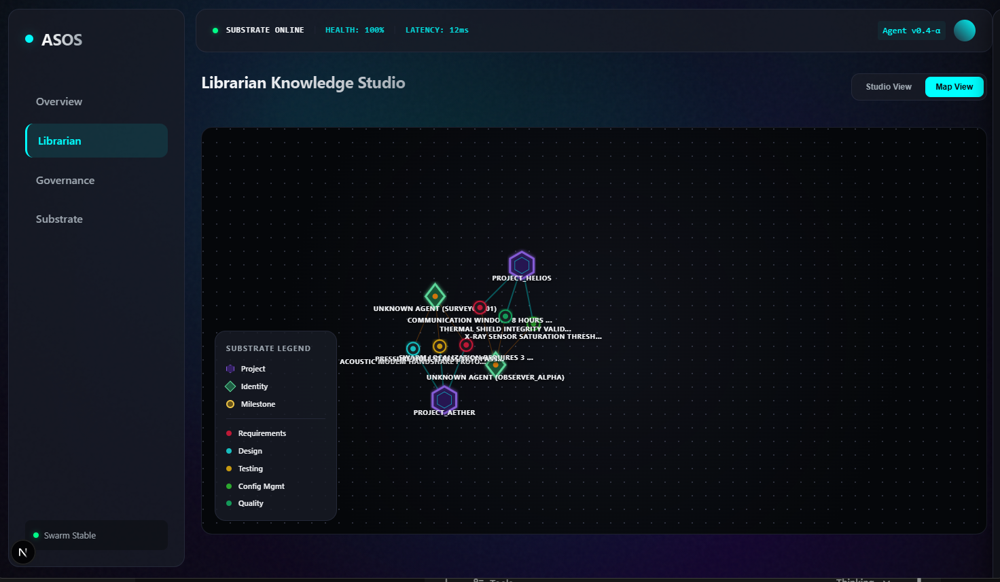

# Agentic Blackboard: Sovereign Orchestration Substrate

<p align="center">
  
</p>

Agentic Blackboard is a high-performance, distributed substrate designed for decentralized governance, multi-tenant memory, and coordination of AI swarm intelligence. It serves as the primary "shared brain" for agentic swarms, enabling real-time semantic consensus, dialectic note linkage, conflict resolution, and spatial materialization within the **Project Nucleus** ecosystem.


## 🌌 Core Architecture

Agentic Blackboard is built on a "Substrate-First" philosophy, where knowledge is not just stored, but actively managed by a fleet of dedicated engines:

*   **Blackboard (The Core)**: A high-frequency, thread-safe knowledge hub that stores "Atoms" (`CpbEntry`). It implements **BetterThan** logic for semantic merge, ensuring that the most accurate and high-priority knowledge always prevails.
*   **DeltaEngine**: A specialized graph processor that maintains relationships (Synapses) between Atoms, Identities, and Projects.
*   **Orchestrator (ZMQ Mirror)**: A ZeroMQ-native distribution engine that mirrors blackboard state across the swarm on port **8090**, providing sub-15ms synchronization latency between distributed nodes.
*   **Librarian**: An autonomous governance agent that audits the graph for orphans, resolves uncertainty, and maintains SWEBOK compliance.
*   **RdfExporter**: A semantic serializer translating substrate atoms and relationships into standardized W3C RDF Turtle using Schema.org and Dublin Core vocabularies.

---

## 📚 Universal Librarian Architecture (Life-Long Commonplace Book)

Agentic Blackboard implements a **Universal Librarian Architecture** that avoids schema bloat and recompilation. Rather than defining bespoke types for every domain, a single universal atom (`CpbEntry`) represents literature notes, culinary recipes, physical workouts, and research procedures through universal primitives:

*   **`Reference` (Bibliographic Citations)**: Structured source citations with titles, locators (page/timestamp), creator, tags, excerpts, and target atom UUIDs or external DOIs/ISBNs.
*   **`NoteLink` (Inter-Note Synapses)**: Dialectic and associative relationships between notes (`SEE_ALSO`, `SUPPORTS`, `REFUTES`, `EXTENDS`, `CITES`, `SYNTHESIS_OF`, etc.) with contextual annotations.
*   **`CatalogItem` (Materials & Ingredients)**: Universal quantities, units, roles (`INGREDIENT`, `EQUIPMENT`, `MATERIAL`), and preparation notes.
*   **`CatalogStep` (Procedural Steps)**: Ordered procedures with durations, tools, and prerequisites (for recipes, workout routines, lab protocols, or software build steps).
*   **`CatalogMetric` (Quantified Measurements)**: Numeric measurements with units (prep time, cook time, calories, reps, voltage, temperature).

### Automatic Graph Projection & Backlinks

When an atom is committed to the blackboard (`Blackboard::commit_entry`):
1. **Edge Projection**: Any `NoteLink` synapses and `Reference` citations are automatically projected into the native `l3kvg` graph engine with multi-tenant ACL scoping.
2. **Backlink Traversal**: Query inbound links (`Blackboard::get_backlinks`) and outbound links (`Blackboard::get_outbound_links`) across dynamic relationship types with tenant isolation.
3. **Semantic Export**: Export nodes and projected graphs as W3C RDF Turtle (`/api/v1/graph/export`) mapped to standard ontologies (`schema:Recipe`, `schema:HowToStep`, `dcterms:references`, `schema:citation`).

---

## 🌉 Project Nucleus Integration

Agentic Blackboard is deeply integrated with **Project Nucleus**, bridging semantic reasoning with spatial reality:

*   **Spatial Anchors**: Atoms can be "anchored" to physical or virtual fiducials in the Nucleus environment.
*   **Tactical Materialization**: The substrate can dispatch ZeroMQ commands to the **Nucleus Governor** to spawn widgets or HUD elements directly onto the Sovereign Desktop.
*   **MCP Bridge**: A Model Context Protocol (MCP) server allows any LLM-based agent to interact with the blackboard using standardized tools.

---

## 🛠️ Components

### 1. Agentic Blackboard Daemon (`agentic-blackboardd`)
The C++ high-performance storage and orchestration engine.
*   **API Port**: `8085` (REST)
*   **Mirror Port**: `8090` (ZMQ Pub/Sub)
*   **Control Port**: `5556` (Nucleus MCP Bridge)

### 2. Agentic Blackboard Verification Suite (`ab_verify`)
Automated test suite validating multi-shard storage, semantic merging, identity ACLs, note backlinks, universal recipes, and RDF export.

### 3. Librarian Knowledge Studio (`ab-dashboard`)
A Next.js-based visualization and governance dashboard.
*   **Map View**: Real-time force-directed graph of the substrate topology.
*   **Studio View**: List view of Knowledge Atoms with "Promote" and "Materialize" actions.
*   **Atmospheric Aesthetic**: A drifting nebular UI that reflects the real-time health of the swarm.



### 4. Agent Skills Suite
Standardized Markdown-based procedural guides that instruct agents on how to leverage the substrate:
*   `knowledge-capture`: Strategic ingestion of research with mandatory "Discover Before You Create" pre-flight verification.
*   `commonplace-curation`: Zettelkasten atomic note synthesis, dialectic relationships (`SEE_ALSO`, `SUPPORTS`, `REFUTES`, `EXTENDS`, `CITES`, `SYNTHESIS_OF`), and backlink traversal.
*   `procedural-catalog`: Standardized procedural recipes, workout routines, lab SOPs, and hardware assemblies using `CatalogItem`, `CatalogStep`, and `CatalogMetric`.
*   `task-orchestration`: Goal decomposition and WBS mapping.
*   `spatial-materialization`: Projecting knowledge into physical space.

Agents can discover and fetch these skills dynamically at runtime via MCP resources: `ab://skills/{name}` and `ab://schema`.

### 5. Administrative & MCP Bridge CLI (`ab-ctl`)
An enterprise administrative and operational control tool installed to `/usr/bin/ab-ctl` (or `python3 src/ab-ctl.py`):
*   **Substrate Management**: `ab-ctl init --bootstrap` (generates credential database and admin bootstrap token), `ab-ctl status` (checks daemon connectivity, auth mode, and substrate state).
*   **RBAC & Token Credential Management**:
    *   `ab-ctl user create <username> --role <admin|curator|agent|surface>`
    *   `ab-ctl user list`
    *   `ab-ctl agent create <agent_name> --user <username> --project <project_id>`
*   **Ambient Multi-Surface Context**:
    *   `ab-ctl surface register --name <surface_id> --type <tabletop|tablet|wall|hmd> --context <context_id>`
    *   `ab-ctl context show <context_id>`
    *   `ab-ctl context focus <context_id> --selected <atom_id_1> <atom_id_2>`
*   **Integrated FastMCP Server**:
    *   `ab-ctl mcp run --connect=http://localhost:8085 --token=<token>` (launches stdio MCP bridge with all 15 blackboard tools and dynamic skill resources).

### 6. Dual Model Context Protocol (MCP) Servers
Agentic Blackboard provides dual MCP server implementations with 100% feature parity for Python and Node.js/TypeScript agents:
*   **Python FastMCP (`ab_mcp_server.py`)**: High-performance asynchronous FastMCP server.
*   **Node.js MCP (`ab-mcp/index.js`)**: Official `@modelcontextprotocol/sdk` implementation.

Both servers expose:
*   **Discovery & Querying**: `search_commonplace`, `get_node`, `get_node_links`, `query_knowledge`, `query_substrate`.
*   **Authoring & Deduplication**: `create_note`, `create_catalog_entry`, `commit_knowledge_bundle`, `link_nodes`. Automatic pre-flight duplicate detection (`check_duplicates=True`) prevents duplicate atoms.
*   **Semantic Export**: `export_graph_rdf` (W3C RDF Turtle).
*   **Dynamic Resources**: `ab://schema`, `ab://skills/{name}`.
*   **Agent Prompts**: `curate_note`, `author_catalog`, `init_swarm`.

### 7. Deployment & Packaging (Debian / Ubuntu, Enterprise Linux RPM & Containers)
*   **Debian & Ubuntu Packaging (`.deb`)**: Native packaging for Debian 12 / Ubuntu 24.04 LTS and 22.04 LTS built via CMake CPack (`-DCPACK_GENERATOR="DEB"` or multi-generator `"DEB;RPM"`) with automatic shared library dependency resolution (`CPACK_DEBIAN_PACKAGE_SHLIBDEPS=ON`). Automatically packages `/usr/bin/agentic-blackboardd`, `/usr/bin/ab-ctl`, `/usr/lib/systemd/system/agentic-blackboard.service`, default configuration `/etc/agentic-blackboard/blackboard.conf`, and skills in `/usr/share/agentic-blackboard/skills`. Includes standard Debian maintainer scripts (`postinst`, `prerm`, `postrm`) for non-root `blackboard` system user management and admin token bootstrapping.
*   **Automated Debian / Ubuntu Bootstrap Script (`scripts/bootstrap-debian.sh`)**: One-command complete environment setup, dependency installation (`build-essential`, `cmake`, `libzmq3-dev`, `libssl-dev`, `dpkg-dev`, `python3`), compilation, verification (`ab_verify`), `.deb` packaging, and local `apt` installation with optional systemd daemon start:
    *   `--package-only`: Compiles targets, runs test suite, and builds `.deb` package in `build/` without installing it to host system.
    *   `--skip-build`: Skips compilation and packaging; installs pre-existing `.deb` package from `build/`.
    *   `--no-start`: Installs the `.deb` package without enabling or immediately starting `agentic-blackboard.service`.
    *   `-h`, `--help`: Prints command line options and usage help.
*   **Manual Debian / Ubuntu Package Installation**:
    ```bash
    # Install generated .deb via apt (resolves system dependencies automatically):
    sudo apt install ./build/agentic-blackboard_*.deb

    # Or install via dpkg directly:
    sudo dpkg -i ./build/agentic-blackboard_*.deb
    ```
*   **Dual CPack Package Generation**:
    ```bash
    # Configure and generate both DEB and RPM packages simultaneously:
    cmake -B build -S . -DCMAKE_BUILD_TYPE=Release -DCPACK_GENERATOR="DEB;RPM"
    cmake --build build -j$(nproc)
    cpack -B build --config build/CPackConfig.cmake
    ```
*   **Enterprise Linux 9 RPM**: Packaged via CPack and RPM spec (`packaging/rpm/agentic-blackboard.spec`) providing `/usr/bin/agentic-blackboardd`, `/usr/bin/ab-ctl`, `/usr/lib/systemd/system/agentic-blackboard.service`, `/etc/agentic-blackboard/blackboard.conf`, `/etc/security/limits.d/99-blackboard.conf`, and `/usr/share/agentic-blackboard/skills`.
*   **Canonical Container (UBI 9 Minimal)**: `Dockerfile` builds a production Red Hat Universal Base Image 9 container running as unprivileged `blackboard` user with volume auto-initialization via `entrypoint.sh`.

### 8. Code Property Graph (CPG) Swarm Coordination (Project Insight Bridge)
Agentic Blackboard provides first-class swarm coordination for codebases indexed by **Project Insight** (the C++20 dual Control Flow & Data Flow Graph analysis platform):
*   **Clean Separation of Concerns**: Project Insight acts as the stateless, read-only code intelligence engine (openCypher queries, ModRef state clustering, $k$-hop blast radius slicing, and interprocedural IFDS/IDE static analysis). Agentic Blackboard acts as the coordination substrate (task DAGs, exclusive TTL leases, dual-identity provenance, and dialectic review).
*   **SWEBOK & PMBOK 4-Agent Topology**:
    *   **Stakeholder Agent (`cpg-stakeholder`)**: Elicits requirements and testable Acceptance Criteria (AC), authorized digital proxy for the human user (`user:<id>`), performs final value validation (`ACCEPTS` / `REQUESTS_CHANGE`).
    *   **Architect Agent (`cpg-architect`)**: Explores CPG topology via openCypher, computes blast radius, and builds the hierarchical Task DAG with strict `DEPENDS_ON` and `SUBTASK_OF` dependencies.
    *   **Implementer Agent (`cpg-worker`)**: Claims exclusive TTL leases, mines localized interface contracts, performs safe TDD construction, and submits solutions (`HAS_SOLUTION`).
    *   **Verifier Agent (`cpg-verifier`)**: Audits submitted code with Project Insight's IFDS/IDE static checkers (taint analysis, uninitialized variables, typestate invariants), committing formal proofs (`VALIDATED_BY`) or counterexample execution traces (`REFUTES`).
*   **`ab-ctl swarm` CLI & FastMCP Tools**:
    *   `ab-ctl swarm init --context <id> --name <str> [--requirement <str>]`
    *   `ab-ctl swarm task create --context <id> --name <str> [--workflow feature|bugfix|refactor] [-k <radius>] [--depends-on <id>]`
    *   `ab-ctl swarm task list --context <id> [--format table|json]`
    *   `ab-ctl swarm lease claim <task_id> --agent <agent_id> [--ttl <sec>]`
    *   `ab-ctl swarm lease release <task_id> --agent <agent_id>`
    *   `ab-ctl swarm review submit <task_id> --agent <agent_id> [--patch <summary>]`
    *   `ab-ctl swarm review verdict <task_id> --verifier <agent_id> --verdict PASS|FAIL [--details <json>]`
    *   `ab-ctl swarm accept <task_id> --stakeholder <user_id> [--notes <str>]`
*   **Dialectic State Machine & Loop Bounding**: Enforces topological dependency barriers (downstream tasks are blocked until prerequisites are `COMPLETED` or `VALIDATED`). Re-routes failed reviews to `READY` with counterexample traces, and locks runaway loops into `ESCALATED` if a task fails verification more than 3 times.
*   **Antigravity Skill & Catalog**: Guided by the [`cpg-swarm-coordination`](skills/cpg-swarm-coordination/SKILL.md) skill with companion references:
    *   [`openCypher Recipes`](skills/cpg-swarm-coordination/references/opencypher_recipes.md): 5 categories of tested CPG graph traversal queries.
    *   [`Blackboard Schemas`](skills/cpg-swarm-coordination/references/blackboard_schemas.md): Draft-07 JSON schemas for all 6 atoms and 7 relationship links.
    *   [`SWEBOK & PMBOK Mapping`](skills/cpg-swarm-coordination/references/swebok_pmbok_mapping.md): Formal theoretical alignment and verification vs. validation matrices.

---

## 🚀 Quick Start

### Debian / Ubuntu One-Command Bootstrap
```bash
# One-command bootstrap on Debian / Ubuntu 24.04 LTS:
./scripts/bootstrap-debian.sh
```
This automated bootstrap script detects host distribution compatibility, installs build and runtime dependencies (`build-essential`, `cmake`, `libzmq3-dev`, `libssl-dev`, `dpkg-dev`, `python3`), compiles targets, runs verification tests (`ab_verify`), packages the native `.deb` via CPack, installs it via `apt`, and enables the `agentic-blackboard` systemd service.

To build the package without installing on the host:
```bash
./scripts/bootstrap-debian.sh --package-only
```

### Build the Substrate & Run Verifications (C++)
```bash
mkdir build && cd build
cmake .. -DCMAKE_BUILD_TYPE=Release
cmake --build . --target agentic-blackboardd ab_verify

# Run the automated verification test suite
./ab_verify

# Launch the daemon
./agentic-blackboardd
```

### Run End-to-End Integration Verification
```bash
python3 scratch/test_atmosphere_full_cycle.py
```

### Administrative & CLI Control (`ab-ctl`)
```bash
# Bootstrap substrate and generate initial admin token
python3 src/ab-ctl.py init --bootstrap

# Check operational status
python3 src/ab-ctl.py status

# Create a curator user
python3 src/ab-ctl.py user create alice --role curator

# Register an ambient tabletop surface
python3 src/ab-ctl.py surface register --name table-01 --type tabletop --context ctx:lab-42

# Launch integrated FastMCP runner for LLM agent integration
python3 src/ab-ctl.py mcp run --smoke-test
```

### Build Packages (CPack: DEB & RPM)
```bash
cd build

# Generate Debian package (.deb)
cpack -G DEB
# Generates agentic-blackboard_0.4.0-1_amd64.deb in build/ (or current directory after cd build)

# Generate Enterprise Linux package (.rpm)
cpack -G RPM
# Generates agentic-blackboard-0.4.0-1.el9.x86_64.rpm in build/ (or current directory after cd build)

# Or generate both simultaneously
cpack -G "DEB;RPM"

# Install .deb on Debian / Ubuntu:
sudo apt install ./agentic-blackboard_*.deb
# or: sudo dpkg -i ./agentic-blackboard_*.deb
```

### Run Canonical Container (Docker / Podman)
```bash
# Build the container image
docker build -t agentic-blackboard:latest .

# Run with persistent data and configuration volumes
docker run -d \
  --name agentic-blackboard \
  -p 8085:8085 \
  -v /var/lib/agentic-blackboard:/var/lib/agentic-blackboard:rw \
  -v /etc/agentic-blackboard:/etc/agentic-blackboard:rw \
  agentic-blackboard:latest
```

### Launch the Dashboard (Next.js)
```bash
cd ab-dashboard
npm install
npm run dev
```

### Connect an Agent (MCP)

**Python FastMCP:**
```bash
python3 ab_mcp_server.py
```

**Node.js MCP:**
```bash
node ab-mcp/index.js
```

---

## 📖 API Reference

| Endpoint | Method | Description |
| :--- | :--- | :--- |
| `/api/v1/schema` | `GET` | Retrieve Agentic Blackboard schema definition, 32 KnowledgeAreas, and 27 relationship predicates. |
| `/api/v1/health` | `GET` | Substrate health check and engine readiness. |
| `/api/v1/search` | `GET` | Multi-tenant full-text and filtered search (`q`, `ka`, `tags`, `limit`). |
| `/api/v1/node/:id/links` | `GET` | Retrieve inbound backlinks and outbound synapses with hydrated statements. |
| `/api/v1/graph/bundle` | `POST` | Commit a batch of anchored Knowledge Atoms with rich citations, links, items, steps, and metrics. |
| `/api/v1/graph/node` | `POST` | Create or update an individual graph node. |
| `/api/v1/node/:id` | `GET` | Retrieve a node and its properties by ID. |
| `/api/v1/query` | `POST` | Query graph nodes, edges, and connections. |
| `/api/v1/link` | `POST` | Create an explicit semantic link/edge between atoms. |
| `/api/v1/cpb/promote` | `POST` | Elevate an atom to `PRINCIPLE` status. |
| `/api/v1/graph/snapshot` | `GET` | Retrieve the full substrate topology. |
| `/api/v1/graph/export` | `GET` | Export the substrate knowledge graph as W3C RDF Turtle. |
| `/api/v1/context/register` | `POST` | Register an ambient surface and join a shared workspace context. |
| `/api/v1/context/:id` | `GET` | Retrieve context state, active surfaces list, and current focus selection. |
| `/api/v1/context/:id/focus` | `POST` | Broadcast multi-surface focus updates and selection telemetry to subscribers. |
| `/api/v1/events` | `GET` | Real-time Server-Sent Events (SSE) stream for context events and committed atoms. |
| `/api/v1/nucleus/materialize` | `POST` | Spawn a spatial widget in Project Nucleus. |
| `/api/v1/nucleus/bind` | `POST` | Bind an atom to a spatial anchor. |

---

**Developed for the Advanced Agentic Coding Swarm.**  
*"Knowledge is the only substrate that grows when shared."*
