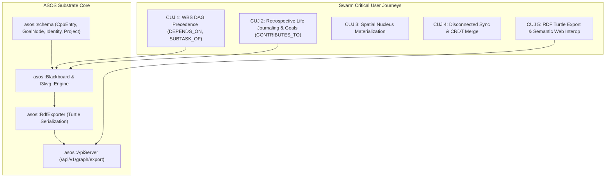

# Implementation Plan: ASOS RDF Schema Enhancements & Critical User Journeys (CUJs)

> **For agentic workers:** REQUIRED SUB-SKILL: Use superpowers:subagent-driven-development to implement this plan task-by-task. Steps use checkbox (`- [ ]`) syntax for tracking.

**Goal:** Implement first-class semantic graph predicates (`DEPENDS_ON`, `BLOCKS`, `SUBTASK_OF`, `VALIDATED_BY`, `CONTRIBUTES_TO`), bitemporal timestamps (`event_timestamp`), structured `GoalNode` support, and a W3C RDF Turtle export engine (`RdfExporter`) with comprehensive automated tests verifying the 5 core Swarm CUJs.

**Architecture:** Extend the C++ `schema.hpp` with new relationship types, bitemporal serialization, and `GoalNode` models. Implement an `RdfExporter` that traverses the `l3kvg` graph substrate and produces valid W3C Turtle triples (`text/turtle`), integrated into the REST `ApiServer`. Validate all end-to-end multi-agent workflows through automated test suites in `asos_verify`.

**Architecture Diagram:**



**Tech Stack:** C++20, CMake, `l3kvg` (Graph Engine), `L3KV` (Multi-Shard Key-Value Store), `lite3-cpp` (Zero-Copy BSON), `httplib` (REST Server), W3C RDF Turtle Specification.

## Global Constraints

- Must maintain 100% zero-copy BSON backward compatibility for existing records in `CpbEntry`.
- Must support multi-tenant UID permissions and prefix isolation.
- Must ensure test databases are cleanly torn down before/after test suites.
- All code must build cleanly with C++20 on Linux and MSVC.

---

### Task 1: Semantic Predicates, Bitemporal Header & GoalNode Schemas

**Files:**
- Modify: `include/asos/schema.hpp`
- Modify: `include/asos/Blackboard.hpp`
- Modify: `src/Blackboard.cpp`

**Interfaces:**
- Consumes: `lite3cpp::Buffer`, `l3kvg::Engine`, `l3kv::Engine`
- Produces:
  - Predicates: `rel::DEPENDS_ON`, `rel::BLOCKS`, `rel::SUBTASK_OF`, `rel::VALIDATED_BY`, `rel::CONTRIBUTES_TO`
  - `CpbEntry::Header::event_timestamp`
  - `struct GoalNode` with `serialize` and `deserialize`
  - `Blackboard::commit_goal_node(const GoalNode& goal, uint32_t principal_id = 0)`

- [ ] **Step 1: Update `include/asos/schema.hpp` with new predicates, bitemporal header, and `GoalNode`**

Add constants to `asos::rel`:
```cpp
namespace rel {
    const std::string CREATED_BY = "CREATED_BY";
    const std::string BELONGS_TO = "BELONGS_TO";
    const std::string MAINTAINS = "MAINTAINS";
    const std::string SUPERSEDED_BY = "SUPERSEDED_BY";
    const std::string CPB_SIMILARITY = "CPB_SIMILARITY";
    const std::string RELATED_TO = "RELATED_TO";
    const std::string REPRESENTED_BY = "REPRESENTED_BY";
    const std::string ANCHORED_TO = "ANCHORED_TO";
    const std::string MENTIONS = "MENTIONS";
    const std::string OCCURRED_AT = "OCCURRED_AT";

    // Task Precedence & Precedence DAG
    const std::string DEPENDS_ON = "DEPENDS_ON";
    const std::string BLOCKS = "BLOCKS";
    const std::string SUBTASK_OF = "SUBTASK_OF";

    // Compliance & Auditing
    const std::string VALIDATED_BY = "VALIDATED_BY";

    // Strategic Goal Alignment
    const std::string CONTRIBUTES_TO = "CONTRIBUTES_TO";
}
```

Add `int64_t event_timestamp = 0;` to `CpbEntry::Header`, and update serialization/deserialization:
```cpp
// In CpbEntry::serialize:
buf.set_i64(h_idx, "timestamp", header.timestamp);
buf.set_i64(h_idx, "event_timestamp", header.event_timestamp > 0 ? header.event_timestamp : header.timestamp);

// In CpbEntry::deserialize:
entry.header.timestamp = buf.get_i64(h_idx, "timestamp");
try {
    if (buf.get_type(h_idx, "event_timestamp") == lite3cpp::Type::Int64) {
        entry.header.event_timestamp = buf.get_i64(h_idx, "event_timestamp");
    } else {
        entry.header.event_timestamp = entry.header.timestamp;
    }
} catch (...) {
    entry.header.event_timestamp = entry.header.timestamp;
}
```

Define `GoalNode`:
```cpp
struct GoalNode {
    std::string goal_id;
    std::string title;
    std::string description;
    std::string category;         // "LIFE", "CAREER", "FITNESS", "ENGINEERING"
    int64_t target_date = 0;      // Target completion epoch ms
    double target_metric = 100.0; // Target quantity
    double current_progress = 0.0;// Current progress quantity
    std::string status = "ACTIVE";// "ACTIVE", "COMPLETED", "PAUSED", "ABANDONED"
    std::string content;

    void serialize(lite3cpp::Buffer& buf) const {
        buf.init_object();
        size_t h_idx = buf.set_obj(0, "header");
        buf.set_str(h_idx, "type", "GOAL");
        buf.set_str(0, "goal_id", goal_id);
        buf.set_str(0, "title", title);
        buf.set_str(0, "description", description);
        buf.set_str(0, "category", category);
        buf.set_i64(0, "target_date", target_date);
        buf.set_f64(0, "target_metric", target_metric);
        buf.set_f64(0, "current_progress", current_progress);
        buf.set_str(0, "status", status);
        buf.set_str(0, "content", content);
    }

    static GoalNode deserialize(const lite3cpp::Buffer& buf) {
        GoalNode gn;
        gn.goal_id = buf.get_str(0, "goal_id");
        gn.title = buf.get_str(0, "title");
        gn.description = buf.get_str(0, "description");
        gn.category = buf.get_str(0, "category");
        gn.target_date = buf.get_i64(0, "target_date");
        gn.target_metric = buf.get_f64(0, "target_metric");
        gn.current_progress = buf.get_f64(0, "current_progress");
        gn.status = buf.get_str(0, "status");
        gn.content = buf.get_str(0, "content");
        return gn;
    }
};
```

- [ ] **Step 2: Add `commit_goal_node` to `Blackboard.hpp` and `Blackboard.cpp`**

In `include/asos/Blackboard.hpp`:
```cpp
bool commit_goal_node(const GoalNode& goal, uint32_t principal_id = 0);
```

In `src/Blackboard.cpp`:
```cpp
bool Blackboard::commit_goal_node(const GoalNode& goal, uint32_t principal_id) {
    lite3cpp::Buffer buf;
    goal.serialize(buf);
    
    std::string key = goal.goal_id;
    if (!key.starts_with("goal:")) {
        key = "goal:" + key;
    }
    
    auto key_uuid = engine_->get_resolver().parse_uuid(key);
    std::string db_key = std::string(l3kvg::KeyBuilder::node_key(key_uuid));
    
    if (principal_id != 0) {
        auto& creds = engine_->get_store()->credentials();
        creds.set_acl(principal_id, db_key, l3kv::Permission::READ | l3kv::Permission::WRITE);
        std::string hex_part = db_key.substr(2);
        creds.set_acl(principal_id, "e:out:" + hex_part, l3kv::Permission::READ | l3kv::Permission::WRITE);
        creds.set_acl(principal_id, "e:in:" + hex_part, l3kv::Permission::READ | l3kv::Permission::WRITE);
    }
    
    engine_->put_node(key, std::string(reinterpret_cast<const char*>(buf.data()), buf.size()));
    return true;
}
```

- [ ] **Step 3: Compile core library to verify no compilation issues**

Run: `cmake --build build --target asos_engine`
Expected: Build succeeds with 0 errors.

- [ ] **Step 4: Commit changes**

```bash
git add include/asos/schema.hpp include/asos/Blackboard.hpp src/Blackboard.cpp
git commit -m "feat(schema): add RDF task predicates, bitemporal timestamp, and GoalNode"
```

---

### Task 2: W3C RDF Turtle Serializer (`RdfExporter`) & REST API Endpoint

**Files:**
- Create: `include/asos/RdfExporter.hpp`
- Create: `src/RdfExporter.cpp`
- Modify: `CMakeLists.txt`
- Modify: `include/asos/ApiServer.hpp`
- Modify: `src/ApiServer.cpp`

**Interfaces:**
- Consumes: `l3kvg::Engine`, `asos::Blackboard`, `asos::CpbEntry`, `asos::GoalNode`, `asos::IdentityNode`, `asos::ProjectNode`
- Produces: `std::string RdfExporter::export_turtle(Blackboard* blackboard, uint32_t principal_id = 0)`
- Endpoint: `GET /api/v1/graph/export?format=turtle`

- [ ] **Step 1: Create `include/asos/RdfExporter.hpp`**

```cpp
#pragma once

#include "asos/Blackboard.hpp"
#include <string>

namespace asos {

class RdfExporter {
public:
    /**
     * @brief Exports the Blackboard graph into W3C RDF Turtle format.
     */
    static std::string export_turtle(Blackboard* blackboard, uint32_t principal_id = 0);
};

} // namespace asos
```

- [ ] **Step 2: Create `src/RdfExporter.cpp`**

Implement Turtle triple generator emitting standard prefixes:
```cpp
#include "asos/RdfExporter.hpp"
#include "asos/schema.hpp"
#include "engine/store.hpp"
#include "L3KVG/KeyBuilder.hpp"
#include "L3KVG/Node.hpp"
#include <sstream>
#include <iomanip>

namespace asos {

static std::string sanitize_str(const std::string& str) {
    std::string res;
    for (char c : str) {
        if (c == '"') res += "\\\"";
        else if (c == '\\') res += "\\\\";
        else if (c == '\n') res += "\\n";
        else if (c == '\r') res += "\\r";
        else if (c == '\t') res += "\\t";
        else res += c;
    }
    return res;
}

std::string RdfExporter::export_turtle(Blackboard* blackboard, uint32_t principal_id) {
    if (!blackboard) return "";
    auto engine = blackboard->get_engine();
    auto store = engine->get_store();

    std::ostringstream ss;
    ss << "@prefix asos: <http://asos.substrate.ai/schema#> .\n";
    ss << "@prefix rdf: <http://www.w3.org/1999/02/22-rdf-syntax-ns#> .\n";
    ss << "@prefix rdfs: <http://www.w3.org/2000/01/rdf-schema#> .\n";
    ss << "@prefix xsd: <http://www.w3.org/2001/XMLSchema#> .\n";
    ss << "@prefix prov: <http://www.w3.org/ns/prov#> .\n";
    ss << "@prefix geo: <http://www.w3.org/2003/01/geo/wgs84_pos#> .\n\n";

    // Scan all nodes in shard stores
    for (size_t shard = 0; shard < store->num_shards(); ++shard) {
        auto keys = store->get_prefix_keys("n:", shard, "n:", 10000);
        for (const auto& key : keys) {
            if (key.ends_with(":meta")) continue;
            
            auto buf = store->get(key, principal_id);
            if (buf.size() == 0) continue;

            size_t start_brace = key.find('{');
            size_t end_brace = key.find('}');
            if (start_brace == std::string::npos || end_brace == std::string::npos) continue;
            std::string hex_id = key.substr(start_brace + 1, end_brace - start_brace - 1);
            uint64_t nid = std::stoull(hex_id, nullptr, 16);

            // Check node type
            std::string type = "";
            try {
                if (buf.get_type(0, "header") == lite3cpp::Type::Object) {
                    size_t h_idx = buf.get_obj(0, "header");
                    type = buf.get_str(h_idx, "type");
                }
            } catch (...) {}

            std::string node_uri = "<urn:asos:node:" + hex_id + ">";

            if (type == "IDENTITY") {
                IdentityNode id_node = IdentityNode::deserialize(buf);
                ss << "<urn:asos:identity:" << sanitize_str(id_node.id) << "> a asos:Identity ;\n";
                ss << "    rdfs:label \"" << sanitize_str(id_node.display_name) << "\" ;\n";
                ss << "    asos:role \"" << sanitize_str(id_node.role) << "\" .\n\n";
            } else if (type == "PROJECT") {
                ProjectNode p_node = ProjectNode::deserialize(buf);
                ss << "<urn:asos:project:" << sanitize_str(p_node.project_id) << "> a asos:Project ;\n";
                ss << "    rdfs:comment \"" << sanitize_str(p_node.description) << "\" ;\n";
                ss << "    asos:lifecycleStatus \"" << sanitize_str(p_node.lifecycle_status) << "\" .\n\n";
            } else if (type == "GOAL") {
                GoalNode g_node = GoalNode::deserialize(buf);
                ss << "<urn:asos:goal:" << sanitize_str(g_node.goal_id) << "> a asos:Goal ;\n";
                ss << "    rdfs:label \"" << sanitize_str(g_node.title) << "\" ;\n";
                ss << "    rdfs:comment \"" << sanitize_str(g_node.description) << "\" ;\n";
                ss << "    asos:category \"" << sanitize_str(g_node.category) << "\" ;\n";
                ss << "    asos:targetMetric " << g_node.target_metric << " ;\n";
                ss << "    asos:currentProgress " << g_node.current_progress << " ;\n";
                ss << "    asos:status \"" << sanitize_str(g_node.status) << "\" .\n\n";
            } else {
                // Default to CPB_ENTRY / KnowledgeAtom
                try {
                    CpbEntry atom = CpbEntry::deserialize(buf);
                    std::string atom_id = atom.header.uuid.empty() ? hex_id : atom.header.uuid;
                    ss << "<urn:asos:atom:" << sanitize_str(atom_id) << "> a asos:KnowledgeAtom ;\n";
                    ss << "    asos:statement \"" << sanitize_str(atom.payload.statement) << "\" ;\n";
                    ss << "    asos:knowledgeArea " << static_cast<int>(atom.taxonomy.knowledge_area) << " ;\n";
                    ss << "    asos:applicability " << atom.taxonomy.applicability << " ;\n";
                    ss << "    asos:isPrinciple " << (atom.taxonomy.is_principle ? "true" : "false") << " ;\n";
                    ss << "    asos:uncertainty " << (atom.taxonomy.uncertainty ? "true" : "false") << " ;\n";
                    if (!atom.header.origin.agent_id.empty()) {
                        ss << "    prov:wasGeneratedBy <urn:asos:identity:" << sanitize_str(atom.header.origin.agent_id) << "> ;\n";
                    }
                    if (!atom.header.origin.project_id.empty()) {
                        ss << "    asos:belongsTo <urn:asos:project:" << sanitize_str(atom.header.origin.project_id) << "> ;\n";
                    }
                    if (atom.header.timestamp > 0) {
                        ss << "    prov:generatedAtTime " << atom.header.timestamp << " ;\n";
                    }
                    if (atom.header.event_timestamp > 0) {
                        ss << "    asos:eventTimestamp " << atom.header.event_timestamp << " ;\n";
                    }
                    if (atom.wellness) {
                        ss << "    asos:moodSentiment " << atom.wellness->mood_sentiment << " ;\n";
                        ss << "    asos:energyLevel " << atom.wellness->energy_level << " ;\n";
                        ss << "    asos:sleepHours " << atom.wellness->sleep_hours << " ;\n";
                        ss << "    asos:stepCount " << atom.wellness->step_count << " ;\n";
                        if (!atom.wellness->activity_type.empty()) {
                            ss << "    asos:activityType \"" << sanitize_str(atom.wellness->activity_type) << "\" ;\n";
                        }
                    }
                    if (atom.education) {
                        ss << "    asos:institutionPlatform \"" << sanitize_str(atom.education->institution_platform) << "\" ;\n";
                        ss << "    asos:progressPercent " << atom.education->progress_percent << " ;\n";
                    }
                    ss << "    rdfs:isDefinedBy " << node_uri << " .\n\n";
                } catch (...) {}
            }

            // Export outgoing edges
            auto node = engine->get_node(nid);
            if (node) {
                for (const auto& rel_label : {
                    rel::CREATED_BY, rel::BELONGS_TO, rel::MAINTAINS, rel::SUPERSEDED_BY,
                    rel::CPB_SIMILARITY, rel::RELATED_TO, rel::REPRESENTED_BY, rel::ANCHORED_TO,
                    rel::MENTIONS, rel::OCCURRED_AT, rel::DEPENDS_ON, rel::BLOCKS,
                    rel::SUBTASK_OF, rel::VALIDATED_BY, rel::CONTRIBUTES_TO
                }) {
                    auto edges = node->get_edges(rel_label, 0.0, principal_id);
                    for (const auto& edge : edges) {
                        char dst_hex[17];
                        sprintf(dst_hex, "%016llx", (unsigned long long)edge->get_dst());
                        ss << "<urn:asos:node:" << hex_id << "> asos:" << rel_label << " <urn:asos:node:" << dst_hex << "> .\n";
                    }
                }
            }
        }
    }

    return ss.str();
}

} // namespace asos
```

- [ ] **Step 3: Update `CMakeLists.txt` and `ApiServer.cpp`**

In `CMakeLists.txt`, add `src/RdfExporter.cpp` to `asos_engine` sources.
In `src/ApiServer.cpp`, register `GET /api/v1/graph/export`:
```cpp
#include "asos/RdfExporter.hpp"

// Inside listen_loop():
svr.Get("/api/v1/graph/export", [this](const httplib::Request& req, httplib::Response& res) {
    try {
        std::string format = req.get_param_value("format");
        std::string active_user = req.get_header_value("X-Active-User");
        uint32_t principal_id = 0;
        if (!active_user.empty() && active_user != "admin") {
            principal_id = blackboard_->get_user_uid(active_user);
        }

        if (format == "turtle" || format.empty()) {
            std::string ttl = RdfExporter::export_turtle(blackboard_, principal_id);
            res.set_content(ttl, "text/turtle");
        } else {
            res.status = 400;
            res.set_content("Unsupported format: " + format, "text/plain");
        }
    } catch (const std::exception& e) {
        res.status = 500;
        res.set_content(e.what(), "text/plain");
    }
});
```

- [ ] **Step 4: Build target `asos_engine` and verify compilation**

Run: `cmake --build build --target asos_engine`
Expected: Build succeeds.

- [ ] **Step 5: Commit changes**

```bash
git add include/asos/RdfExporter.hpp src/RdfExporter.cpp CMakeLists.txt src/ApiServer.cpp
git commit -m "feat(rdf): add W3C RDF Turtle serializer and export endpoint"
```

---

### Task 3: CUJ 1 & CUJ 2 Automated Verifications (SWE WBS DAG & Retrospective Life Journaling/Goals)

**Files:**
- Modify: `src/main_verify.cpp`

**Interfaces:**
- Consumes: `asos::Blackboard`, `asos::rel::*`, `asos::GoalNode`, `asos::CpbEntry`
- Produces: `test_cuj_wbs_dag_validation()`, `test_cuj_retrospective_journaling_and_goals()`

- [ ] **Step 1: Add `test_cuj_wbs_dag_validation` to `src/main_verify.cpp`**

Implement test for CUJ 1:
1. Create Epic Task (`task:compiler-epic`), Child Task 1 (`task:lexer`), Child Task 2 (`task:parser`).
2. Establish `SUBTASK_OF` edges: `task:lexer -> task:compiler-epic`, `task:parser -> task:compiler-epic`.
3. Establish `DEPENDS_ON` edge: `task:parser -> task:lexer`.
4. Establish `BLOCKS` edge: `task:lexer -> task:parser`.
5. Worker commits Knowledge Atom (`atom:lexer-spec`), auditor validates it $\to$ `VALIDATED_BY` edge to `identity:auditor-007`.
6. Verify edge traversals for all predicates.

- [ ] **Step 2: Add `test_cuj_retrospective_journaling_and_goals` to `src/main_verify.cpp`**

Implement test for CUJ 2:
1. Register user `jasoncoposky`.
2. Commit `GoalNode` (`goal:marathon-2026`, target_metric=42.195 km, current_progress=0.0).
3. Commit retrospective journal entry with `event_timestamp = 1700000000` (past event) and `timestamp = 1700050000` (commit time).
4. Link journal entry $\to$ `goal:marathon-2026` via `rel::CONTRIBUTES_TO`.
5. Update goal progress to 10.5 km.
6. Verify bitemporal timestamps deserialize correctly (`event_timestamp` != `timestamp`).
7. Verify `CONTRIBUTES_TO` edge traversal.

- [ ] **Step 3: Add database clean tear-down helper before each test run**

Include `<filesystem>` and invoke `std::filesystem::remove_all(db_path)` in all test functions.

- [ ] **Step 4: Build and run `asos_verify`**

Run: `cmake --build build --target asos_verify && ./build/asos_verify`
Expected: Tests pass.

- [ ] **Step 5: Commit changes**

```bash
git add src/main_verify.cpp
git commit -m "test(cuj): add automated verifications for CUJ 1 (WBS DAG) and CUJ 2 (Life Goals)"
```

---

### Task 4: CUJ 5 Automated Verification (RDF Turtle Export & Semantic Web Interop)

**Files:**
- Modify: `src/main_verify.cpp`

**Interfaces:**
- Consumes: `asos::RdfExporter`, `asos::Blackboard`
- Produces: `test_cuj_rdf_turtle_export()`

- [ ] **Step 1: Implement `test_cuj_rdf_turtle_export` in `src/main_verify.cpp`**

1. Initialize Blackboard (`test_rdf_db`).
2. Commit `IdentityNode`, `ProjectNode`, `GoalNode`, and `CpbEntry` with `Wellness` payload.
3. Link nodes with `CREATED_BY`, `BELONGS_TO`, `CONTRIBUTES_TO`, and `DEPENDS_ON`.
4. Call `RdfExporter::export_turtle(&bb)`.
5. Assert output contains:
   - `@prefix asos: <http://asos.substrate.ai/schema#>`
   - `a asos:KnowledgeAtom`
   - `a asos:Goal`
   - `a asos:Identity`
   - `a asos:Project`
   - `asos:CONTRIBUTES_TO`
   - `asos:DEPENDS_ON`

- [ ] **Step 2: Build and run all verification suites**

Run: `cmake --build build --target asos_verify && ./build/asos_verify`
Expected: Output `[SUCCESS] All ASOS Verification Tests Passed!` with 0 errors.

- [ ] **Step 3: Commit all changes**

```bash
git add src/main_verify.cpp
git commit -m "test(cuj): add automated verification for CUJ 5 (RDF Turtle Export)"
```
