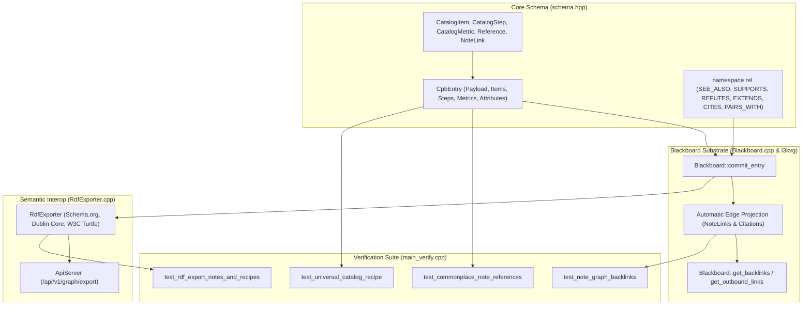

# Implementation Plan: ASOS Life-Long Digital Commonplace Book Schema Expansion

> **For agentic workers:** REQUIRED SUB-SKILL: Use superpowers:subagent-driven-development to implement this plan task-by-task. Steps use checkbox (`- [ ]`) syntax for tracking.

**Goal:** Implement universal librarian catalog primitives (`Reference`, `NoteLink`, `CatalogItem`, `CatalogStep`, `CatalogMetric`), first-class note-to-note and citation graph projection, backlink queries, and W3C RDF Turtle export in the ASOS substrate with automated verification tests.

**Architecture:** Extend `include/asos/schema.hpp` with universal catalog structs and rich relational predicates. Update `Blackboard::commit_entry` to automatically project `NoteLink` and `Reference` synapses into `l3kvg` graph edges with multi-tenant ACLs. Implement `get_backlinks` and `get_outbound_links` in `Blackboard`, enhance `RdfExporter` with Dublin Core and Schema.org mappings, and validate all functionality in `src/main_verify.cpp`.

**Architecture Diagram:**



**Tech Stack:** C++20, CMake, `l3kvg` (Graph Engine), `L3KV` (Multi-Shard Store), `lite3-cpp` (Zero-Copy BSON), `httplib` (REST Server).

## Global Constraints

- Must maintain 100% zero-copy BSON backward compatibility for existing records in `CpbEntry`.
- Deserialization of new fields must be guarded with `try / catch` so old databases load cleanly.
- Must propagate multi-tenant UID ACL permissions to all auto-projected edges when `principal_id != 0`.
- All code must build cleanly with C++20 on Linux and MSVC with zero warnings.

---

### Task 1: Universal Librarian Schema Primitives in `schema.hpp`

**Files:**
- Modify: `include/asos/schema.hpp`

**Interfaces:**
- Consumes: `lite3cpp::Buffer`
- Produces:
  - `struct Reference` with `serialize` / `deserialize`
  - `struct NoteLink` with `serialize` / `deserialize`
  - `struct CatalogItem` with `serialize` / `deserialize`
  - `struct CatalogStep` with `serialize` / `deserialize`
  - `struct CatalogMetric` with `serialize` / `deserialize`
  - Updated `CpbEntry::Payload` with `references` and `note_links`
  - Updated `CpbEntry` with `items`, `steps`, `metrics`, `attributes`
  - New `KnowledgeArea` enums: `LITERATURE_READING = 26`, `CULINARY_RECIPES = 27`, `CREATIVE_ARTS = 28`, `PERSONAL_FINANCE = 29`, `HOME_LOGISTICS = 30`, `GENERAL_COMMONPLACE = 31`
  - New `namespace rel` predicates: `SEE_ALSO`, `REFERENCES`, `CITES`, `SUPPORTS`, `REFUTES`, `EXTENDS`, `SYNTHESIS_OF`, `QUESTION_RAISED_BY`, `ANALOGY_TO`, `PAIRS_WITH`, `VARIATION_OF`, `USES_INGREDIENT`

- [x] **Step 1: Add new relationship constants to `namespace rel` in `include/asos/schema.hpp`**

```cpp
namespace rel {
    const std::string CREATED_BY = "CREATED_BY";
    const std::string BELONGS_TO = "BELONGS_TO";
    const std::string MAINTAINS = "MAINTAINS";
    const std::string SUPERSEDED_BY = "SUPERSEDED_BY";
    const std::string CPB_SIMILARITY = "CPB_SIMILARITY";
    const std::string RELATED_TO = "RELATED_TO";
    const std::string REPRESENTED_BY = "REPRESENTED_BY";
    const std::string ANCHORED_TO = "ANCHORED_TO";
    const std::string MENTIONS = "MENTIONS";
    const std::string OCCURRED_AT = "OCCURRED_AT";

    // Task & Strategic Alignment
    const std::string DEPENDS_ON = "DEPENDS_ON";
    const std::string BLOCKS = "BLOCKS";
    const std::string SUBTASK_OF = "SUBTASK_OF";
    const std::string VALIDATED_BY = "VALIDATED_BY";
    const std::string CONTRIBUTES_TO = "CONTRIBUTES_TO";

    // Literature & Intellectual Dialectic
    const std::string SEE_ALSO = "SEE_ALSO";
    const std::string REFERENCES = "REFERENCES";
    const std::string CITES = "CITES";
    const std::string SUPPORTS = "SUPPORTS";
    const std::string REFUTES = "REFUTES";
    const std::string EXTENDS = "EXTENDS";
    const std::string SYNTHESIS_OF = "SYNTHESIS_OF";
    const std::string QUESTION_RAISED_BY = "QUESTION_RAISED_BY";
    const std::string ANALOGY_TO = "ANALOGY_TO";

    // Culinary & Composition
    const std::string PAIRS_WITH = "PAIRS_WITH";
    const std::string VARIATION_OF = "VARIATION_OF";
    const std::string USES_INGREDIENT = "USES_INGREDIENT";
}
```

- [x] **Step 2: Add new `KnowledgeArea` entries in `include/asos/schema.hpp`**

```cpp
    // Life-Long Commonplace Book Domains
    LITERATURE_READING = 26,
    CULINARY_RECIPES = 27,
    CREATIVE_ARTS = 28,
    PERSONAL_FINANCE = 29,
    HOME_LOGISTICS = 30,
    GENERAL_COMMONPLACE = 31,
```

- [x] **Step 3: Define `Reference`, `NoteLink`, `CatalogItem`, `CatalogStep`, and `CatalogMetric` in `include/asos/schema.hpp`**

Implement full structs with `serialize(lite3cpp::Buffer& buf, size_t parent)` and `deserialize(const lite3cpp::Buffer& buf, size_t parent)`.

- [x] **Step 4: Update `CpbEntry` with new fields and serialization logic**

Update `CpbEntry::Payload` with `references` and `note_links`.
Update `CpbEntry` with `items`, `steps`, `metrics`, and `attributes`.
Update `serialize()` to write BSON arrays for `references`, `note_links`, `items`, `steps`, `metrics`, and BSON object for `attributes`.
Update `deserialize()` to read them safely with `try / catch`.

- [x] **Step 5: Verify compilation**

Run: `cmake --build build --target asos_engine`
Expected: Build succeeds with 0 errors.

- [x] **Step 6: Commit changes**

```bash
git add include/asos/schema.hpp
git commit -m "feat(schema): add universal librarian primitives, note references, and catalog structures"
```

---

### Task 2: Substrate Automatic Edge Projection & Backlink Queries

**Files:**
- Modify: `include/asos/Blackboard.hpp`
- Modify: `src/Blackboard.cpp`

**Interfaces:**
- Consumes: `asos::CpbEntry`, `l3kvg::Engine`
- Produces:
  - `Blackboard::commit_entry`: Auto-projects `NoteLink` edges and `Reference` citation edges.
  - `Blackboard::get_backlinks(const std::string& note_uuid, uint32_t principal_id = 0)`
  - `Blackboard::get_outbound_links(const std::string& note_uuid, uint32_t principal_id = 0)`

- [x] **Step 1: Declare methods in `include/asos/Blackboard.hpp`**

```cpp
std::vector<std::pair<std::string, std::string>> get_backlinks(const std::string& note_uuid, uint32_t principal_id = 0);
std::vector<std::pair<std::string, std::string>> get_outbound_links(const std::string& note_uuid, uint32_t principal_id = 0);
```

- [x] **Step 2: Implement auto-projection in `src/Blackboard.cpp` (`commit_entry`)**

Iterate over `entry.payload.note_links`:
```cpp
for (const auto& link : entry.payload.note_links) {
    if (!link.target_uuid.empty()) {
        engine_->put_edge(entry.header.uuid, link.target_uuid, link.relation.empty() ? rel::SEE_ALSO : link.relation, 1.0);
        if (principal_id != 0) {
            std::string src_key = std::string(l3kvg::KeyBuilder::node_key(key_uuid));
            std::string hex_part = src_key.substr(2);
            creds.set_acl(principal_id, "e:out:" + hex_part, l3kv::Permission::READ | l3kv::Permission::WRITE);
        }
    }
}
```

Iterate over `entry.payload.references`:
```cpp
for (const auto& ref : entry.payload.references) {
    if (!ref.uuid.empty()) {
        engine_->put_edge(entry.header.uuid, ref.uuid, rel::CITES, 1.0);
    }
}
```

- [x] **Step 3: Implement `get_backlinks` and `get_outbound_links` in `src/Blackboard.cpp`**

Use `engine_->get_node()` and `node->get_edges()` or store scanning to collect inbound and outbound connections with their relationship labels.

- [x] **Step 4: Verify compilation**

Run: `cmake --build build --target asos_engine`
Expected: Build succeeds.

- [x] **Step 5: Commit changes**

```bash
git add include/asos/Blackboard.hpp src/Blackboard.cpp
git commit -m "feat(blackboard): add automatic edge projection and backlink queries for notes"
```

---

### Task 3: W3C RDF Turtle Serializer Support for Commonplace Notes & Catalogs

**Files:**
- Modify: `include/asos/RdfExporter.hpp`
- Modify: `src/RdfExporter.cpp`

**Interfaces:**
- Consumes: `asos::CpbEntry`
- Produces: Enhanced `RdfExporter::export_turtle` formatting notes, citations, recipes, items, and steps.

- [x] **Step 1: Update `src/RdfExporter.cpp` to emit Schema.org & Dublin Core properties**

Add `@prefix schema: <http://schema.org/> .\n` to turtle header.
If `entry.payload.references` is non-empty, emit `schema:citation` sub-nodes with title, page, author, and excerpt.
If `entry.items` is non-empty, emit `schema:recipeIngredient` or `schema:itemListElement`.
If `entry.steps` is non-empty, emit `schema:recipeInstructions` or `schema:step`.
If `entry.metrics` is non-empty, emit metric triples.
Emit note link predicates (`asos:supports`, `asos:refutes`, `asos:extends`, `rdfs:seeAlso`).

- [x] **Step 2: Verify compilation**

Run: `cmake --build build --target asos_engine`
Expected: Build succeeds.

- [x] **Step 3: Commit changes**

```bash
git add src/RdfExporter.cpp
git commit -m "feat(rdf): add Schema.org and Dublin Core export for notes and recipes"
```

---

### Task 4: Automated Verification Test Suite

**Files:**
- Modify: `src/main_verify.cpp`

**Interfaces:**
- Produces:
  - `test_commonplace_note_references()`
  - `test_note_graph_backlinks()`
  - `test_universal_catalog_recipe()`
  - `test_rdf_export_notes_and_recipes()`

- [x] **Step 1: Write `test_commonplace_note_references` in `src/main_verify.cpp`**

Assert multi-reference note serialization and deserialization in `lite3-cpp`.

- [x] **Step 2: Write `test_note_graph_backlinks` in `src/main_verify.cpp`**

Assert note-to-note linking via `rel::EXTENDS` and `rel::SEE_ALSO`, verify auto-projection into `l3kvg`, and query `get_backlinks`.

- [x] **Step 3: Write `test_universal_catalog_recipe` in `src/main_verify.cpp`**

Create and commit a recipe with ingredients, instructions, and metrics. Assert round-trip fidelity.

- [x] **Step 4: Write `test_rdf_export_notes_and_recipes` in `src/main_verify.cpp`**

Call `RdfExporter::export_turtle` and assert presence of citations, ingredients, and relations.

- [x] **Step 5: Run verification suite**

Run: `cmake --build build --target asos_verify && ./build/asos_verify`
Expected: Output `[SUCCESS] All ASOS Verification Tests Passed!` with 0 errors.

- [x] **Step 6: Commit and push**

```bash
git add src/main_verify.cpp
git commit -m "test(commonplace): add automated verifications for notes, recipes, and backlinks"
git push origin main
```
