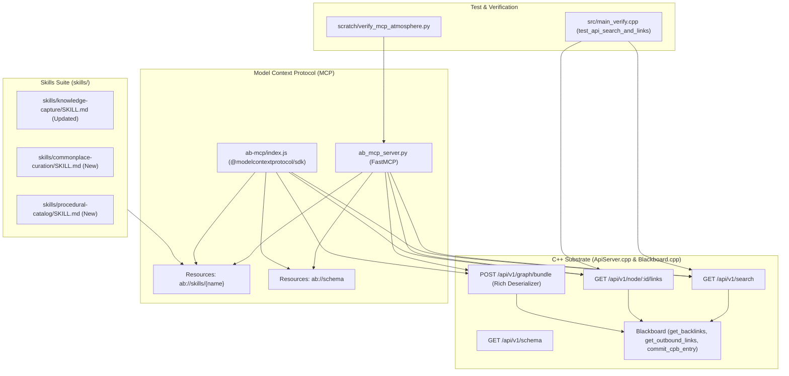

# Implementation Plan: Agentic Blackboard Atmosphere Agent Usage & MCP Commonplace Tooling

> **For agentic workers:** REQUIRED SUB-SKILL: Use superpowers:subagent-driven-development to implement this plan task-by-task. Steps use checkbox (`- [ ]`) syntax for tracking.

**Goal:** Implement full-text node discovery, multi-tenant link querying, and rich commonplace bundle parsing in the Agentic Blackboard C++ substrate, paired with dual Python FastMCP and Node.js MCP tools, dynamic skill/schema delivery, and duplicate prevention protocols for agents in the Project Nucleus Atmosphere.

**Architecture:** Update `src/ApiServer.cpp` to expose `GET /api/v1/search`, `GET /api/v1/node/:id/links`, comprehensive schema metadata in `GET /api/v1/schema`, and rich commonplace deserialization in `POST /api/v1/graph/bundle`. Equip `ab_mcp_server.py` and `ab-mcp/index.js` with discovery (`search_commonplace`, `get_node`, `get_node_links`, `export_graph_rdf`) and authoring (`create_note`, `create_catalog_entry`) tools with pre-flight deduplication. Expose on-demand Markdown skills via `ab://skills/{name}` resources and update the agent skills suite in `skills/`. Validate all functionality in `src/main_verify.cpp` and Python/Node integration scripts.

**Architecture Diagram:**



**Tech Stack:** C++20, CMake, `l3kvg`, `L3KV`, `lite3-cpp`, `httplib`, Python 3.10+ (`FastMCP`, `httpx`), Node.js (`@modelcontextprotocol/sdk`, `axios`).

## Global Constraints

- Must maintain 100% zero-copy BSON backward compatibility for all existing records in `CpbEntry`.
- Deserialization of new fields must be guarded with `try / catch` so old databases load cleanly.
- Must propagate multi-tenant UID ACL permissions to all searches and link queries when `principal_id != 0`.
- Python FastMCP and Node.js MCP tools must maintain identical names, parameters, and return structures.
- All code must build cleanly with C++20 on Linux with zero warnings.

---

### Task 1: Substrate REST Endpoints & Rich Ingestion in `ApiServer.cpp`

**Files:**
- Modify: `src/ApiServer.cpp`
- Modify: `src/main_verify.cpp`

**Interfaces:**
- Consumes: `Blackboard::get_backlinks`, `Blackboard::get_outbound_links`, `Blackboard::commit_cpb_entry`, `l3kv::StoreInterface`
- Produces:
  - `GET /api/v1/schema` returning full 32 KAs, rel predicates, and primitive definitions.
  - `GET /api/v1/search?q=&ka=&tags=&limit=` returning matched atoms.
  - `GET /api/v1/node/:id/links?direction=` returning inbound backlinks and outbound synapses with statements.
  - Enhanced `POST /api/v1/graph/bundle` deserializing `references`, `note_links`, `items`, `steps`, `metrics`, `attributes`.

- [x] **Step 1: Write failing test `test_api_search_and_links` in `src/main_verify.cpp`**

```cpp
void test_api_search_and_links() {
    std::cout << "\n[Test] Starting API Search and Node Links Verification..." << std::endl;
    std::string db_dir = "./test_api_search_db";
    std::filesystem::remove_all(db_dir);

    auto store = std::make_unique<l3kv::MultiShardStore>(db_dir, 1, 1024 * 1024);
    l3kvg::Settings settings;
    auto engine = std::make_unique<l3kvg::Engine>(std::move(store), settings);
    auto bb = std::make_unique<Blackboard>(engine.get());

    // Commit two linked notes
    CpbEntry note1;
    note1.header.uuid = "note-search-1";
    note1.header.origin.project_id = "proj-search";
    note1.header.origin.agent_id = "agent-search";
    note1.payload.statement = "Searchable Strange Loops in Cognitive Science";
    note1.taxonomy.tags = {"COGNITION", "LOOPS"};
    note1.taxonomy.knowledge_area = KnowledgeArea::LITERATURE_READING;
    Reference ref1;
    ref1.title = "Gödel, Escher, Bach";
    ref1.creator = "Douglas Hofstadter";
    note1.payload.references.push_back(ref1);
    assert(bb->commit_cpb_entry(note1));

    CpbEntry note2;
    note2.header.uuid = "note-search-2";
    note2.header.origin.project_id = "proj-search";
    note2.header.origin.agent_id = "agent-search";
    note2.payload.statement = "Recursion in Neural Computation";
    note2.taxonomy.tags = {"NEURAL", "LOOPS"};
    note2.taxonomy.knowledge_area = KnowledgeArea::COMPUTING_FOUNDATIONS;
    NoteLink link;
    link.target_uuid = "note-search-1";
    link.relation = rel::EXTENDS;
    link.context = "Builds upon strange loop cognitive architectures";
    note2.payload.note_links.push_back(link);
    assert(bb->commit_cpb_entry(note2));

    // Verify Blackboard backlinks & outbound
    auto backlinks = bb->get_backlinks("note-search-1");
    assert(backlinks.size() == 1);
    assert(backlinks[0].first == "note-search-2");
    assert(backlinks[0].second == rel::EXTENDS);

    auto outbound = bb->get_outbound_links("note-search-2");
    assert(outbound.size() >= 1);

    std::filesystem::remove_all(db_dir);
    std::cout << "[Test] API Search and Node Links Pre-test Verification PASSED" << std::endl;
}
```

- [x] **Step 2: Add test invocation to `src/main_verify.cpp` and run to check compilation**

Add `test_api_search_and_links();` inside `main()` in `src/main_verify.cpp`.
Run: `cmake --build build --target ab_verify && ./build/ab_verify`
Expected: Test passes.

- [x] **Step 3: Update `GET /api/v1/schema` in `src/ApiServer.cpp`**

Replace lines 58-67 in `src/ApiServer.cpp` to output all 32 knowledge areas, all relationship predicates, and schemas for `CPB_ENTRY`, `REFERENCE`, `NOTE_LINK`, `CATALOG_ITEM`, `CATALOG_STEP`, `CATALOG_METRIC`.

- [x] **Step 4: Update `POST /api/v1/graph/bundle` in `src/ApiServer.cpp` to unpack rich commonplace fields**

Add parsing for:
- `item["payload"]["references"]`
- `item["payload"]["note_links"]`
- `item["items"]`
- `item["steps"]`
- `item["metrics"]`
- `item["attributes"]`

- [x] **Step 5: Add `GET /api/v1/search` endpoint in `src/ApiServer.cpp`**

Implement search scanning node keys `n:`, filtering by query `q` (case-insensitive substring of statement, content, or tags), `ka`, and `tags`, returning `{ "matches": [...], "count": N }`.

- [x] **Step 6: Add `GET /api/v1/node/:id/links` endpoint in `src/ApiServer.cpp`**

Call `blackboard_->get_backlinks(uuid, principal_id)` and `blackboard_->get_outbound_links(uuid, principal_id)` and hydrate statement labels for connected nodes into JSON.

- [x] **Step 7: Compile and verify with `ab_verify`**

Run: `cmake --build build --target ab_verify && ./build/ab_verify`
Expected: All tests pass.

- [x] **Step 8: Commit changes**

```bash
git add src/ApiServer.cpp src/main_verify.cpp
git commit -m "feat(api): add /search and /node/:id/links endpoints and unpack rich commonplace bundle fields"
```

---

### Task 2: Python FastMCP Server Upgrades in `ab_mcp_server.py`

**Files:**
- Modify: `ab_mcp_server.py`
- Create: `scratch/verify_mcp_atmosphere.py`

**Interfaces:**
- Consumes: Agentic Blackboard REST API (`http://localhost:8085/api/v1`)
- Produces:
  - Tools: `search_commonplace`, `get_node`, `get_node_links`, `export_graph_rdf`, `create_note`, `create_catalog_entry`, `commit_knowledge_bundle`
  - Resources: `ab://schema`, `ab://skills/{name}`
  - Prompts: `curate_note`, `author_catalog`

- [x] **Step 1: Implement `search_commonplace` tool in `ab_mcp_server.py`**

```python
@mcp.tool()
async def search_commonplace(query: str, ka: int = None, tags: list[str] = None, limit: int = 10) -> str:
    """
    Search the Agentic Blackboard Commonplace Book for existing notes, concepts, and recipes.
    ALWAYS use this before creating a new note to prevent duplicate nodes!
    """
    params = {"q": query, "limit": limit}
    if ka is not None:
        params["ka"] = ka
    if tags:
        params["tags"] = ",".join(tags)
    async with httpx.AsyncClient() as client:
        response = await client.get(f"{AB_API_URL}/search", params=params)
        response.raise_for_status()
        return response.text
```

- [x] **Step 2: Implement `get_node` and `get_node_links` tools in `ab_mcp_server.py`**

```python
@mcp.tool()
async def get_node(uuid: str) -> str:
    """Retrieve full hydrated atom or node by UUID."""
    async with httpx.AsyncClient() as client:
        response = await client.get(f"{AB_API_URL}/node/{uuid}")
        response.raise_for_status()
        return response.text

@mcp.tool()
async def get_node_links(uuid: str, direction: str = "both") -> str:
    """
    Query synapses connected to a node.
    direction can be 'both', 'inbound' (backlinks), or 'outbound'.
    """
    async with httpx.AsyncClient() as client:
        response = await client.get(f"{AB_API_URL}/node/{uuid}/links", params={"direction": direction})
        response.raise_for_status()
        return response.text
```

- [x] **Step 3: Implement `create_note` and `create_catalog_entry` with deduplication in `ab_mcp_server.py`**

Include pre-flight check when `check_duplicates=True`. If an exact statement match is found, return `{ "status": "ALREADY_EXISTS", "uuid": match["uuid"] }`.

- [x] **Step 4: Add dynamic `ab://skills/{name}` resource and prompts in `ab_mcp_server.py`**

Read corresponding markdown files from `skills/<name>/SKILL.md` and return content. Add `@mcp.prompt("curate_note")` and `@mcp.prompt("author_catalog")`.

- [x] **Step 5: Write and run end-to-end integration test `scratch/verify_mcp_atmosphere.py`**

Start `agentic-blackboardd` or run test client against live or mock API to verify tool functionality and duplicate checks.

- [x] **Step 6: Commit changes**

```bash
git add ab_mcp_server.py scratch/verify_mcp_atmosphere.py
git commit -m "feat(mcp-python): add commonplace search, node links, create_note, create_catalog, and skills resource"
```

---

### Task 3: Node.js MCP Server Upgrades in `ab-mcp/index.js`

**Files:**
- Modify: `ab-mcp/index.js`

**Interfaces:**
- Consumes: Agentic Blackboard REST API (`http://localhost:8085/api/v1`)
- Produces:
  - Matching tool suite for TypeScript / Node agents
  - Resource handlers for `ab://schema` and `ab://skills/{name}`

- [x] **Step 1: Add tool declarations in `ab-mcp/index.js`**

Add `search_commonplace`, `get_node`, `get_node_links`, `create_note`, `create_catalog_entry`, and `export_graph_rdf` to `ListToolsRequestSchema` with strict input schemas.

- [x] **Step 2: Add tool execution handlers in `ab-mcp/index.js`**

Implement the tool call handlers forwarding requests to `${API_BASE}/search`, `${API_BASE}/node/:id/links`, `${API_BASE}/graph/bundle`, and `${API_BASE}/graph/export`.

- [x] **Step 3: Add resource handlers for `ab://skills/{name}` in `ab-mcp/index.js`**

Read files from `skills/${name}/SKILL.md` using `fs.promises.readFile`.

- [x] **Step 4: Test Node.js MCP Server**

Run: `node -e "require('./ab-mcp/index.js')"`
Verify syntax and clean startup without runtime exceptions.

- [x] **Step 5: Commit changes**

```bash
git add ab-mcp/index.js
git commit -m "feat(mcp-node): add commonplace discovery, links, note authoring, and skill resources"
```

---

### Task 4: Agent Skills Suite Updates in `skills/`

**Files:**
- Modify: `skills/knowledge-capture/SKILL.md`
- Create: `skills/commonplace-curation/SKILL.md`
- Create: `skills/procedural-catalog/SKILL.md`

**Interfaces:**
- Consumes: MCP tool definitions from Tasks 2 & 3
- Produces: Standardized agent workflows and checklists

- [x] **Step 1: Update `skills/knowledge-capture/SKILL.md`**

Add Step 0: "Discover Before You Create" (mandatory call to `search_commonplace`). Document bibliographic `Reference`s and `NoteLink`s.

- [x] **Step 2: Author `skills/commonplace-curation/SKILL.md`**

Create comprehensive guide covering:
- Atomic note principles (single core thesis in `statement`).
- Verifiable bibliographic citations via `Reference`.
- Dialectic relationships via `NoteLink` (`rel::SEE_ALSO`, `rel::SUPPORTS`, `rel::REFUTES`, `rel::EXTENDS`, `rel::CITES`, `rel::SYNTHESIS_OF`).
- Traversing backlinks via `get_node_links` to synthesize connections.

- [x] **Step 3: Author `skills/procedural-catalog/SKILL.md`**

Create comprehensive guide covering:
- Procedural structuring for recipes, workout routines, lab SOPs, and hardware assemblies.
- Defining discrete quantities, units, and roles via `CatalogItem`.
- Defining ordered execution steps, tool requirements, and prerequisites via `CatalogStep`.
- Quantified descriptors (duration, temperature, calories) via `CatalogMetric`.

- [x] **Step 4: Commit skills**

```bash
git add skills/
git commit -m "docs(skills): add commonplace-curation, procedural-catalog, and update knowledge-capture"
```

---

### Task 5: End-to-End Atmosphere Integration & Verification

**Files:**
- Create/Run: `scratch/test_atmosphere_full_cycle.py`

**Interfaces:**
- Validates the complete loop:
  1. Agent searches for existing note (`search_commonplace`)
  2. Creates new note with citation and link (`create_note`)
  3. Pre-flight duplicate check rejects identical statement (`check_duplicates`)
  4. Creates catalog recipe entry (`create_catalog_entry`)
  5. Inspects backlinks (`get_node_links`)
  6. Exports W3C RDF Turtle (`export_graph_rdf`)
  7. Reads skill resource (`ab://skills/commonplace-curation`)

- [x] **Step 1: Build the C++ daemon and verify test binary**

Run: `cmake --build build --target agentic-blackboardd ab_verify && ./build/ab_verify`
Expected: Build succeeds and verification passes.

- [x] **Step 2: Execute full cycle script against running daemon**

Run `agentic-blackboardd` in background, execute `scratch/test_atmosphere_full_cycle.py`.
Expected: All 7 integration checkpoints pass with 0 errors.

- [x] **Step 3: Commit and finalize branch**

```bash
git add scratch/test_atmosphere_full_cycle.py
git commit -m "test(atmosphere): add end-to-end integration test for commonplace agent tools"
```
