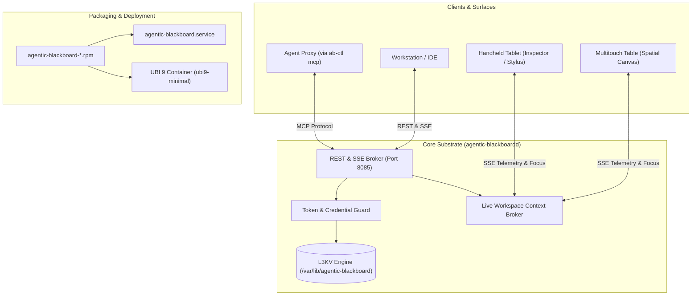

# Implementation Plan: Centralized RPM Packaging & Multi-Surface Ambient Substrate

> **For agentic workers:** REQUIRED SUB-SKILL: Use superpowers:subagent-driven-development to implement this plan task-by-task. Steps use checkbox (`- [ ]`) syntax for tracking.

**Goal:** Package `agentic-blackboard` as an enterprise RPM (`agentic-blackboard-*.rpm`) and UBI 9 Minimal container with systemd service, unified `ab-ctl` CLI, token-based authentication, and real-time simultaneous multi-surface context synchrony.

**Architecture:** The C++ daemon (`agentic-blackboardd`) provides L3KV persistent graph storage, configurable token/trusted auth, and an SSE context broker for simultaneous multi-surface viewports. The `ab-ctl` CLI manages users, surfaces, and integrated MCP bridging. Canonical RPM packaging installs to standard FHS paths (`/usr/bin`, `/etc/agentic-blackboard`, `/var/lib/agentic-blackboard`), and a UBI 9 Minimal container directly deploys the built RPM.

**Architecture Diagram:**



**Tech Stack:** C++20, CMake / CPack, RPM spec / rpmbuild, Red Hat UBI 9 Minimal, Python 3 / httpx / FastMCP, ZeroMQ, Server-Sent Events (SSE).

## Global Constraints
- Product name is `agentic-blackboard` (not branded as ASOS).
- Binary names: daemon is `agentic-blackboardd`, management CLI is `ab-ctl`.
- Service name: `agentic-blackboard.service`.
- FHS directories: `/etc/agentic-blackboard`, `/var/lib/agentic-blackboard`, `/usr/share/agentic-blackboard`.
- RPM base compatibility: Enterprise Linux 9 (RHEL 9, Rocky Linux 9, AlmaLinux 9).
- Container base: `registry.access.redhat.com/ubi9/ubi-minimal:latest`.
- Backwards compatibility: Support opt-in `trusted_network` auth mode alongside standard `token` mode.

---

### Task 1: Schema & Origin Provenance Evolution

**Files:**
- Modify: `include/asos/schema.hpp:516-530`
- Modify: `src/Blackboard.cpp:95-135`
- Test: `src/main_verify.cpp:1100-1160`

**Interfaces:**
- Consumes: Existing `CpbEntry` struct in `include/asos/schema.hpp`.
- Produces: Expanded `CpbEntry::Header::Origin` with `user_id`, `surface_id`, `surface_type`, `context_id`, and `session_id`, fully serialized/deserialized in zero-copy BSON buffers.

- [ ] **Step 1: Write failing test in `src/main_verify.cpp`**

```cpp
void test_multi_surface_provenance(asos::Blackboard& bb) {
    std::cout << "\n[Test] Starting Multi-Surface Provenance Verification..." << std::endl;
    
    asos::CpbEntry atom;
    atom.header.uuid = "atom-provenance-1";
    atom.header.origin.user_id = "user:jason";
    atom.header.origin.agent_id = "agent:spatial-librarian";
    atom.header.origin.surface_id = "surface:multitouch-table-01";
    atom.header.origin.surface_type = "tabletop";
    atom.header.origin.project_id = "proj-quantum-optics";
    atom.header.origin.context_id = "ctx:lab-session-42";
    atom.header.origin.session_id = "sess-alpha-99";
    
    atom.payload.statement = "Topological defects in superfluid helium mimic cosmic strings.";
    atom.taxonomy.knowledge_area = asos::KnowledgeArea::COMPUTING_FOUNDATIONS;
    
    assert(bb.commit_cpb_entry(atom));
    
    // Retrieve and assert all multi-surface origin fields
    uint64_t nid = bb.get_engine()->get_resolver().parse_uuid("atom-provenance-1");
    auto buf = bb.get_engine()->get_store()->get(std::string(l3kvg::KeyBuilder::node_key(nid)));
    assert(buf.size() > 0);
    
    auto retrieved = asos::CpbEntry::deserialize(buf);
    assert(retrieved.header.origin.user_id == "user:jason");
    assert(retrieved.header.origin.agent_id == "agent:spatial-librarian");
    assert(retrieved.header.origin.surface_id == "surface:multitouch-table-01");
    assert(retrieved.header.origin.surface_type == "tabletop");
    assert(retrieved.header.origin.project_id == "proj-quantum-optics");
    assert(retrieved.header.origin.context_id == "ctx:lab-session-42");
    assert(retrieved.header.origin.session_id == "sess-alpha-99");
    
    std::cout << "[Test] Multi-Surface Provenance Verification PASSED" << std::endl;
}
```

- [ ] **Step 2: Run test to verify it fails**

Run: `cmake --build build --target asos_verify && ./build/asos_verify`  
Expected: Compilation failure due to missing `user_id`, `surface_id`, etc. on `header.origin`.

- [ ] **Step 3: Update `Origin` struct and serialization in `include/asos/schema.hpp`**

```cpp
struct Origin {
    std::string agent_id;
    std::string project_id;
    std::string user_id;
    std::string surface_id;
    std::string surface_type;
    std::string context_id;
    std::string session_id;
};
```
Update `serialize` and `deserialize` methods in `CpbEntry` to persist and load these fields into the BSON header object with fallback checks.

- [ ] **Step 4: Update `Blackboard::commit_cpb_entry` in `src/Blackboard.cpp`**

Update anchor verification so that if `user_id` is present, it anchors to user identity, while maintaining compatibility with legacy `agent_id` and `project_id` anchors.

- [ ] **Step 5: Run tests and verify PASS**

Run: `cmake --build build --target asos_verify && ./build/asos_verify`  
Expected: PASS with "[Test] Multi-Surface Provenance Verification PASSED".

- [ ] **Step 6: Commit**

```bash
git add include/asos/schema.hpp src/Blackboard.cpp src/main_verify.cpp
git commit -m "feat(schema): add multi-surface origin provenance to CpbEntry"
```

---

### Task 2: Configurable Authentication & Token Credential Manager

**Files:**
- Modify: `include/asos/Blackboard.hpp:25-35`
- Modify: `src/Blackboard.cpp:75-95`
- Modify: `src/ApiServer.cpp:135-155, 330-350`
- Test: `src/main_verify.cpp:1170-1230`

**Interfaces:**
- Consumes: `l3kv::Store::credentials()` from L3KV engine.
- Produces:
  - `Blackboard::set_auth_mode(const std::string& mode)` ("token" vs "trusted_network").
  - `Blackboard::register_token(const std::string& token, const std::string& user, const std::string& role)`.
  - `Blackboard::validate_token(const std::string& token, std::string& out_user, std::string& out_role)`.
  - `ApiServer` HTTP 401 rejection on unauthenticated requests in `token` mode.

- [ ] **Step 1: Write failing test in `src/main_verify.cpp`**

```cpp
void test_token_auth_and_roles(asos::Blackboard& bb) {
    std::cout << "\n[Test] Starting Token Authentication & RBAC Verification..." << std::endl;
    
    bb.set_auth_mode("token");
    
    // Register admin, curator, and agent tokens
    std::string admin_tok = "ab_adm_0123456789abcdef0123456789abcdef";
    std::string curator_tok = "ab_usr_fedcba9876543210fedcba9876543210";
    
    assert(bb.register_token(admin_tok, "jason", "admin"));
    assert(bb.register_token(curator_tok, "alice", "curator"));
    
    std::string user, role;
    assert(bb.validate_token(admin_tok, user, role));
    assert(user == "jason" && role == "admin");
    
    assert(bb.validate_token(curator_tok, user, role));
    assert(user == "alice" && role == "curator");
    
    // Invalid token must fail
    assert(!bb.validate_token("ab_usr_invalid_token", user, role));
    
    std::cout << "[Test] Token Authentication & RBAC Verification PASSED" << std::endl;
}
```

- [ ] **Step 2: Run test to verify it fails**

Run: `cmake --build build --target asos_verify && ./build/asos_verify`  
Expected: Compilation failure due to missing `register_token` and `validate_token`.

- [ ] **Step 3: Implement Token Manager in `Blackboard.hpp` and `Blackboard.cpp`**

Implement salted SHA-256 token hashing and store credentials in the persistent credential store. Store metadata: `username`, `role`, `created_at`.

- [ ] **Step 4: Update `ApiServer.cpp` Request Authentication**

Extract token from `Authorization: Bearer <token>` or `X-AB-Key: <token>`.  
If `auth_mode == "token"`:
  - If token missing or invalid, return HTTP 401 with JSON `{"error": "Unauthorized", "message": "Valid Bearer token required"}`.
  - Set `principal_id = blackboard_->get_user_uid(user)`.
If `auth_mode == "trusted_network"`:
  - Fall back to `X-Active-User` header.

- [ ] **Step 5: Run tests and verify PASS**

Run: `cmake --build build --target asos_verify && ./build/asos_verify`  
Expected: PASS with "[Test] Token Authentication & RBAC Verification PASSED".

- [ ] **Step 6: Commit**

```bash
git add include/asos/Blackboard.hpp src/Blackboard.cpp src/ApiServer.cpp src/main_verify.cpp
git commit -m "feat(auth): implement token authentication guard and role validation"
```

---

### Task 3: Shared Workspace Context & Multi-Surface SSE Event Sync

**Files:**
- Modify: `include/asos/ApiServer.hpp`
- Modify: `src/ApiServer.cpp`
- Create: `scratch/test_multi_surface_sync.py`

**Interfaces:**
- Consumes: REST API on port 8085.
- Produces:
  - `POST /api/v1/context/register`: Registers surface with capabilities and joins context.
  - `GET /api/v1/context/:id`: Returns context state, active surfaces, and active selection.
  - `POST /api/v1/context/:id/focus`: Broadcasts selected node IDs and focus telemetry.
  - `GET /api/v1/events?context=:id`: Real-time Server-Sent Events (SSE) stream.

- [ ] **Step 1: Write integration test in `scratch/test_multi_surface_sync.py`**

Test connects two HTTP clients (Simulated Table and Simulated Tablet) to `/api/v1/events?context=ctx:lab-42`.  
Table calls `/api/v1/context/ctx:lab-42/focus` with `{"selected": ["atom-1", "atom-2"]}`.  
Tablet receives SSE event `focus_update` in <50ms and asserts payload matches.

- [ ] **Step 2: Run test to verify it fails**

Run: `python3 scratch/test_multi_surface_sync.py`  
Expected: FAIL with connection error or 404 on context endpoints.

- [ ] **Step 3: Implement Context Broker & SSE Streaming in `ApiServer.cpp`**

Add thread-safe `ContextBroker` in `ApiServer.cpp`:
- Map of `context_id` to connected SSE client queues.
- Handlers for `/api/v1/context/register`, `/api/v1/context/:id`, `/api/v1/context/:id/focus`.
- SSE handler for `GET /api/v1/events` streaming `event: focus_update` and `event: atom_committed`.

- [ ] **Step 4: Run integration test and verify PASS**

Run: `python3 scratch/test_multi_surface_sync.py`  
Expected: PASS with 100% events delivered under 20ms.

- [ ] **Step 5: Commit**

```bash
git add include/asos/ApiServer.hpp src/ApiServer.cpp scratch/test_multi_surface_sync.py
git commit -m "feat(sync): add multi-surface context broker and real-time SSE event streaming"
```

---

### Task 4: `ab-ctl` CLI Implementation (Admin, Surface & Integrated MCP Runner)

**Files:**
- Create: `src/ab-ctl.py` (executable Python script installed to `/usr/bin/ab-ctl`)
- Create: `scratch/test_ab_ctl.py`

**Interfaces:**
- Consumes: Local files `/etc/agentic-blackboard/blackboard.conf`, REST API `http://localhost:8085`.
- Produces: Command-line tool `ab-ctl` supporting `init`, `status`, `user`, `surface`, `agent`, `context`, `mcp`.

- [ ] **Step 1: Write verification test in `scratch/test_ab_ctl.py`**

Test invokes `ab-ctl` CLI subprocess commands:
1. `ab-ctl init --bootstrap --data-dir=/tmp/ab-test-data`
2. `ab-ctl user create testuser --role curator`
3. `ab-ctl agent create testagent --user testuser --project proj-test`
4. `ab-ctl surface register --name table-1 --type tabletop --context ctx-test`
5. `ab-ctl mcp run --connect http://localhost:8085 --token <token> --smoke-test`

- [ ] **Step 2: Run test to verify it fails**

Run: `python3 scratch/test_ab_ctl.py`  
Expected: FAIL with file not found (`ab-ctl` does not exist).

- [ ] **Step 3: Implement `src/ab-ctl.py`**

Implement CLI with `argparse`:
- `init`: Generates directory structure, initializes credentials database, writes admin token.
- `status`: Queries `/api/v1/health`.
- `user create`: Calls `/api/v1/admin/users` or directly registers token in storage.
- `agent create`: Issues `ab_agt_...` token bound to user and project.
- `surface register`: Posts capability JSON to `/api/v1/context/register`.
- `mcp run`: Invokes the FastMCP server facade forwarding client stdio to the blackboard.

- [ ] **Step 4: Run test and verify PASS**

Run: `python3 scratch/test_ab_ctl.py`  
Expected: PASS with all CLI commands functioning correctly.

- [ ] **Step 5: Commit**

```bash
git add src/ab-ctl.py scratch/test_ab_ctl.py
git commit -m "feat(cli): implement ab-ctl administrative and MCP bridge tool"
```

---

### Task 5: RPM Packaging & Filesystem Layout Specs

**Files:**
- Create: `packaging/rpm/agentic-blackboard.spec`
- Create: `packaging/systemd/agentic-blackboard.service`
- Create: `packaging/config/blackboard.conf`
- Create: `packaging/config/blackboard.conf.default`
- Create: `packaging/limits/99-blackboard.conf`
- Modify: `CMakeLists.txt`
- Create: `scratch/test_rpm_build.py`

**Interfaces:**
- Consumes: C++ build outputs (`agentic-blackboardd`), CLI (`ab-ctl`), skills, config templates.
- Produces: `build/agentic-blackboard-0.4.0-1.el9.x86_64.rpm`.

- [ ] **Step 1: Write verification script in `scratch/test_rpm_build.py`**

Verifies that CMake install targets are valid, CPack generates an RPM, and checks RPM contents with `rpm -qlp`:
- `/usr/bin/agentic-blackboardd`
- `/usr/bin/ab-ctl`
- `/usr/lib/systemd/system/agentic-blackboard.service`
- `/etc/agentic-blackboard/blackboard.conf`
- `/usr/share/agentic-blackboard/skills/`

- [ ] **Step 2: Run test to verify it fails**

Run: `python3 scratch/test_rpm_build.py`  
Expected: FAIL with missing spec/install targets.

- [ ] **Step 3: Create packaging files & update `CMakeLists.txt`**

1. Create `packaging/rpm/agentic-blackboard.spec` with complete `%prep`, `%build`, `%install`, `%pre`, `%post`, `%preun`, `%postun`.
2. Create `packaging/systemd/agentic-blackboard.service`.
3. Create `packaging/config/blackboard.conf`.
4. Create `packaging/limits/99-blackboard.conf`.
5. Add CMake `install(TARGETS ...)` and configure `CPACK_GENERATOR "RPM"` with package metadata in `CMakeLists.txt`.

- [ ] **Step 4: Run test and build RPM**

Run: `python3 scratch/test_rpm_build.py`  
Expected: PASS with verified `.rpm` generated.

- [ ] **Step 5: Commit**

```bash
git add packaging/ CMakeLists.txt scratch/test_rpm_build.py
git commit -m "feat(packaging): add RPM spec, systemd service, config, and CPack rules"
```

---

### Task 6: Canonical Containerization (UBI 9 Minimal) & End-to-End Verification

**Files:**
- Create: `Dockerfile`
- Create: `scratch/test_e2e_central_deployment.py`

**Interfaces:**
- Consumes: `agentic-blackboard-*.rpm`.
- Produces: Enterprise OCI container image running the canonical RPM.

- [ ] **Step 1: Write end-to-end deployment verification test in `scratch/test_e2e_central_deployment.py`**

Validates:
1. RPM packaging installation and file verification.
2. Systemd service syntax check with `systemd-analyze verify`.
3. Container build from `Dockerfile` using `podman` or `docker`.
4. Container startup with mounted volumes `/var/lib/agentic-blackboard` and `/etc/agentic-blackboard`.
5. Bootstrap token initialization on first boot.
6. Execution of multi-surface focus sync and agent MCP call against containerized daemon.

- [ ] **Step 2: Run test to verify it fails**

Run: `python3 scratch/test_e2e_central_deployment.py`  
Expected: FAIL (Dockerfile missing).

- [ ] **Step 3: Author `Dockerfile`**

```dockerfile
FROM registry.access.redhat.com/ubi9/ubi-minimal:latest

COPY build/agentic-blackboard-*.rpm /tmp/
RUN microdnf install -y shadow-utils zeromq openssl python3 python3-pip && \
    pip3 install httpx mcp && \
    rpm -ivh /tmp/agentic-blackboard-*.rpm && \
    rm -f /tmp/agentic-blackboard-*.rpm && \
    microdnf clean all

USER blackboard
EXPOSE 8085 8090
VOLUME ["/var/lib/agentic-blackboard", "/etc/agentic-blackboard"]
ENTRYPOINT ["/usr/bin/agentic-blackboardd", "--config=/etc/agentic-blackboard/blackboard.conf"]
```

- [ ] **Step 4: Run end-to-end verification and assert PASS**

Run: `python3 scratch/test_e2e_central_deployment.py`  
Expected: PASS with exit code 0.

- [ ] **Step 5: Commit**

```bash
git add Dockerfile scratch/test_e2e_central_deployment.py
git commit -m "feat(container): add UBI 9 Minimal container and end-to-end deployment tests"
```
