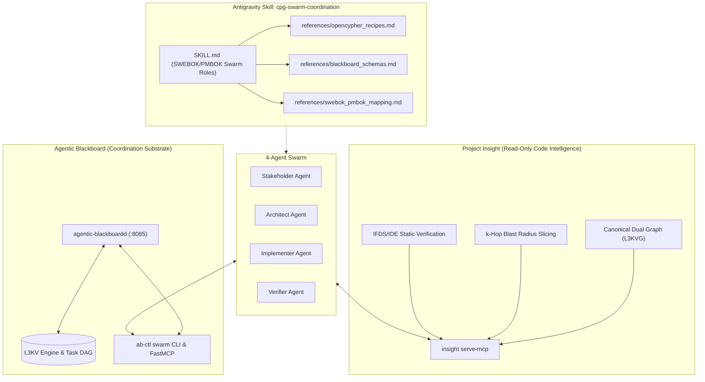

# CPG Swarm Coordination Implementation Plan

> **For agentic workers:** REQUIRED SUB-SKILL: Use superpowers:subagent-driven-development to implement this plan task-by-task. Steps use checkbox (`- [ ]`) syntax for tracking.

**Goal:** Implement the complete Code Property Graph (CPG) Swarm Coordination capability: a specialized Antigravity skill (`cpg-swarm-coordination`) with SWEBOK/PMBOK 4-agent swarm roles (Stakeholder, Architect, Implementer, Verifier), `ab-ctl` swarm CLI and FastMCP orchestration tools, and an end-to-end integration test harness.

**Architecture:** The swarm coordinates across two decoupled platforms: Project Insight (read-only CPG discovery, blast radius slicing, and IFDS/IDE static analysis via `insight serve-mcp`) and Agentic Blackboard (task DAG, exclusive leases, dual-identity provenance, and dialectic verification via `ab-ctl` and REST API). New swarm orchestration primitives in `ab-ctl` and the `cpg-swarm-coordination` skill provide the formal protocol, schemas, and state machine.

**Architecture Diagram:**



**Tech Stack:** Python 3.10+ (`FastMCP`, `httpx`, `argparse`), C++20 (`agentic-blackboardd`), Markdown/YAML (Antigravity Skills), openCypher, JSON-RPC 2.0.

## Global Constraints
- Target skill path: `/home/darkfell/.gemini/config/plugins/superpowers/skills/cpg-swarm-coordination/`
- Target CLI path: `/home/darkfell/dev/agentic_blackboard/src/ab-ctl.py`
- Test harness path: `/home/darkfell/dev/agentic_blackboard/scratch/test_cpg_swarm_coordination.py`
- SWEBOK v3 & PMBOK 7th edition alignment strictly preserved.
- No modifications or dependencies introduced into `project_insight` core.
- All blackboard commits must adhere to dual-identity provenance (`user:<id>` and `agent:<id>`).

---

### Task 1: `ab-ctl` Swarm CLI & Core Lease Management

**Files:**
- Modify: `src/ab-ctl.py:530-650`
- Test: `scratch/test_ab_ctl_swarm.py`

**Interfaces:**
- Consumes: Agentic Blackboard REST API (`/api/v1/graph/node`, `/api/v1/link`, `/api/v1/context/register`, `/api/v1/node/:id`).
- Produces: `ab-ctl swarm init`, `ab-ctl swarm task create`, `ab-ctl swarm task list`, `ab-ctl swarm lease claim`, `ab-ctl swarm lease release`, `ab-ctl swarm review submit`, `ab-ctl swarm review verdict`, `ab-ctl swarm accept`.

- [ ] **Step 1: Write failing CLI integration test for `ab-ctl swarm`**

Create `scratch/test_ab_ctl_swarm.py` testing context initialization, task creation with dependencies, lease claiming, review submission, dialectic verdict recording (`VALIDATED_BY`/`REFUTES`), and stakeholder acceptance.

```python
#!/usr/bin/env python3
import subprocess
import json
import sys
import os

def run_cmd(args):
    res = subprocess.run([sys.executable, "src/ab-ctl.py"] + args, capture_output=True, text=True)
    return res.returncode, res.stdout, res.stderr

def main():
    print("[TEST] Checking ab-ctl swarm CLI subcommands...")
    code, out, err = run_cmd(["swarm", "--help"])
    assert code == 0, f"Failed swarm --help: {err}"
    assert "init" in out and "lease" in out and "review" in out
    print("[PASS] ab-ctl swarm help verified.")

if __name__ == "__main__":
    main()
```

- [ ] **Step 2: Run test to verify it fails**

Run: `python3 /home/darkfell/dev/agentic_blackboard/scratch/test_ab_ctl_swarm.py`  
Expected: FAIL with `unrecognized arguments: swarm` or similar.

- [ ] **Step 3: Implement `swarm` subcommands in `src/ab-ctl.py`**

In `src/ab-ctl.py`:
1. Add `cmd_swarm(args)` handling:
   - `init`: Registers swarm context (`POST /api/v1/context/register`) and creates root requirement atom.
   - `task create`: Creates task atom (`POST /api/v1/graph/node`) with metadata (workflow, target_symbols, blast_radius_k, status="READY", lease={}).
   - `task list`: Queries context nodes (`GET /api/v1/context/:id` or search) and formats tasks in an aligned table showing task ID, name, status, lease holder, and dialectic links.
   - `lease claim`: Validates all incoming `DEPENDS_ON` edges are in `COMPLETED` or `VALIDATED` state. If valid and not leased, updates task atom with `metadata.status = "IN_PROGRESS"` and `metadata.lease = {holder: agent_id, expires_at: now + ttl}`. Returns HTTP 409 / error if blocked.
   - `lease release`: Clears lease holder and sets `status = "READY"`.
   - `review submit`: Updates task atom to `status = "REVIEW_PENDING"`, creates a `solution` atom, and links `task -> solution` via `HAS_SOLUTION`.
   - `review verdict`: Creates `verification_proof` or `counterexample_trace` atom and links `task -> proof` with `VALIDATED_BY` (on PASS) or `REFUTES` (on FAIL). Updates task status to `VALIDATED` (on PASS) or `READY` (on FAIL).
   - `accept`: Attaches `ACCEPTS` link from requirement/stakeholder to task and sets `status = "COMPLETED"`.
2. Add argparse subparsers for `swarm` and all sub-actions.

- [ ] **Step 4: Run test to verify it passes**

Run: `python3 /home/darkfell/dev/agentic_blackboard/scratch/test_ab_ctl_swarm.py`  
Expected: PASS

- [ ] **Step 5: Commit Task 1**

```bash
git add src/ab-ctl.py scratch/test_ab_ctl_swarm.py
git commit -m "feat(cli): add ab-ctl swarm task and lease management subcommands"
```

---

### Task 2: FastMCP Swarm Tool Expansion in `ab-ctl.py`

**Files:**
- Modify: `src/ab-ctl.py:480-530`
- Test: `scratch/test_mcp_swarm.py`

**Interfaces:**
- Consumes: FastMCP stdio server in `ab-ctl mcp`.
- Produces: MCP tools:
  - `swarm_init_context(context_id: str, name: str, user_id: str = "human")`
  - `swarm_create_task(context_id: str, name: str, workflow: str, target_symbols: list[str], depends_on: list[str] = [])`
  - `swarm_list_tasks(context_id: str)`
  - `swarm_claim_lease(task_id: str, agent_id: str, ttl_sec: int = 600)`
  - `swarm_release_lease(task_id: str, agent_id: str)`
  - `swarm_submit_review(task_id: str, agent_id: str, patch_summary: str)`
  - `swarm_record_verdict(task_id: str, verifier_id: str, verdict: str, details: dict)`
  - `swarm_accept_task(task_id: str, stakeholder_id: str, notes: str)`

- [ ] **Step 1: Write unit test for FastMCP swarm tools**

Create `scratch/test_mcp_swarm.py` that verifies the FastMCP server registers all 8 new swarm tools and their parameter signatures.

- [ ] **Step 2: Run test to verify it fails**

Run: `python3 /home/darkfell/dev/agentic_blackboard/scratch/test_mcp_swarm.py`  
Expected: FAIL with missing tool names.

- [ ] **Step 3: Implement FastMCP swarm tool decorators in `src/ab-ctl.py`**

Register the `@mcp.tool()` wrappers around the swarm functions in `run_mcp_server()`:
```python
@mcp.tool()
def swarm_claim_lease(task_id: str, agent_id: str, ttl_sec: int = 600) -> str:
    """Claims an exclusive lease on a task whose dependencies are satisfied."""
    ...
```

- [ ] **Step 4: Run test to verify it passes**

Run: `python3 /home/darkfell/dev/agentic_blackboard/scratch/test_mcp_swarm.py`  
Expected: PASS

- [ ] **Step 5: Commit Task 2**

```bash
git add src/ab-ctl.py scratch/test_mcp_swarm.py
git commit -m "feat(mcp): add swarm coordination tools to ab-ctl FastMCP server"
```

---

### Task 3: Reference Documentation & Schema Catalog

**Files:**
- Create: `/home/darkfell/.gemini/config/plugins/superpowers/skills/cpg-swarm-coordination/references/opencypher_recipes.md`
- Create: `/home/darkfell/.gemini/config/plugins/superpowers/skills/cpg-swarm-coordination/references/blackboard_schemas.md`
- Create: `/home/darkfell/.gemini/config/plugins/superpowers/skills/cpg-swarm-coordination/references/swebok_pmbok_mapping.md`

**Interfaces:**
- Consumes: Project Insight CPG schema (`InsightGraph`, `NodeKind`, `EdgeKind`) and Agentic Blackboard `CpbEntry` JSON schemas.
- Produces: Reference recipes and documentation for swarm agents.

- [ ] **Step 1: Create `references/opencypher_recipes.md`**

Write openCypher queries for:
- Discovering function callers and callee trees (`MATCH (caller)-[:CALLS]->(f:Function {name: $target})`).
- Discovering shared global state affiliations (`MATCH (f:Function)-[:WRITES|READS]->(v:Variable)`).
- Tracing dataflow taint paths (`MATCH p=(s:Variable)-[:TAINT_FLOWS_TO*]->(sink:Node)`).
- Extracting class hierarchies and virtual method overrides (`MATCH (derived:Class)-[:INHERITS]->(base:Class)`).

- [ ] **Step 2: Create `references/blackboard_schemas.md`**

Write exact JSON payload schemas for:
- `Requirement` atom
- `Task` atom
- `VerificationProof` atom
- `CounterexampleTrace` atom
- Relationship link requests (`DEPENDS_ON`, `SUBTASK_OF`, `VALIDATED_BY`, `REFUTES`, `ACCEPTS`, `REQUESTS_CHANGE`).

- [ ] **Step 3: Create `references/swebok_pmbok_mapping.md`**

Write detailed IEEE SWEBOK v3 and PMI PMBOK 7th edition role, artifact, and lifecycle mappings.

- [ ] **Step 4: Commit Task 3**

```bash
git add /home/darkfell/.gemini/config/plugins/superpowers/skills/cpg-swarm-coordination/references/
git commit -m "docs(skill): add CPG swarm coordination reference recipes and schemas"
```

---

### Task 4: Antigravity Skill Specification (`SKILL.md`)

**Files:**
- Create: `/home/darkfell/.gemini/config/plugins/superpowers/skills/cpg-swarm-coordination/SKILL.md`
- Test: Verification of skill frontmatter, role definitions, and workflow guidelines.

**Interfaces:**
- Consumes: Superpowers skill system, Project Insight MCP, Agentic Blackboard FastMCP.
- Produces: The executable skill definition guiding agent swarms.

- [ ] **Step 1: Write `SKILL.md` with YAML frontmatter**

Include:
- `name: cpg-swarm-coordination`
- `description: Use when coordinating an autonomous AI agent swarm (Stakeholder, Architect, Implementer, Verifier) on a codebase indexed by Project Insight using the Agentic Blackboard for task scheduling, leases, and dialectic review.`
- Role definitions and system prompt templates for each role.
- Step-by-step playbooks for:
  - Feature Development
  - Bug Fixing & Root Cause Localization
  - Refactoring & Modernization
- Strict dialectic state transition rules and lease expiration handling.

- [ ] **Step 2: Commit Task 4**

```bash
git add /home/darkfell/.gemini/config/plugins/superpowers/skills/cpg-swarm-coordination/SKILL.md
git commit -m "feat(skill): add cpg-swarm-coordination skill for autonomous swarms"
```

---

### Task 5: End-to-End Swarm Integration Test

**Files:**
- Create: `scratch/test_e2e_cpg_swarm.py`

**Interfaces:**
- Consumes: Running `agentic-blackboardd` daemon, `ab-ctl`, and mock or live `insight` queries.
- Produces: Comprehensive automated verification of the 4-agent dialectic lifecycle.

- [ ] **Step 1: Write `scratch/test_e2e_cpg_swarm.py`**

The integration test simulates all 4 agents in sequence:
1. Starts temporary `agentic-blackboardd` daemon on isolated port (e.g. 8096).
2. **Stakeholder Agent**: Creates requirement atom with AC.
3. **Architect Agent**: Creates 2 tasks: `Task-1` (leaf data structure) and `Task-2` (consumer), linking `Task-2 DEPENDS_ON Task-1`.
4. **Implementer Agent 2**: Tries to lease `Task-2` -> Fails (blocked by dependencies).
5. **Implementer Agent 1**: Leases `Task-1`, marks `REVIEW_PENDING`.
6. **Verifier Agent**: Audits `Task-1`, simulates failure, attaches `REFUTES` counterexample trace -> `Task-1` returns to `READY`.
7. **Implementer Agent 1**: Re-leases `Task-1`, fixes defect, marks `REVIEW_PENDING`.
8. **Verifier Agent**: Audits `Task-1`, attaches `VALIDATED_BY` proof -> `Task-1` marked `VALIDATED`.
9. **Stakeholder Agent**: Reviews acceptance criteria, attaches `ACCEPTS` -> `Task-1` marked `COMPLETED`.
10. **Implementer Agent 2**: Claims lease on `Task-2` -> Succeeds now that `Task-1` is completed!
11. Shuts down daemon cleanly and asserts 100% success.

- [ ] **Step 2: Execute integration test and verify all steps pass**

Run: `python3 /home/darkfell/dev/agentic_blackboard/scratch/test_e2e_cpg_swarm.py`  
Expected: `[PASS] Complete 4-Agent Dialectic Swarm Lifecycle Verified!`

- [ ] **Step 3: Commit Task 5**

```bash
git add scratch/test_e2e_cpg_swarm.py
git commit -m "test(swarm): add end-to-end integration test for 4-agent dialectic swarm lifecycle"
```
