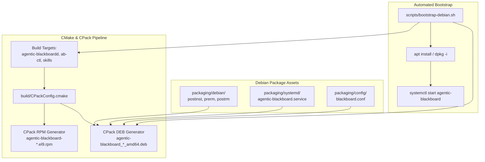

# Debian & Ubuntu Distribution Support and Automated Bootstrap Implementation Plan

> **For agentic workers:** REQUIRED SUB-SKILL: Use superpowers:subagent-driven-development to implement this plan task-by-task. Steps use checkbox (`- [ ]`) syntax for tracking.

**Goal:** Provide first-class Debian and Ubuntu distribution packaging (`.deb` via CMake CPack) with standard maintainer scripts, a comprehensive verification test suite, an automated one-command bootstrap script (`scripts/bootstrap-debian.sh`), and documentation updates.

**Architecture:** Extend the existing CMake build system to configure CPack's `DEB` generator alongside the `RPM` generator. Create standard maintainer scripts (`postinst`, `prerm`, `postrm`) in `packaging/debian/` that manage service users, filesystem permissions, idempotent substrate bootstrap, and systemd units. Implement an automated installer script (`scripts/bootstrap-debian.sh`) and verification test suites (`scratch/test_deb_packaging.py` and `scratch/test_bootstrap_debian.py`).

**Architecture Diagram:**



**Tech Stack:** CMake 3.20+, CPack, C++20, Python 3, `dpkg-deb`, `dpkg-shlibdeps`, systemd, bash.

## Global Constraints
- Must not break or regress existing RPM packaging (`agentic-blackboard-*.el9.x86_64.rpm`) or container builds.
- CPack DEB generator must use `CPACK_DEBIAN_PACKAGE_SHLIBDEPS ON` to resolve dynamic dependencies on Ubuntu 24.04 and Debian 12 without hardcoding library SONAMEs.
- Maintainer scripts must be POSIX `/bin/sh` compliant (`sh -n` clean) and executable (`0755`).
- Substrate initialization in `postinst` and `bootstrap-debian.sh` must be idempotent and non-destructive.
- All tests must pass 100%: `test_deb_packaging.py`, `test_bootstrap_debian.py`, `test_rpm_build.py`, and `ab_verify`.

---

### Task 1: Debian Maintainer Scripts (`postinst`, `prerm`, `postrm`)

**Files:**
- Create: `packaging/debian/postinst`
- Create: `packaging/debian/prerm`
- Create: `packaging/debian/postrm`
- Test: `scratch/test_deb_scripts.py`

**Interfaces:**
- Consumes: Standard POSIX shell `/bin/sh`, `dpkg` maintainer arguments (`configure`, `remove`, `purge`).
- Produces: Executable maintainer scripts managing system user `blackboard`, `/var/lib/agentic-blackboard` ownership, `ab-ctl init --bootstrap`, and systemd unit reload.

- [ ] **Step 1: Write verification test for maintainer scripts**
Create `scratch/test_deb_scripts.py` testing:
1. All three files exist (`packaging/debian/postinst`, `prerm`, `postrm`).
2. All three files have executable permissions (`0755`).
3. All three files pass syntax checking (`sh -n <file>`).
4. `postinst` contains `addgroup` / `groupadd`, `adduser` / `useradd`, `chown -R blackboard:blackboard`, and `ab-ctl init --bootstrap`.
5. `prerm` stops `agentic-blackboard.service`.
6. `postrm` reloads systemd on remove/purge.

- [ ] **Step 2: Run test to verify it fails**
Run: `python3 scratch/test_deb_scripts.py`
Expected: FAIL with missing maintainer scripts.

- [ ] **Step 3: Implement maintainer scripts**
Create `packaging/debian/postinst`:
```sh
#!/bin/sh
set -e

case "$1" in
    configure)
        # Create blackboard group if not present
        if ! getent group blackboard >/dev/null; then
            addgroup --system blackboard 2>/dev/null || groupadd -r blackboard 2>/dev/null || true
        fi

        # Create blackboard user if not present
        if ! getent passwd blackboard >/dev/null; then
            adduser --system --ingroup blackboard --home /var/lib/agentic-blackboard \
                --no-create-home --shell /usr/sbin/nologin blackboard 2>/dev/null || \
            useradd -r -g blackboard -d /var/lib/agentic-blackboard -s /usr/sbin/nologin blackboard 2>/dev/null || true
        fi

        # Ensure directories exist and have proper permissions
        mkdir -p /var/lib/agentic-blackboard /var/log/agentic-blackboard /etc/agentic-blackboard
        chown -R blackboard:blackboard /var/lib/agentic-blackboard /var/log/agentic-blackboard
        chmod 0750 /var/lib/agentic-blackboard /var/log/agentic-blackboard

        if [ -f /etc/agentic-blackboard/blackboard.conf ]; then
            chown root:blackboard /etc/agentic-blackboard/blackboard.conf
            chmod 0640 /etc/agentic-blackboard/blackboard.conf
        fi

        # Idempotent bootstrap initialization
        if [ ! -f /var/lib/agentic-blackboard/initialized ]; then
            if [ -x /usr/bin/ab-ctl ]; then
                /usr/bin/ab-ctl init --bootstrap --data-dir=/var/lib/agentic-blackboard || true
                touch /var/lib/agentic-blackboard/initialized 2>/dev/null || true
            fi
            chown -R blackboard:blackboard /var/lib/agentic-blackboard
        fi

        # Reload systemd daemon if running
        if [ -d /run/systemd/system ]; then
            systemctl --system daemon-reload >/dev/null 2>&1 || true
        fi
        ;;
    abort-upgrade|abort-remove|abort-deconfigure)
        ;;
    *)
        echo "postinst called with unknown argument \`$1'" >&2
        exit 1
        ;;
esac

exit 0
```

Create `packaging/debian/prerm`:
```sh
#!/bin/sh
set -e

case "$1" in
    remove|deconfigure)
        if [ -d /run/systemd/system ]; then
            systemctl stop agentic-blackboard.service >/dev/null 2>&1 || true
        fi
        ;;
    upgrade|failed-upgrade)
        ;;
    *)
        echo "prerm called with unknown argument \`$1'" >&2
        exit 1
        ;;
esac

exit 0
```

Create `packaging/debian/postrm`:
```sh
#!/bin/sh
set -e

case "$1" in
    purge|remove|upgrade|failed-upgrade|abort-install|abort-upgrade)
        if [ -d /run/systemd/system ]; then
            systemctl --system daemon-reload >/dev/null 2>&1 || true
        fi
        ;;
    *)
        echo "postrm called with unknown argument \`$1'" >&2
        exit 1
        ;;
esac

exit 0
```
Set executable bit (`chmod 0755 packaging/debian/postinst packaging/debian/prerm packaging/debian/postrm`).

- [ ] **Step 4: Run test to verify it passes**
Run: `python3 scratch/test_deb_scripts.py`
Expected: PASS with all script audits succeeded.

- [ ] **Step 5: Commit Task 1**
```bash
git add packaging/debian/ scratch/test_deb_scripts.py
git commit -m "feat(packaging): add Debian maintainer scripts postinst, prerm, and postrm"
```

---

### Task 2: CMake CPack DEB Integration & Package Generation

**Files:**
- Modify: `CMakeLists.txt:144-169`
- Test: `scratch/test_deb_packaging.py`

**Interfaces:**
- Consumes: `packaging/debian/*`, `build/agentic-blackboardd`, `src/ab-ctl.py`, `skills/`.
- Produces: `build/agentic-blackboard_0.4.0-1_amd64.deb` via `cpack -G DEB`.

- [ ] **Step 1: Write failing packaging integration test**
Create `scratch/test_deb_packaging.py` testing:
1. CMake configuration accepts `-DCPACK_GENERATOR=DEB`.
2. Running `cpack -G DEB` creates `build/agentic-blackboard_0.4.0-1_amd64.deb` (or matching name).
3. `dpkg-deb -I <file>.deb` contains:
   - `Package: agentic-blackboard`
   - `Version: 0.4.0`
   - `Maintainer: Agentic Blackboard Team <team@agentic-blackboard.org>`
   - `Depends:` containing `systemd`, `python3`, and dynamically resolved `libc6`, `libzmq5`, `libssl3` (or `libssl3t64`).
4. `dpkg-deb -c <file>.deb` contains:
   - `/usr/bin/agentic-blackboardd`
   - `/usr/bin/ab-ctl`
   - `/usr/lib/systemd/system/agentic-blackboard.service`
   - `/etc/agentic-blackboard/blackboard.conf`
   - `/usr/share/agentic-blackboard/skills/`
5. `dpkg-deb -e <file>.deb <extract_dir>` confirms `postinst`, `prerm`, and `postrm` are present with `0755` permissions.

- [ ] **Step 2: Run test to verify it fails**
Run: `python3 scratch/test_deb_packaging.py`
Expected: FAIL because `CMakeLists.txt` does not yet configure CPack DEB.

- [ ] **Step 3: Update `CMakeLists.txt` with CPack DEB directives**
In [`CMakeLists.txt`](file:///home/darkfell/dev/agentic_blackboard/CMakeLists.txt), update CPack configuration:
```cmake
# CPack Packaging Configuration
if(NOT CPACK_GENERATOR)
    set(CPACK_GENERATOR "DEB;RPM")
endif()
set(CPACK_PACKAGE_NAME "agentic-blackboard")
set(CPACK_PACKAGE_VERSION "0.4.0")
set(CPACK_PACKAGE_VERSION_MAJOR "0")
set(CPACK_PACKAGE_VERSION_MINOR "4")
set(CPACK_PACKAGE_VERSION_PATCH "0")
set(CPACK_PACKAGE_RELEASE "1")
set(CPACK_PACKAGE_VENDOR "Agentic Blackboard Team")
set(CPACK_PACKAGE_DESCRIPTION_SUMMARY "Agentic Blackboard Server & Ambient Substrate Daemon")
set(CPACK_PACKAGE_LICENSE "Apache-2.0")

# RPM Generator Settings
set(CPACK_RPM_PACKAGE_NAME "${CPACK_PACKAGE_NAME}")
set(CPACK_RPM_PACKAGE_VERSION "${CPACK_PACKAGE_VERSION}")
set(CPACK_RPM_PACKAGE_RELEASE "1.el9")
set(CPACK_RPM_PACKAGE_LICENSE "Apache-2.0")
set(CPACK_RPM_PACKAGE_GROUP "Applications/System")
set(CPACK_RPM_PACKAGE_ARCHITECTURE "x86_64")
set(CPACK_RPM_FILE_NAME "agentic-blackboard-0.4.0-1.el9.x86_64.rpm")
set(CPACK_RPM_PACKAGE_AUTOREQPROV "no")
set(CPACK_RPM_PACKAGE_REQUIRES "systemd, python3, zeromq, openssl")

# DEB Generator Settings
set(CPACK_DEBIAN_PACKAGE_NAME "${CPACK_PACKAGE_NAME}")
set(CPACK_DEBIAN_PACKAGE_VERSION "${CPACK_PACKAGE_VERSION}")
set(CPACK_DEBIAN_PACKAGE_RELEASE "1")
set(CPACK_DEBIAN_PACKAGE_MAINTAINER "Agentic Blackboard Team <team@agentic-blackboard.org>")
set(CPACK_DEBIAN_PACKAGE_SECTION "utils")
set(CPACK_DEBIAN_PACKAGE_PRIORITY "optional")
set(CPACK_DEBIAN_PACKAGE_HOMEPAGE "https://github.com/jasoncoposky/agentic_blackboard")
set(CPACK_DEBIAN_FILE_NAME "DEB-DEFAULT")
set(CPACK_DEBIAN_PACKAGE_SHLIBDEPS ON)
set(CPACK_DEBIAN_PACKAGE_DEPENDS "systemd, python3 (>= 3.10), adduser | passwd")
set(CPACK_DEBIAN_PACKAGE_SUGGESTS "python3-httpx")
set(CPACK_DEBIAN_PACKAGE_CONTROL_EXTRA
    "${CMAKE_CURRENT_SOURCE_DIR}/packaging/debian/postinst"
    "${CMAKE_CURRENT_SOURCE_DIR}/packaging/debian/prerm"
    "${CMAKE_CURRENT_SOURCE_DIR}/packaging/debian/postrm"
)

set(CPACK_SET_DESTDIR ON)
set(CPACK_PACKAGING_INSTALL_PREFIX "/")

include(CPack)
```

- [ ] **Step 4: Run test to verify it passes**
Run: `python3 scratch/test_deb_packaging.py`
Expected: PASS with `.deb` created, valid control metadata, dependencies, manifest, and maintainer scripts verified.

- [ ] **Step 5: Commit Task 2**
```bash
git add CMakeLists.txt scratch/test_deb_packaging.py
git commit -m "feat(packaging): add CPack DEB configuration and package generation"
```

---

### Task 3: Automated Bootstrap Script (`scripts/bootstrap-debian.sh`)

**Files:**
- Create: `scripts/bootstrap-debian.sh`
- Test: `scratch/test_bootstrap_debian.py`

**Interfaces:**
- Consumes: Host OS `/etc/os-release`, `apt-get`, `cmake`, `cpack`, `systemctl`.
- Produces: Executable `scripts/bootstrap-debian.sh` with options (`--package-only`, `--skip-build`, `--no-start`, `--help`).

- [ ] **Step 1: Write test for `scripts/bootstrap-debian.sh`**
Create `scratch/test_bootstrap_debian.py` testing:
1. `scripts/bootstrap-debian.sh` exists and is executable (`0755`).
2. Running with `--help` prints usage instructions and exits with code 0.
3. Running with `--package-only` compiles targets, runs `./build/ab_verify`, builds the `.deb` package via CPack, and exits with code 0 without modifying `/usr` or `/etc`.
4. Confirms that the built `.deb` exists in `build/`.

- [ ] **Step 2: Run test to verify it fails**
Run: `python3 scratch/test_bootstrap_debian.py`
Expected: FAIL with `scripts/bootstrap-debian.sh` missing.

- [ ] **Step 3: Implement `scripts/bootstrap-debian.sh`**
Create `scripts/bootstrap-debian.sh`:
```bash
#!/usr/bin/env bash
set -euo pipefail

PACKAGE_ONLY=false
SKIP_BUILD=false
NO_START=false

print_usage() {
    cat <<EOF
Usage: $0 [OPTIONS]

Bootstrap and install Agentic Blackboard on Debian / Ubuntu systems.

Options:
  --package-only   Compile and build the .deb package without installing it
  --skip-build     Skip build step; install existing .deb package from build/
  --no-start       Install package but do not immediately start systemd service
  -h, --help       Show this help message and exit
EOF
}

while [[ $# -gt 0 ]]; do
    case "$1" in
        --package-only) PACKAGE_ONLY=true; shift ;;
        --skip-build) SKIP_BUILD=true; shift ;;
        --no-start) NO_START=true; shift ;;
        -h|--help) print_usage; exit 0 ;;
        *) echo "Unknown option: $1" >&2; print_usage; exit 1 ;;
    esac
done

SCRIPT_DIR="$(cd "$(dirname "${BASH_SOURCE[0]}")" && pwd)"
ROOT_DIR="$(cd "${SCRIPT_DIR}/.." && pwd)"

# 1. Pre-flight check: OS identification
if [ ! -f /etc/os-release ]; then
    echo "[ERROR] Cannot verify host OS: /etc/os-release missing." >&2
    exit 1
fi

. /etc/os-release
IS_DEBIAN_FAMILY=false
if [[ "${ID:-}" =~ ^(debian|ubuntu|linuxmint|pop)$ ]] || [[ "${ID_LIKE:-}" =~ (debian|ubuntu) ]]; then
    IS_DEBIAN_FAMILY=true
fi

if [ "$IS_DEBIAN_FAMILY" != "true" ]; then
    echo "[ERROR] This bootstrap script is intended for Debian / Ubuntu distributions (detected: ${NAME:-unknown})." >&2
    echo "For Enterprise Linux 9 / RHEL / Rocky, refer to packaging/rpm/agentic-blackboard.spec." >&2
    exit 1
fi

echo "=== Bootstrapping Agentic Blackboard on ${PRETTY_NAME} ==="

# Helper for elevated commands
SUDO=""
if [ "$(id -u)" -ne 0 ]; then
    if command -v sudo >/dev/null 2>&1; then
        SUDO="sudo"
    else
        echo "[ERROR] Root privileges or sudo required." >&2
        exit 1
    fi
fi

# 2. Prerequisites
if [ "$SKIP_BUILD" != "true" ]; then
    echo "[*] Ensuring build & runtime prerequisites are installed..."
    DEBIAN_FRONTEND=noninteractive $SUDO apt-get update -qq
    DEBIAN_FRONTEND=noninteractive $SUDO apt-get install -y -qq \
        build-essential cmake libzmq3-dev libssl-dev dpkg-dev python3
fi

# 3. Build & Package
BUILD_DIR="${ROOT_DIR}/build"
if [ "$SKIP_BUILD" != "true" ]; then
    echo "[*] Configuring and building Agentic Blackboard..."
    mkdir -p "${BUILD_DIR}"
    cmake -B "${BUILD_DIR}" -S "${ROOT_DIR}" -DCMAKE_BUILD_TYPE=Release -DCPACK_GENERATOR="DEB"
    cmake --build "${BUILD_DIR}" -j"$(nproc)"

    echo "[*] Running engine verification test..."
    "${BUILD_DIR}/ab_verify"

    echo "[*] Generating Debian package via CPack..."
    cpack -G DEB --config "${BUILD_DIR}/CPackConfig.cmake"
fi

# Locate generated package
DEB_PACKAGE="$(find "${BUILD_DIR}" -maxdepth 1 -name "agentic-blackboard_*.deb" | head -n 1)"
if [ -z "${DEB_PACKAGE}" ] || [ ! -f "${DEB_PACKAGE}" ]; then
    echo "[ERROR] No agentic-blackboard_*.deb found in ${BUILD_DIR}." >&2
    exit 1
fi

echo "[+] Debian package ready: ${DEB_PACKAGE}"

if [ "$PACKAGE_ONLY" = "true" ]; then
    echo "[*] Package-only flag requested. Build complete."
    exit 0
fi

# 4. Installation
echo "[*] Installing package via apt-get..."
DEBIAN_FRONTEND=noninteractive $SUDO apt-get install -y -qq "${DEB_PACKAGE}"

# 5. Service Lifecycle
if [ "$NO_START" != "true" ] && [ -d /run/systemd/system ]; then
    echo "[*] Starting agentic-blackboard.service..."
    $SUDO systemctl enable --now agentic-blackboard.service || true
fi

# 6. Status Output
echo ""
echo "================================================================="
echo "  Agentic Blackboard Bootstrapped Successfully!"
echo "================================================================="
if [ -f /var/lib/agentic-blackboard/admin.token ]; then
    echo "  Admin Token File: /var/lib/agentic-blackboard/admin.token"
    echo "  Daemon URL:       http://localhost:8085"
    echo ""
    echo "  To verify status:"
    echo "    ab-ctl status --token-file=/var/lib/agentic-blackboard/admin.token"
    echo ""
    echo "  To initialize a swarm workspace context:"
    echo "    ab-ctl swarm init --context project-alpha --name \"Alpha Project\""
fi
echo "================================================================="
```
Set executable bit (`chmod 0755 scripts/bootstrap-debian.sh`).

- [ ] **Step 4: Run test to verify it passes**
Run: `python3 scratch/test_bootstrap_debian.py`
Expected: PASS with CLI options and package-only mode tested.

- [ ] **Step 5: Commit Task 3**
```bash
git add scripts/bootstrap-debian.sh scratch/test_bootstrap_debian.py
git commit -m "feat(bootstrap): add automated bootstrap script for Debian and Ubuntu"
```

---

### Task 4: Documentation & Regression Verification

**Files:**
- Modify: `README.md`
- Test: All suites

**Interfaces:**
- Consumes: Verified Debian package & bootstrap script.
- Produces: Updated `README.md` documenting Ubuntu / Debian `.deb` installation and `scripts/bootstrap-debian.sh`.

- [ ] **Step 1: Update `README.md`**
Update Section 7 (Deployment & Packaging) and Section 2 (Quick Start) to document:
- Debian / Ubuntu 24.04/22.04 installation via `agentic-blackboard_*.deb`.
- One-command bootstrapping via `./scripts/bootstrap-debian.sh`.
- CPack multi-generator support (`DEB;RPM`).

- [ ] **Step 2: Run all verification test suites**
Run:
```bash
python3 scratch/test_deb_scripts.py
python3 scratch/test_deb_packaging.py
python3 scratch/test_bootstrap_debian.py
./build/ab_verify
python3 scratch/test_ab_ctl.py
python3 scratch/test_ab_ctl_swarm.py
python3 scratch/test_mcp_swarm.py
python3 scratch/test_e2e_cpg_swarm.py
```
Expected: 100% PASS across all suites.

- [ ] **Step 3: Commit Task 4**
```bash
git add README.md
git commit -m "docs: document Debian and Ubuntu packaging and automated bootstrap in README"
```
