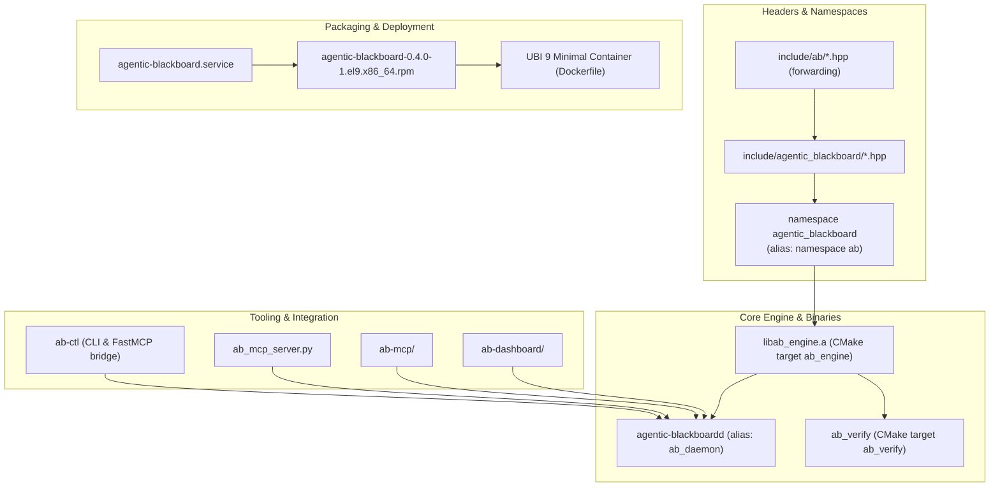

# Rebranding from ASOS to Agentic Blackboard (AB) Implementation Plan

> **For agentic workers:** REQUIRED SUB-SKILL: Use superpowers:subagent-driven-development to implement this plan task-by-task. Steps use checkbox (`- [ ]`) syntax for tracking.

**Goal:** Completely eliminate all references to `asos` across the codebase, build system, packaging, tools, tests, documentation, and skills, replacing them with `agentic_blackboard` or `ab`.

**Architecture:** 
- Restructure headers under `include/agentic_blackboard/` with forwarding shims under `include/ab/`.
- Shift C++ namespaces to `namespace agentic_blackboard` with an alias `namespace ab = agentic_blackboard`.
- Refactor CMake targets to `ab_engine`, `ab_verify`, and `agentic-blackboardd` (with `ab_daemon` alias).
- Rename MCP servers (`ab_mcp_server.py`, `ab-mcp/`), web dashboards (`ab-dashboard/`), branding assets, and packaging configs.
- Rebrand all root documentation, built-in skills, and historical superpower specs/plans to ensure zero occurrences of `asos`.

**Architecture Diagram:**



**Tech Stack:** C++20, CMake, OpenSSL, ZeroMQ, Python 3.11, FastMCP, Node.js, Next.js, RPM packaging, UBI 9 Minimal Docker container.

## Global Constraints
- Namespace: `namespace agentic_blackboard` with `namespace ab = agentic_blackboard;`
- Header inclusion paths: Both `<agentic_blackboard/...>` and `<ab/...>` must be valid.
- Token salt: `ab_salt_token_v1:` across C++ engine and Python CLI.
- Packaging: Canonical package name remains `agentic-blackboard`, version `0.4.0-1.el9`.
- Cleanliness: `git grep -i "asos"` must return 0 results at plan completion.

---

### Task 1: C++ Headers, Namespace & Source Migration

**Files:**
- Move: `include/asos/` $\rightarrow$ `include/agentic_blackboard/`
- Create: `include/ab/ApiServer.hpp`, `include/ab/Blackboard.hpp`, `include/ab/DeltaEngine.hpp`, `include/ab/Librarian.hpp`, `include/ab/Monitor.hpp`, `include/ab/Orchestrator.hpp`, `include/ab/RdfExporter.hpp`, `include/ab/schema.hpp`, `include/ab/Validator.hpp`
- Modify: `include/agentic_blackboard/*.hpp`
- Modify: `src/ApiServer.cpp`, `src/Blackboard.cpp`, `src/DeltaEngine.cpp`, `src/Librarian.cpp`, `src/Monitor.cpp`, `src/Orchestrator.cpp`, `src/RdfExporter.cpp`, `src/Validator.cpp`, `src/main.cpp`

**Interfaces:**
- Consumes: L3KV engine, cpp-httplib, OpenSSL, nlohmann::json.
- Produces: `namespace agentic_blackboard` and `namespace ab = agentic_blackboard` exporting all engine classes: `Blackboard`, `ApiServer`, `DeltaEngine`, `Librarian`, `Monitor`, `Orchestrator`, `RdfExporter`, `Validator`, `CpbEntry`.

- [ ] **Step 1: Move header directory and create forwarding headers**
```bash
git mv include/asos include/agentic_blackboard
mkdir -p include/ab
```
Create forwarding shims in `include/ab/*.hpp` forwarding to `<agentic_blackboard/*.hpp>`. Example for `include/ab/Blackboard.hpp`:
```cpp
#pragma once
#include <agentic_blackboard/Blackboard.hpp>
```

- [ ] **Step 2: Update namespace and header guards in `include/agentic_blackboard/`**
In each header file (`schema.hpp`, `Blackboard.hpp`, `ApiServer.hpp`, etc.):
- Replace `#ifndef ASOS_...` / `#define ASOS_...` with `#pragma once` or `AGENTIC_BLACKBOARD_...`.
- Replace `namespace asos {` with `namespace agentic_blackboard {`.
- At the end of `include/agentic_blackboard/schema.hpp` (or common header):
```cpp
namespace ab = agentic_blackboard;
```
- Replace any `<asos/...>` includes with `<agentic_blackboard/...>`.

- [ ] **Step 3: Update source implementations in `src/*.cpp` and `src/main.cpp`**
- In `src/ApiServer.cpp`, `src/Blackboard.cpp`, `src/DeltaEngine.cpp`, `src/Librarian.cpp`, `src/Monitor.cpp`, `src/Orchestrator.cpp`, `src/RdfExporter.cpp`, `src/Validator.cpp`:
  - Update `#include <asos/...>` to `#include <agentic_blackboard/...>`.
  - Replace `namespace asos` with `namespace agentic_blackboard`.
  - Replace log strings `[ASOS]` with `[AgenticBlackboard]` or `[AB]`.
  - In `src/Blackboard.cpp`: update salt prefix from `asos_salt_token_v1:` to `ab_salt_token_v1:`.
- In `src/main.cpp`:
  - Update `#include <asos/...>` to `#include <agentic_blackboard/...>`.
  - Update namespace references `asos::` to `agentic_blackboard::` or `ab::`.
  - Update banner and CLI help strings from `ASOS Daemon` to `Agentic Blackboard Daemon`.

- [ ] **Step 4: Verify compilation of source files**
Run: `gcc -Iinclude -fsyntax-only src/main.cpp` (or test build target).
Expected: Compiles with namespace `agentic_blackboard`.

- [ ] **Step 5: Commit Task 1**
```bash
git add include/ src/
git commit -m "refactor(core): migrate namespace and headers from asos to agentic_blackboard / ab"
```

---

### Task 2: CMake Build System, Targets & Verification Harness

**Files:**
- Modify: `CMakeLists.txt`
- Modify: `src/main_verify.cpp`
- Test: `build/ab_verify`

**Interfaces:**
- Consumes: Migrated headers and source files from Task 1.
- Produces: CMake targets `ab_engine`, `agentic_blackboardd`, `ab_daemon`, and `ab_verify`.

- [ ] **Step 1: Update `CMakeLists.txt`**
- Rename library target `asos_engine` to `ab_engine`:
  ```cmake
  add_library(ab_engine STATIC ${ASOS_ENGINE_SOURCES})
  add_library(agentic_blackboard::engine ALIAS ab_engine)
  ```
- Rename verification target `asos_verify` to `ab_verify`:
  ```cmake
  add_executable(ab_verify src/main_verify.cpp)
  target_link_libraries(ab_verify PRIVATE ab_engine ${L3KV_LIBRARIES} ...)
  ```
- Add alias target `ab_daemon` for `agentic-blackboardd`:
  ```cmake
  add_executable(agentic-blackboardd src/main.cpp)
  add_executable(ab_daemon ALIAS agentic-blackboardd)
  ```
- Update include directories and install directives from `asos` to `agentic_blackboard`.

- [ ] **Step 2: Update `src/main_verify.cpp`**
- Replace `#include <asos/...>` with `#include <agentic_blackboard/...>` or `#include <ab/...>`.
- Replace `asos::` with `ab::` or `agentic_blackboard::`.
- Update test log banners from `[Test] ASOS Verification...` to `[Test] Agentic Blackboard Verification...`.
- Update token test strings and salts to `ab_salt_token_v1:`.

- [ ] **Step 3: Build targets and run `ab_verify`**
Run:
```bash
cmake -B build -S .
cmake --build build --target ab_engine ab_verify agentic-blackboardd
./build/ab_verify
```
Expected: All verification suites pass with `[SUCCESS] All Agentic Blackboard Verification Tests Passed!`.

- [ ] **Step 4: Commit Task 2**
```bash
git add CMakeLists.txt src/main_verify.cpp
git commit -m "build(cmake): update targets to ab_engine, ab_verify, and agentic-blackboardd"
```

---

### Task 3: Tooling & MCP Migration (`ab-ctl`, `ab_mcp_server.py`, `ab-mcp`)

**Files:**
- Rename: `asos_mcp_server.py` $\rightarrow$ `ab_mcp_server.py`
- Rename: `asos-mcp/` $\rightarrow$ `ab-mcp/`
- Modify: `src/ab-ctl.py`
- Modify: `ab_mcp_server.py`
- Modify: `ab-mcp/package.json`, `ab-mcp/index.js`
- Test: `scratch/test_ab_ctl.py`, `scratch/test_multi_surface_sync.py`

**Interfaces:**
- Consumes: REST endpoints of `agentic-blackboardd` on port 8085 / configurable port.
- Produces: `ab-ctl` CLI commands and FastMCP / Node.js MCP server tools.

- [ ] **Step 1: Move and update MCP Python server**
```bash
git mv asos_mcp_server.py ab_mcp_server.py
```
In `ab_mcp_server.py`:
- Replace any references to `ASOS` with `Agentic Blackboard` or `ab`.
- Update server name `mcp = FastMCP("agentic-blackboard")`.

- [ ] **Step 2: Update `src/ab-ctl.py`**
- Update token salt prefix to `ab_salt_token_v1:`.
- Update banner, docstrings, and CLI help strings to `Agentic Blackboard (ab) Controller`.
- Update FastMCP server initialization and imports from `ab_mcp_server`.
- Update default database path strings to `ab_db` or `/var/lib/agentic-blackboard`.

- [ ] **Step 3: Move and update Node.js MCP server**
```bash
git mv asos-mcp ab-mcp
```
In `ab-mcp/package.json`:
- `"name": "ab-mcp"`, `"description": "Model Context Protocol server for Agentic Blackboard"`
In `ab-mcp/index.js`:
- Update log messages and server name to `agentic-blackboard`.

- [ ] **Step 4: Update and run test scripts**
In `scratch/test_ab_ctl.py` and `scratch/test_multi_surface_sync.py`:
- Update binary invocation from `build/asos_daemon` to `build/agentic-blackboardd`.
- Run:
```bash
python3 scratch/test_ab_ctl.py
python3 scratch/test_multi_surface_sync.py
```
Expected: All steps and phases pass with exit code 0.

- [ ] **Step 5: Commit Task 3**
```bash
git add src/ab-ctl.py ab_mcp_server.py ab-mcp/ scratch/test_ab_ctl.py scratch/test_multi_surface_sync.py
git commit -m "feat(cli): rename MCP server and update ab-ctl branding and tests"
```

---

### Task 4: Dashboard, Assets, Packaging & Containerization

**Files:**
- Rename: `asos-dashboard/` $\rightarrow$ `ab-dashboard/`
- Rename: `asos_logo.png` $\rightarrow$ `ab_logo.png`
- Rename: `asos_screenshot.png` $\rightarrow$ `ab_screenshot.png`
- Rename: `scratch/populate_asos_project.py` $\rightarrow$ `scratch/populate_ab_project.py`
- Modify: `ab-dashboard/package.json`, `ab-dashboard/src/app/layout.js`, `ab-dashboard/src/app/page.js`, `ab-dashboard/src/components/Sidebar.js`
- Modify: `packaging/rpm/agentic-blackboard.spec`, `packaging/systemd/agentic-blackboard.service`, `packaging/config/blackboard.conf`, `packaging/config/blackboard.conf.default`, `packaging/limits/99-blackboard.conf`, `Dockerfile`, `.gitignore`
- Test: `scratch/test_rpm_build.py`, `scratch/test_e2e_central_deployment.py`

**Interfaces:**
- Consumes: Built binary `build/agentic-blackboardd`, `src/ab-ctl.py`.
- Produces: Clean enterprise RPM `agentic-blackboard-0.4.0-1.el9.x86_64.rpm` and Docker image `agentic-blackboard:latest`.

- [ ] **Step 1: Move assets and dashboard**
```bash
git mv asos-dashboard ab-dashboard
git mv asos_logo.png ab_logo.png
git mv asos_screenshot.png ab_screenshot.png
git mv scratch/populate_asos_project.py scratch/populate_ab_project.py
```
In `ab-dashboard/package.json`:
- `"name": "ab-dashboard"`
In `ab-dashboard/src/app/layout.js`, `page.js`, `Sidebar.js`:
- Replace `"ASOS Dashboard"` with `"Agentic Blackboard"`.

- [ ] **Step 2: Update packaging, systemd, and configs**
- In `packaging/rpm/agentic-blackboard.spec`:
  - Ensure all comments and descriptions use `Agentic Blackboard` with zero mentions of `asos`.
- In `packaging/systemd/agentic-blackboard.service`:
  - Description: `Agentic Blackboard Daemon (ab)`.
- In `packaging/config/blackboard.conf` and `blackboard.conf.default`:
  - Remove any remaining `asos` comments.
- In `.gitignore`:
  - Replace `asos_db` and `test_asos_db` with `ab_db`, `ab_db-*`, and `blackboard_db`.
- In `Dockerfile`:
  - Ensure image tags and comments reference `agentic-blackboard`.

- [ ] **Step 3: Run RPM build and container deployment verification**
Run:
```bash
python3 scratch/test_rpm_build.py
python3 scratch/test_e2e_central_deployment.py
```
Expected: Both tests pass all phases and exit code 0.

- [ ] **Step 4: Commit Task 4**
```bash
git add ab-dashboard/ ab_logo.png ab_screenshot.png scratch/populate_ab_project.py packaging/ Dockerfile .gitignore scratch/test_rpm_build.py scratch/test_e2e_central_deployment.py
git commit -m "packaging: rename dashboard and scrub asos references from configs and assets"
```

---

### Task 5: Complete Documentation, Guides, Skills & Historical Specs Scrub

**Files:**
- Rename: `ASOS Schema & Code Reference Guide.md` $\rightarrow$ `Agentic Blackboard Schema & Code Reference Guide.md`
- Rename: `ASOS Architecture & Master Schema TRD v0.2.md` $\rightarrow$ `Agentic Blackboard Architecture & Master Schema TRD v0.2.md`
- Modify: `Agentic Blackboard Schema & Code Reference Guide.md`, `Agentic Blackboard Architecture & Master Schema TRD v0.2.md`, `README.md`
- Modify: `skills/commonplace-curation/SKILL.md`, `skills/graph-integrity-audit/SKILL.md`, `skills/knowledge-capture/SKILL.md`, `skills/procedural-catalog/SKILL.md`, `skills/spatial-materialization/SKILL.md`, `skills/task-orchestration/SKILL.md`
- Modify: `scripts/inject_master_swarm.py`, `scratch/*.cpp`, `scratch/*.py`
- Modify: `docs/superpowers/specs/*.md`, `docs/superpowers/plans/*.md`

**Interfaces:**
- Consumes: Entire repository.
- Produces: Zero occurrences of `asos` across the repository.

- [ ] **Step 1: Rename reference guides**
```bash
git mv "ASOS Schema & Code Reference Guide.md" "Agentic Blackboard Schema & Code Reference Guide.md"
git mv "ASOS Architecture & Master Schema TRD v0.2.md" "Agentic Blackboard Architecture & Master Schema TRD v0.2.md"
```

- [ ] **Step 2: Update reference guides and `README.md`**
- Replace all instances of `ASOS` and `asos` with `Agentic Blackboard` or `ab`.
- Update include paths, namespace examples, and build commands.

- [ ] **Step 3: Update built-in skills in `skills/`**
- In all 6 `skills/*/SKILL.md` files:
  - Replace `ASOS` with `Agentic Blackboard` or `ab`.
  - Update endpoint examples and tool references.

- [ ] **Step 4: Update scratch scripts and historical specs/plans**
- In `scratch/*.cpp`, `scratch/*.py`, `scripts/*.py`:
  - Replace `asos` namespace, includes, and log strings.
- In `docs/superpowers/specs/` and `docs/superpowers/plans/`:
  - Update all historical specs and plans to use `Agentic Blackboard` / `ab`.

- [ ] **Step 5: Final Zero-Tolerance Sweep**
Run:
```bash
git grep -i "asos"
```
Expected: 0 lines returned.

- [ ] **Step 6: Run full test suite regression**
Run:
```bash
./build/ab_verify
python3 scratch/test_ab_ctl.py
python3 scratch/test_multi_surface_sync.py
```
Expected: All tests pass.

- [ ] **Step 7: Commit Task 5**
```bash
git add README.md "Agentic Blackboard Schema & Code Reference Guide.md" "Agentic Blackboard Architecture & Master Schema TRD v0.2.md" skills/ scratch/ scripts/ docs/superpowers/
git commit -m "docs: complete rebranding from asos to agentic_blackboard and ab across all documentation"
```
