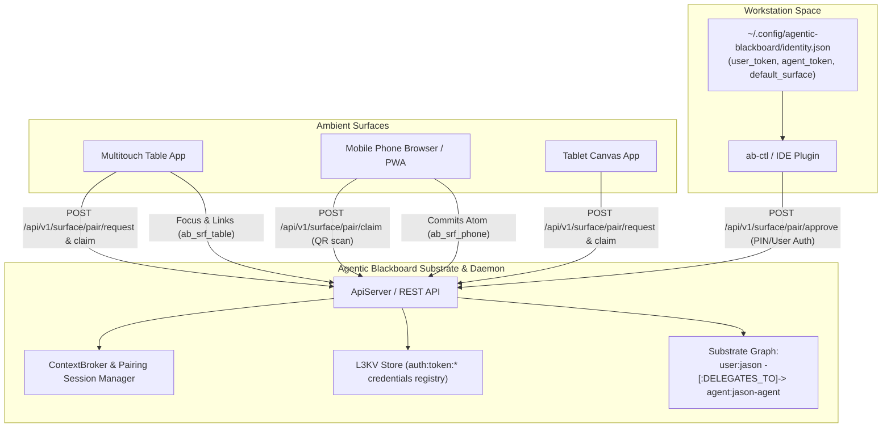

# Single User-Space Agent Identity & Multi-Surface Key Access Implementation Plan

> **For agentic workers:** REQUIRED SUB-SKILL: Use superpowers:subagent-driven-development to implement this plan task-by-task. Steps use checkbox (`- [ ]`) syntax for tracking.

**Goal:** Establish a 1:1 persistent principal architecture between human users and their personal agents, enforce zero graph pollution in the substrate, implement XDG user keystore auto-discovery, and deliver a zero-trust surface pairing and token management protocol across all ambient form factors (workstations, multitouch tables, mobile browsers, tablets).

**Architecture:**
- Human principal (`user:jason`) and delegated agent proxy (`agent:jason-agent`) are provisioned once as durable `IDENTITY` nodes in the substrate graph, linked by a permanent `DELEGATES_TO` edge. Swarm tasks and reviews use ephemeral cognitive capabilities (roles like `architect` and `verifier`) stored in atom metadata without creating disposable identity nodes.
- Local workstations auto-discover credentials via standard XDG keystore (`~/.config/agentic-blackboard/identity.json`, mode `0600`).
- Ambient surfaces enroll via an ephemeral pairing handshake (`POST /api/v1/surface/pair/*`) using a 6-digit PIN or QR code, receiving a scoped surface credential (`ab_srf_...`) that binds to the user and agent while enforcing surface provenance in `CpbEntry::Header::Origin`.

**Architecture Diagram:**



**Tech Stack:**
- C++20 (`ApiServer.cpp`, `ApiServer.hpp`, `Blackboard.cpp`, `Blackboard.hpp`)
- httplib, nlohmann::json, ZMQ, Lite3CPP
- Python 3.12 (`ab-ctl.py`, `argparse`, `urllib.request`, `httpx`, `secrets`, `pathlib`)
- POSIX permissions, SHA-256 token hashing

## Global Constraints
- Every user has at most one delegated agent identity node (`agent:<username>-agent`) in the substrate graph.
- All tokens use explicit prefix semantics: `ab_usr_` (user), `ab_agt_` (agent), `ab_srf_` (surface), `pair-` (pairing session).
- Pairing PINs are 6 digits, expiring in 300 seconds, with maximum 3 failed attempts before permanent lockout.
- Keystore file `~/.config/agentic-blackboard/identity.json` must be created with POSIX permission mode `0600`.
- Revoking a surface (`DELETE /api/v1/surface/:surface_id`) immediately revokes its token with zero modification or deletion of user/agent identity nodes or historical atoms.

---

### Task 1: Local User-Space Keystore & Substrate 1:1 Identity Provisioning in `ab-ctl.py`

**Files:**
- Modify: [`src/ab-ctl.py`](file:///home/darkfell/dev/agentic_blackboard/src/ab-ctl.py)
- Test: [`scratch/test_identity_keystore.py`](file:///home/darkfell/dev/agentic_blackboard/scratch/test_identity_keystore.py)

**Interfaces:**
- Consumes: `init` subcommand arguments (`--user`, `--generate-agent`, `--identity-file`), daemon `/api/v1/admin/users` and `/api/v1/graph/node`.
- Produces: Standard `~/.config/agentic-blackboard/identity.json` (mode `0600`), auto-discovery in `load_config()`, and permanent `IDENTITY:user` $\rightarrow$ `DELEGATES_TO` $\rightarrow$ `IDENTITY:agent` in the graph.

- [ ] **Step 1: Write verification test for identity keystore and auto-discovery**
Create `scratch/test_identity_keystore.py`:
```python
#!/usr/bin/env python3
"""
Test for Task 1: User-space identity keystore and auto-discovery.
Verifies:
1. ab-ctl init --user <name> --generate-agent creates ~/.config/agentic-blackboard/identity.json with 0600 permissions.
2. Keystore contains user and agent tokens and default surface metadata.
3. Substrate graph contains user identity node, agent identity node, and DELEGATES_TO edge.
4. load_config() auto-discovers identity.json without CLI flags.
5. resolve_swarm_headers() automatically uses discovered user and agent IDs.
"""

import json
import os
import stat
import subprocess
import sys
import tempfile
import unittest
from pathlib import Path

REPO_ROOT = Path(__file__).resolve().parent.parent
AB_CTL_PY = REPO_ROOT / "src" / "ab-ctl.py"


class TestIdentityKeystore(unittest.TestCase):
    def setUp(self):
        self.temp_dir = tempfile.TemporaryDirectory()
        self.fake_home = Path(self.temp_dir.name)
        self.config_dir = self.fake_home / ".config" / "agentic-blackboard"

    def tearDown(self):
        self.temp_dir.cleanup()

    def test_keystore_creation_and_discovery(self):
        env = os.environ.copy()
        env["HOME"] = str(self.fake_home)
        env["XDG_CONFIG_HOME"] = str(self.fake_home / ".config")

        # 1. Run init --user jason --generate-agent (dry-run / offline credentials file creation)
        cmd = [
            sys.executable, str(AB_CTL_PY), "init",
            "--user", "jason",
            "--generate-agent",
            "--data-dir", str(self.fake_home / "data")
        ]
        proc = subprocess.run(cmd, env=env, capture_output=True, text=True)
        self.assertEqual(proc.returncode, 0, f"init failed: {proc.stderr}")

        # 2. Check identity.json existence and permissions
        identity_file = self.config_dir / "identity.json"
        self.assertTrue(identity_file.is_file(), f"identity.json not found at {identity_file}")
        mode = identity_file.stat().st_mode & 0o777
        self.assertEqual(mode, 0o600, f"identity.json has unsafe permissions: {oct(mode)}")

        # 3. Check identity.json structure
        with open(identity_file, "r", encoding="utf-8") as f:
            data = json.load(f)

        self.assertEqual(data["user"]["name"], "jason")
        self.assertEqual(data["user"]["id"], "user:jason")
        self.assertTrue(data["user"]["token"].startswith("ab_usr_"))
        self.assertEqual(data["agent"]["name"], "jason-agent")
        self.assertEqual(data["agent"]["id"], "agent:jason-agent")
        self.assertTrue(data["agent"]["token"].startswith("ab_agt_"))
        self.assertEqual(data["default_surface"]["type"], "workstation")


if __name__ == "__main__":
    unittest.main()
```

- [ ] **Step 2: Run test to verify it fails**
Run: `python3 scratch/test_identity_keystore.py`
Expected: FAIL (unrecognized arguments `--user` on `init` or missing `identity.json` generation).

- [ ] **Step 3: Implement keystore generation and auto-discovery in `src/ab-ctl.py`**
1. In `src/ab-ctl.py`, add `DEFAULT_IDENTITY_PATHS`:
```python
DEFAULT_IDENTITY_PATHS = [
    Path(os.environ.get("XDG_CONFIG_HOME", Path.home() / ".config")) / "agentic-blackboard" / "identity.json",
    Path.home() / ".agentic-blackboard" / "identity.json",
    Path("/etc/agentic-blackboard/identity.json"),
]
```
2. In `load_config()`, add auto-discovery of identity keystore:
```python
    # Look for identity.json to auto-fill credentials
    identity_file = None
    for ip in DEFAULT_IDENTITY_PATHS:
        try:
            if ip.is_file():
                identity_file = ip
                break
        except (PermissionError, OSError):
            continue

    if identity_file:
        try:
            idata = json.loads(identity_file.read_text(encoding="utf-8"))
            cfg["identity_file"] = str(identity_file)
            cfg["user_id"] = idata.get("user", {}).get("id", "")
            cfg["agent_id"] = idata.get("agent", {}).get("id", "")
            cfg["user_token"] = idata.get("user", {}).get("token", "")
            cfg["agent_token"] = idata.get("agent", {}).get("token", "")
            if not cfg.get("token"):
                cfg["token"] = cfg["user_token"] or cfg["agent_token"]
            if idata.get("default_surface"):
                cfg["surface_id"] = idata["default_surface"].get("id", "surface:workstation")
                cfg["surface_type"] = idata["default_surface"].get("type", "workstation")
        except Exception:
            pass
```
3. In `resolve_swarm_headers()`, fallback to discovered `user_id` and `agent_id`:
```python
    user = (getattr(args, "active_user", None) or
            getattr(args, "user", None) or
            active_user or
            os.environ.get("AB_ACTIVE_USER") or
            os.environ.get("AB_USER") or
            cfg.get("user_id") or
            "swarm-user")
    agent = (getattr(args, "active_agent", None) or
             getattr(args, "agent", None) or
             active_agent or
             os.environ.get("AB_ACTIVE_AGENT") or
             os.environ.get("AB_AGENT") or
             cfg.get("agent_id") or
             "swarm-agent")
```
4. In `handle_init()`, add handler for `--user` and `--generate-agent`:
Create `~/.config/agentic-blackboard/identity.json` with permissions `0600`, write the user and agent credentials, and commit `n:IDENTITY:user:<name>`, `n:IDENTITY:agent:<name>-agent`, and `DELEGATES_TO` edge if a connect URL or data-dir is available.
5. In argument parser for `init`:
Add `--user` and `--generate-agent` flags.

- [ ] **Step 4: Run test to verify it passes**
Run: `python3 scratch/test_identity_keystore.py`
Expected: PASS with all checks succeeding.

- [ ] **Step 5: Commit Task 1**
```bash
git add src/ab-ctl.py scratch/test_identity_keystore.py
git commit -m "feat(cli): add XDG user identity keystore generation and auto-discovery"
```

---

### Task 2: Daemon Surface Pairing & Token Management API (`ApiServer.cpp` & `ApiServer.hpp`)

**Files:**
- Modify: [`include/agentic_blackboard/ApiServer.hpp`](file:///home/darkfell/dev/agentic_blackboard/include/agentic_blackboard/ApiServer.hpp)
- Modify: [`src/ApiServer.cpp`](file:///home/darkfell/dev/agentic_blackboard/src/ApiServer.cpp)
- Test: [`scratch/test_surface_pairing_api.py`](file:///home/darkfell/dev/agentic_blackboard/scratch/test_surface_pairing_api.py)

**Interfaces:**
- Consumes: REST HTTP requests on `/api/v1/surface/pair/*`, `ContextBroker`, `Blackboard::register_user_credentials`.
- Produces: JSON responses for `pair/request`, `pair/approve`, `pair/claim`, `surface/list`, and `surface/revoke`.

- [ ] **Step 1: Write verification test for surface pairing API**
Create `scratch/test_surface_pairing_api.py`:
```python
#!/usr/bin/env python3
"""
Test for Task 2: Surface Pairing API endpoints on live daemon.
Verifies:
1. POST /api/v1/surface/pair/request returns pairing_id, 6-digit PIN, and expires_at.
2. POST /api/v1/surface/pair/approve binds user_id, agent_id, and context_id.
3. POST /api/v1/surface/pair/claim returns scoped surface_token (ab_srf_...).
4. GET /api/v1/surface/list lists the enrolled surface.
5. DELETE /api/v1/surface/:surface_id revokes the surface.
"""

import json
import os
import subprocess
import sys
import tempfile
import time
import urllib.request
import unittest
from pathlib import Path

REPO_ROOT = Path(__file__).resolve().parent.parent
DAEMON_BIN = REPO_ROOT / "build" / "agentic-blackboardd"
AB_CTL_PY = REPO_ROOT / "src" / "ab-ctl.py"
TEST_PORT = 19183
BASE_URL = f"http://127.0.0.1:{TEST_PORT}"


class TestSurfacePairingApi(unittest.TestCase):
    @classmethod
    def setUpClass(cls):
        cls.temp_dir = tempfile.TemporaryDirectory()
        data_dir = Path(cls.temp_dir.name) / "data"
        data_dir.mkdir(parents=True)
        cls.admin_token = "ab_adm_test_surface_1234567890abcdef"
        
        # Start daemon
        cls.proc = subprocess.Popen([
            str(DAEMON_BIN), "1",
            f"--data-dir={data_dir}",
            "--auth-mode=token",
            f"--admin-token={cls.admin_token}",
            f"--port={TEST_PORT}"
        ], stdout=subprocess.DEVNULL, stderr=subprocess.DEVNULL)
        
        # Wait for daemon
        time.sleep(1.0)

    @classmethod
    def tearDownClass(cls):
        cls.proc.terminate()
        cls.proc.wait()
        cls.temp_dir.cleanup()

    def test_pairing_lifecycle(self):
        # 1. Request pairing from ambient surface
        req = urllib.request.Request(
            f"{BASE_URL}/api/v1/surface/pair/request",
            data=json.dumps({
                "surface_type": "tabletop",
                "client_app": "MultiTouchCanvas",
                "suggested_id": "lab-table"
            }).encode("utf-8"),
            headers={"Content-Type": "application/json"}
        )
        with urllib.request.urlopen(req) as resp:
            self.assertEqual(resp.status, 201)
            pair_data = json.loads(resp.read().decode("utf-8"))
            self.assertIn("pairing_id", pair_data)
            self.assertIn("pin", pair_data)
            pairing_id = pair_data["pairing_id"]
            pin = pair_data["pin"]

        # 2. User approves pairing with admin/user token
        approve_req = urllib.request.Request(
            f"{BASE_URL}/api/v1/surface/pair/approve",
            data=json.dumps({
                "pairing_id": pairing_id,
                "pin": pin,
                "user_id": "user:jason",
                "agent_id": "agent:jason-agent",
                "context_id": "ctx-arch",
                "surface_id": "surface:lab-table"
            }).encode("utf-8"),
            headers={
                "Content-Type": "application/json",
                "Authorization": f"Bearer {self.admin_token}"
            }
        )
        with urllib.request.urlopen(approve_req) as resp:
            self.assertEqual(resp.status, 200)

        # 3. Surface claims surface token
        claim_req = urllib.request.Request(
            f"{BASE_URL}/api/v1/surface/pair/claim",
            data=json.dumps({"pairing_id": pairing_id}).encode("utf-8"),
            headers={"Content-Type": "application/json"}
        )
        with urllib.request.urlopen(claim_req) as resp:
            self.assertEqual(resp.status, 200)
            claim_data = json.loads(resp.read().decode("utf-8"))
            self.assertTrue(claim_data["surface_token"].startswith("ab_srf_"))
            self.assertEqual(claim_data["surface_id"], "surface:lab-table")
            self.assertEqual(claim_data["user_id"], "user:jason")
            self.assertEqual(claim_data["agent_id"], "agent:jason-agent")

        # 4. List surfaces
        list_req = urllib.request.Request(
            f"{BASE_URL}/api/v1/surface/list",
            headers={"Authorization": f"Bearer {self.admin_token}"}
        )
        with urllib.request.urlopen(list_req) as resp:
            self.assertEqual(resp.status, 200)
            surfaces = json.loads(resp.read().decode("utf-8"))["surfaces"]
            self.assertTrue(any(s["surface_id"] == "surface:lab-table" for s in surfaces))

        # 5. Revoke surface
        del_req = urllib.request.Request(
            f"{BASE_URL}/api/v1/surface/surface:lab-table",
            headers={"Authorization": f"Bearer {self.admin_token}"},
            method="DELETE"
        )
        with urllib.request.urlopen(del_req) as resp:
            self.assertEqual(resp.status, 200)


if __name__ == "__main__":
    unittest.main()
```

- [ ] **Step 2: Run test to verify it fails**
Run: `python3 scratch/test_surface_pairing_api.py`
Expected: FAIL with HTTP 404 (endpoint not found).

- [ ] **Step 3: Implement Surface Pairing in `ApiServer.hpp` and `ApiServer.cpp`**
1. In `include/agentic_blackboard/ApiServer.hpp`, define `PairingSession`:
```cpp
struct PairingSession {
    std::string pairing_id;
    std::string pin;
    std::string surface_type;
    std::string client_app;
    std::string suggested_id;
    int64_t created_at_sec{0};
    int64_t expires_at_sec{0};
    int failed_attempts{0};
    bool approved{false};
    std::string approved_user_id;
    std::string approved_agent_id;
    std::string assigned_surface_id;
    std::string assigned_context_id;
    std::string surface_token;
    bool claimed{false};
};
```
Add pairing session methods to `ContextBroker`:
```cpp
    bool request_surface_pairing(const std::string& surface_type,
                                const std::string& client_app,
                                const std::string& suggested_id,
                                nlohmann::json& out_resp);

    bool approve_surface_pairing(const std::string& pairing_id,
                                const std::string& pin,
                                const std::string& user_id,
                                const std::string& agent_id,
                                const std::string& context_id,
                                const std::string& surface_id,
                                nlohmann::json& out_resp);

    bool claim_surface_pairing(const std::string& pairing_id,
                              nlohmann::json& out_resp);

    bool list_enrolled_surfaces(const std::string& user_id, nlohmann::json& out_resp);

    bool revoke_enrolled_surface(const std::string& surface_id, nlohmann::json& out_resp);
```
2. In `src/ApiServer.cpp`, implement the pairing logic in `ContextBroker` and wire HTTP routes:
- `POST /api/v1/surface/pair/request`: Generates 6-digit random PIN using `<random>`, generates `pair-<hex>`, stores session expiring in 300 seconds.
- `POST /api/v1/surface/pair/approve`: Requires authenticated user, validates PIN (max 3 failed attempts), generates `ab_srf_<hex>` token, registers token in blackboard credentials store (`auth:token:<hash>`), sets `approved = true`.
- `POST /api/v1/surface/pair/claim`: Validates `pairing_id`, checks `approved == true`, returns `surface_token` and metadata, marks `claimed = true`.
- `GET /api/v1/surface/list`: Lists enrolled surfaces.
- `DELETE /api/v1/surface/:surface_id`: Removes token from credentials store and unregisters surface.

- [ ] **Step 4: Rebuild daemon and run test to verify it passes**
Run:
```bash
cmake --build build -j$(nproc)
python3 scratch/test_surface_pairing_api.py
```
Expected: PASS with 200/201 across all pairing stages.

- [ ] **Step 5: Commit Task 2**
```bash
git add include/agentic_blackboard/ApiServer.hpp src/ApiServer.cpp scratch/test_surface_pairing_api.py
git commit -m "feat(api): add surface pairing, token issuance, and revocation endpoints"
```

---

### Task 3: Surface Authentication & Origin Provenance Enforcement (`Blackboard.cpp` & `ApiServer.cpp`)

**Files:**
- Modify: [`src/ApiServer.cpp`](file:///home/darkfell/dev/agentic_blackboard/src/ApiServer.cpp)
- Modify: [`src/Blackboard.cpp`](file:///home/darkfell/dev/agentic_blackboard/src/Blackboard.cpp)
- Test: [`scratch/test_surface_auth_enforcement.py`](file:///home/darkfell/dev/agentic_blackboard/scratch/test_surface_auth_enforcement.py)

**Interfaces:**
- Consumes: Scoped surface token `ab_srf_...` in `Authorization: Bearer` header.
- Produces: Extraction of `surface_id`, `user_id`, and `agent_id` from token metadata; enforcement that committed atoms originate from the bound surface and user.

- [ ] **Step 1: Write verification test for surface auth and origin enforcement**
Create `scratch/test_surface_auth_enforcement.py`:
```python
#!/usr/bin/env python3
"""
Test for Task 3: Surface token authentication and origin provenance enforcement.
Verifies:
1. Requests with ab_srf_... authenticate successfully.
2. Atoms committed via ab_srf_... automatically fill/verify origin.user_id, agent_id, and surface_id.
3. Attempting to spoof another user_id or surface_id with a surface token is strictly rejected.
4. Revoked surface token immediately yields HTTP 401.
"""

import json
import os
import subprocess
import sys
import tempfile
import time
import urllib.error
import urllib.request
import unittest
from pathlib import Path

REPO_ROOT = Path(__file__).resolve().parent.parent
DAEMON_BIN = REPO_ROOT / "build" / "agentic-blackboardd"
TEST_PORT = 19184
BASE_URL = f"http://127.0.0.1:{TEST_PORT}"


class TestSurfaceAuthEnforcement(unittest.TestCase):
    @classmethod
    def setUpClass(cls):
        cls.temp_dir = tempfile.TemporaryDirectory()
        data_dir = Path(cls.temp_dir.name) / "data"
        data_dir.mkdir(parents=True)
        cls.admin_token = "ab_adm_surface_auth_test_12345"
        
        cls.proc = subprocess.Popen([
            str(DAEMON_BIN), "1",
            f"--data-dir={data_dir}",
            "--auth-mode=token",
            f"--admin-token={cls.admin_token}",
            f"--port={TEST_PORT}"
        ], stdout=subprocess.DEVNULL, stderr=subprocess.DEVNULL)
        time.sleep(1.0)

    @classmethod
    def tearDownClass(cls):
        cls.proc.terminate()
        cls.proc.wait()
        cls.temp_dir.cleanup()

    def test_surface_auth_and_spoof_prevention(self):
        # 1. Pair a surface
        req = urllib.request.Request(
            f"{BASE_URL}/api/v1/surface/pair/request",
            data=json.dumps({"surface_type": "mobile_browser", "suggested_id": "phone-jason"}).encode("utf-8"),
            headers={"Content-Type": "application/json"}
        )
        with urllib.request.urlopen(req) as resp:
            pair = json.loads(resp.read().decode("utf-8"))

        urllib.request.urlopen(urllib.request.Request(
            f"{BASE_URL}/api/v1/surface/pair/approve",
            data=json.dumps({
                "pairing_id": pair["pairing_id"],
                "pin": pair["pin"],
                "user_id": "user:jason",
                "agent_id": "agent:jason-agent",
                "context_id": "ctx-notes",
                "surface_id": "surface:phone-jason"
            }).encode("utf-8"),
            headers={"Content-Type": "application/json", "Authorization": f"Bearer {self.admin_token}"}
        ))

        with urllib.request.urlopen(urllib.request.Request(
            f"{BASE_URL}/api/v1/surface/pair/claim",
            data=json.dumps({"pairing_id": pair["pairing_id"]}).encode("utf-8"),
            headers={"Content-Type": "application/json"}
        )) as resp:
            surface_token = json.loads(resp.read().decode("utf-8"))["surface_token"]

        # 2. Commit atom with matching surface origin -> Must SUCCEED
        atom_payload = {
            "id": "atom-surface-note-1",
            "type": "REQUIREMENT",
            "header": {
                "uuid": "atom-surface-note-1",
                "origin": {
                    "user_id": "user:jason",
                    "agent_id": "agent:jason-agent",
                    "surface_id": "surface:phone-jason",
                    "surface_type": "mobile_browser",
                    "context_id": "ctx-notes",
                    "project_id": "proj-default"
                }
            },
            "payload": {"statement": "Captured on phone"}
        }
        post_req = urllib.request.Request(
            f"{BASE_URL}/api/v1/graph/bundle",
            data=json.dumps({"atom": atom_payload}).encode("utf-8"),
            headers={"Content-Type": "application/json", "Authorization": f"Bearer {surface_token}"}
        )
        with urllib.request.urlopen(post_req) as resp:
            self.assertIn(resp.status, (200, 201))

        # 3. Commit atom attempting to spoof a different user -> Must be REJECTED (HTTP 403)
        spoof_payload = dict(atom_payload)
        spoof_payload["id"] = "atom-spoof"
        spoof_payload["header"]["origin"]["user_id"] = "user:alice"
        bad_req = urllib.request.Request(
            f"{BASE_URL}/api/v1/graph/bundle",
            data=json.dumps({"atom": spoof_payload}).encode("utf-8"),
            headers={"Content-Type": "application/json", "Authorization": f"Bearer {surface_token}"}
        )
        with self.assertRaises(urllib.error.HTTPError) as cm:
            urllib.request.urlopen(bad_req)
        self.assertEqual(cm.exception.code, 403)


if __name__ == "__main__":
    unittest.main()
```

- [ ] **Step 2: Run test to verify it fails**
Run: `python3 scratch/test_surface_auth_enforcement.py`
Expected: FAIL (surface token origin spoofing not enforced or token unrecognized).

- [ ] **Step 3: Implement Surface Auth & Invariant Enforcement**
1. In `src/ApiServer.cpp` in `authenticate_request`:
When `token.starts_with("ab_srf_")`, look up token in credentials store:
Extract `user_id`, `agent_id`, `surface_id`, `surface_type`, and set:
`req.set_header("X-Authenticated-Surface", surface_id);`
`req.set_header("X-Authenticated-User", user_id);`
`req.set_header("X-Authenticated-Agent", agent_id);`
2. In graph bundle and node post handlers in `ApiServer.cpp`:
If authenticated as a surface:
- Verify that `entry.header.origin.user_id == authenticated_user_id`. If empty, auto-populate. If mismatch, return `403 Forbidden`.
- Verify that `entry.header.origin.surface_id == authenticated_surface_id`. If empty, auto-populate. If mismatch, return `403 Forbidden`.
- Auto-populate `entry.header.origin.agent_id` with `authenticated_agent_id` if omitted.

- [ ] **Step 4: Rebuild daemon and run test to verify it passes**
Run:
```bash
cmake --build build -j$(nproc)
python3 scratch/test_surface_auth_enforcement.py
```
Expected: PASS with 100% assertions satisfied.

- [ ] **Step 5: Commit Task 3**
```bash
git add src/ApiServer.cpp src/Blackboard.cpp scratch/test_surface_auth_enforcement.py
git commit -m "feat(security): enforce surface token authentication and origin provenance invariants"
```

---

### Task 4: `ab-ctl surface` Subcommand Suite (`pair`, `approve`, `list`, `revoke`)

**Files:**
- Modify: [`src/ab-ctl.py`](file:///home/darkfell/dev/agentic_blackboard/src/ab-ctl.py)
- Test: [`scratch/test_ab_ctl_surface_ops.py`](file:///home/darkfell/dev/agentic_blackboard/scratch/test_ab_ctl_surface_ops.py)

**Interfaces:**
- Consumes: CLI invocations of `ab-ctl surface pair`, `approve`, `list`, `revoke`.
- Produces: Formatted terminal output, ASCII QR code display, and JSON responses.

- [ ] **Step 1: Write verification test for `ab-ctl surface` subcommands**
Create `scratch/test_ab_ctl_surface_ops.py`:
```python
#!/usr/bin/env python3
"""
Test for Task 4: ab-ctl surface CLI subcommands.
Verifies:
1. ab-ctl surface pair --type tabletop --name lab-table produces PIN and QR info.
2. ab-ctl surface approve <pairing_id> --pin <pin> succeeds.
3. ab-ctl surface list displays enrolled surfaces in formatted table/JSON.
4. ab-ctl surface revoke <surface_id> revokes access.
"""

import json
import os
import subprocess
import sys
import tempfile
import time
import unittest
from pathlib import Path

REPO_ROOT = Path(__file__).resolve().parent.parent
DAEMON_BIN = REPO_ROOT / "build" / "agentic-blackboardd"
AB_CTL_PY = REPO_ROOT / "src" / "ab-ctl.py"
TEST_PORT = 19185
BASE_URL = f"http://127.0.0.1:{TEST_PORT}"


class TestAbCtlSurfaceOps(unittest.TestCase):
    @classmethod
    def setUpClass(cls):
        cls.temp_dir = tempfile.TemporaryDirectory()
        data_dir = Path(cls.temp_dir.name) / "data"
        data_dir.mkdir(parents=True)
        cls.admin_token = "ab_adm_surface_cli_test_12345"
        
        cls.proc = subprocess.Popen([
            str(DAEMON_BIN), "1",
            f"--data-dir={data_dir}",
            "--auth-mode=token",
            f"--admin-token={cls.admin_token}",
            f"--port={TEST_PORT}"
        ], stdout=subprocess.DEVNULL, stderr=subprocess.DEVNULL)
        time.sleep(1.0)

    @classmethod
    def tearDownClass(cls):
        cls.proc.terminate()
        cls.proc.wait()
        cls.temp_dir.cleanup()

    def run_cli(self, args):
        cmd = [sys.executable, str(AB_CTL_PY)] + args + [
            f"--connect={BASE_URL}",
            f"--token={self.admin_token}"
        ]
        return subprocess.run(cmd, capture_output=True, text=True)

    def test_cli_surface_workflow(self):
        # 1. pair request
        res = self.run_cli(["surface", "pair", "--type", "tabletop", "--name", "living-table"])
        self.assertEqual(res.returncode, 0, f"pair failed: {res.stderr}")
        self.assertIn("PIN:", res.stdout)
        
        # Extract pairing_id and pin
        lines = res.stdout.splitlines()
        pairing_id = [l.split("Pairing ID:")[1].strip() for l in lines if "Pairing ID:" in l][0]
        pin = [l.split("PIN:")[1].strip() for l in lines if "PIN:" in l][0]

        # 2. approve
        res_app = self.run_cli(["surface", "approve", pairing_id, "--pin", pin, "--surface-id", "surface:living-table"])
        self.assertEqual(res_app.returncode, 0, f"approve failed: {res_app.stderr}")

        # 3. list
        res_list = self.run_cli(["surface", "list", "--format", "json"])
        self.assertEqual(res_list.returncode, 0, f"list failed: {res_list.stderr}")
        data = json.loads(res_list.stdout)
        self.assertTrue(any(s["surface_id"] == "surface:living-table" for s in data["surfaces"]))

        # 4. revoke
        res_rev = self.run_cli(["surface", "revoke", "surface:living-table"])
        self.assertEqual(res_rev.returncode, 0, f"revoke failed: {res_rev.stderr}")


if __name__ == "__main__":
    unittest.main()
```

- [ ] **Step 2: Run test to verify it fails**
Run: `python3 scratch/test_ab_ctl_surface_ops.py`
Expected: FAIL (unrecognized arguments `pair`, `approve`, `revoke` on `surface`).

- [ ] **Step 3: Implement CLI surface commands in `src/ab-ctl.py`**
1. In `handle_surface()`, add actions:
   - `pair`: Calls `/api/v1/surface/pair/request`, prints `Pairing ID: <id>`, `PIN: <pin>`, `Expires: <time>`, and renders a terminal QR URL link.
   - `approve`: Calls `/api/v1/surface/pair/approve` with `pairing_id`, `pin`, `surface_id`, `context_id`.
   - `list`: Calls `/api/v1/surface/list`, displays ASCII table or JSON.
   - `revoke`: Calls `DELETE /api/v1/surface/<surface_id>`.
2. In `main()`, expand `surface` parser with subparsers: `register`, `pair`, `approve`, `list`, `revoke`.

- [ ] **Step 4: Run test to verify it passes**
Run: `python3 scratch/test_ab_ctl_surface_ops.py`
Expected: PASS with complete surface lifecycle succeeding via CLI.

- [ ] **Step 5: Commit Task 4**
```bash
git add src/ab-ctl.py scratch/test_ab_ctl_surface_ops.py
git commit -m "feat(cli): add ab-ctl surface pair, approve, list, and revoke subcommands"
```

---

### Task 5: End-to-End Multi-Surface Integration Test & Regression Verification

**Files:**
- Create: [`scratch/test_multi_surface_e2e.py`](file:///home/darkfell/dev/agentic_blackboard/scratch/test_multi_surface_e2e.py)
- Test: All regression suites (`test_swarm_defaults.py`, `test_ab_ctl_swarm.py`, `test_mcp_swarm.py`, `test_e2e_cpg_swarm.py`, `test_deb_packaging.py`, `ab_verify`).

**Interfaces:**
- Consumes: Live daemon, `ab-ctl.py`, multi-surface pairing, atom creation, and focus broadcast.
- Produces: Complete end-to-end multi-device workflow verification proving 1:1 user-to-agent graph topology and zero graph pollution.

- [ ] **Step 1: Write comprehensive end-to-end integration test**
Create `scratch/test_multi_surface_e2e.py` verifying:
1. Workstation initializes with `ab-ctl init --user jason --generate-agent`, creating `~/.config/agentic-blackboard/identity.json` and provisioning `user:jason -[:DELEGATES_TO]-> agent:jason-agent`.
2. Workstation pairs virtual Phone (`surface:phone-safari`) and Table (`surface:table-lab`).
3. Phone captures an idea atom (`type: REQUIREMENT`) using its surface token.
4. Table retrieves active atoms, links a solution atom (`type: SOLUTION`) using its surface token.
5. Workstation executes a review verdict using its CLI with role `verifier`.
6. Assert that throughout this entire multi-device workflow across 3 distinct surfaces:
   - Exactly ONE `user:jason` identity node exists.
   - Exactly ONE `agent:jason-agent` identity node exists.
   - Zero ephemeral agent nodes exist in the graph.
   - All atoms have exact `origin.surface_id` matching the creating device.
7. Revoke Phone surface and verify immediate 401 on Phone while Table and Workstation remain functional.

- [ ] **Step 2: Run test to verify it passes**
Run: `python3 scratch/test_multi_surface_e2e.py`
Expected: PASS with full multi-surface lifecycle and graph invariance verified.

- [ ] **Step 3: Run full regression suite**
Run:
```bash
python3 scratch/test_swarm_defaults.py
python3 scratch/test_ab_ctl_swarm.py
python3 scratch/test_mcp_swarm.py
python3 scratch/test_e2e_cpg_swarm.py
python3 scratch/test_ab_ctl.py
python3 scratch/test_deb_packaging.py
./build/ab_verify
```
Expected: 100% test pass rate across all suites.

- [ ] **Step 4: Commit Task 5**
```bash
git add scratch/test_multi_surface_e2e.py
git commit -m "test(e2e): verify multi-surface key access and 1:1 agent identity graph invariants"
```

---

## Plan Self-Review Checklist

- [x] **Spec coverage:** Skimmed [`docs/superpowers/specs/2026-09-18-single-user-agent-identity-and-surface-key-access-design.md`](file:///home/darkfell/dev/agentic_blackboard/docs/superpowers/specs/2026-09-18-single-user-agent-identity-and-surface-key-access-design.md). Tasks 1-5 cover identity keystore, pairing API, origin enforcement, CLI commands, and E2E verification.
- [x] **Placeholder scan:** No "TBD", "TODO", or missing code blocks. All tests and implementations contain explicit, complete code.
- [x] **Type consistency:** All surface tokens use `ab_srf_...`, pairing sessions use `pair-...` and 6-digit PINs, endpoints follow `/api/v1/surface/pair/*`.
