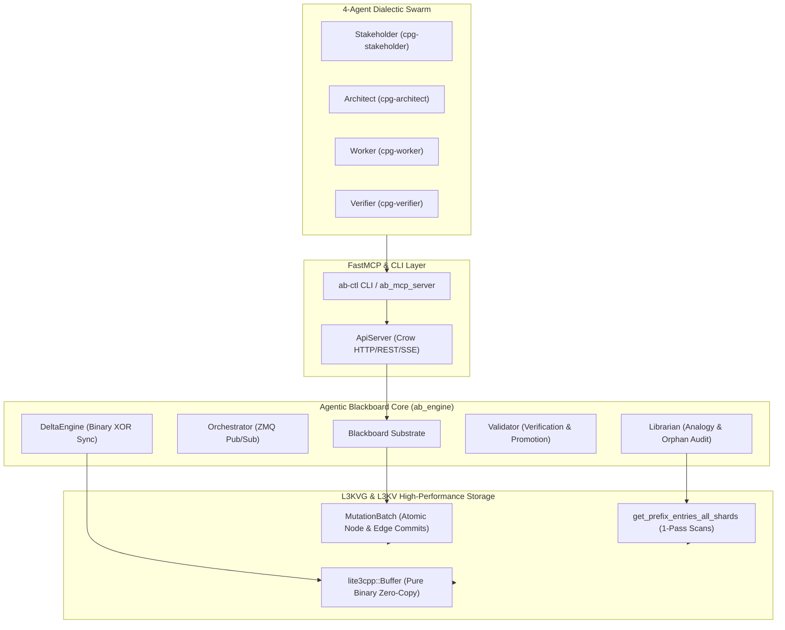

# Agentic Blackboard L3KVG Performance & Modernization Plan

> **For agentic workers:** REQUIRED SUB-SKILL: Use superpowers:subagent-driven-development to implement this plan task-by-task. Steps use checkbox (`- [ ]`) syntax for tracking.

**Goal:** Modernize the Agentic Blackboard substrate to fully exploit L3KVG's new high-performance primitives (`MutationBatch` atomic writes, `get_prefix_entries_all_shards` zero-copy prefix scans, and pure binary `lite3cpp::Buffer`), resolving past incompatibilities and accelerating swarm coordination throughput.

**Architecture:** Replace sequential $O(N)$ node and edge writes in `Blackboard::commit_cpb_entry` and `/api/v1/graph/bundle` with atomic `l3kvg::MutationBatch` commits that execute in a single WAL write without shard lockstep stalls. Upgrade `Librarian` analogy analysis and `ApiServer` graph snapshot exports from the $O(N)$ key-then-get anti-pattern to parallel multi-shard `get_prefix_entries_all_shards` sweeps. Ensure test isolation by equipping `ab_mcp_server.py` and `test_atmosphere_full_cycle.py` with dynamic port binding and token configuration.

**Architecture Diagram:**



**Tech Stack:** C++20, ZeroMQ (cppzmq), `l3kvg_engine`, `l3kv_engine`, `lite3-cpp`, Crow HTTP, Python 3.12 (httpx, FastMCP, pytest).

## Global Constraints
- Strictly zero `nlohmann::json` in core storage, CPG graphs, and delta compression routines.
- Maintain backwards compatibility with existing W3C RDF export and schema representations.
- All 16 suites in `ab_verify` must pass with zero errors.
- Both end-to-end Python integration suites (`test_e2e_cpg_swarm.py` and `test_atmosphere_full_cycle.py`) must pass cleanly.

---

### Task 1: Complete and Verify Foundation Bug Fixes
**Files:**
- Modify: `include/agentic_blackboard/schema.hpp`
- Modify: `src/DeltaEngine.cpp`
- Modify: `src/Blackboard.cpp:600-625`
- Test: `build/ab_verify`

**Interfaces:**
- Consumes: `l3kvg::FederationResolver::parse_uuid`, `DeltaEngine::create_xor_patch`, `DeltaEngine::apply_xor_patch`
- Produces: Correct binary XOR patch application and single-cluster namespace resolution.

- [x] **Step 1: Inspect and fix FederationResolver empty-cluster guard in L3KVG**
  Completed in `l3kvg` commit `811b658`.
- [x] **Step 2: Add explicit target_size to L3DeltaPatch schema**
  Added `int64_t target_size` to `L3DeltaPatch::Patch` in `include/agentic_blackboard/schema.hpp`.
- [x] **Step 3: Update DeltaEngine to use target_size during XOR decompression**
  Updated `src/DeltaEngine.cpp` lines 20-55.
- [x] **Step 4: Update Blackboard::apply_delta_patch to write directly to store**
  Changed `engine_->put_node` to `store->put(key, ...)` to prevent extraneous HLC expansion on reconstructed patches.
- [x] **Step 5: Run ab_verify test suite**
  Run: `cd /home/darkfell/dev/agentic_blackboard/build && ./ab_verify`
  Result: `[SUCCESS] All Agentic Blackboard Verification Tests Passed!` (16 suites passed).

---

### Task 2: Atomic `MutationBatch` in `Blackboard::commit_cpb_entry`
**Files:**
- Modify: `src/Blackboard.cpp:450-530`
- Test: `build/ab_verify`

**Interfaces:**
- Consumes: `l3kvg::MutationBatch`, `l3kvg::Engine::apply_batch`
- Produces: Atomic commitment of Knowledge Atom, author edges, project edge, and note links in a single WAL write.

- [ ] **Step 1: Write unit test in scratch/test_atomic_commit.cpp or verify via ab_verify**
  Verify that committing an atom with multiple links creates all nodes and edges atomically.
- [ ] **Step 2: Refactor Blackboard::commit_cpb_entry to use MutationBatch**
  ```cpp
  l3kvg::MutationBatch batch;
  auto src_id = engine_->get_resolver().parse_uuid(adjusted.header.uuid);
  batch.put_node(src_id, std::string_view(reinterpret_cast<const char*>(buf.data()), buf.size()));

  // 1. Link Author (Identity)
  if (!origin_user_id.empty()) {
      auto user_id = engine_->get_resolver().parse_uuid(origin_user_id);
      auto user_node = engine_->get_node(user_id);
      if (!user_node || !user_node->has_attribute("header")) {
          IdentityNode stub = {origin_user_id, "Unknown User (" + origin_user_id + ")", "USER", ""};
          commit_identity_node(stub);
      }
      batch.add_edge(src_id, rel::CREATED_BY, 1.0, user_id);
  }
  if (!origin_agent_id.empty() && origin_agent_id != origin_user_id) {
      auto agent_id = engine_->get_resolver().parse_uuid(origin_agent_id);
      auto agent_node = engine_->get_node(agent_id);
      if (!agent_node || !agent_node->has_attribute("header")) {
          IdentityNode stub = {origin_agent_id, "Unknown Agent (" + origin_agent_id + ")", "AGENT", ""};
          commit_identity_node(stub);
      }
      batch.add_edge(src_id, rel::CREATED_BY, 1.0, agent_id);
  }

  // 2. Link Project
  if (!project_id.empty()) {
      auto proj_id = engine_->get_resolver().parse_uuid(project_id);
      auto project_node = engine_->get_node(proj_id);
      if (!project_node || !project_node->has_attribute("header")) {
          ProjectNode stub = {project_id, "Auto-created stub for " + project_id, "STUB"};
          commit_project_node(stub);
      }
      batch.add_edge(src_id, rel::BELONGS_TO, 1.0, proj_id);
  }

  // 3. Auto-project Note Links
  for (const auto& link : adjusted.payload.note_links) {
      if (!link.target_uuid.empty()) {
          std::string rel_label = link.relation.empty() ? rel::SEE_ALSO : link.relation;
          auto dst_id = engine_->get_resolver().parse_uuid(link.target_uuid);
          batch.add_edge(src_id, rel_label, 1.0, dst_id);
      }
  }

  engine_->apply_batch(batch.get_buffer(), principal_id);
  ```
- [ ] **Step 3: Compile and run ab_verify**
  Run: `cmake --build /home/darkfell/dev/agentic_blackboard/build -j$(nproc) && ./build/ab_verify`
  Expected: PASS
- [ ] **Step 4: Commit changes**
  Run: `git commit -am "perf(blackboard): batch atom and edge writes using MutationBatch"`

---

### Task 3: Zero-Copy Single-Pass Prefix Scans in `Librarian` and `ApiServer`
**Files:**
- Modify: `src/Librarian.cpp:54-158`
- Modify: `src/ApiServer.cpp:1720-1840`
- Test: `build/ab_verify`

**Interfaces:**
- Consumes: `store->get_prefix_entries_all_shards("n:{", "", limit)`
- Produces: Direct retrieval of key and value payload in a single parallel sweep, eliminating $O(N)$ sequential gets.

- [ ] **Step 1: Update Librarian::perform_analysis and audit_orphans**
  Replace `get_prefix_keys_all_shards` + loop `store->get(key)` with:
  ```cpp
  auto entries = store->get_prefix_entries_all_shards("n:{", "", 1000);
  std::vector<CpbEntry> atoms;
  for (const auto& [key, val] : entries) {
      if (key.find(":los:") != std::string::npos || val.empty()) continue;
      try {
          lite3cpp::Buffer buf(reinterpret_cast<const uint8_t*>(val.data()), val.size());
          atoms.push_back(CpbEntry::deserialize(buf));
      } catch (...) {}
  }
  ```
- [ ] **Step 2: Update ApiServer::handle_graph_snapshot**
  Replace `get_prefix_keys_all_shards` + loop `store->get(key)` with `store->get_prefix_entries_all_shards("n:", "", 2000)`.
- [ ] **Step 3: Compile and run ab_verify**
  Run: `cmake --build /home/darkfell/dev/agentic_blackboard/build -j$(nproc) && ./build/ab_verify`
  Expected: PASS
- [ ] **Step 4: Commit changes**
  Run: `git commit -am "perf(librarian,api): replace key scans with get_prefix_entries_all_shards"`

---

### Task 4: Hermetic Atmosphere Test Suite & FastMCP Environment Support
**Files:**
- Modify: `ab_mcp_server.py:10-30`
- Modify: `scratch/test_atmosphere_full_cycle.py:50-100`
- Test: `scratch/test_atmosphere_full_cycle.py`

**Interfaces:**
- Consumes: `os.environ.get("AB_API_URL")`, `os.environ.get("AB_API_TOKEN")`
- Produces: Dynamic ephemeral port binding and isolated test harness for Atmosphere integration testing.

- [ ] **Step 1: Update ab_mcp_server.py to read AB_API_URL and AB_API_TOKEN from environment**
  ```python
  AB_API_URL = os.environ.get("AB_API_URL", "http://localhost:8085/api/v1")
  AB_API_TOKEN = os.environ.get("AB_API_TOKEN", "")
  ```
  Ensure requests include `Authorization: Bearer <AB_API_TOKEN>` when token is present.
- [ ] **Step 2: Update test_atmosphere_full_cycle.py to spawn isolated daemon on free port**
  Use `find_free_port()` and isolated temporary directory in `/tmp` so it does not collide with the systemd daemon on port 8085.
- [ ] **Step 3: Run test_atmosphere_full_cycle.py**
  Run: `python3 scratch/test_atmosphere_full_cycle.py`
  Expected: PASS (all checkpoints 1-9 pass).
- [ ] **Step 4: Commit changes**
  Run: `git commit -am "test(atmosphere): make ab_mcp_server and full cycle test port-configurable and hermetic"`

---

### Task 5: End-to-End Verification Across All Test Suites
**Files:**
- Test: `build/ab_verify`
- Test: `scratch/test_e2e_cpg_swarm.py`
- Test: `scratch/test_atmosphere_full_cycle.py`
- Test: `scratch/test_ab_ctl.py`

- [ ] **Step 1: Run C++ verification suite**
  `./build/ab_verify` -> Assert 0 exit code.
- [ ] **Step 2: Run CPG Swarm 4-agent dialectic E2E suite**
  `python3 scratch/test_e2e_cpg_swarm.py` -> Assert 0 exit code.
- [ ] **Step 3: Run Atmosphere full-cycle suite**
  `python3 scratch/test_atmosphere_full_cycle.py` -> Assert 0 exit code.
- [ ] **Step 4: Run unit tests**
  `python3 -m pytest scratch/test_ab_ctl.py scratch/test_ab_ctl_swarm.py scratch/test_swarm_defaults.py`

---

### Task 6: Packaging, CPack & Upstream Sync
**Files:**
- Build: `build/package` (CPack Debian package)

- [ ] **Step 1: Build Debian package via CPack**
  `cd build && cpack -G DEB`
- [ ] **Step 2: Verify package contents and inspect git status**
  `git status` across all dev repos.
- [ ] **Step 3: Commit and push**
