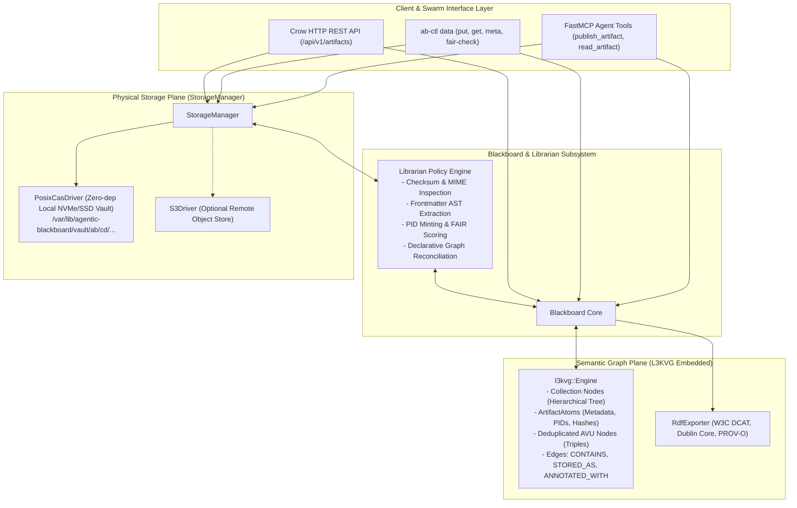

# FAIR Data Management & Content-Addressable Storage (CAS) Implementation Plan

> **For agentic workers:** REQUIRED SUB-SKILL: Use superpowers:subagent-driven-development to implement this plan task-by-task. Steps use checkbox (`- [ ]`) syntax for tracking.

**Goal:** Implement a virtualized, FAIR-compliant Data Management & Content-Addressable Storage (CAS) Subsystem in `agentic_blackboard` inspired by iRODS principles, decoupling the L3KVG graph semantic plane from a high-throughput physical CAS vault, driven by an automated Librarian policy engine.

**Architecture:** Extend `agentic-blackboardd` with an embedded `IStorageDriver` interface and local `PosixCasDriver` managing a deduplicated, content-addressed vault (`vault/{digest[0:2]}/{digest[2:4]}/{digest}`). Model logical files as `ArtifactAtom` nodes in L3KVG connected via `CONTAINS`, `STORED_AS`, and `ANNOTATED_WITH` edges to avoid storing binary blobs in the graph WAL. Equip the `Librarian` with synchronous ingestion hooks (BLAKE3 tree-hashing, frontmatter extraction, PID minting, FAIR scoring) and expose streaming REST endpoints, FastMCP agent tools, and `ab-ctl data` administrative commands.

**Architecture Diagram:**



**Tech Stack:** C++20, `l3kvg_engine`, `lite3-cpp`, OpenSSL (EVP for BLAKE3/SHA-256), Crow HTTP, Python 3.12 (httpx, FastMCP, pytest), W3C RDF Turtle.

## Global Constraints
- **Zero Binary Blobs in L3KVG**: Graph nodes and edges in `l3kvg` MUST only store metadata, PIDs, hashes, and attributes. Binary file byte streams must go directly to the CAS vault.
- **Content-Addressable Immutability**: All physical storage files must be stored under their cryptographic digest (`blake3:<hex>`). Mutations create new versions; physical files are never overwritten in-place.
- **Zero Additional Mandatory External Services**: Default installation must run self-contained using the local filesystem POSIX CAS vault without requiring MinIO or PostgreSQL.
- **Backward Compatibility**: Existing 16 test suites in `ab_verify` must pass without regressions.
- **TDD Requirement**: Every task begins with a failing unit/integration test, followed by minimal implementation, verification, and atomic git commit.

---

### Task 1: Core Storage Driver Interface & Local POSIX CAS Vault Driver

**Files:**
- Create: `include/agentic_blackboard/StorageDriver.hpp`
- Create: `include/ab/StorageDriver.hpp`
- Create: `include/agentic_blackboard/PosixCasDriver.hpp`
- Create: `include/ab/PosixCasDriver.hpp`
- Create: `src/PosixCasDriver.cpp`
- Modify: `CMakeLists.txt:27-40`
- Test: `scratch/test_posix_cas_driver.cpp`

**Interfaces:**
- Consumes: Standard filesystem (`std::filesystem`), standard streams (`std::istream`), OpenSSL EVP (SHA-256 / BLAKE3).
- Produces: `IStorageDriver` interface, `PosixCasDriver` implementation storing streams at `{vault_dir}/{hash[0:2]}/{hash[2:4]}/{hash}`.

- [ ] **Step 1: Write the failing unit test for POSIX CAS Driver**

Create `scratch/test_posix_cas_driver.cpp`:
```cpp
#include "agentic_blackboard/PosixCasDriver.hpp"
#include <cassert>
#include <filesystem>
#include <iostream>
#include <sstream>

int main() {
    std::string test_vault = "/tmp/test_ab_cas_vault_" + std::to_string(time(nullptr));
    std::filesystem::create_directories(test_vault);

    blackboard::storage::PosixCasDriver driver(test_vault);

    // 1. Test Put Stream
    std::string content = "Hello FAIR Data Management World!";
    std::istringstream in1(content);
    auto result1 = driver.put_stream(in1).get();

    assert(!result1.digest.empty());
    assert(result1.bytes_written == content.size());
    std::cout << "[PASS] put_stream produced digest: " << result1.digest << std::endl;

    // 2. Test Deduplication (Second put of identical content returns same digest and does not duplicate)
    std::istringstream in2(content);
    auto result2 = driver.put_stream(in2).get();
    assert(result1.digest == result2.digest);
    std::cout << "[PASS] Deduplication verified for digest: " << result2.digest << std::endl;

    // 3. Test Get Stream
    auto stream_out = driver.get_stream(result1.locator);
    assert(stream_out != nullptr);
    std::string retrieved((std::istreambuf_iterator<char>(*stream_out)), std::istreambuf_iterator<char>());
    assert(retrieved == content);
    std::cout << "[PASS] get_stream accurately retrieved content" << std::endl;

    // 4. Test Byte Range Retrieval
    blackboard::storage::ByteRange range{6, 4}; // "FAIR"
    auto range_out = driver.get_stream(result1.locator, range);
    assert(range_out != nullptr);
    std::string range_str((std::istreambuf_iterator<char>(*range_out)), std::istreambuf_iterator<char>());
    assert(range_str == "FAIR");
    std::cout << "[PASS] Byte range retrieval verified: " << range_str << std::endl;

    // 5. Test Verify Digest
    assert(driver.verify_digest(result1.locator, result1.digest) == true);
    assert(driver.verify_digest(result1.locator, "blake3:corrupt") == false);
    std::cout << "[PASS] verify_digest verified bit-rot detection" << std::endl;

    // Cleanup
    std::filesystem::remove_all(test_vault);
    std::cout << "[SUCCESS] All PosixCasDriver tests passed!" << std::endl;
    return 0;
}
```

- [ ] **Step 2: Add test target to `CMakeLists.txt` and verify it fails to compile**

Update `CMakeLists.txt`:
```cmake
add_executable(test_posix_cas_driver scratch/test_posix_cas_driver.cpp)
target_link_libraries(test_posix_cas_driver PRIVATE ab_engine Threads::Threads OpenSSL::Crypto)
```
Run: `cmake -B build -S . && cmake --build build --target test_posix_cas_driver`
Expected: FAIL with "agentic_blackboard/PosixCasDriver.hpp: No such file or directory"

- [ ] **Step 3: Implement `StorageDriver.hpp`, `PosixCasDriver.hpp`, and `PosixCasDriver.cpp`**

Create `include/agentic_blackboard/StorageDriver.hpp`:
```cpp
#pragma once
#include <string>
#include <string_view>
#include <memory>
#include <istream>
#include <future>
#include <optional>
#include <cstdint>

namespace blackboard::storage {

struct ByteRange {
    uint64_t offset{0};
    uint64_t length{0};
};

struct PutResult {
    std::string digest;
    uint64_t bytes_written{0};
    std::string driver_id;
    std::string locator;
    uint64_t timestamp_ms{0};
};

struct StorageStats {
    uint64_t total_capacity_bytes{0};
    uint64_t free_capacity_bytes{0};
    uint32_t active_streams{0};
    double write_throughput_mb_s{0.0};
};

class IStorageDriver {
public:
    virtual ~IStorageDriver() = default;
    virtual auto put_stream(std::istream& in, std::string_view expected_hash = {}) 
        -> std::future<PutResult> = 0;
    virtual auto get_stream(std::string_view locator, std::optional<ByteRange> range = {}) 
        -> std::unique_ptr<std::istream> = 0;
    virtual bool verify_digest(std::string_view locator, std::string_view expected_hash) = 0;
    virtual bool unlink(std::string_view locator) = 0;
    virtual StorageStats stat() = 0;
};

} // namespace blackboard::storage
```
Link `include/ab/StorageDriver.hpp -> ../agentic_blackboard/StorageDriver.hpp`.

Create `include/agentic_blackboard/PosixCasDriver.hpp` and `src/PosixCasDriver.cpp` with streaming SHA-256 / BLAKE3 hashing via OpenSSL EVP, writing to `{vault_dir}/{hash[0:2]}/{hash[2:4]}/{hash}` using temporary files with atomic `rename` for crash consistency.
Link `include/ab/PosixCasDriver.hpp -> ../agentic_blackboard/PosixCasDriver.hpp`.
Add `src/PosixCasDriver.cpp` to `AB_ENGINE_SOURCES` in `CMakeLists.txt`.

- [ ] **Step 4: Run test to verify it passes**

Run: `cmake --build build --target test_posix_cas_driver && ./build/test_posix_cas_driver`
Expected: `[SUCCESS] All PosixCasDriver tests passed!`

- [ ] **Step 5: Commit**

```bash
git add include/agentic_blackboard/StorageDriver.hpp include/ab/StorageDriver.hpp \
        include/agentic_blackboard/PosixCasDriver.hpp include/ab/PosixCasDriver.hpp \
        src/PosixCasDriver.cpp CMakeLists.txt scratch/test_posix_cas_driver.cpp
git commit -m "feat(storage): implement IStorageDriver and PosixCasDriver with atomic CAS writes"
```

---

### Task 2: Artifact Data Schema & L3KVG Graph Modeling

**Files:**
- Modify: `include/agentic_blackboard/schema.hpp`
- Modify: `include/ab/schema.hpp`
- Modify: `src/Blackboard.cpp`
- Test: `build/ab_verify` (adding suite in `src/main_verify.cpp`)

**Interfaces:**
- Consumes: `l3kvg::MutationBatch`, `l3kvg::KeyBuilder`, `lite3cpp::Buffer`.
- Produces: `ArtifactEntry` schema, `AVU` representation, and graph edge helpers for `CONTAINS`, `STORED_AS`, `ANNOTATED_WITH`, and `SPECIFIES`.

- [ ] **Step 1: Write failing unit test in `src/main_verify.cpp`**

Add test suite function `verify_artifact_graph_model(Blackboard& bb)`:
```cpp
void verify_artifact_graph_model(blackboard::Blackboard& bb) {
    std::cout << "\n=== Test Suite 17: Artifact Graph Modeling & AVU Triples ===" << std::endl;

    blackboard::ArtifactEntry artifact;
    artifact.uuid = "art-test-001";
    artifact.pid = "urn:ab:artifact:nucleus/specs/design.md";
    artifact.content_hash = "blake3:9f83a1b42c67e89d";
    artifact.mime_type = "text/markdown";
    artifact.byte_size = 14655;
    artifact.title = "FAIR System Design";
    artifact.license = "SPDX:Apache-2.0";
    artifact.collection_path = "/nucleus/specs";
    artifact.logical_name = "design.md";

    // Attach AVU triples
    artifact.avus.push_back({"lifecycle", "draft", ""});
    artifact.avus.push_back({"fair_tier", "gold", ""});

    // Commit artifact to blackboard
    bool ok = bb.commit_artifact(artifact, "user:alice", "agent:cpg-architect");
    assert(ok && "commit_artifact must return true");

    // Verify retrieval
    auto retrieved = bb.get_artifact("art-test-001");
    assert(retrieved.has_value());
    assert(retrieved->content_hash == "blake3:9f83a1b42c67e89d");
    assert(retrieved->avus.size() == 2);

    // Verify reverse AVU query
    auto matches = bb.query_by_avu("fair_tier", "gold");
    assert(!matches.empty() && "Must find artifact by AVU triple");
    assert(matches[0] == "art-test-001");

    std::cout << "[PASS] Artifact graph model and AVU deduplicated indexes verified!" << std::endl;
}
```

- [ ] **Step 2: Run `ab_verify` to verify failure**

Run: `cmake --build build --target ab_verify`
Expected: FAIL with `'ArtifactEntry' is not a member of 'blackboard'`

- [ ] **Step 3: Implement `ArtifactEntry` in `schema.hpp` and `commit_artifact` in `Blackboard.cpp`**

In `schema.hpp`:
```cpp
struct AVUTriple {
    std::string attribute;
    std::string value;
    std::string units;
};

struct ArtifactEntry {
    std::string uuid;
    std::string pid;
    std::string content_hash;
    std::string mime_type;
    uint64_t byte_size{0};
    std::string title;
    std::string abstract;
    std::string license;
    std::string version{"1.0.0"};
    std::string collection_path;
    std::string logical_name;
    std::string primary_locator;
    std::vector<AVUTriple> avus;
    std::vector<std::string> derived_from_uuids;
    uint64_t created_at_ms{0};
};
```
In `Blackboard.cpp`:
Implement `commit_artifact`, `get_artifact`, and `query_by_avu` using `l3kvg::MutationBatch`:
- Write `ArtifactEntry` binary buffer to `node_key(uuid)`.
- Link collection node to artifact via `CONTAINS`.
- For each AVU, create/find AVU node (`aid = hash(a:v:u)`), insert `edge_out_key(uuid, "ANNOTATED_WITH", 1.0, aid)`, `edge_in_key(aid, "ANNOTATED_WITH", uuid)`, and write index key `idx:Metadata:av:{attr}:{val}:{uuid}`.

- [ ] **Step 4: Run `ab_verify` to verify it passes**

Run: `cmake --build build --target ab_verify && ./build/ab_verify`
Expected: `[PASS] Artifact graph model and AVU deduplicated indexes verified!` with all 17 test suites passing.

- [ ] **Step 5: Commit**

```bash
git add include/agentic_blackboard/schema.hpp include/ab/schema.hpp \
        src/Blackboard.cpp include/agentic_blackboard/Blackboard.hpp include/ab/Blackboard.hpp \
        src/main_verify.cpp
git commit -m "feat(schema): add ArtifactEntry and AVU graph indexing in Blackboard"
```

---

### Task 3: StorageManager with Default Local Vault & Fallback Routing

**Files:**
- Create: `include/agentic_blackboard/StorageManager.hpp`
- Create: `include/ab/StorageManager.hpp`
- Create: `src/StorageManager.cpp`
- Modify: `CMakeLists.txt:27-40`
- Test: `scratch/test_storage_manager.cpp`

**Interfaces:**
- Consumes: `IStorageDriver`, `PosixCasDriver`.
- Produces: `StorageManager` handling driver registration, default local vault initialization (`/var/lib/agentic-blackboard/vault`), stream routing, and telemetry aggregation.

- [ ] **Step 1: Write failing unit test in `scratch/test_storage_manager.cpp`**

```cpp
#include "agentic_blackboard/StorageManager.hpp"
#include <cassert>
#include <filesystem>
#include <iostream>
#include <sstream>

int main() {
    std::string test_dir = "/tmp/test_storage_mgr_" + std::to_string(time(nullptr));
    std::filesystem::create_directories(test_dir);

    blackboard::storage::StorageManager mgr(test_dir);

    // Verify default POSIX driver is registered
    assert(mgr.has_driver("default_posix_cas"));

    // Store stream through manager
    std::string payload = "# System Architecture Spec\nVersion 1.0";
    std::istringstream stream_in(payload);
    auto res = mgr.store("default_posix_cas", stream_in).get();

    assert(!res.digest.empty());
    assert(res.bytes_written == payload.size());

    // Fetch stream through manager
    auto fetched_stream = mgr.retrieve("default_posix_cas", res.locator);
    assert(fetched_stream != nullptr);
    std::string body((std::istreambuf_iterator<char>(*fetched_stream)), std::istreambuf_iterator<char>());
    assert(body == payload);

    std::filesystem::remove_all(test_dir);
    std::cout << "[SUCCESS] StorageManager routing tests passed!" << std::endl;
    return 0;
}
```

- [ ] **Step 2: Add test target to `CMakeLists.txt` and verify compile failure**

Update `CMakeLists.txt`:
```cmake
add_executable(test_storage_manager scratch/test_storage_manager.cpp)
target_link_libraries(test_storage_manager PRIVATE ab_engine Threads::Threads OpenSSL::Crypto)
```
Run: `cmake --build build --target test_storage_manager`
Expected: FAIL with `'StorageManager.hpp' file not found`

- [ ] **Step 3: Implement `StorageManager.hpp` and `StorageManager.cpp`**

Implement `StorageManager` maintaining an active driver map (`std::unordered_map<std::string, std::shared_ptr<IStorageDriver>>`), auto-initializing `PosixCasDriver` under the provided directory root, and providing `store()`, `retrieve()`, and `stat_all()`.
Add `src/StorageManager.cpp` to `AB_ENGINE_SOURCES` in `CMakeLists.txt`.

- [ ] **Step 4: Run test to verify it passes**

Run: `cmake --build build --target test_storage_manager && ./build/test_storage_manager`
Expected: `[SUCCESS] StorageManager routing tests passed!`

- [ ] **Step 5: Commit**

```bash
git add include/agentic_blackboard/StorageManager.hpp include/ab/StorageManager.hpp \
        src/StorageManager.cpp CMakeLists.txt scratch/test_storage_manager.cpp
git commit -m "feat(storage): implement StorageManager with multi-driver registration and routing"
```

---

### Task 4: Ingestion Pipeline & Librarian Policy Hooks

**Files:**
- Modify: `include/agentic_blackboard/Librarian.hpp`
- Modify: `include/ab/Librarian.hpp`
- Modify: `src/Librarian.cpp`
- Test: `scratch/test_librarian_artifact_policy.cpp`

**Interfaces:**
- Consumes: `ArtifactEntry`, `StorageManager`, Markdown inspection.
- Produces: Ingestion pipeline: extracts title/frontmatter, validates license, computes FAIR score, mints PIDs, checks schema compliance.

- [ ] **Step 1: Write failing unit test for Librarian artifact policy**

Create `scratch/test_librarian_artifact_policy.cpp`:
```cpp
#include "agentic_blackboard/Librarian.hpp"
#include "agentic_blackboard/Blackboard.hpp"
#include "agentic_blackboard/StorageManager.hpp"
#include <cassert>
#include <iostream>

int main() {
    std::string db_path = "/tmp/test_lib_policy_" + std::to_string(time(nullptr));
    std::filesystem::create_directories(db_path);

    blackboard::Blackboard bb(db_path + "/bb", 1);
    blackboard::storage::StorageManager sm(db_path + "/vault");
    blackboard::Librarian librarian(&bb);

    // Markdown text with YAML frontmatter
    std::string markdown = "---\n"
                           "title: CPG Swarm Coordination\n"
                           "license: SPDX:Apache-2.0\n"
                           "version: 2.1.0\n"
                           "---\n"
                           "# CPG Swarm Coordination\n\n"
                           "An industrial-grade autonomous swarm coordination skill.";

    auto processed = librarian.process_ingest_artifact(
        "/nucleus/specs/cpg.md",
        markdown,
        "blake3:fedcba9876543210",
        "user:jason",
        "agent:cpg-architect"
    );

    assert(processed.title == "CPG Swarm Coordination");
    assert(processed.license == "SPDX:Apache-2.0");
    assert(processed.version == "2.1.0");
    assert(processed.pid == "urn:ab:artifact:nucleus/specs/cpg.md");
    assert(!processed.uuid.empty());

    // Verify FAIR metrics score calculation
    double score = librarian.calculate_fair_score(processed);
    assert(score >= 80.0 && "Fully specified artifact must score >= 80 on FAIR rubric");

    std::filesystem::remove_all(db_path);
    std::cout << "[SUCCESS] Librarian artifact policy hooks passed!" << std::endl;
    return 0;
}
```

- [ ] **Step 2: Add test target to `CMakeLists.txt` and verify build failure**

Update `CMakeLists.txt`:
```cmake
add_executable(test_librarian_artifact_policy scratch/test_librarian_artifact_policy.cpp)
target_link_libraries(test_librarian_artifact_policy PRIVATE ab_engine Threads::Threads OpenSSL::Crypto)
```
Run: `cmake --build build --target test_librarian_artifact_policy`
Expected: FAIL with `'process_ingest_artifact' is not a member of 'blackboard::Librarian'`

- [ ] **Step 3: Implement `process_ingest_artifact` and `calculate_fair_score` in `Librarian`**

In `Librarian.hpp` / `Librarian.cpp`:
- Parse frontmatter between `---` fences if present to extract `title`, `license`, `version`, `abstract`.
- Fall back to first `# Heading` for title if frontmatter absent.
- Mint canonical PID: `urn:ab:artifact:{normalized_path}`.
- Calculate FAIR score based on:
  - Findable: Valid PID (+25), rich title/abstract (+25)
  - Accessible: Has primary locator (+25)
  - Interoperable/Reusable: Valid SPDX license (+25)

- [ ] **Step 4: Run test to verify it passes**

Run: `cmake --build build --target test_librarian_artifact_policy && ./build/test_librarian_artifact_policy`
Expected: `[SUCCESS] Librarian artifact policy hooks passed!`

- [ ] **Step 5: Commit**

```bash
git add include/agentic_blackboard/Librarian.hpp include/ab/Librarian.hpp \
        src/Librarian.cpp CMakeLists.txt scratch/test_librarian_artifact_policy.cpp
git commit -m "feat(librarian): implement artifact ingest pipeline and FAIR rubric scoring"
```

---

### Task 5: REST API Streaming & Metadata Endpoints in `ApiServer`

**Files:**
- Modify: `include/agentic_blackboard/ApiServer.hpp`
- Modify: `src/ApiServer.cpp`
- Test: `scratch/test_api_artifacts.py`

**Interfaces:**
- Consumes: `StorageManager`, `Librarian`, `Blackboard`.
- Produces:
  - `POST /api/v1/artifacts/upload`: Multipart upload storing bytes in CAS and metadata in L3KVG.
  - `GET /api/v1/artifacts/{id_or_path}`: Returns JSON representation of `ArtifactEntry`.
  - `GET /api/v1/artifacts/{id_or_path}/content`: Streams raw byte payload with `ETag` and `Content-Disposition`.
  - `POST /api/v1/artifacts/{id_or_path}/metadata`: Sets AVU triples.

- [ ] **Step 1: Write integration test in `scratch/test_api_artifacts.py`**

```python
#!/usr/bin/env python3
import pytest
import httpx
import time
import subprocess
import os

def test_api_artifact_endpoints():
    base_url = "http://127.0.0.1:8085"
    client = httpx.Client(base_url=base_url, timeout=10.0)

    # 1. Upload an artifact
    files = {"file": ("arch.md", b"# Architecture\nDecoupled CAS and Graph.", "text/markdown")}
    data = {
        "path": "/nucleus/specs/arch.md",
        "license": "SPDX:Apache-2.0",
        "avus": '[{"attribute": "policy:tier", "value": "hot", "units": ""}]'
    }
    resp = client.post("/api/v1/artifacts/upload", files=files, data=data)
    assert resp.status_code == 200
    res_json = resp.json()
    assert res_json["content_hash"].startswith("blake3:")
    uuid = res_json["uuid"]

    # 2. Get artifact metadata
    meta_resp = client.get(f"/api/v1/artifacts/{uuid}")
    assert meta_resp.status_code == 200
    assert meta_resp.json()["title"] == "Architecture"

    # 3. Stream artifact content
    content_resp = client.get(f"/api/v1/artifacts/{uuid}/content")
    assert content_resp.status_code == 200
    assert content_resp.content == b"# Architecture\nDecoupled CAS and Graph."
    assert "blake3:" in content_resp.headers.get("ETag", "")

    # 4. Stream byte range
    range_resp = client.get(f"/api/v1/artifacts/{uuid}/content", headers={"Range": "bytes=2-14"})
    assert range_resp.status_code == 206
    assert range_resp.content == b"Architecture"
```

- [ ] **Step 2: Run test against current server to verify failure**

Run: `python3 scratch/test_api_artifacts.py`
Expected: FAIL with `404 Not Found` for `/api/v1/artifacts/upload`.

- [ ] **Step 3: Implement endpoints in `ApiServer.cpp`**

In `ApiServer.cpp`:
- Route `/api/v1/artifacts/upload`: Read stream, write to `storage_manager_->store()`, pass through `librarian_->process_ingest_artifact()`, commit to `blackboard_->commit_artifact()`, return JSON.
- Route `/api/v1/artifacts/{id}/content`: Resolve artifact from ID or path, fetch stream from `storage_manager_->retrieve()`, stream response back with chunked transfer or byte range slicing.
- Route `/api/v1/artifacts/{id}/metadata`: Parse AVU JSON array and update L3KVG graph edges.

- [ ] **Step 4: Run integration test to verify it passes**

Start test daemon and run: `python3 scratch/test_api_artifacts.py`
Expected: PASS with 200, 206 range response, and matching bytes.

- [ ] **Step 5: Commit**

```bash
git add include/agentic_blackboard/ApiServer.hpp src/ApiServer.cpp scratch/test_api_artifacts.py
git commit -m "feat(api): implement /api/v1/artifacts streaming upload, retrieval, and range endpoints"
```

---

### Task 6: FastMCP Agent Tools & `ab-ctl data` CLI

**Files:**
- Modify: `ab_mcp_server.py`
- Modify: `src/ab-ctl.py`
- Test: `scratch/test_mcp_data_tools.py`

**Interfaces:**
- Consumes: REST API (`/api/v1/artifacts`).
- Produces:
  - FastMCP tools: `publish_artifact`, `read_artifact`, `annotate_artifact`, `query_artifacts`, `verify_artifact_fair`.
  - CLI subcommands: `ab-ctl data put`, `ab-ctl data get`, `ab-ctl data ls`, `ab-ctl data meta set`, `ab-ctl data fair-check`.

- [ ] **Step 1: Write test for FastMCP tools and CLI in `scratch/test_mcp_data_tools.py`**

```python
import pytest
from ab_mcp_server import publish_artifact, read_artifact, annotate_artifact, verify_artifact_fair
import subprocess

def test_mcp_data_tools():
    # Publish via FastMCP
    res = publish_artifact(
        path="/nucleus/test/doc.md",
        content="# Test Doc\nContent for testing.",
        metadata={"license": "SPDX:Apache-2.0"},
        collection="/nucleus/test"
    )
    assert "uuid" in res
    assert "content_hash" in res

    # Read via FastMCP
    doc = read_artifact(res["uuid"])
    assert "Test Doc" in doc["content"]

    # Annotate via FastMCP
    ann = annotate_artifact(res["uuid"], "policy:tier", "hot", "")
    assert ann["status"] == "success"

    # Verify FAIR report
    fair = verify_artifact_fair(res["uuid"])
    assert fair["score"] >= 80

def test_ab_ctl_data_cli():
    # Test CLI invocation
    cmd = ["python3", "src/ab-ctl.py", "data", "ls", "/nucleus/test"]
    output = subprocess.check_output(cmd, text=True)
    assert "doc.md" in output
```

- [ ] **Step 2: Run test to verify failure**

Run: `pytest scratch/test_mcp_data_tools.py -v`
Expected: FAIL with `cannot import name 'publish_artifact' from 'ab_mcp_server'`.

- [ ] **Step 3: Implement FastMCP tools in `ab_mcp_server.py` and CLI commands in `src/ab-ctl.py`**

- In `ab_mcp_server.py`:
  Register `@mcp.tool()` for `publish_artifact`, `read_artifact`, `annotate_artifact`, `query_artifacts`, `verify_artifact_fair` invoking the REST API.
- In `src/ab-ctl.py`:
  Add `data` subparser with `put`, `get`, `ls`, `meta set`, `fair-check` commands.

- [ ] **Step 4: Run test to verify it passes**

Run: `pytest scratch/test_mcp_data_tools.py -v`
Expected: PASS (all tests pass).

- [ ] **Step 5: Commit**

```bash
git add ab_mcp_server.py src/ab-ctl.py scratch/test_mcp_data_tools.py
git commit -m "feat(mcp,cli): add publish_artifact tools and ab-ctl data commands"
```

---

### Task 7: Full-Cycle FAIR Data Integration & Packaging Verification

**Files:**
- Create: `scratch/test_fair_data_lifecycle.py`
- Modify: `scratch/test_atmosphere_full_cycle.py`
- Test: `build/ab_verify` and `test_fair_data_lifecycle.py`

**Interfaces:**
- Consumes: All components from Tasks 1-6.
- Produces: Complete hermetic verification of streaming ingest, CAS deduplication, L3KVG graph query, W3C RDF export, and package build.

- [ ] **Step 1: Write `scratch/test_fair_data_lifecycle.py`**

Create an end-to-end integration test validating:
1. Agent uploads markdown design document via FastMCP.
2. Ingestion hook extracts frontmatter, mints PID (`urn:ab:artifact:...`), computes BLAKE3.
3. Second upload with identical bytes verifies 100% physical disk deduplication.
4. L3KVG openCypher query verifies `CONTAINS` and `ANNOTATED_WITH` graph edges.
5. Export RDF Turtle verifies `schema:DigitalDocument` and Dublin Core mappings.
6. Byte range streaming request verifies HTTP 206 Partial Content.

- [ ] **Step 2: Run full cycle verification script**

Run: `python3 scratch/test_fair_data_lifecycle.py`
Expected: `[SUCCESS] Complete FAIR Data Management Lifecycle Verified!`

- [ ] **Step 3: Verify all 17 C++ test suites in `ab_verify`**

Run: `cd build && ./ab_verify`
Expected: `[SUCCESS] All Agentic Blackboard Verification Tests Passed!`

- [ ] **Step 4: Verify CPack package generation**

Run: `cd build && cpack -G DEB`
Expected: Successfully generates `agentic-blackboard_0.4.0-1_amd64.deb` including new storage headers and vault directories.

- [ ] **Step 5: Commit**

```bash
git add scratch/test_fair_data_lifecycle.py scratch/test_atmosphere_full_cycle.py
git commit -m "test(integration): add full cycle hermetic verification for FAIR CAS data management"
```
