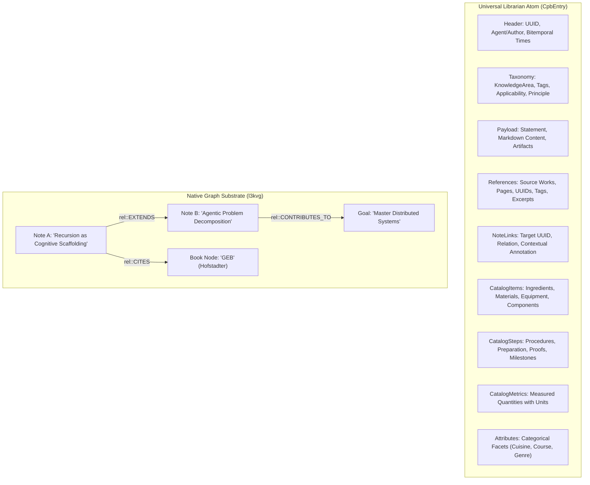

# Design Spec: ASOS Life-Long Digital Commonplace Book Schema Expansion
**Date**: 2026-09-15  
**Status**: APPROVED  
**Author**: Jason Coposky & Antigravity Pair  

---

## 1. Executive Summary & Vision

The **Agentic Sovereign Orchestration Substrate (ASOS)** serves as the high-performance distributed blackboard for agentic swarm intelligence, spatial computing (Project Nucleus), and human life-long personal knowledge management. 

Historically, digital note-taking and personal knowledge tools either fragment data across disparate domain-specific applications (recipe apps, literature tools, fitness trackers, task managers) or degrade into unstructured freeform text that lacks machine-computable semantic rigor.

This specification establishes a **Universal Librarian Architecture** for ASOS. Rather than hardcoding bespoke C++ structs for each emerging life activity, the substrate adopts universal cataloging, bibliographic, and procedural primitives. A single universal atom (`CpbEntry`) seamlessly services deep literature notes, culinary recipes, scientific experiments, physical workouts, and software engineering principles without schema bloat or recompilation cycles.



---

## 2. Universal Schema Primitives

### 2.1 Rich Bibliographic Referencing (`Reference`)

A single note can cite one or more external works, historical texts, research papers, or media recordings:

```cpp
struct Reference {
    std::string title;                     // Title of source work (e.g. "Structure and Interpretation of Computer Programs")
    std::string page_numbers;              // Locators: "pp. 142-148", "Chapter 3.2", "01:14:20"
    std::string uuid;                      // Substrate atom UUID or external URI/DOI/ISBN
    std::string creator;                   // Author, researcher, lecturer, or artist
    std::vector<std::string> tags;         // Reference-level tags (e.g. ["lisp", "metalinguistic-abstraction"])
    std::string excerpt;                   // Verbatim quotation or passage cited from this source

    void serialize(lite3cpp::Buffer& buf, size_t parent) const;
    static Reference deserialize(const lite3cpp::Buffer& buf, size_t parent);
};
```

### 2.2 Inter-Note Synapses (`NoteLink`)

Connects notes to other notes in the commonplace book, supporting both simple associative links and rich intellectual dialectic predicates:

```cpp
struct NoteLink {
    std::string target_uuid;               // UUID of the linked note
    std::string relation;                  // Relation predicate (e.g. "SEE_ALSO", "SUPPORTS", "REFUTES", "EXTENDS")
    std::string context;                   // Contextual annotation explaining the connection

    void serialize(lite3cpp::Buffer& buf, size_t parent) const;
    static NoteLink deserialize(const lite3cpp::Buffer& buf, size_t parent);
};
```

### 2.3 Catalog Items (`CatalogItem`)

Universal representation of materials, ingredients, components, equipment, or physical items:

```cpp
struct CatalogItem {
    std::string name;             // e.g. "Mascarpone", "All-purpose flour", "3/8-inch Hex Bolt"
    double quantity = 0.0;        // e.g. 500.0, 2.5, 4.0
    std::string unit;             // e.g. "g", "ml", "cup", "pcs", "reps", "kg"
    std::string role;             // "INGREDIENT", "EQUIPMENT", "MATERIAL", "EXERCISE", "COMPONENT"
    std::string notes;            // e.g. "room temperature", "sifted", "torque to 25 Nm"

    void serialize(lite3cpp::Buffer& buf, size_t parent) const;
    static CatalogItem deserialize(const lite3cpp::Buffer& buf, size_t parent);
};
```

### 2.4 Catalog Steps (`CatalogStep`)

Universal representation of procedural execution, recipes, workout routines, repair sequences, or scientific protocols:

```cpp
struct CatalogStep {
    int32_t step_number = 1;      // Sequence order (1, 2, 3...)
    std::string instruction;      // Action statement / instruction
    int32_t duration_seconds = 0; // Optional duration (e.g. 300 for 5 min whisk, 1800 for bake)
    std::string notes;            // Technique notes, checkpoints, or safety warnings

    void serialize(lite3cpp::Buffer& buf, size_t parent) const;
    static CatalogStep deserialize(const lite3cpp::Buffer& buf, size_t parent);
};
```

### 2.5 Catalog Metrics (`CatalogMetric`)

Universal representation of quantitative measurements with dimensions, avoiding rigid hardcoded telemetry:

```cpp
struct CatalogMetric {
    std::string key;              // e.g. "prep_time", "cook_time", "servings", "calories", "heart_rate_avg"
    double value = 0.0;           // Measured quantity
    std::string unit;             // Unit of measurement ("min", "kcal", "yield", "bpm", "us")

    void serialize(lite3cpp::Buffer& buf, size_t parent) const;
    static CatalogMetric deserialize(const lite3cpp::Buffer& buf, size_t parent);
};
```

---

## 3. The Universal Atom Schema (`CpbEntry`)

All commonplace notes, recipes, and reflections integrate cleanly into [`CpbEntry`](file:///home/darkfell/dev/agentic_blackboard/include/asos/schema.hpp#L315-L442):

```cpp
struct CpbEntry {
    struct Header {
        std::string uuid;
        struct Origin {
            std::string agent_id;
            std::string project_id;
        } origin;
        int64_t timestamp = 0;       // Substrate commit / transaction time (epoch ms)
        int64_t event_timestamp = 0; // Physical / retrospective event time (epoch ms)
    } header;

    struct Taxonomy {
        KnowledgeArea knowledge_area;
        std::vector<std::string> tags;
        int64_t applicability = 100;
        bool uncertainty = false;
        bool is_principle = false;
    } taxonomy;

    struct Payload {
        std::string content_type = "text/markdown";
        std::string statement;                  // Primary thesis, axiom, or recipe title
        std::string content;                    // Markdown reflection, synthesis, or notes
        std::vector<std::string> artifact_refs; // Attached images, diagrams, PDFs

        // First-Class Referencing Web
        std::vector<Reference> references;      // External source citations
        std::vector<NoteLink> note_links;       // Links to other notes in the commonplace book
    } payload;

    // Universal Librarian Catalog Layer
    std::vector<CatalogItem> items;             // Ingredients, materials, equipment
    std::vector<CatalogStep> steps;             // Procedural steps, recipe instructions
    std::vector<CatalogMetric> metrics;         // Quantitative measurements & times
    std::map<std::string, std::string> attributes; // Categorical descriptors (cuisine, course)

    // Domain Extensions (Preserved for backward compatibility)
    std::optional<Wellness> wellness;
    std::optional<Education> education;
    std::optional<ValidationSignature> signature;

    void serialize(lite3cpp::Buffer& buf) const;
    static CpbEntry deserialize(const lite3cpp::Buffer& buf);
    bool better_than(const CpbEntry& other) const;
};
```

---

## 4. Semantic Graph Predicates (`asos::rel`)

The predicate namespace is expanded to govern note dialectics, citations, and compositional recipes:

```cpp
namespace rel {
    // Baseline Provenance & Scoping
    const std::string CREATED_BY = "CREATED_BY";
    const std::string BELONGS_TO = "BELONGS_TO";
    const std::string MAINTAINS = "MAINTAINS";

    // Versioning & Structural Analogy
    const std::string SUPERSEDED_BY = "SUPERSEDED_BY";
    const std::string CPB_SIMILARITY = "CPB_SIMILARITY";
    const std::string RELATED_TO = "RELATED_TO";

    // Spatial & Grounding
    const std::string REPRESENTED_BY = "REPRESENTED_BY";
    const std::string ANCHORED_TO = "ANCHORED_TO";
    const std::string MENTIONS = "MENTIONS";
    const std::string OCCURRED_AT = "OCCURRED_AT";

    // Task & Strategic Alignment
    const std::string DEPENDS_ON = "DEPENDS_ON";
    const std::string BLOCKS = "BLOCKS";
    const std::string SUBTASK_OF = "SUBTASK_OF";
    const std::string VALIDATED_BY = "VALIDATED_BY";
    const std::string CONTRIBUTES_TO = "CONTRIBUTES_TO";

    // --- Literature & Intellectual Dialectic ---
    const std::string SEE_ALSO = "SEE_ALSO";                     // Associative reference
    const std::string REFERENCES = "REFERENCES";                 // General citation
    const std::string CITES = "CITES";                           // Explicit source attribution
    const std::string SUPPORTS = "SUPPORTS";                     // Evidentiary support
    const std::string REFUTES = "REFUTES";                       // Challenge or contradiction
    const std::string EXTENDS = "EXTENDS";                       // Elaboration / generalization
    const std::string SYNTHESIS_OF = "SYNTHESIS_OF";             // Synthesis of multiple notes
    const std::string QUESTION_RAISED_BY = "QUESTION_RAISED_BY"; // Inquiry sparked by a note
    const std::string ANALOGY_TO = "ANALOGY_TO";                 // Isomorphic structural parallel

    // --- Culinary & Composition ---
    const std::string PAIRS_WITH = "PAIRS_WITH";                 // Complementary recipe/beverage
    const std::string VARIATION_OF = "VARIATION_OF";             // Recipe adaptation
    const std::string USES_INGREDIENT = "USES_INGREDIENT";       // Ingredient component link
}
```

---

## 5. Knowledge Area Taxonomy Expansion

```cpp
enum class KnowledgeArea : uint8_t {
    // SWEBOK KAs (1-15)
    REQUIREMENTS = 1,
    DESIGN = 2,
    CONSTRUCTION = 3,
    TESTING = 4,
    MAINTENANCE = 5,
    CONFIG_MANAGEMENT = 6,
    ENGINEERING_MANAGEMENT = 7,
    ENGINEERING_PROCESS = 8,
    ENGINEERING_MODELS = 9,
    QUALITY = 10,
    PROFESSIONAL_PRACTICE = 11,
    ECONOMICS = 12,
    COMPUTING_FOUNDATIONS = 13,
    MATHEMATICAL_FOUNDATIONS = 14,
    ENGINEERING_FOUNDATIONS = 15,

    // Life Journaling & Commonplace Domains
    HEALTH_WELLNESS = 20,
    SOCIAL_RELATIONSHIPS = 21,
    PERSONAL_REFLECTIONS = 22,
    LEISURE_CREATIVITY = 23,
    DAILY_ROUTINE = 24,
    EDUCATION_LEARNING = 25,
    
    // --- New Life-Long Commonplace Book Domains ---
    LITERATURE_READING = 26,   // Books, articles, academic papers, essays, quotes
    CULINARY_RECIPES = 27,     // Food, beverages, recipes, cooking techniques
    CREATIVE_ARTS = 28,        // Writing, drawing, music composition, design
    PERSONAL_FINANCE = 29,     // Budgets, investments, capital planning
    HOME_LOGISTICS = 30,       // Inventory, maintenance, warranties, gear
    GENERAL_COMMONPLACE = 31,  // Axioms, aphorisms, cross-disciplinary observations

    UNKNOWN = 0
};
```

---

## 6. Blackboard Substrate & Graph Engine Integration

### 6.1 Automatic Edge Projection (`Blackboard::commit_entry`)

When an atom is committed to the blackboard:
1. **Note-to-Note Synapses**: Each `NoteLink` automatically generates a directed edge in `l3kvg`:
   ```cpp
   engine_->put_edge(atom.header.uuid, link.target_uuid, link.relation, 1.0);
   ```
2. **Bibliographic Citations**: Each `Reference` whose `uuid` corresponds to an existing node in the graph generates:
   ```cpp
   engine_->put_edge(atom.header.uuid, ref.uuid, rel::CITES, 1.0);
   ```
3. **Multi-Tenant Security**: If a `principal_id` is set, read/write ACLs are propagated to all auto-generated edge keys.

### 6.2 Backlink and Reference Traversal API

```cpp
// Queries all inbound edges to a note (who cites or links to me?)
std::vector<std::pair<std::string, std::string>> Blackboard::get_backlinks(const std::string& note_uuid, uint32_t principal_id);

// Queries all outbound links from a note (who do I link to?)
std::vector<std::pair<std::string, std::string>> Blackboard::get_outbound_links(const std::string& note_uuid, uint32_t principal_id);
```

---

## 7. W3C RDF Turtle Serialization (`RdfExporter`)

[`RdfExporter`](file:///home/darkfell/dev/agentic_blackboard/include/asos/RdfExporter.hpp) serializes notes, references, items, and steps into standard W3C Semantic Web representations:

```turtle
@prefix asos: <http://asos.substrate.ai/schema#> .
@prefix schema: <http://schema.org/> .
@prefix prov: <http://www.w3.org/ns/prov#> .
@prefix rdfs: <http://www.w3.org/2000/01/rdf-schema#> .
@prefix xsd: <http://www.w3.org/2001/XMLSchema#> .

<urn:asos:atom:note-recursion> a asos:KnowledgeAtom, schema:CreativeWork ;
    schema:headline "Recursion as Cognitive Scaffolding" ;
    schema:text "Detailed commentary and personal reflection..." ;
    schema:citation [
        a schema:Book ;
        schema:name "Gödel, Escher, Bach" ;
        schema:pagination "pp. 142-148" ;
        schema:author "Douglas Hofstadter" ;
        schema:keywords "epistemology", "recursion" ;
        schema:text "Strange loops occur whenever..."
    ] ;
    rdfs:seeAlso <urn:asos:atom:note-heuristics> ;
    asos:extends <urn:asos:atom:note-problem-solving> .

<urn:asos:atom:recipe-tiramisu> a asos:KnowledgeAtom, schema:Recipe ;
    schema:name "Classic Tiramisu" ;
    schema:description "Traditional Treviso method." ;
    schema:recipeIngredient "Mascarpone (500 g)", "Ladyfingers (30 pcs)", "Espresso (250 ml)" ;
    schema:recipeInstructions "1. Brew espresso...", "2. Whip yolks with sugar..." ;
    schema:prepTime "PT30M" ;
    schema:recipeYield "8 servings" ;
    asos:pairsWith <urn:asos:atom:recipe-espresso-roast> .
```

---

## 8. Verification & Test Plan

1. **`test_commonplace_note_references`**:
   - Create a note with two distinct `Reference` items (a book and a research paper).
   - Round-trip serialize and deserialize via `lite3-cpp` zero-copy BSON.
   - Assert all citation fields (title, page, creator, tags, excerpt) are accurately preserved.

2. **`test_note_graph_backlinks`**:
   - Create Note A, Note B, and Note C.
   - Note B links to Note A via `rel::EXTENDS`.
   - Note C links to Note A via `rel::SEE_ALSO`.
   - Commit entries to Blackboard.
   - Call `get_backlinks(Note A)` $\to$ verify Note B (`EXTENDS`) and Note C (`SEE_ALSO`) are returned.

3. **`test_universal_catalog_recipe`**:
   - Create a recipe atom with `items` (ingredients), `steps` (instructions), `metrics` (times, servings), and `attributes` (cuisine, course).
   - Verify serialization round-trip.
   - Assert metric query capabilities.

4. **`test_rdf_export_notes_and_recipes`**:
   - Export graph containing notes and recipes via `RdfExporter::export_turtle`.
   - Assert RDF output includes `schema:citation`, `schema:recipeIngredient`, `rdfs:seeAlso`, and `asos:extends`.

5. **Regression Verification**:
   - Run full test suite in `asos_verify` ensuring 100% backward compatibility with existing tests.
