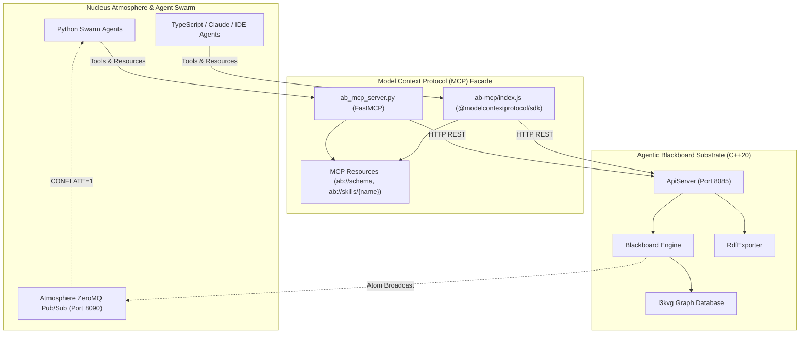

# Design Spec: Agentic Blackboard Atmosphere Agent Usage & MCP Commonplace Tooling

**Date**: 2026-09-16  
**Status**: APPROVED  
**Author**: Jason Coposky & Antigravity Pair  

---

## 1. Executive Summary & Vision

The **Agentic Blackboard** serves as the high-performance distributed blackboard and collective memory for agentic swarm intelligence and human life-long knowledge management. In earlier milestones, the **Universal Librarian Architecture** was implemented in C++ ([`include/agentic_blackboard/schema.hpp`](file:///home/darkfell/dev/agentic_blackboard/include/agentic_blackboard/schema.hpp) and [`src/Blackboard.cpp`](file:///home/darkfell/dev/agentic_blackboard/src/Blackboard.cpp)), establishing primitives for bibliographic citations ([`Reference`](file:///home/darkfell/dev/agentic_blackboard/include/agentic_blackboard/schema.hpp#L346)), dialectic inter-note synapses ([`NoteLink`](file:///home/darkfell/dev/agentic_blackboard/include/agentic_blackboard/schema.hpp#L394)), procedural catalog items and steps ([`CatalogItem`](file:///home/darkfell/dev/agentic_blackboard/include/agentic_blackboard/schema.hpp#L422), [`CatalogStep`](file:///home/darkfell/dev/agentic_blackboard/include/agentic_blackboard/schema.hpp#L456), [`CatalogMetric`](file:///home/darkfell/dev/agentic_blackboard/include/agentic_blackboard/schema.hpp#L490)), automatic graph edge projections, and W3C RDF Turtle serialization.

However, a rich substrate is only as effective as the agents' ability to discover it, navigate it, and contribute to it without causing graph entropy or duplicate node proliferation. Within the **Project Nucleus Atmosphere**, agents require:
1. **Seamless Discovery**: Fast search across concepts, tags, and knowledge areas so agents find existing knowledge before authoring.
2. **Duplicate Prevention**: Automated substrate-level idempotency and disciplined pre-flight search protocols preventing redundant clones.
3. **Dialectic Graph Traversal**: High-level tools to inspect incoming backlinks and outgoing citations.
4. **Self-Documenting Schema & Skills Delivery**: Dynamic runtime delivery of the Agentic Blackboard schema and operational Markdown skills directly into agent context windows via Model Context Protocol (MCP) resources.

This specification details the end-to-end architecture bridging the C++ Agentic Blackboard substrate to autonomous agents operating across the Atmosphere mesh via dual Python FastMCP and Node.js MCP server facades.



---

## 2. 3-Layer Agent Communication Framework

To ensure agent swarms reliably interact with the blackboard, we establish three distinct operational layers:

### Layer 1: Schema Discovery (Communicating WHAT)
- **Live Schema Resource (`ab://schema`)**: Backed by `GET /api/v1/schema`, returning machine-readable JSON that enumerates all 32 `KnowledgeArea` indices, all relational predicates (`rel::SEE_ALSO`, `rel::SUPPORTS`, `rel::REFUTES`, `rel::EXTENDS`, `rel::CITES`, `rel::PAIRS_WITH`, `rel::USES_INGREDIENT`, etc.), and structural field schemas for `Reference`, `NoteLink`, `CatalogItem`, `CatalogStep`, and `CatalogMetric`.
- **Typed Tool Docstrings & Enums**: MCP tool inputs enforce strict Pydantic/JSON-schema typing with allowed relationship and role enums.

### Layer 2: Skills Delivery (Communicating HOW and WHEN)
- **On-Demand Skill Resources (`ab://skills/{name}`)**: Agents dynamically fetch Markdown guides from [`skills/`](file:///home/darkfell/dev/agentic_blackboard/skills) via MCP resource reads:
  - `knowledge-capture`: Quick insight capture with mandatory pre-flight deduplication.
  - `commonplace-curation`: Dialectic note structuring and Zettelkasten linking.
  - `procedural-catalog`: Recipe, workout, and laboratory SOP authoring.
  - `graph-integrity-audit`: Graph hygiene, orphan resolution, and backlink auditing.
- **MCP Prompt Templates**:
  - `curate_note`: Guides the agent through searching, citing, and connecting a literature/research note.
  - `author_catalog`: Guides the agent through structuring recipes or SOPs with discrete quantities, units, and sequential steps.

### Layer 3: Graph Reasoning & Feedback (Communicating CURRENT CONTEXT)
- Graph navigation tools return hydrated semantic context (source statements, relationship verbs, and contextual annotations), enabling agents to reason over their graph neighborhood without excessive round-trip queries.

---

## 3. Substrate REST Enhancements (`ApiServer.cpp`)

To support the MCP tools, [`src/ApiServer.cpp`](file:///home/darkfell/dev/agentic_blackboard/src/ApiServer.cpp) is updated with the following endpoints:

### 3.1 Updated Schema Endpoint: `GET /api/v1/schema`
Outputs full metadata for taxonomy, predicates, and universal primitives:
```json
{
  "system": "Agentic Blackboard v0.4-α",
  "knowledge_areas": {
    "1": "REQUIREMENTS",
    "2": "DESIGN",
    "13": "COMPUTING_FOUNDATIONS",
    "26": "LITERATURE_READING",
    "27": "CULINARY_RECIPES",
    "28": "CREATIVE_ARTS",
    "29": "PERSONAL_FINANCE",
    "30": "HOME_LOGISTICS",
    "31": "GENERAL_COMMONPLACE"
  },
  "relationships": [
    "CREATED_BY", "BELONGS_TO", "MAINTAINS", "SUPERSEDED_BY", "CPB_SIMILARITY", "RELATED_TO",
    "SEE_ALSO", "REFERENCES", "CITES", "SUPPORTS", "REFUTES", "EXTENDS", "SYNTHESIS_OF",
    "QUESTION_RAISED_BY", "ANALOGY_TO", "PAIRS_WITH", "VARIATION_OF", "USES_INGREDIENT"
  ],
  "types": {
    "CPB_ENTRY": {
      "fields": ["uuid", "statement", "content", "ka", "tags", "applicability", "references", "note_links", "items", "steps", "metrics", "attributes"]
    },
    "REFERENCE": {
      "fields": ["title", "page_numbers", "uuid", "creator", "tags", "excerpt"]
    },
    "NOTE_LINK": {
      "fields": ["target_uuid", "relation", "context"]
    },
    "CATALOG_ITEM": {
      "fields": ["name", "quantity", "unit", "role", "notes"]
    },
    "CATALOG_STEP": {
      "fields": ["step_number", "instruction", "duration_minutes", "required_tools", "prerequisites"]
    },
    "CATALOG_METRIC": {
      "fields": ["name", "value", "unit"]
    }
  }
}
```

### 3.2 Full-Text Search Endpoint: `GET /api/v1/search`
- **Query Parameters**:
  - `q`: Search substring (matched case-insensitively against statement, content, tags).
  - `ka`: Optional `KnowledgeArea` filter.
  - `tags`: Optional comma-separated tag filter.
  - `limit`: Integer limit (default 10).
- **Response**:
  ```json
  {
    "matches": [
      {
        "uuid": "atom-a1b2c3d4",
        "statement": "Recursion as Cognitive Scaffolding",
        "ka": 26,
        "tags": ["LISP", "COGNITION"],
        "author": "Antigravity",
        "score": 0.95
      }
    ],
    "count": 1
  }
  ```

### 3.3 Node Synapse Query Endpoint: `GET /api/v1/node/:id/links`
- **Query Parameters**:
  - `direction`: `"both"` (default), `"inbound"`, or `"outbound"`.
- **Response**:
  Hydrates backlinks and outbound links using [`Blackboard::get_backlinks`](file:///home/darkfell/dev/agentic_blackboard/src/Blackboard.cpp#L305) and [`Blackboard::get_outbound_links`](file:///home/darkfell/dev/agentic_blackboard/src/Blackboard.cpp#L340) with tenant ACL scoping.

### 3.4 Rich Bundle Ingestion: `POST /api/v1/graph/bundle`
Update JSON deserialization loop to unpack:
- `payload.references` $\rightarrow$ `std::vector<Reference>`
- `payload.note_links` $\rightarrow$ `std::vector<NoteLink>`
- `items` $\rightarrow$ `std::vector<CatalogItem>`
- `steps` $\rightarrow$ `std::vector<CatalogStep>`
- `metrics` $\rightarrow$ `std::vector<CatalogMetric>`
- `attributes` $\rightarrow$ `std::map<std::string, std::string>`

---

## 4. MCP Server Tool Specifications

Identical tool suites implemented in both [`ab_mcp_server.py`](file:///home/darkfell/dev/agentic_blackboard/ab_mcp_server.py) and [`ab-mcp/index.js`](file:///home/darkfell/dev/agentic_blackboard/ab-mcp/index.js):

### 4.1 Discovery & Navigation
1. **`search_commonplace`**:
   - `query`: str (required)
   - `ka`: int = None
   - `tags`: list[str] = None
   - `limit`: int = 10
2. **`get_node`**:
   - `uuid`: str (required) - Returns full hydrated atom.
3. **`get_node_links`**:
   - `uuid`: str (required)
   - `direction`: Literal["both", "inbound", "outbound"] = "both"
4. **`export_graph_rdf`**:
   - `active_user`: str = None - Retrieves W3C RDF Turtle serialization.

### 4.2 Authoring & Linking
5. **`create_note`**:
   - `project_id`: str (required)
   - `agent_id`: str (required)
   - `statement`: str (required, 1-2 sentence core thesis)
   - `content`: str = "" (Full Markdown body)
   - `references`: list[dict] = None (`title`, `page_numbers`, `uuid`, `creator`, `tags`, `excerpt`)
   - `note_links`: list[dict] = None (`target_uuid`, `relation`, `context`)
   - `tags`: list[str] = None
   - `ka`: int = 31 (`GENERAL_COMMONPLACE`)
   - `uuid`: str = None (Optional canonical slug; derived deterministically if omitted)
   - `check_duplicates`: bool = True (Pre-checks for existing statement matches)
6. **`create_catalog_entry`**:
   - `project_id`: str (required)
   - `agent_id`: str (required)
   - `statement`: str (required)
   - `content`: str = ""
   - `items`: list[dict] = None (`name`, `quantity`, `unit`, `role`, `notes`)
   - `steps`: list[dict] = None (`step_number`, `instruction`, `duration_minutes`, `required_tools`, `prerequisites`)
   - `metrics`: list[dict] = None (`name`, `value`, `unit`)
   - `attributes`: dict[str, str] = None (e.g. `{"cuisine": "Italian", "difficulty": "Medium"}`)
   - `tags`: list[str] = None
   - `ka`: int = 27 (`CULINARY_RECIPES`)
   - `uuid`: str = None
   - `check_duplicates`: bool = True
7. **`commit_knowledge_bundle`**:
   - `project_id`: str (required)
   - `agent_id`: str (required)
   - `atoms`: list[dict] (arbitrary heterogeneous atom payload)

---

## 5. Duplicate Prevention & Idempotency Protocol

To guarantee graph integrity:

1. **"Discover Before You Create" Protocol**:
   - Agent skills mandate executing `search_commonplace(query)` *before* authoring a new atom.
   - If an existing atom covers the concept, agents must either link to it (`rel::EXTENDS`, `rel::SUPPORTS`, `rel::REFUTES`) or enhance it, rather than creating a duplicate.
2. **Deterministic Statement Hashing**:
   - When no explicit UUID is provided, the substrate generates a deterministic hash of the normalized statement:
     ```cpp
     uint32_t h = std::hash<std::string>{}(canonicalize(statement));
     uuid = "atom-" + hex(h);
     ```
   - Re-submitting the same statement resolves to the existing atom.
3. **BetterThan Semantic Merging**:
   - If a collision occurs on an existing atom UUID, the substrate's `BetterThan` logic reconciles fields (higher applicability or newer timestamp wins), avoiding duplicate vertex creation in `l3kvg`.
4. **Pre-flight Duplicate Check in Tools**:
   - When `check_duplicates=True`, `create_note` and `create_catalog_entry` verify if an atom with the exact statement already exists. If found, they return `{ "status": "EXISTS", "uuid": existing_uuid }` with guidance to link or update.

---

## 6. Skills Suite Enhancements

The Markdown skills in [`skills/`](file:///home/darkfell/dev/agentic_blackboard/skills) provide operational discipline:

1. **[`skills/knowledge-capture/SKILL.md`](file:///home/darkfell/dev/agentic_blackboard/skills/knowledge-capture/SKILL.md)**:
   - Updated to mandate pre-flight discovery search.
   - Extended to guide bibliographic citation capture via `Reference` and linking to related research atoms.
2. **`skills/commonplace-curation/SKILL.md` (New)**:
   - Teaches Zettelkasten note-taking principles: atomic notes, citing source works, using dialectic linking predicates (`SUPPORTS`, `REFUTES`, `EXTENDS`), and inspecting backlinks to synthesize emergent themes.
3. **`skills/procedural-catalog/SKILL.md` (New)**:
   - Teaches authoring structured procedural recipes, lab SOPs, workout routines, and hardware assemblies using `CatalogItem` (ingredients/tools) and `CatalogStep` (ordered execution instructions).

---

## 7. Multi-Tenancy & Security Model

- All tool calls accept and propagate `X-Active-User`.
- The substrate maps `X-Active-User` to an internal `principal_id` and enforces ACLs on node reads, node writes, and edge traversals.
- Graph search and link traversal automatically respect tenant isolation boundaries; users cannot inspect or discover nodes across unpermitted tenants.

---

## 8. Verification Strategy

1. **Substrate C++ Tests ([`src/main_verify.cpp`](file:///home/darkfell/dev/agentic_blackboard/src/main_verify.cpp))**:
   - `test_api_search_and_links()`: Start test server, commit notes, and verify `GET /api/v1/search` and `GET /api/v1/node/:id/links` return expected matches and backlink payloads.
2. **Python MCP End-to-End Suite (`scratch/verify_mcp_atmosphere.py`)**:
   - Test `search_commonplace` returning relevant matches.
   - Test `create_note` with bibliographic citations and `NoteLink` synapses.
   - Test duplicate prevention: re-submitting an identical statement returns `EXISTS` or updates without creating duplicates.
   - Test `create_catalog_entry` with ingredients, steps, and metrics.
   - Test `get_node_links` returning both inbound backlinks and outbound citations.
   - Test reading `ab://schema` and `ab://skills/commonplace-curation`.
3. **Node.js MCP Suite**:
   - Verify tool list and schema compliance via `@modelcontextprotocol/sdk`.

---
