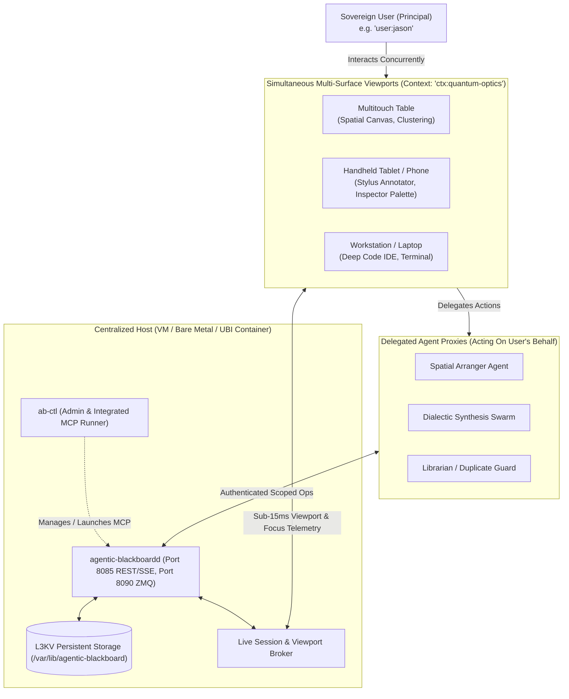
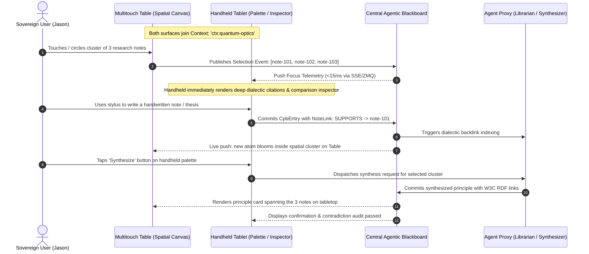

# Design Spec: Centralized RPM Packaging & Multi-Surface Ambient Substrate

**Date**: 2026-09-16  
**Status**: APPROVED  
**Product**: `agentic-blackboard` (CLI: `ab-ctl`, Daemon: `agentic-blackboardd`)  
**Author**: Jason Coposky & Antigravity Pair  

---

## 1. Executive Summary & Vision

The **Agentic Blackboard** (`agentic-blackboard`) is a high-performance, distributed knowledge substrate designed to maintain persistent cognitive and spatial state for human users across a constellation of computing surfaces, proxied by fleets of autonomous AI agents. 

While the blackboard interacts with distributed orchestration systems, its product identity is distinct and self-contained: it is branded as the standalone **Agentic Blackboard**.

### Core Tenets of Productization
1. **Canonical Enterprise Packaging**: Packaged as a standard RPM (`agentic-blackboard-*.rpm`) for RHEL 9, Rocky Linux 9, and AlmaLinux 9, accompanied by an enterprise-grade systemd service (`agentic-blackboard.service`) and the unified management CLI (`ab-ctl`).
2. **RPM-First Container Strategy**: The container image (`agentic-blackboard:latest`) is derived directly from Red Hat Universal Base Image 9 Minimal (`ubi9-minimal`), installing the canonical RPM as its primary build artifact.
3. **Ambient Multi-Surface Substrate**: The blackboard maintains state across any number of interactive surfaces (phones, tablets, laptops, multitouch tables, ambient wall displays) without imposing rigid modality restrictions.
4. **Simultaneous Multi-Surface Co-Presence**: Native support for a user actively working across multiple devices *at the same time within the same shared context* (e.g. tabletop spatial canvas + handheld stylus/inspector palette + laptop terminal).
5. **Delegated Agent Proxies**: Agents act as accredited proxies on behalf of sovereign human users across surfaces, inheriting scoped permissions without siloed credentials or fragmented data ownership.



---

## 2. The User-Centric Multi-Surface & Multi-Agent Model

### 2.1 The Core Triad
Traditional systems model users, agents, and machines as separate flat accounts. The Agentic Blackboard models them as a hierarchical triad:
*   **User Principal (`user_id`)**: The sovereign human who owns the research, notes, projects, and permissions.
*   **Universal Interactive Viewports (`surface_id`)**: Generalized computing canvases described by physical/interaction capabilities, not hardcoded roles.
*   **Agent Proxies (`agent_id`)**: Autonomous AI agents acting within delegated capability grants signed by the user.

### 2.2 Simultaneous Multi-Surface Co-Presence
A fundamental user journey is concurrent multi-surface interaction within a single shared workspace context (`context_id`):



### 2.3 Dual-Tier State Synchronization
To maintain sub-15ms perceptual synchrony across surfaces:
1. **Persistent Knowledge Graph Tier**:
   - Commonplace atoms (`CpbEntry`), dialectic relationships (`NoteLink`), bibliographic citations (`Reference`), procedural catalog items, and spatial anchors.
   - Transactionally persisted to disk via L3KV.
2. **Ephemeral Context & Viewport Telemetry Tier**:
   - Active focus, selection bounds, transient pen strokes, and viewport coordinates.
   - Broadcast in real time via low-latency ZeroMQ Pub/Sub and HTTP Server-Sent Events (SSE).

---

## 3. Schema & Provenance Evolution

The `CpbEntry::Header::Origin` structure in [`include/agentic_blackboard/schema.hpp`](file:///home/darkfell/dev/agentic_blackboard/include/agentic_blackboard/schema.hpp) is updated to capture full interaction provenance without assuming input modality:

```cpp
struct Origin {
    std::string user_id;         // Sovereign User Principal (e.g. "user:jason")
    std::string agent_id;        // Acting Proxy Agent (e.g. "agent:librarian-01", "agent:direct-touch")
    std::string surface_id;      // Originating Device (e.g. "surface:multitouch-table-01", "surface:pixel-fold")
    std::string surface_type;    // Capability profile (e.g. "tabletop", "handheld", "workstation")
    std::string project_id;      // Project Anchor (e.g. "proj:quantum-optics")
    std::string context_id;      // Active Workspace Context (e.g. "ctx:lab-session-42")
    std::string session_id;      // Ephemeral surface session
};
```

### Context & Surface Capability Schema
Surfaces register with the blackboard by declaring objective physical capabilities:

```json
{
  "context_id": "ctx:quantum-optics",
  "surface_id": "surface:pixel-fold-01",
  "client_app": "blackboard-canvas-touch",
  "capabilities": {
    "touch_points": 10,
    "has_stylus": true,
    "has_pointer": true,
    "has_audio_input": true,
    "viewport_pixels": [2208, 1840],
    "dpi": 378
  }
}
```

---

## 4. Identity, Authentication & Delegated Capability Grants

### 4.1 Configurable Authentication Modes (`blackboard.conf`)
The server supports two runtime modes:
*   **`token` (Default, Production)**: All requests must provide `Authorization: Bearer <token>` or `X-AB-Key: <token>`. Unauthenticated requests are rejected with HTTP 401.
*   **`trusted_network` (Opt-in, Isolated Subnets)**: Allows fallback to `X-Active-User: <username>` for private cluster swarms or backwards compatibility.

### 4.2 Token Taxonomy & Cryptographic Security
Tokens use high-entropy random keys prefixed by actor type:
*   `ab_adm_<hex>`: Bootstrap Cluster Administrator.
*   `ab_usr_<hex>`: Human User Session Token.
*   `ab_srf_<hex>`: Paired Surface Device Token.
*   `ab_agt_<hex>`: Delegated Agent Proxy Token.

Tokens are stored exclusively as salted SHA-256 hashes within `/var/lib/agentic-blackboard/credentials.db`.

### 4.3 Delegated Agent Proxy Tokens
Surfaces mint or request Agent Proxy Tokens scoped to a user and project:
```json
{
  "principal": "user:jason",
  "proxy_agent": "agent:touch-table-copilot",
  "surface_id": "surface:multitouch-table-01",
  "allowed_projects": ["proj:quantum-optics"],
  "capabilities": ["read", "write", "link", "spatialize"],
  "expires_at": 1789680000
}
```

---

## 5. Centralized Packaging & Filesystem Layout

### 5.1 RPM Package Structure (`agentic-blackboard-*.rpm`)
Standard FHS paths for RHEL 9 / Rocky Linux 9 / AlmaLinux 9:

| Filesystem Path | Ownership | Permissions | Description |
| :--- | :--- | :--- | :--- |
| `/usr/bin/agentic-blackboardd` | `root:root` | `0755` | Core C++20 blackboard daemon |
| `/usr/bin/ab-ctl` | `root:root` | `0755` | Administrative & MCP launcher CLI |
| `/usr/lib/systemd/system/agentic-blackboard.service` | `root:root` | `0644` | Systemd unit file |
| `/etc/agentic-blackboard/blackboard.conf` | `root:blackboard` | `0640` | Main server configuration file |
| `/etc/agentic-blackboard/blackboard.conf.default` | `root:root` | `0644` | Stock configuration reference |
| `/usr/share/agentic-blackboard/skills/` | `root:root` | `0755` | Bundled agent skills (`knowledge-capture`, etc.) |
| `/usr/share/agentic-blackboard/schema/` | `root:root` | `0755` | Static schema definitions |
| `/var/lib/agentic-blackboard/` | `blackboard:blackboard` | `0750` | L3KV persistent graph storage & credentials |
| `/var/log/agentic-blackboard/` | `blackboard:blackboard` | `0750` | Dedicated log directory |
| `/etc/security/limits.d/99-blackboard.conf` | `root:root` | `0644` | System resource limits (`nofile 65536`) |

### 5.2 RPM Lifecycle Scriptlets
*   **`%pre`**:
    ```bash
    getent group blackboard >/dev/null || groupadd -r blackboard
    getent passwd blackboard >/dev/null || \
        useradd -r -g blackboard -d /var/lib/agentic-blackboard -s /sbin/nologin \
        -c "Agentic Blackboard Daemon" blackboard
    exit 0
    ```
*   **`%post`**:
    ```bash
    %systemd_post agentic-blackboard.service
    if [ ! -f /var/lib/agentic-blackboard/initialized ]; then
        /usr/bin/ab-ctl init --bootstrap --data-dir=/var/lib/agentic-blackboard > /etc/agentic-blackboard/admin.token 2>&1
        chmod 0600 /etc/agentic-blackboard/admin.token
        touch /var/lib/agentic-blackboard/initialized
        chown -R blackboard:blackboard /var/lib/agentic-blackboard
    fi
    ```
*   **`%preun`**: `%systemd_preun agentic-blackboard.service`
*   **`%postun`**: `%systemd_postun_with_restart agentic-blackboard.service`

### 5.3 Systemd Service Definition
```ini
[Unit]
Description=Agentic Blackboard Substrate Daemon
After=network.target network-online.target
Wants=network-online.target

[Service]
Type=simple
User=blackboard
Group=blackboard
ExecStart=/usr/bin/agentic-blackboardd --config=/etc/agentic-blackboard/blackboard.conf
Restart=always
RestartSec=5s
LimitNOFILE=65536
ProtectSystem=full
ProtectHome=true
ReadWritePaths=/var/lib/agentic-blackboard /var/log/agentic-blackboard

[Install]
WantedBy=multi-user.target
```

### 5.4 Container Strategy (UBI 9 Minimal Base)
The container image is built directly from the generated RPM:
```dockerfile
FROM registry.access.redhat.com/ubi9/ubi-minimal:latest

COPY build/agentic-blackboard-*.rpm /tmp/
RUN microdnf install -y shadow-utils zeromq openssl && \
    rpm -ivh /tmp/agentic-blackboard-*.rpm && \
    rm -f /tmp/agentic-blackboard-*.rpm && \
    microdnf clean all

USER blackboard
EXPOSE 8085 8090
VOLUME ["/var/lib/agentic-blackboard", "/etc/agentic-blackboard"]
ENTRYPOINT ["/usr/bin/agentic-blackboardd", "--config=/etc/agentic-blackboard/blackboard.conf"]
```

---

## 6. The `ab-ctl` Administrative & MCP Tool Suite

The CLI provides commands for operators, surfaces, and agent connectivity:

### Server & Service Administration
```bash
ab-ctl status                           # Query daemon health and storage stats
ab-ctl init --data-dir=<path>           # Bootstrap new database and admin token
ab-ctl config validate                  # Validate /etc configuration file syntax
```

### User, Surface & Context Management
```bash
# Provision Human Users
ab-ctl user create jason --role admin

# Register Surfaces
ab-ctl surface register --name "lab-table-01" --type tabletop --context "ctx:quantum-optics"

# Context Inspection
ab-ctl context list
ab-ctl context inspect ctx:quantum-optics
```

### Agent Provisioning & Integrated MCP Runner
```bash
# Create Agent Proxy Token
ab-ctl agent create doc-librarian --user jason --project proj-quantum-optics

# Launch Integrated MCP Bridge (Zero-setup for Claude, Cursor, Antigravity)
ab-ctl mcp run --connect http://localhost:8085 --token <agent_token>
```

---

## 7. Verification & Quality Gates

| Verification Gate | Command / Tool | Success Criteria |
| :--- | :--- | :--- |
| **RPM Build & Lint** | `rpmbuild -ba` / `rpmlint` | Zero errors; package builds cleanly under RHEL 9 / Rocky 9. |
| **Systemd Lifecycle** | `systemctl start/stop/status agentic-blackboard` | Starts cleanly under `blackboard:blackboard`, respects limits. |
| **Token Auth Gate** | `curl -H "Authorization: Bearer ..."` | 200 OK on valid token; 401 Unauthorized on missing/invalid token. |
| **Multi-Surface Sync** | Automated dual-client SSE test (`scratch/test_multi_surface_sync.py`) | Focus event on client 1 delivers to client 2 in <15ms. |
| **Container Smoke Test** | `docker run --rm -p 8085:8085 agentic-blackboard:latest` | Container starts, `/api/v1/health` returns 200 OK. |
| **Integrated MCP Bridge** | `ab-ctl mcp run` | FastMCP / MCP JSON-RPC protocol passes all 14 tool/resource checks. |
