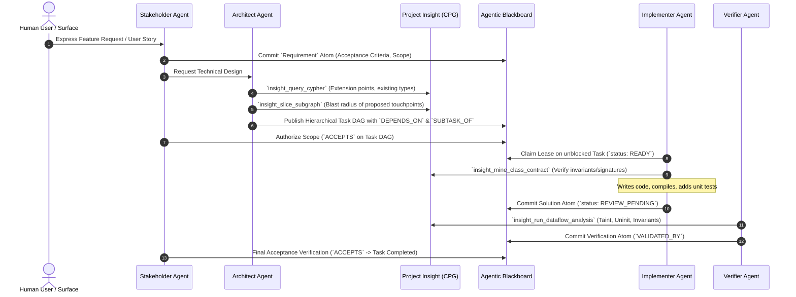
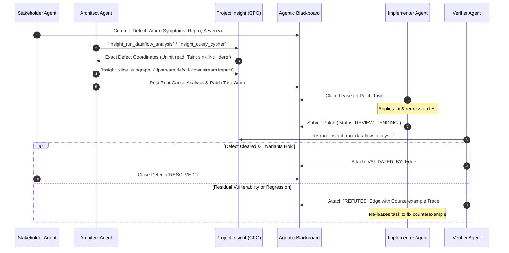
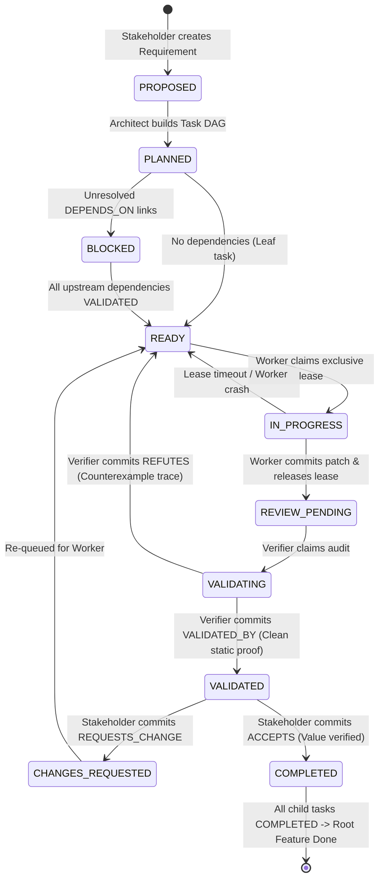

# Design Specification: Code Property Graph (CPG) Swarm Coordination

**Date:** 2026-09-17  
**Status:** Validated / Ready for Planning  
**Target Repository:** `/home/darkfell/dev/agentic_blackboard`  
**Related Repository:** `/home/darkfell/dev/project_insight`  
**Standard Mappings:** SWEBOK v3 (IEEE Computer Society), PMBOK 7th Edition (Project Management Institute)  

---

## 1. Executive Summary

Autonomous AI agent swarms tackling complex codebases require two foundational pillars:
1. **Deep Code Understanding & Semantic Invariant Discovery**: Provided by **Project Insight** via its language-agnostic Canonical Dual Graph (CFG + DFG in L3KVG), LLVM 18 lowering, ModRef state clustering, IFDS/IDE interprocedural static analysis, and $k$-hop blast radius slicing.
2. **Shared Substrate for Coordination, Task Orchestration & Dialectic Review**: Provided by the **Agentic Blackboard** via thread-safe transactional knowledge atoms in L3KV, dual-identity provenance (`user:<id>` and `agent:<id>`), exclusive task leases, topological DAG execution, and real-time multi-surface Server-Sent Event (SSE) synchronization.

This specification establishes the **Generalized CPG Swarm Coordination Protocol and Skill** (`cpg-swarm-coordination`). It enables a collective of specialized agents to collaborate safely on **new feature development**, **bug fixing**, and **refactoring** across codebases indexed by Project Insight, without polluting Project Insight with coordination logic or bloating the blackboard with compiler-specific code parsing.

---

## 2. Architectural Separation of Concerns

The architecture strictly adheres to the Single Responsibility Principle:

```mermaid
flowchart TD
    subgraph PI ["Project Insight (Discovery & Static Analysis)"]
        CPG["Canonical Dual Graph<br/>(Dual CFG/DFG in L3KVG)"]
        SLICER["k-Hop Blast Radius Slicing"]
        STATIC["IFDS/IDE Static Verification"]
        MCP_PI["Native MCP Server<br/>(insight serve-mcp)"]
        CPG & SLICER & STATIC --> MCP_PI
    end

    subgraph AB ["Agentic Blackboard (Swarm Coordination Substrate)"]
        DAEMON["agentic-blackboardd (:8085)"]
        TASK_DAG["Topological Task DAG & Leases"]
        SSE["ContextBroker (Multi-Surface SSE)"]
        MCP_AB["AB MCP Server (ab-ctl mcp)"]
        DAEMON & TASK_DAG & SSE --> MCP_AB
    end

    subgraph Swarm ["Autonomous AI Agent Swarm (SWEBOK / PMBOK Roles)"]
        STAKE["1. Stakeholder Agent<br/>(Requirements, Value, Acceptance)"]
        ARCH["2. Architect Agent<br/>(Discovery, Topology, Task DAG)"]
        WORKER["3. Implementer Agent<br/>(Leasing, Slicing, Construction)"]
        VERIF["4. Verifier Agent<br/>(Static Analysis, Dialectic Proofs)"]
    end

    STAKE <-->|1. Intent & Acceptance| MCP_AB
    ARCH <-->|2. CPG Topology & Impact| MCP_PI
    ARCH <-->|3. Task DAG Formulation| MCP_AB
    WORKER <-->|4. Claim Lease & Submit| MCP_AB
    WORKER <-->|5. Localized Slices & Contracts| MCP_PI
    VERIF <-->|6. Static & SMT Checks| MCP_PI
    VERIF <-->|7. Dialectic Proofs (VALIDATED_BY/REFUTES)| MCP_AB
```

- **Project Insight** remains a pure code indexing, static analysis, and query engine. It does not communicate with the blackboard daemon, maintain agent leases, or manage task lifecycles.
- **Agentic Blackboard** remains the coordination and knowledge substrate. It manages tasks, leases, provenance, and multi-surface context synchronization.
- **The Swarm** bridges the two: Agents query Project Insight via standard MCP tools (`insight_query_cypher`, `insight_slice_subgraph`, `insight_mine_class_contract`, `insight_run_dataflow_analysis`) and coordinate through Agentic Blackboard tools (`create_atom`, `claim_lease`, `create_edge`, `context_focus`).

---

## 3. Swarm Topology: SWEBOK & PMBOK Alignment

Software engineering initiatives fail most often through scope misalignment, broken assumptions, or lack of independent verification. The swarm establishes 4 distinct roles mapped to formal engineering bodies of knowledge:

| Swarm Role | Primary Standard Alignment | Core Responsibilities |
|---|---|---|
| **Stakeholder Agent** (`cpg-stakeholder`) | **SWEBOK**: Software Requirements (KA 1) & Software Quality / Validation (KA 9)<br/>**PMBOK**: Stakeholder & Delivery Domains | Formulates `Requirement` atoms with testable Acceptance Criteria (AC). Acts as the digital proxy for the human user/sponsor. Validates deliverables against business intent via `ACCEPTS` or `REQUESTS_CHANGE`. |
| **Architect Agent** (`cpg-architect`) | **SWEBOK**: Software Design (KA 2)<br/>**PMBOK**: Planning & Development Approach | Explores CPG topology via openCypher. Assesses blast radius ($k$-hop impact). Decomposes requirements into a hierarchical Task DAG with strict `DEPENDS_ON` and `SUBTASK_OF` edges. |
| **Implementer Agent** (`cpg-worker`) | **SWEBOK**: Software Construction (KA 3) & Configuration Management (KA 6)<br/>**PMBOK**: Team & Project Work | Claims exclusive leases on `READY` tasks under `agent:<id>` identity. Queries localized slices and interface contracts from Project Insight. Writes code, runs unit tests, and submits patches for review. |
| **Verifier Agent** (`cpg-verifier`) | **SWEBOK**: Software Testing (KA 4) & Software Quality / Verification (KA 9)<br/>**PMBOK**: Measurement & Uncertainty | Audits submitted work using Project Insight's IFDS/IDE static analyzers (taint analysis, uninitialized variables, typestate protocols, SMT path feasibility). Commits objective `VALIDATED_BY` proof or `REFUTES` counterexample trace. |

---

## 4. Workflows by Software Engineering Task

### 4.1 Feature Development Workflow



1. **Elicitation & Scoping**: Stakeholder Agent captures intent, non-functional constraints, and acceptance criteria.
2. **CPG Extension Discovery**: Architect queries the CPG for existing call hierarchies, interfaces, and shared state clusters.
3. **Blast Radius Analysis**: Architect extracts $k$-hop neighborhoods around touched symbols to guarantee isolation.
4. **Implementation**: Worker claims an exclusive lease and implements the change adhering to mined contracts.
5. **Dialectic Verification**: Verifier confirms no introduced static defects or path-feasibility violations.
6. **Validation Acceptance**: Stakeholder certifies acceptance criteria satisfaction and completes the task.

### 4.2 Bug Fixing & Root Cause Analysis Workflow



1. **Defect Ingestion**: Stakeholder Agent creates a `Defect` atom describing symptoms and expected behavior.
2. **Static Fault Localization**: Architect runs `insight_run_dataflow_analysis` to pinpoint uninitialized reads, taint sinks, or typestate protocol violations down to exact file, line, and AST node.
3. **Impact Slicing**: Upstream/downstream slicing isolates the repair boundary.
4. **Repair & Refutation Gate**: Verifier verifies the patch. If a residual path remains vulnerable, Verifier attaches a `REFUTES` edge with an execution trace showing the exact failure path.

### 4.3 Refactoring & Modernization Workflow

1. **State-Affiliation Clustering**: Architect queries ModRef matrices (`insight cluster`) and hub nodes (`insight stats`) to find tangled globals and tightly coupled procedures.
2. **IMU Formulation**: Codebase is partitioned into Isolated Migration Units (IMUs). Leaf data structures and types are scheduled first, working outward toward orchestrators.
3. **Ownership Modernization**: Worker infers pointer lifecycles (`insight_infer_ownership`) to substitute raw pointers with RAII types (`std::unique_ptr`, `std::shared_ptr`, `std::span`, `std::string_view`).
4. **Interface Preservation**: Verifier ensures public signatures and ABI compatibility remain intact.

---

## 5. Tool Matrix & Integration Protocol

### 5.1 Tool Allocation

| Role | Project Insight MCP Tools (`insight serve-mcp`) | Blackboard Tools (`ab-ctl mcp` / REST) |
|---|---|---|
| **Stakeholder** | Read-only metrics: `insight_query_cypher` | `create_atom`, `create_edge` (`ACCEPTS`, `REQUESTS_CHANGE`), `context_focus` |
| **Architect** | `insight_query_cypher`, `insight_slice_subgraph`, `insight_mine_class_contract` | `create_atom` (`task`), `create_edge` (`SUBTASK_OF`, `DEPENDS_ON`), `update_atom` |
| **Implementer** | `insight_slice_subgraph`, `insight_mine_class_contract`, `insight_infer_ownership` | `claim_lease`, `renew_lease`, `release_lease`, `create_atom` (`solution`), `update_atom` |
| **Verifier** | `insight_run_dataflow_analysis`, `insight_query_cypher` | `create_atom` (`verification_proof`, `counterexample_trace`), `create_edge` (`VALIDATED_BY`, `REFUTES`), `update_atom` |

### 5.2 Knowledge Atom Schemas

#### Task Atom (`type: task`)
```json
{
  "type": "task",
  "category": "engineering",
  "name": "Refactor BufferPool to Modern RAII",
  "description": "Encapsulate raw pointer buffer management in BufferPool using std::unique_ptr and std::span.",
  "metadata": {
    "workflow": "refactoring",
    "target_symbols": ["BufferPool_init", "BufferPool_alloc", "BufferPool_free"],
    "blast_radius_k": 2,
    "impacted_files": ["src/buffer.c", "include/buffer.h"],
    "status": "READY",
    "lease": {
      "holder": null,
      "lease_expires_at": 0,
      "timeout_sec": 600
    }
  },
  "origin": {
    "agent_id": "cpg-architect-01",
    "user_id": "jason",
    "context_id": "ctx-project-core",
    "surface_id": "cli"
  }
}
```

#### Verification Proof Atom (`type: verification_proof`)
```json
{
  "type": "verification_proof",
  "category": "assurance",
  "name": "Static Analysis Clean Proof: BufferPool",
  "description": "Zero taint leaks, zero uninitialized reads, typestate protocols mathematically verified.",
  "metadata": {
    "verifier_agent": "cpg-verifier-01",
    "tool_invoked": "insight_run_dataflow_analysis",
    "results": {
      "taint_violations": 0,
      "uninitialized_reads": 0,
      "smt_paths_analyzed": 14,
      "smt_infeasible_pruned": 3
    },
    "verdict": "PASS"
  }
}
```

#### Counterexample Refutation Atom (`type: counterexample_trace`)
```json
{
  "type": "counterexample_trace",
  "category": "assurance",
  "name": "Refutation: Memory Leak on Early ScopeExit in BufferPool_alloc",
  "description": "Path execution leads to unreleased allocation on error branch (line 142).",
  "metadata": {
    "verifier_agent": "cpg-verifier-01",
    "failure_type": "typestate_leak",
    "trace": [
      {"file": "src/buffer.cpp", "line": 120, "event": "alloc", "symbol": "raw_buf"},
      {"file": "src/buffer.cpp", "line": 135, "event": "branch_taken", "condition": "size > MAX_BUF"},
      {"file": "src/buffer.cpp", "line": 142, "event": "return_early", "leak": "raw_buf"}
    ],
    "suggested_fix": "Wrap raw_buf in std::unique_ptr or scope_exit prior to branch validation."
  }
}
```

---

## 6. Dialectic Task State Machine & Lease Protocol



### Lease Mechanics
- **Exclusive Lock**: Only one worker agent can hold an active lease on a task at any given time.
- **Heartbeat & Renewal**: Default lease duration is 600 seconds. Workers issue heartbeats every 180 seconds. If a worker process hangs or crashes, the lease expires and the task automatically returns to `READY` for another agent.
- **Topological Barrier**: Tasks with unfinished `DEPENDS_ON` predecessors cannot be leased.

---

## 7. Multi-Surface Ambient Observability

1. **ContextBroker & Real-Time SSE Streams**:
   - Swarm agents subscribe to `GET /api/v1/events?context=:id`. Mutations (`lease_claimed`, `atom_committed`, `context_focus`) trigger reactive agent wakeups without busy polling.
2. **Dashboard & Mobile Telemetry**:
   - `ab-dashboard` visualizes the live CPG task graph, lease holders, and dialectic links (`VALIDATED_BY` in green, `REFUTES` in red).
3. **Human-in-the-Loop Supervision**:
   - The human lead can view the active task focus, inspect counterexample traces, and sign off as the Stakeholder Agent directly via browser or CLI.

---

## 8. Antigravity Skill Specification

The skill will be implemented at:  
`~/.gemini/config/plugins/superpowers/skills/cpg-swarm-coordination/SKILL.md`

### Skill Structure:
- **YAML Frontmatter**: Name `cpg-swarm-coordination`, triggers, description.
- **Role System Prompts**: Specialized subagent prompts for Stakeholder, Architect, Worker, and Verifier.
- **Protocol Playbooks**: Step-by-step instructions for each workflow (Feature, Bugfix, Refactor).
- **Reference Catalog**:
  - `references/opencypher_recipes.md`: Standard queries for callers, callee trees, global state affiliations, and memory SSA def-use chains.
  - `references/blackboard_schemas.md`: Exact JSON payloads for atom creation, edge linking, and SSE event handling.
