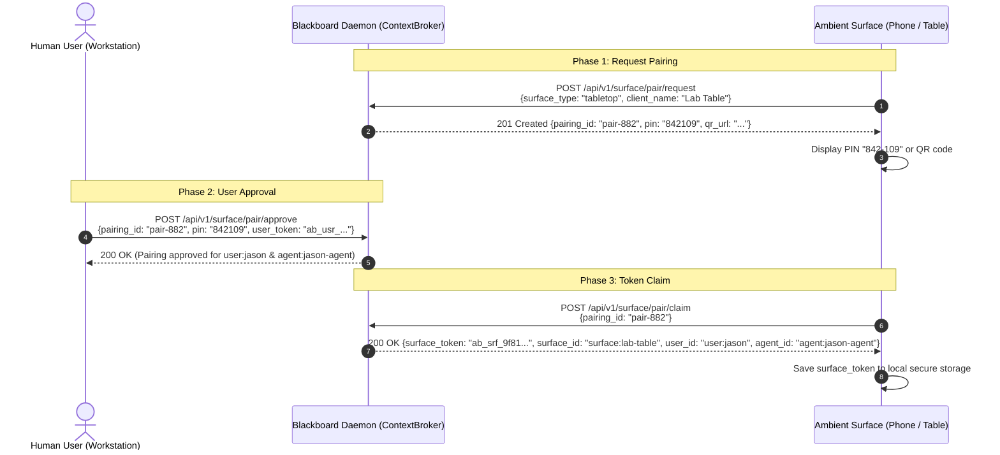

# Architecture Specification: Single User-Space Agent Identity & Multi-Surface Key Access

**Status:** Proposed  
**Date:** 2026-09-18  
**Author:** Agentic Blackboard Architecture Team  
**Scope:** Identity Architecture, Substrate Graph Hygiene, Multi-Surface Key Distribution & Pairing Protocol

---

## 1. Executive Summary & Problem Statement

### 1.1 The Graph Pollution Challenge
In multi-agent and swarm architectures, it is common to instantiate ephemeral agent identities for each task, workflow, or session (e.g., `agent:cpg-architect-01`, `agent:worker-9b12`, `agent:verifier-f44a`). When committed to a lifelong, persistent knowledge substrate like the Agentic Blackboard, this model causes severe graph pollution over months and years:
- Thousands of disposable identity nodes accumulate in the graph.
- Long-term memory, trust scores, and dialectic reputations are fragmented across dead identifiers.
- Graph traversals and analogy scans (`Librarian`) waste compute auditing abandoned identity nodes.

### 1.2 The Solution: 1:1 Persistent Principal with Ephemeral Roles
In user space, each human user has exactly **one persistent agent identity proxy** (e.g., `user:jason` $\rightarrow$ `agent:jason-agent`). 
- **Identity is durable:** `user_id` and `agent_id` remain stable over the entire lifespan of the user's workspace.
- **Cognitive hats are ephemeral:** Specific roles such as `architect`, `implementer`, `verifier`, and `curator` are dynamic execution capabilities associated with tasks, reviews, and atoms—not separate graph identity nodes.
- **Surfaces are ambient devices:** Interactions occur on diverse physical and virtual surfaces (e.g., workstation CLI/IDE, multitouch interactive table, mobile phone browser/PWA, tablet stylus canvas). Each surface is identified by a distinct `surface_id` and `surface_type`, but attributes authorship to the same underlying user and agent principals.

### 1.3 Goals & Non-Goals
- **Goals:**
  - Enforce a 1:1 relationship between human users and their persistent agent identities in the substrate graph.
  - Provide zero-ceremony local credential discovery on user workstations via standard XDG paths (`~/.config/agentic-blackboard/identity.json`).
  - Provide a secure, zero-trust pairing handshake (ephemeral PIN / QR code) for ambient multi-device surfaces (touch tables, mobile browsers, tablets).
  - Enable instant surface revocation (`ab-ctl surface revoke`) with zero blast radius to the persistent agent identity or historical atoms.
  - Maintain full provenance traceability in `CpbEntry::Header::Origin` across all participating surfaces.
- **Non-Goals:**
  - Replacing OAuth2/OIDC for external cloud identity providers (Agentic Blackboard remains a self-sovereign ambient substrate).
  - Storing biometric keys or device hardware TPM roots in the blackboard graph.

---

## 2. Identity Architecture & Substrate Schema

### 2.1 The Decoupled Identity Triplet
The architecture decouples **Who Authorizes** (`user_id`), **Who Operates** (`agent_id`), **Where It Occurs** (`surface_id`), and **What Hat Is Worn** (`role`):

```
+------------------------------------------------------------------------------------+
|                                Substrate Graph                                     |
|                                                                                    |
|   [Node: IDENTITY:user:jason]                                                      |
|                 |                                                                  |
|                 | (DELEGATES_TO)                                                   |
|                 v                                                                  |
|   [Node: IDENTITY:agent:jason-agent]                                               |
|                                                                                    |
|         ^                               ^                               ^          |
|         | (CREATED_BY)                  | (CREATED_BY)                  |          |
|     [Atom: Req-101]                 [Atom: Sol-102]                [Atom: Proof-103]|
|      origin:                         origin:                        origin:        |
|       user: user:jason                user: user:jason               user: ...     |
|       agent: agent:jason-agent        agent: agent:jason-agent       agent: ...    |
|       surface: surface:phone-safari   surface: surface:tabletop-01   surface: ...  |
|       role: "curator"                 role: "architect"              role: ...     |
+------------------------------------------------------------------------------------+
```

### 2.2 Substrate Graph Nodes & Invariants
1. **User Identity Node:**
   - ID: `user:<username>` (e.g., `user:jason`)
   - Type: `IDENTITY`
   - Metadata: `{"role": "user", "display_name": "Jason", "status": "ACTIVE"}`
2. **Agent Identity Node:**
   - ID: `agent:<username>-agent` (e.g., `agent:jason-agent`)
   - Type: `IDENTITY`
   - Metadata: `{"role": "agent", "user": "user:jason", "status": "ACTIVE"}`
3. **Delegation Edge:**
   - Source: `user:<username>`
   - Target: `agent:<username>-agent`
   - Label: `DELEGATES_TO`
   - Metadata: `{"granted_at": <epoch_timestamp>, "status": "PERMANENT"}`

### 2.3 Universal Atom Provenance (`CpbEntry::Header::Origin`)
Every knowledge atom written to the blackboard preserves the full origin context in its binary serialization:
```cpp
struct Origin {
    std::string user_id;      // e.g. "user:jason"
    std::string agent_id;     // e.g. "agent:jason-agent"
    std::string surface_id;   // e.g. "surface:multitouch-table-01"
    std::string surface_type; // e.g. "tabletop", "mobile_browser", "workstation"
    std::string project_id;   // e.g. "proj-quantum-optics"
    std::string context_id;   // e.g. "ctx-architecture"
    std::string session_id;   // e.g. "sess-live-20260918"
};
```
When an atom is created via a swarm role (such as an Architect or Verifier), the role is captured in the atom's taxonomy or metadata (`metadata.role = "verifier"`), preserving dialectic traceability without mutating the agent principal.

---

## 3. Multi-Surface Key Access Across Form Factors

Surfaces span a wide variety of form factors, trust boundaries, and operating environments:

| Surface | Device & Platform | Storage Location | Enrollment Mechanism |
| :--- | :--- | :--- | :--- |
| **Workstation** | Local host (CLI, IDE, background daemon) | `~/.config/agentic-blackboard/identity.json` (mode `0600`) | Bootstrap / Direct initialization |
| **Multitouch Table** | Dedicated room appliance (Linux / macOS / Electron) | Sandboxed OS Keystore or `/etc/agentic-blackboard/surface.json` | 6-Digit PIN pairing via workstation approval |
| **Phone Browser / PWA** | Mobile browser (iOS Safari, Android Chrome) | `IndexedDB` / Web Crypto API | Ephemeral QR code scan |
| **Tablet Canvas** | Stylus tablet (iPadOS / Android) | Sandboxed secure keychain | QR code scan or 6-digit PIN pairing |
| **Ambient Display** | Wall-mounted status display | Read-only surface token in environment | Pre-shared display token |

---

## 4. Surface Enrollment & Key Distribution Protocol

To ensure security while maintaining zero friction, remote/ambient surfaces never store the user's master admin token. Instead, they receive a **Scoped Surface Credential** (`ab_srf_<hash>`).



### 4.1 Surface Token Properties (`ab_srf_...`)
- **Prefix:** `ab_srf_` followed by 32 cryptographically random hex characters.
- **Bound Principals:** Explicitly maps to `user_id` and `agent_id` in the daemon's internal credentials registry.
- **Surface Metadata:** Contains `surface_id`, `surface_type`, `client_app`, `ip_address`, and `last_active`.
- **Permissions:** Can read graph nodes, subscribe to context focus streams, and commit atoms within assigned contexts. Cannot manage administrative users or alter system configurations.

### 4.2 Lifecycle & Revocation
When a surface is lost, reassigned, or retired:
```bash
ab-ctl surface revoke surface:lab-table
```
1. The daemon invalidates `surface:lab-table`'s surface token immediately.
2. Any pending requests with that token return `HTTP 401 Unauthorized`.
3. All historical atoms created from that surface retain their immutable provenance (`surface_id: "surface:lab-table"`).
4. The user's persistent identity (`user:jason`) and agent identity (`agent:jason-agent`) remain completely unaffected.

---

## 5. Local Workstation Keystore (`identity.json`)

For local development and CLI operations, `ab-ctl` and the Antigravity IDE auto-discover credentials following the XDG base directory specification.

### 5.1 File Location
```
${XDG_CONFIG_HOME:-~/.config}/agentic-blackboard/identity.json
```
Fallback paths:
1. `~/.config/agentic-blackboard/identity.json`
2. `/etc/agentic-blackboard/identity.json`
3. Environment variables: `AB_USER_TOKEN`, `AB_AGENT_TOKEN`, `AB_USER_ID`, `AB_AGENT_ID`

### 5.2 Schema of `identity.json`
```json
{
  "version": "1.0",
  "connect": "http://localhost:8085",
  "user": {
    "id": "user:jason",
    "name": "jason",
    "token": "ab_usr_a1b2c3d4e5f6...",
    "role": "curator"
  },
  "agent": {
    "id": "agent:jason-agent",
    "name": "jason-agent",
    "token": "ab_agt_f6e5d4c3b2a1...",
    "role": "agent"
  },
  "default_surface": {
    "id": "surface:workstation",
    "type": "workstation"
  }
}
```

### 5.3 Auto-Discovery Logic in `ab-ctl`
When executing any command (such as `ab-ctl swarm task create` or `ab-ctl status`):
1. If `--token` or `--token-file` is explicitly supplied, use it.
2. Else if `AB_USER_TOKEN` or `AB_AGENT_TOKEN` exists in the environment, use it.
3. Else look for `~/.config/agentic-blackboard/identity.json`:
   - If present and valid, automatically populate authentication headers and dual-identity fields (`X-Active-User`, `X-Active-Agent`).
4. Fall back to daemon defaults if running in unauthenticated mode.

---

## 6. Daemon REST API Specification

### 6.1 Surface Pairing Endpoints

#### `POST /api/v1/surface/pair/request`
Initiates a pairing session for an unauthenticated ambient device.
- **Request Body:**
  ```json
  {
    "surface_type": "tabletop",
    "client_app": "MultiTouchCanvas v2.1",
    "suggested_id": "living-lab-table"
  }
  ```
- **Response (201 Created):**
  ```json
  {
    "pairing_id": "pair-8a39f1c0",
    "pin": "592104",
    "expires_at": 1726678200,
    "qr_url": "/api/v1/surface/pair/qr/pair-8a39f1c0"
  }
  ```

#### `POST /api/v1/surface/pair/approve`
Called by an authenticated user from their workstation or mobile app to approve a pending pairing session.
- **Headers:** `Authorization: Bearer ab_usr_...` or `ab_adm_...`
- **Request Body:**
  ```json
  {
    "pairing_id": "pair-8a39f1c0",
    "pin": "592104",
    "context_id": "ctx-architecture",
    "surface_id": "surface:living-lab-table"
  }
  ```
- **Response (200 OK):**
  ```json
  {
    "status": "APPROVED",
    "pairing_id": "pair-8a39f1c0",
    "surface_id": "surface:living-lab-table"
  }
  ```

#### `POST /api/v1/surface/pair/claim`
Called by the ambient surface to retrieve its provisioned surface token once approved.
- **Request Body:**
  ```json
  {
    "pairing_id": "pair-8a39f1c0"
  }
  ```
- **Response (200 OK):**
  ```json
  {
    "surface_token": "ab_srf_7c3a01b2e4f58912d0943817ab56fe01",
    "surface_id": "surface:living-lab-table",
    "surface_type": "tabletop",
    "user_id": "user:jason",
    "agent_id": "agent:jason-agent",
    "context_id": "ctx-architecture"
  }
  ```

#### `GET /api/v1/surface/list`
Lists all enrolled surfaces for the authenticated user.
- **Headers:** `Authorization: Bearer ab_usr_...`

#### `DELETE /api/v1/surface/:surface_id`
Revokes an enrolled surface token.
- **Headers:** `Authorization: Bearer ab_usr_...`

---

## 7. CLI Command Surface (`ab-ctl`)

### 7.1 Initialization & Identity Generation
```bash
# Initialize local user-space identity file
ab-ctl init --user jason --generate-agent
# Output:
# [INIT] Created ~/.config/agentic-blackboard/identity.json
# [USER] user:jason (token: ab_usr_...)
# [AGENT] agent:jason-agent (token: ab_agt_...)
# [SUBSTRATE] Substrate identity graph provisioned with 1:1 DELEGATES_TO relation.
```

### 7.2 Surface Management
```bash
# 1. Start pairing session for a remote device (generates PIN and terminal ASCII QR)
ab-ctl surface pair --type tabletop --name lab-table

# 2. Approve a pending pairing request from a surface display
ab-ctl surface approve pair-8a39f1c0 --pin 592104

# 3. List active and enrolled ambient surfaces
ab-ctl surface list

# 4. Revoke a lost or decommissioned surface
ab-ctl surface revoke surface:living-lab-table
```

---

## 8. Threat Model & Security Invariants

| Risk | Mitigation |
| :--- | :--- |
| **Surface Theft (e.g. tablet stolen)** | The surface token is restricted to client/context operations. It cannot perform user administration. Running `ab-ctl surface revoke` immediately severs access without altering master keys. |
| **PIN Brute-Force** | Pairing PINs are 6-digit random values expiring in 300 seconds (5 minutes). Max 3 incorrect attempts per `pairing_id` before the session is permanently locked. |
| **Impersonation of Other Agents** | The daemon enforces that `ab_srf_...` tokens can only commit atoms whose `origin.user_id` and `origin.agent_id` match the principals bound at pairing time. |
| **Local Credential Snooping** | `~/.config/agentic-blackboard/identity.json` is created with POSIX permissions `0600` (read/write by owner only). |

---

## 9. Verification & Testing Strategy

1. **Unit Tests (`scratch/test_surface_pairing.py`):**
   - PIN generation, timeout expiration, and attempt throttling.
   - User-space identity file creation, permission check (`0600`), and auto-discovery in `load_config()`.
2. **Integration Tests (`scratch/test_multi_surface_e2e.py`):**
   - Simulate pairing handshake between a mock tablet and live daemon.
   - Verify surface token can commit atoms with correct `origin.surface_id` and `origin.surface_type`.
   - Verify revocation immediately returns HTTP 401 for subsequent requests.
3. **Graph Invariant Checks:**
   - Assert that running 50 tasks across 5 distinct surfaces results in exactly 2 `IDENTITY` nodes (`user:jason`, `agent:jason-agent`) and zero graph bloat.
