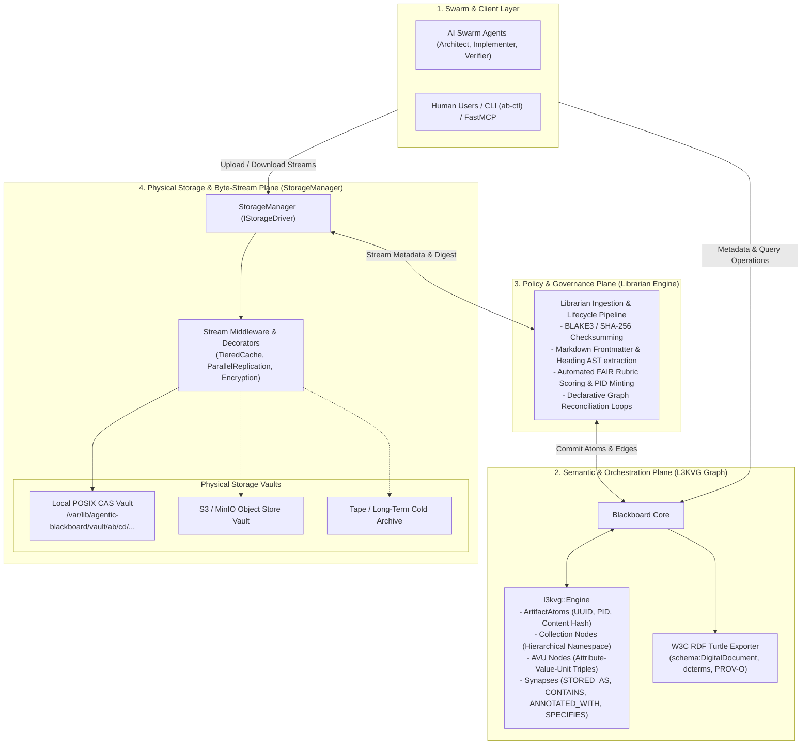
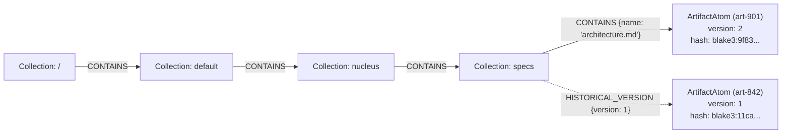

# Design Specification: FAIR Data Management & Content-Addressable Storage Subsystem

- **Date**: 2026-10-09
- **Status**: Draft / Proposed
- **Author**: Jason M. Coposky & Antigravity Swarm Architect
- **Target Repository**: `agentic_blackboard`
- **Underlying Engines**: `l3kvg` (Property Graph), `IStorageDriver` (CAS Vault)
- **Theoretical & Standard Grounding**:
  - **Wilkinson et al. (2016)**: *The FAIR Guiding Principles for scientific data management and stewardship*
  - **W3C Standards**: DCAT v3, PROV-O, Schema.org, RDF Turtle 1.1
  - **iRODS Architectural Heritage**: Virtualized Hierarchical Resources, Decoupled Metadata (AVUs), Rule-Driven Policy Enforcement Points (PEPs)
  - **IEEE SWEBOK v3**: KA 3 (Software Construction), KA 9 (Software Quality / V&V)

---

## 1. Executive Summary & Problem Statement

As autonomous agent swarms (Architect, Implementer, Verifier, Stakeholder) collaborate on complex systems within the **Agentic Blackboard** and **Project Nucleus** ecosystems, they generate, mutate, and consume large volumes of file-based artifacts:
- Architectural and technical design documents (`.md`, `.pdf`, `.svg`).
- Formal specifications, AST graphs, and interface contracts.
- Model weights, embeddings, test traces, and verification counterexamples.

Historically, systems either:
1. **Bloat the database**: Store binary blobs directly in graph or relational storage, degrading cache locality and transactional throughput.
2. **Lose provenance and governance**: Store files on unstructured network drives, creating orphan files, broken links, unversioned mutations, and zero FAIR (Findable, Accessible, Interoperable, Reusable) compliance.

Drawing inspiration from the virtualized data management principles of **iRODS**, this specification defines a high-performance **Data Management & Storage Subsystem** for the Agentic Blackboard. It strictly decouples the **Semantic Plane** (L3KVG graph catalog, provenance, AVU metadata) from the **Physical Plane** (immutable Content-Addressable Storage vaults), managed by an automated **Policy Engine** (Librarian ingestion hooks).

---

## 2. Architectural Separation of Concerns

The architecture establishes three strictly isolated planes:



### Invariant Rules of Separation:
1. **Zero Binary Blobs in L3KVG**:
   The `l3kvg::Engine` stores exclusively metadata atoms, property maps, cryptographic hashes, and graph edges. It maintains sub-5ns local traversals without memory fragmentation or WAL bloat.
2. **Byte Immutability via CAS**:
   Physical storage is strictly content-addressable by cryptographic digest (`blake3:<hex>`). A physical byte stream is never mutated in-place; modifications create new CAS objects.
3. **Logical Mutability via Graph Edges**:
   Logical namespace paths (e.g. `/project-nucleus/specs/system-arch.md`) are graph edges pointing to specific `ArtifactAtom` versions. Updating a file updates the graph pointer and preserves the full immutable history.

---

## 3. Storage Addressability & Logical Namespace Overlays

The storage engine employs a **Hybrid Content-Addressable Storage (CAS) with Logical Namespace Overlays** model.

### 3.1 Physical CAS Layout
Every physical payload is stored in a two-tier sharded directory structure based on its primary BLAKE3 cryptographic digest:
```
/var/lib/agentic-blackboard/vault/
├── 9f/
│   └── 83/
│       └── 9f83a1b42c67e89d... (Immutable Byte Stream)
```
- Deduplication: Identical files or unedited revisions across different projects share the exact same physical disk payload.
- Scrubbing: Bit-rot detection is performed by background workers streaming bytes through a streaming BLAKE3 hasher and comparing against the filename key.

### 3.2 Logical Collection Tree Overlays
Users and AI agents interact with familiar hierarchical paths:
```
/zones/default/projects/nucleus/specs/architecture.md
```
In L3KVG, this is represented as a tree of `CollectionNode` entities linked by `CONTAINS` edges:



---

## 4. Storage Driver Abstraction (`IStorageDriver`)

Inspired by the iRODS resource hierarchy, but modernised for zero-copy streaming, C++20 `std::span`, and cloud-native object stores.

### 4.1 Core Interface Definition

```cpp
namespace blackboard::storage {

struct PutResult {
    std::string digest;           // "blake3:<hex>"
    std::string secondary_digest; // "sha256:<hex>" for external interoperability
    uint64_t bytes_written{0};
    std::string driver_id;        // "posix_cas_default"
    std::string locator;          // "vault/9f/83/9f83..."
    HLCTimestamp timestamp;
};

struct ByteRange {
    uint64_t offset{0};
    uint64_t length{0};
};

struct StorageStats {
    uint64_t total_capacity_bytes{0};
    uint64_t free_capacity_bytes{0};
    uint32_t active_streams{0};
    double write_throughput_mb_s{0.0};
};

class IStorageDriver {
public:
    virtual ~IStorageDriver() = default;

    // Stream-based ingestion
    virtual auto put_stream(std::istream& in, std::string_view expected_hash = {}) 
        -> std::future<PutResult> = 0;

    // Stream-based retrieval with HTTP range support
    virtual auto get_stream(std::string_view locator, std::optional<ByteRange> range = {}) 
        -> std::unique_ptr<std::istream> = 0;

    // Bit-rot verification
    virtual bool verify_digest(std::string_view locator, std::string_view expected_hash) = 0;

    // Physical purge / prune
    virtual bool unlink(std::string_view locator) = 0;

    // Driver telemetry
    virtual StorageStats stat() = 0;
};

} // namespace blackboard::storage
```

### 4.2 Composable Middleware (Decorators)
Coordinating resources are implemented via stream middleware:
- **`TieredCacheDecorator`**: Synchronously streams to local NVMe POSIX CAS (L1) while dispatching an asynchronous stream to remote S3 (L2).
- **`ReplicationDecorator`**: Multicasts stream to $N$ storage targets, resolving success on quorum acknowledgment.
- **`EncryptionDecorator`**: In-stream AES-256-GCM envelope encryption before writing to physical storage.

---

## 5. Metadata as the Primary Policy Driver

Metadata drives the lifecycle, security, replication, and discovery of data objects.

### 5.1 Dual Representation
1. **Graph-Native AVU Triples (`ANNOTATED_WITH`)**:
   - Attribute, Value, Units stored as deduplicated canonical nodes in L3KVG.
   - Reverse index: `idx:Metadata:av:<attr>:<val>:<target_uuid>` in L3KV.
   - Graph queries evaluate complex multi-attribute intersections in microseconds.
2. **Structured FAIR JSON-LD / Frontmatter**:
   - Dublin Core (`dcterms:title`, `dcterms:creator`, `dcterms:license`, `dcterms:bibliographicCitation`).
   - W3C PROV-O (`prov:wasGeneratedBy`, `prov:wasDerivedFrom`, `prov:wasAttributedTo`).
   - Schema.org (`schema:DigitalDocument`, `schema:TechArticle`).

### 5.2 Three-Tier Policy Execution Engine
1. **Pre-Commit Invariant Guards**:
   - Enforce mandatory metadata schemas per collection (e.g. all design docs in `/nucleus/specs` must define `license` and `version`).
   - Enforce access control escalation: setting `classification = confidential` atomically inserts `DENY` or tenant restriction edges.
2. **Reactive Event-Driven Triggers**:
   - Ingest / update operations emit ZeroMQ / SSE events (`METADATA_APPLIED`).
   - Asynchronous workers handle S3 replication, vector embedding generation, and notification.
3. **Declarative Graph Reconciliation**:
   - The Librarian runs periodic openCypher queries over L3KVG to detect drift between metadata intent and physical reality:
     ```cypher
     MATCH (d:DataObject)-[:ANNOTATED_WITH]->(a:AVU {attribute: "policy:tier", value: "cold"})
     WHERE NOT (d)-[:STORED_AS]->(:Replica)-[:LOCATED_AT]->(:Resource {type: "archive"})
     RETURN d.uuid, d.content_hash
     ```
   - Automatically schedules reconciliation tasks to achieve desired state.

---

## 6. FAIR Principles Implementation Matrix

| Principle | Requirement | Implementation Specification |
| :--- | :--- | :--- |
| **Findable** | **F1: Persistent Identifier (PID)** | Every artifact receives a dual PID: stable logical URN (`urn:ab:artifact:<path>`) and immutable hash URN (`urn:hash:blake3:<digest>`), plus optional external DOI/ARK mapping. |
| | **F2: Rich Metadata** | Automated extraction of Markdown frontmatter, titles, headings, word/token metrics, and Dublin Core descriptors. |
| | **F3: Metadata links to PID** | `ArtifactAtom` explicitly references canonical PID; bidirectional graph edges connect them. |
| | **F4: Searchable Index** | Indexed in L3KVG via full-text keyword scans, AVU prefix indexes, and openCypher graph traversals. |
| **Accessible** | **A1: Open Protocol** | Retrievable via standard HTTP REST (`GET /api/v1/artifacts/{id}/content`) and FastMCP tool (`read_artifact`). |
| | **A1.1: Authentication & Authz** | Guarded by Blackboard RBAC, Bearer tokens, and L3KVG `EffectiveUID` principal propagation. |
| | **A2: Metadata Persistence** | If a physical storage replica is archived or unlinked, the `ArtifactAtom` metadata, history, and tombstone remain queryable in L3KVG. |
| **Interoperable** | **I1: Knowledge Representation** | Fully exportable via `RdfExporter` as W3C RDF Turtle using Schema.org, Dublin Core, and DCAT v3 vocabularies. |
| | **I2: FAIR Vocabularies** | Uses standardized terminology for software artifacts, licenses (SPDX), and MIME types. |
| | **I3: Qualified References** | Uses typed synapses (`SPECIFIES`, `DERIVED_FROM`, `CITES`, `VALIDATED_BY`) linking artifacts to tasks, code symbols, and external papers. |
| **Reusable** | **R1: Rich Provenance** | W3C PROV-O compliance: records human principal (`X-Active-User`), authoring agent (`X-Active-Agent`), task execution ID, and git commit SHA. |
| | **R1.1: Clear License** | Mandatory machine-readable `license` property (e.g. `SPDX:Apache-2.0`). |
| | **R1.2: Detailed Lineage** | Tracks artifact evolution across revisions with parent-child revision DAGs. |

---

## 7. Interfaces: REST API, FastMCP, and CLI

### 7.1 REST API Endpoints (`agentic-blackboardd`)
- `POST /api/v1/artifacts/upload`: Multipart stream upload (accepts file bytes, path, collection, and AVU tags).
- `GET /api/v1/artifacts/{id_or_path}`: Returns `ArtifactAtom` metadata, AVUs, replicas, and FAIR compliance report.
- `GET /api/v1/artifacts/{id_or_path}/content`: Streams raw file bytes directly from the storage driver.
- `POST /api/v1/artifacts/{id_or_path}/metadata`: Adds, modifies, or deletes AVU triples.
- `GET /api/v1/artifacts/{id_or_path}/export?format=turtle`: Exports W3C RDF Turtle serialization.

### 7.2 FastMCP Agent Tools (`ab_mcp_server.py`)
- `publish_artifact(path, content, metadata, collection)`: Allows swarm agents to persist design docs, test outputs, or diagrams.
- `read_artifact(id_or_path)`: Streams artifact text or metadata directly into agent context.
- `annotate_artifact(id_or_path, attribute, value, units)`: Applies metadata to trigger policy workflows.
- `query_artifacts(cypher_or_tags)`: Discovers artifacts across the collective blackboard memory.

### 7.3 Administrative CLI (`ab-ctl data`)
```bash
# Upload a design document with metadata
ab-ctl data put docs/superpowers/specs/system-arch.md \
  --path /nucleus/specs/system-arch.md \
  --meta status=draft \
  --meta license=Apache-2.0

# Query metadata and FAIR compliance
ab-ctl data show /nucleus/specs/system-arch.md --fair-report

# Manually trigger storage tiering / replication
ab-ctl data replicate /nucleus/specs/system-arch.md --target s3-vault
```

---

## 8. Verification & Test Strategy

1. **Storage Driver Hermetic Tests**:
   - `test_posix_cas_driver`: Validates streaming ingest, chunking, digest verification, and idempotency.
   - `test_storage_decorators`: Validates synchronous write + async sync replication and error propagation.
2. **Metadata & Policy Pipeline Tests**:
   - `test_avu_deduplication`: Verifies that 1,000 objects with identical AVUs share 1 L3KVG node.
   - `test_reconciliation_loop`: Sets `policy:tier = cold` and verifies that the Librarian executes the transition task.
3. **FAIR Interoperability Tests**:
   - `test_rdf_export_fair`: Validates that exported RDF Turtle conforms to W3C DCAT and Dublin Core schemas.
   - `test_provenance_audit`: Verifies that `prov:wasGeneratedBy` and dual-identity headers match the authoring agent and human sponsor.
