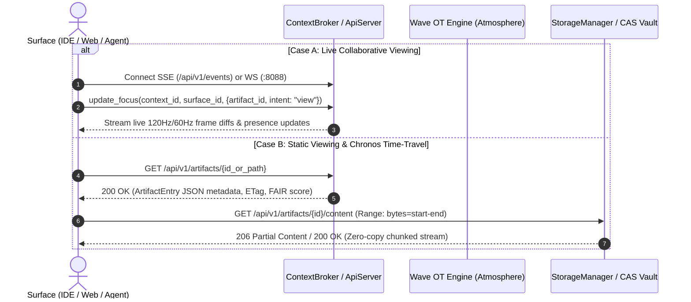
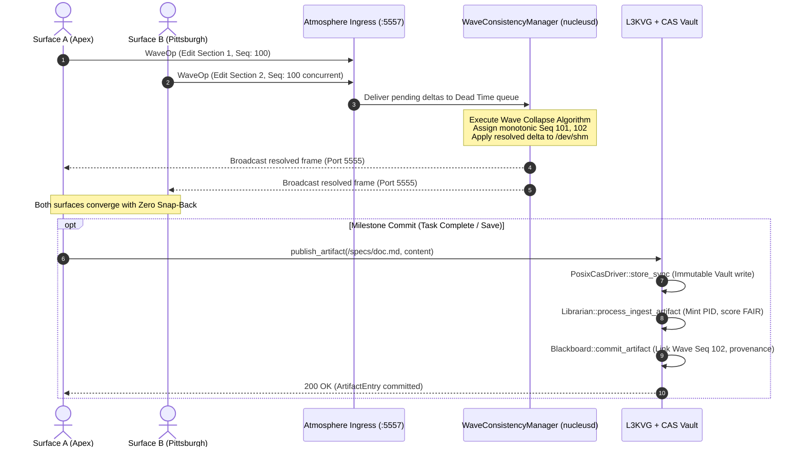

# Unified Wave-CAS Collaboration Architecture: Multi-Surface Concurrency, Operational Transformation, and Immutable FAIR Persistence

**Date:** 2026-10-10  
**Status:** Approved Architectural Specification  
**Subsystems:** `agentic_blackboard`, `project_nucleus`, `Atmosphere`, `l3kvg`, `CAS Vault`  
**Authors:** System Architecture & Distributed Substrate Engineering  

---

## 1. Executive Summary

This specification formalizes the unified collaboration model bridging the **Apache Wave Operational Transformation (OT) Protocol** in `project_nucleus` / `Atmosphere` with the **FAIR Content-Addressable Storage (CAS) Vault** and **L3KVG Graph Substrate** in `agentic_blackboard`.

It addresses the fundamental distributed systems challenge of simultaneously viewing, modifying, and synchronizing data objects across **multiple surfaces** (Web Canvas, CLI, IDE, Autonomous Agent Swarms) in **multiple physical locations** (Apex, NC; Pittsburgh, PA) across a replicated substrate without data loss, race conditions, or artificial locking bottlenecks.

### The Core Paradigm: Dual-Tier Concurrency

| Dimension | Tier 1: The Live Wave (In-Flight Concurrency) | Tier 2: The CAS Vault (Durable Milestones) |
|---|---|---|
| **Temporal Role** | High-frequency active collaboration (120Hz frame loop) | Immutable historical preservation & time-travel |
| **Engine** | `WaveConsistencyManager` (`nucleusd` / Atmosphere) | `StorageManager` + `PosixCasDriver` (`agentic_blackboard`) |
| **Data Unit** | 32-byte binary `BlackboardOp` delta stream | Content-addressed cryptographic blobs (`vault/xx/yy/hash`) |
| **Consistency Model** | Operational Transformation with Monotonic Frame Sequencer | Strict content immutability & cryptographic deduplication |
| **Conflict Resolution**| Mathematical Wave Collapse (Mean delta convergence) | DAG-based branching with `DERIVED_FROM` lineage |
| **Substrate Impact** | Shared memory (`/dev/shm`) & ephemeral ZMQ sockets | Zero binary blobs in L3KVG; structured metadata only |

---

## 2. Architectural Blueprint

```
+----------------------------------------------------------------------------------------------------+
|                                    DISTRIBUTED SURFACES                                            |
|   [Surface A: Web Canvas]       [Surface B: Autonomous Agent]       [Surface C: IDE / CLI]         |
+----------------------------------------------------------------------------------------------------+
              |                                  |                                  |
              | 32-byte BlackboardOp (Wave OT)   | WaveOp / MCP Control Plane       | ab-ctl data / CLI
              v                                  v                                  v
+----------------------------------------------------------------------------------------------------+
|                     TIER 1: ATMOSPHERE WAVE INGRESS & CONSISTENCY LAYER                            |
|                                                                                                    |
|   1. Atmosphere Gateway (scripts/atmosphere_ws_gateway.py: Multiplexes WebSocket & ZMQ)           |
|   2. Wave Ingress Socket (ZMQ PULL :5557): Ingests concurrent deltas from all active surfaces     |
|   3. WaveConsistencyManager (nucleusd @ 120Hz):                                                    |
|      - Groups operations by entity ID                                                              |
|      - Monotonic Sequence Counter (sequence_counter_++)                                            |
|      - Wave Collapse Algorithm: Continuous mathematical mean convergence (Zero Snap-Back)          |
|   4. Live Wave State (lite3 BSON in /dev/shm/Nucleus_Blackboard):                                  |
|      - High-frequency kinematic positions, fragment layout, active container trees                 |
|   5. Real-Time Broadcast: Atmosphere Pub Socket (ZMQ :5555) / SSE ContextBroker (:8085/api/v1/events)|
+----------------------------------------------------------------------------------------------------+
                                                 |
                                    Periodic 1Hz Snapshot /
                                    User Save / Task Completion
                                                 v
+----------------------------------------------------------------------------------------------------+
|                     TIER 2: AGENTIC BLACKBOARD FAIR CAS VAULT & GRAPH SUBSTRATE                    |
|                                                                                                    |
|   1. Ingestion Pipeline (Librarian Engine):                                                        |
|      - Frontmatter extraction, license validation, canonical PID minting (urn:ab:artifact:...)    |
|      - FAIR Metric Scoring (Findable, Accessible, Interoperable, Reusable out of 100.0)            |
|   2. StorageManager & PosixCasDriver:                                                              |
|      - Zero-Copy streaming via MemViewStreamBuf & res.set_content_provider                         |
|      - Immutable two-tier sharded directory: vault/{hash[0:2]}/{hash[2:4]}/{hash}                  |
|      - O(1) Pre-check deduplication: Re-uploads of known hashes bypass NVMe flash writes           |
|   3. L3KVG Knowledge Graph (Zero Binary Blobs in L3KVG):                                           |
|      - Stores ArtifactEntry node linked to terminal Wave Sequence ID                               |
|      - Multi-surface provenance: AUTHORED_BY, GENERATED_BY, DERIVED_FROM, STORED_AS, SPECIFIES     |
|      - AVU Triples indexed in pre-hashed secondary index keys (idx:Metadata:av:{attr}:{val}:{uuid})|
|   4. Chronos Time-Travel & Audit Engine:                                                           |
|      - Scrubbing past timeline frames reconstructs exact historical CAS snapshots                  |
+----------------------------------------------------------------------------------------------------+
```

---

## 3. Tier 1: The Live Wave (In-Flight Concurrency & Operational Transformation)

### 3.1 The Wave Operation Primitive (`BlackboardOp`)
In-flight edits across surfaces do not transmit heavy JSON documents or raw file buffers. They transmit fixed-size, 32-byte binary operations:

```cpp
struct BlackboardOp {
    uint64_t sequence_id; // Strictly monotonic sequence order
    uint32_t entity_id;   // Target fragment / document block index
    uint32_t op_type;     // OP_MOVE, OP_MUTATE, OP_RESCALE, OP_TEXT_DELTA
    float delta[4];       // Spatial / parameter delta vector
};
```

### 3.2 The Wave Collapse Algorithm
When multiple surfaces concurrently manipulate the same fragment or document section:
1. `WaveConsistencyManager` accumulates all `BlackboardOp` frames arriving during the inter-frame dead time.
2. Operations are grouped by `entity_id`.
3. The **Wave Collapse Algorithm** computes the convergence mean:
   $$\bar{\Delta}_k = \frac{1}{N} \sum_{i=1}^N \Delta_{k,i}$$
4. The resolved delta is applied to the active shared-memory scene graph (`bb_->fragments[entity_id]`).
5. A strictly increasing sequence counter is incremented (`sequence_counter_++`).
6. The resolved frame is published over Atmosphere ZMQ port 5555 and relayed to all connected surfaces via WebSockets and SSE.

**Guarantees:**
- **Zero Snap-Back:** Neither user experiences jarring state rollbacks or rubber-banding.
- **Order Monotonicity:** Sequence IDs are globally ordered by the Sovereign Sequencer (`nucleusd`). Out-of-order or duplicate packets from high-latency network clients are transformed or discarded.

---

## 4. Tier 2: The CAS Vault (Durable Checkpoints & FAIR Persistence)

When an editing session concludes, a task completes, or the 1Hz macro-semantic journal triggers, the active Wave state collapses into a **durable, immutable CAS milestone**.

### 4.1 Ingestion & Zero-Copy Streaming
1. The active document or fragment payload is serialized into a byte stream.
2. The payload is streamed into `StorageManager::store_sync` using `MemViewStreamBuf`, avoiding intermediary heap copying.
3. `PosixCasDriver` computes the cryptographic hash (SHA-256 / BLAKE3) in-flight and atomically renames the temporary file into the content-addressable vault:
   $$\text{locator} = \text{vault} / h[0..1] / h[2..3] / h$$
4. **Pre-check Deduplication:** If `expected_hash` matches an existing vault blob, `PosixCasDriver` returns the existing locator in $O(1)$ time without touching temporary files or consuming NVMe write endurance.

### 4.2 L3KVG Graph Modeling (Zero Binary Blobs in L3KVG)
The L3KVG substrate records only structured metadata in `ArtifactEntry`:
- `uuid`: Globally unique identifier (`art-{hex8}`).
- `pid`: Canonical persistent identifier (`urn:ab:artifact:{path}`).
- `content_hash`: Cryptographic digest (`sha256:...`).
- `wave_sequence_id`: Terminal Wave sequence counter linking the snapshot to the live OT stream.
- `primary_locator`: Relative CAS vault path (`vault/xx/yy/...`).
- `avus`: User and policy AVU triples (`policy:tier`, `curation:score`, etc.).

### 4.3 Graph Topology
The graph maintains rich provenance edges connecting the artifact:
- `collection -[:CONTAINS]-> artifact`
- `artifact -[:STORED_AS]-> locator`
- `artifact -[:SPECIFIES]-> pid`
- `artifact -[:ANNOTATED_WITH]-> avu_node`
- `artifact_v2 -[:DERIVED_FROM]-> artifact_v1`
- `artifact_v2 -[:SUPERSEDES]-> artifact_v1`

---

## 5. Dual-Tier Viewing & Modification Protocols

### 5.1 Protocol: File Retrieval for Viewing



### 5.2 Protocol: File Retrieval for Modification



---

## 6. The Role of `lite3` BSON in the Unified System

`lite3` BSON is the optimized binary serialization envelope for **structural graph nodes and Wavelet state**:

1. **Wavelet State Serialization:** The active fragment tree, layout containers, and document manifests (`session_active.lite3`) are serialized using `lite3cpp::Buffer`.
2. **Pre-Hashed Field Operations:** In-flight property updates (e.g. changing widget dimensions, toggling visibility, setting metadata) execute in $O(1)$ time via `PackedNodeLayout::hashes`.
3. **Strict Separation:** Large binary payloads (images, video, weights, binaries, documents) are strictly prohibited from `lite3` buffers. They are stored in the CAS vault and referenced by content hash.

---

## 7. Distributed Replicated Substrate (WAN Synchronization)

When running across geographically separated nodes (Apex, NC and Pittsburgh, PA):

1. **Eager Metadata Replication (ZeroMQ Mesh):**
   - Hybrid Logical Clock (`HLC`) timestamps and `ArtifactEntry` records replicate immediately over ZeroMQ pub/sub.
   - Node 2 instantly knows the logical path, content hash, and Wave sequence of new artifacts.
2. **Lazy On-Demand Blob Synchronization:**
   - Physical bytes are not pushed blindly across the WAN.
   - When a surface at Node 2 requests a file, `StorageManager` detects that the locator is remote, pulls the stream on-demand from Node 1, populates Node 2's local CAS vault, and streams to the client.
3. **AVU Policy Replication:**
   - Artifacts tagged with `policy:replication = eager_all` trigger the `Librarian` background replication worker to pre-warm remote vaults before human or agent requests occur.

---

## 8. Invariants & Guarantees

1. **Zero Binary Blobs in L3KVG:** Binary data files are never written to the L3KV WAL or graph fragment store.
2. **Zero-Copy Stream Invariant:** Streaming file transfers utilize non-owning buffers (`MemViewStreamBuf`), bounded stack chunks (64 KB), and direct socket sinks (`res.set_content_provider`, `shutil.copyfileobj`).
3. **Monotonic Wave Sequencing:** Every state mutation in Tier 1 possesses a strictly monotonic sequence ID.
4. **Cryptographic Immutability:** Any modification produces a new content hash; historical snapshots in the CAS vault are never overwritten in place.
5. **FAIR Compliance Verification:** Every published artifact carries a canonical PID (`urn:ab:artifact:...`), standard MIME type, license, and evaluated FAIR compliance score ($\ge 80.0$).
