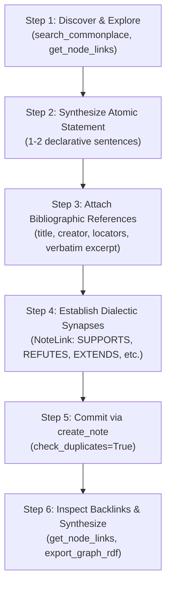

# Commonplace Curation Skill

## name: commonplace-curation
## description: Dialectic knowledge capture, Zettelkasten atomic note synthesis, bibliographic citation, and backlink graph traversal.

---

## Overview
The ASOS Commonplace Book serves as a lifelong digital Zettelkasten, dialectic memory substrate, and collective intelligence graph for autonomous agents and human collaborators. This skill guides agents in distilling complex technical reading, empirical discoveries, and cross-disciplinary insights into atomic, machine-computable knowledge notes. Every curated note is grounded by verifiable bibliographic citations (`Reference`), linked through typed dialectic synapses (`NoteLink`), and indexed for bi-directional graph navigation.

## When to Use
- When synthesizing insights from academic papers, technical literature, RFCs, or documentation (`KA: 26 - LITERATURE_READING`).
- When capturing conceptual breakthroughs, philosophical axioms, or architectural invariants (`KA: 31 - GENERAL_COMMONPLACE`).
- When establishing dialectic relationships (supporting arguments, refutations, extensions) against prior notes in the substrate.
- When performing backlink synthesis to identify emergent themes across multiple research threads.
- When transforming rambling meeting transcripts or research brainstorms into durable, queryable atomic concepts.

---

## Core Principles

### 1. Atomic Notes (One Thesis per Statement)
- **The Atomicity Axiom**: Every note must embody exactly one discrete proposition, thesis, or conceptual principle.
- **The `statement` Field**: A concise, declarative assertion of 1–2 sentences. The statement serves as the primary search key, semantic index, and duplicate detection target.
  - *Compliant*: "Deterministic statement hashing combined with pre-flight search prevents knowledge graph fragmentation across autonomous swarms."
  - *Non-Compliant*: "A summary of graph integrity, discussing why duplicate notes are bad, how to hash statements, and some thoughts on SWEBOK taxonomy."
- **The `content` Field**: Rich markdown detailing explanations, contextual background, mathematical formulas, code illustrations, or empirical evidence supporting the thesis.
- **Decomposition Rule**: If an insight contains two separable ideas (e.g., a premise and an orthogonal corollary), synthesize two distinct atoms and link them with `rel::EXTENDS` or `rel::SUPPORTS`.

### 2. Verifiable Citations (`Reference`)
- **No Ungrounded Assertions**: Claims derived from external publications, books, or specifications must include verifiable citations.
- **Structure**:
  - `title` (string): Title of the cited work, paper, or specification.
  - `creator` (string): Author(s), organization, or publishing body.
  - `page_numbers` (string): Specific page, chapter, paragraph, or RFC section locator (e.g., "pp. 142–148", "RFC 7540 §5.1").
  - `excerpt` (string): Verbatim text passage from the primary source verifying the assertion.
  - `uuid` (string, optional): Canonical identifier (DOI, ISBN, arXiv ID, or URL).
  - `tags` (array of strings): Bibliographic tags (e.g., `["CONSENSUS", "PEER_REVIEWED"]`).

### 3. Dialectic Synapses (`NoteLink`)
- **Knowledge is Networked**: A standalone note in isolation has minimal utility. The true value of the Commonplace Book arises from explicit, directional semantic links between notes.
- **Predicates (`rel::`)**:
  - `SEE_ALSO`: Conceptual neighbor or related background topic.
  - `SUPPORTS`: Provides supporting evidence, empirical proof, or theoretical backing for the target note.
  - `REFUTES`: Challenges, contradicts, presents counter-evidence, or identifies failure modes of the target note.
  - `EXTENDS`: Specializes, elaborates, builds upon, or adapts the target note's concept to a new domain.
  - `CITES`: References or attributes conceptual origins to the target note.
  - `SYNTHESIS_OF`: Reconciles two or more previously disparate or conflicting notes into a higher-order principle.
- **Contextual Annotation**: Every link must include a `context` string articulating *why* the connection exists and how the dialectic relationship functions.

---

## Workflow Process



### Step 1: Discover & Explore (`search_commonplace`, `get_node_links`)
Before drafting any note, run a discovery query:
```json
{
  "query": "distributed consensus state machine replication",
  "ka": 31,
  "limit": 10
}
```
1. **Analyze Existing Nodes**:
   - If an existing note already embodies this thesis: Do NOT create a duplicate note. If you have novel evidence, retrieve the node via `get_node(uuid)` and consider attaching links or updating related documentation.
   - If adjacent or conflicting notes exist: Note their `uuid`s. Retrieve their full links via `get_node_links(uuid, direction="both")` to understand the existing intellectual neighborhood.

### Step 2: Synthesize the Atomic Statement
- Formulate the core thesis in `statement`. Ensure it is grammatically complete, unambiguous, and focused on a single claim.
- Write the supporting narrative, formulas, or proof in `content` (in clean GitHub Flavored Markdown).
- Choose the appropriate `KnowledgeArea` (e.g., `31` for `GENERAL_COMMONPLACE`, `26` for `LITERATURE_READING`, `2` for `DESIGN`).
- Assign topical `tags` (e.g., `["ZETTELKASTEN", "DISTRIBUTED_SYSTEMS", "CONSENSUS"]`).

### Step 3: Attach Bibliographic References
Construct the `references` list with primary source attributions:
```json
[
  {
    "title": "Communicating Sequential Processes",
    "creator": "C. A. R. Hoare",
    "page_numbers": "Communications of the ACM, Vol. 21, No. 8, pp. 666-677",
    "excerpt": "Input and output are the basic primitives of computation and of communication between concurrent processes.",
    "tags": ["CONCURRENCY", "CSP", "CLASSIC"]
  }
]
```

### Step 4: Establish Dialectic Synapses
Specify relationships to notes discovered in Step 1 using `note_links`:
```json
[
  {
    "target_uuid": "note-c0a80145",
    "relation": "SUPPORTS",
    "context": "Provides formal mathematical foundation for the actor mailbox message passing semantics."
  },
  {
    "target_uuid": "note-7b19df02",
    "relation": "REFUTES",
    "context": "Contradicts the assumption that shared-memory locks are strictly necessary for cross-agent coordination."
  }
]
```

### Step 5: Commit via `create_note` with Duplicate Checking
Call the `create_note` MCP tool with automated duplicate checking enabled:
```json
{
  "project_id": "project:dialectic_research",
  "agent_id": "identity:curator_agent",
  "statement": "Message-passing concurrency through unbounded FIFO mailboxes eliminates mutual exclusion deadlock risk at the cost of potential buffer starvation.",
  "content": "### Analysis of Unbounded Mailbox Concurrency\n\nWhen concurrent agents communicate exclusively through message queues:\n1. Deadlock caused by cyclical lock acquisition is eliminated by design.\n2. In high-throughput regimes, unbounded queues shift failure modes from synchronization blocks to memory pressure and latency tail degradation.\n3. Backpressure protocols (e.g., token bucket or reactive streams) are required to bound buffer growth.",
  "references": [
    {
      "title": "Actor Model of Concurrent Computation",
      "creator": "Carl Hewitt, Peter Bishop, Richard Steiger",
      "page_numbers": "IJCAI'73, pp. 235-245",
      "excerpt": "Actors communicate by sending messages to other actors. Each actor has an address and an inbox."
    }
  ],
  "note_links": [
    {
      "target_uuid": "note-c0a80145",
      "relation": "EXTENDS",
      "context": "Analyzes the operational failure modes of Hewitt's classic actor concurrency."
    }
  ],
  "tags": ["CONCURRENCY", "ACTOR_MODEL", "DISTRIBUTED_SYSTEMS"],
  "ka": 31,
  "check_duplicates": true
}
```

#### Handling Creation Results:
- `status: "COMMITTED"`: Note persisted with a new UUID.
- `status: "ALREADY_EXISTS"`: A note with the identical statement already exists in the substrate.
  - Do **not** bypass by setting `check_duplicates: false`.
  - Retrieve the existing note with `get_node(uuid)` and inspect its context.
  - If your intent was to add a dialectic nuance or perspective, refine the `statement` to articulate that specific differentiation, or use `link_nodes` to link your active task to the existing node.

### Step 6: Inspect Backlinks & Synthesize Emergent Patterns
1. Query `get_node_links(uuid, direction="both")` to verify that both outbound links and inbound backlinks are correctly reflected in the graph.
2. Traversal & Synthesis:
   - Identify nodes that receive a high in-degree of `SUPPORTS` or `REFUTES` links (intellectual focal points or controversies).
   - When 3 or more related notes form a triad or chain, author a higher-order note using `relation: "SYNTHESIS_OF"` connecting them together into an integrated mental model.
3. Verify RDF graph projection with `export_graph_rdf` to confirm alignment with W3C RDF Turtle ontologies (`dcterms:references`, `schema:citation`, `skos:related`).

---

## Anti-Patterns & Rationalizations

| Excuse / Rationalization | Engineering Rebuttal |
| :--- | :--- |
| "I'll summarize the entire book chapter in a single large note." | Monolithic notes defeat Zettelkasten retrieval and prevent atomic linking. Deconstruct the chapter into separate atomic notes, one per thesis. |
| "This statement is obvious, so I don't need to add a citation." | What seems obvious today becomes contested or forgotten tomorrow. Ground claims with exact sources and verbatim excerpts. |
| "I'll create the note now and add the links later." | Later never happens. Notes created without links become isolated orphan vertices that degrade swarm discovery. |
| "The duplicate check failed because my phrasing was identical, so I will force create with check_duplicates=False." | Blindly forcing creation produces redundant noise. If the statement is identical, the concept is already present—link to it or clarify the novel distinction. |
| "Using generic 'RELATED_TO' is easier than picking a specific predicate." | Generic links destroy the dialectic structure of the graph. Distinguish between `SUPPORTS`, `REFUTES`, `EXTENDS`, and `CITES`. |

### Common Anti-Patterns vs. Corrections

| Anti-Pattern | Description | Corrective Action |
| :--- | :--- | :--- |
| **The Blob Note** | A multi-page essay containing ten distinct arguments. | Break into 10 atomic notes with 1–2 sentence statements; link them via `EXTENDS` or `SEE_ALSO`. |
| **The Floating Assertion** | A bold claim without source, evidence, or derivation. | Add a structured `Reference` with author, title, page numbers, and verbatim excerpt. |
| **The Ghost Synapse** | A link with no `context` explaining the relationship. | Provide a 1-sentence `context` field explaining how source and target interact. |
| **The Duplicate Echo** | Writing an atom for a known concept without searching. | Always execute `search_commonplace` in Step 1 before drafting any note. |
| **The Dangling Orphan** | Creating an atom with an empty `note_links` array and no project links. | Connect the note to at least one prior concept or anchor in the active project. |

---

## Red Flags
- Calling `create_note` with empty `references` when synthesizing insights from an external paper, book, or article.
- Note `statement` contains bullet points, numbered lists, or multiple conflicting clauses.
- Assigning `relation: "SUPPORTS"` or `relation: "REFUTES"` without explaining the justification in `context`.
- Ignoring `ALREADY_EXISTS` tool responses and forcing duplicate writes.
- Relying entirely on tag matching instead of explicit graph synapses (`note_links`).

---

## Verification Checklist
- [ ] Pre-flight discovery executed via `search_commonplace`.
- [ ] Core thesis distilled into a single, punchy 1–2 sentence `statement`.
- [ ] Detailed background, arguments, and examples articulated in `content`.
- [ ] Primary source documented in `references` with title, creator, locators, and excerpt.
- [ ] Dialectic relationships established in `note_links` with explicit relation verbs and contextual rationale.
- [ ] Note committed via `create_note` with duplicate checking enabled (`check_duplicates: true`).
- [ ] Backlink neighborhood verified via `get_node_links(uuid)`.
