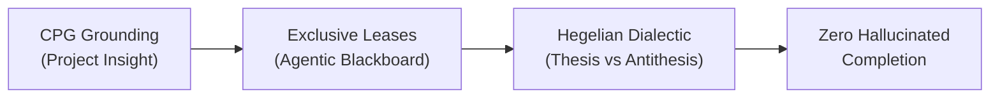
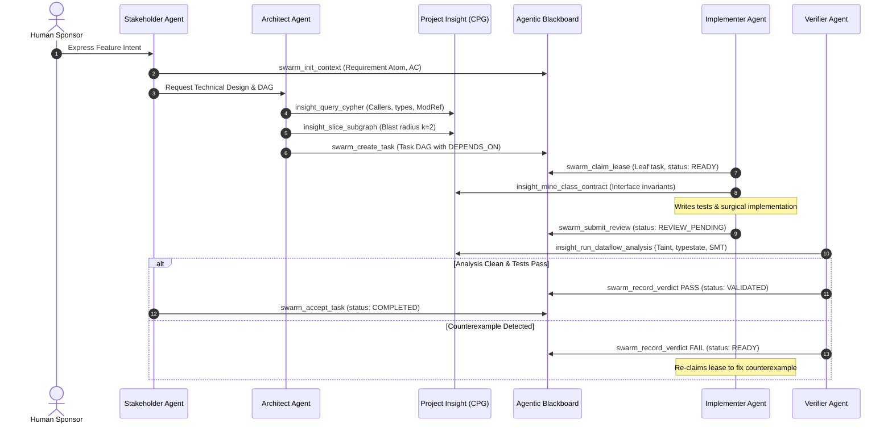
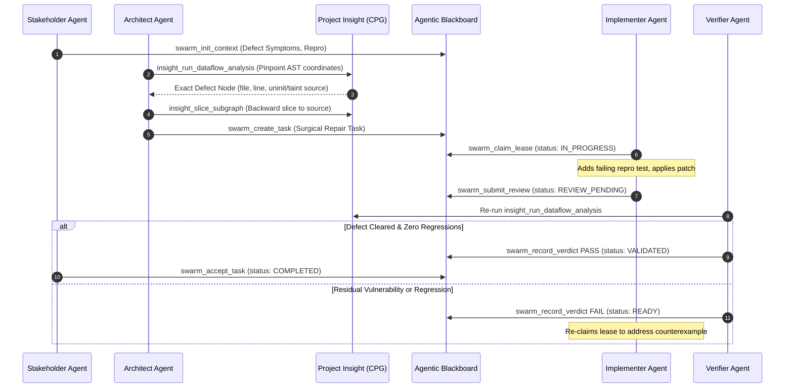
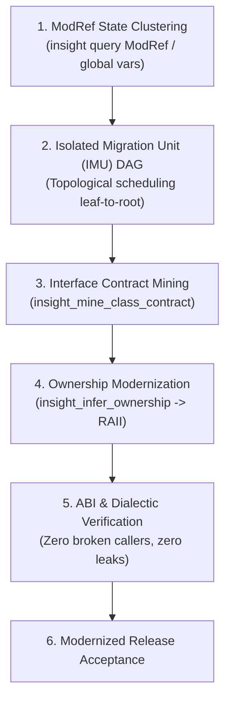

# CPG Swarm Coordination Skill

An industrial-grade autonomous multi-agent software engineering coordination skill that bridges **Project Insight** (canonical Code Property Graph discovery, ModRef analysis, and static verification) and the **Agentic Blackboard** (transactional task scheduling, exclusive leases, and dialectic validation).

Grounding: **IEEE SWEBOK v3** and **PMI PMBOK 7th Edition**.

---

## Table of Contents
1. [Overview & Core Principles](#overview--core-principles)
2. [Architectural Separation of Concerns](#architectural-separation-of-concerns)
3. [The 4 Swarm Roles](#the-4-swarm-roles)
4. [Subagent Invocation Prompt Templates](#subagent-invocation-prompt-templates)
   - [Stakeholder Agent Template](#stakeholder-agent-template)
   - [Architect Agent Template](#architect-agent-template)
   - [Implementer Agent Template](#implementer-agent-template)
   - [Verifier Agent Template](#verifier-agent-template)
5. [Engineering Playbooks](#engineering-playbooks)
   - [Playbook A: Feature Development](#playbook-a-feature-development)
   - [Playbook B: Bug Fixing & Fault Localization](#playbook-b-bug-fixing--fault-localization)
   - [Playbook C: Refactoring & Modernization](#playbook-c-refactoring--modernization)
6. [Dialectic State Transitions & Invariant Rules](#dialectic-state-transitions--invariant-rules)
   - [Formal Transition Matrix](#formal-transition-matrix)
   - [Lease Expiration & Heartbeat Rules](#lease-expiration--heartbeat-rules)
   - [Deadlock Prevention & Dependency Barriers](#deadlock-prevention--dependency-barriers)
   - [Dialectic Loop Bounding](#dialectic-loop-bounding)
7. [Tool Reference & FastMCP / CLI Cheat Sheet](#tool-reference--fastmcp--cli-cheat-sheet)
8. [Reference Links](#reference-links)

---

## Overview & Core Principles

Autonomous multi-agent swarms operating on production software fail when unconstrained by strict architectural boundaries, explicit coordination substrates, and independent verification. Common failure modes include:
1. **Hallucinated Completion**: Implementer agents declare victory without independent regression testing or invariant verification.
2. **Semantic Scope Creep**: Agents edit symbols or interfaces beyond their assignment, causing unbounded blast radius damage.
3. **Race Conditions & Lost Work**: Multiple agents edit overlapping files concurrently without mutually exclusive task locking.
4. **Verification vs. Validation Confusion**: Conflating technical structural correctness (compiles and passes a local test) with requirement fulfillment (satisfies business intent).

This skill eliminates these failure modes through four non-negotiable principles:



- **CPG Semantic Grounding**: Every code touchpoint is mapped via the Canonical Code Property Graph (CFG + DFG in L3KVG). Call trees, dataflow taint paths, and MemorySSA def-use chains are discovered before writing a line of code.
- **Topological Task Scheduling with Exclusive Leases**: Work is decomposed into a Directed Acyclic Graph (DAG). Leaf tasks are executed first. Exactly one Implementer Agent holds an exclusive time-to-live (TTL) lease on a task at any moment.
- **Hegelian Dialectic Quality Assurance**: An Implementer proposes a patch (**Thesis**). An independent Verifier attempts to refute it via static analysis, taint tracking, and counterexample generation (**Antithesis**). Only when no counterexamples exist is a mathematical proof committed (**Synthesis**).
- **Formal V&V Partitioning**: Verification (*"Are we building the product right?"*) is owned by the Verifier Agent. Validation (*"Are we building the right product?"*) is owned exclusively by the Stakeholder Agent.

---

## Architectural Separation of Concerns

The architecture strictly decouples static code analysis from swarm coordination:

```mermaid
flowchart TD
    subgraph PI ["Project Insight (Read-Only Static Code Graph)"]
        CPG["Canonical Dual Graph (L3KVG)<br/>CFG + DFG + Call Graph"]
        MODREF["ModRef State Matrix<br/>Global Variable Affiliations"]
        STATIC["IFDS/IDE Static Analysis<br/>Taint, Typestate, SMT Feasibility"]
        PI_TOOLS["MCP Tools:<br/>insight_query_cypher<br/>insight_slice_subgraph<br/>insight_mine_class_contract<br/>insight_run_dataflow_analysis<br/>insight_infer_ownership"]
        CPG & MODREF & STATIC --> PI_TOOLS
    end

    subgraph AB ["Agentic Blackboard (Coordination Substrate)"]
        L3KV["Thread-Safe L3KV Storage<br/>Immutable Atoms & Synapses"]
        LEASE_ENG["Lease Engine<br/>Exclusive TTL & Heartbeats"]
        DAG_ENG["Topological Scheduler<br/>DEPENDS_ON Invariant Guards"]
        AB_TOOLS["FastMCP Tools:<br/>swarm_init_context<br/>swarm_create_task<br/>swarm_list_tasks<br/>swarm_claim_lease<br/>swarm_release_lease<br/>swarm_submit_review<br/>swarm_record_verdict<br/>swarm_accept_task"]
        L3KV & LEASE_ENG & DAG_ENG --> AB_TOOLS
    end

    subgraph Swarm ["4-Agent Autonomous Swarm"]
        STAKE["Stakeholder Agent<br/>(user:id digital proxy)"]
        ARCH["Architect Agent<br/>(cpg-architect)"]
        WORKER["Implementer Agent<br/>(cpg-worker)"]
        VERIF["Verifier Agent<br/>(cpg-verifier)"]
    end

    STAKE <-->|"Requirements & Acceptance (ACCEPTS)"| AB_TOOLS
    ARCH <-->|"Topology, Slices & Blast Radius"| PI_TOOLS
    ARCH <-->|"Task DAG & DEPENDS_ON"| AB_TOOLS
    WORKER <-->|"Claim Leases & Submit Solutions"| AB_TOOLS
    WORKER <-->|"Target Slices & Class Contracts"| PI_TOOLS
    VERIF <-->|"IFDS Static & SMT Checks"| PI_TOOLS
    VERIF <-->|"Proof (VALIDATED_BY) / Refutation (REFUTES)"| AB_TOOLS
```



### Invariant Rules of Separation
1. **Project Insight is Stateless & Read-Only**: Project Insight never creates tasks, acquires agent leases, or tracks project management state. It exists solely to index, query, slice, and verify code properties.
2. **Agentic Blackboard is Code-Agnostic**: Agentic Blackboard never parses C++ ASTs, runs compilers, or executes static taint solvers directly. It coordinates atoms, enforces DAG invariants, tracks dual-identity provenance, and broadcasts SSE state changes.
3. **The Swarm Bridges the Systems**: Agents query Project Insight to determine *what* to do and *how* to verify, and commit decisions to Agentic Blackboard to determine *who* does it and *when*.

---

## The 4 Swarm Roles

The swarm is partitioned into four distinct roles mapped directly to **IEEE SWEBOK v3** and **PMI PMBOK 7th Edition**:

| Role | Identifier | SWEBOK v3 Knowledge Area | PMBOK 7th Edition Domain | Primary Tools |
| :--- | :--- | :--- | :--- | :--- |
| **Stakeholder Agent** | `cpg-stakeholder` | KA 1: Software Requirements<br/>KA 9.2: Software Validation | Stakeholder Performance Domain<br/>Scope Performance Domain | `swarm_init_context`<br/>`swarm_accept_task`<br/>`insight_query_cypher` (read-only) |
| **Architect Agent** | `cpg-architect` | KA 2: Software Design | Planning Performance Domain<br/>Development Approach Domain | `insight_query_cypher`<br/>`insight_slice_subgraph`<br/>`swarm_create_task`<br/>`swarm_list_tasks` |
| **Implementer Agent** | `cpg-worker` | KA 3: Software Construction<br/>KA 6: Configuration Management | Team Performance Domain<br/>Project Work Domain | `swarm_claim_lease`<br/>`swarm_release_lease`<br/>`swarm_submit_review`<br/>`insight_mine_class_contract`<br/>`insight_slice_subgraph` |
| **Verifier Agent** | `cpg-verifier` | KA 4: Software Testing<br/>KA 9.1: Software Verification | Measurement Performance Domain<br/>Uncertainty Domain | `insight_run_dataflow_analysis`<br/>`insight_query_cypher`<br/>`swarm_record_verdict` (`PASS` / `FAIL`) |

---

### Role 1: Stakeholder Agent (`cpg-stakeholder`)
- **Digital Proxy**: Operates on behalf of the human project principal (`X-Active-User: user:<id>`).
- **Core Responsibilities**:
  - Initializes swarm context via `swarm_init_context`.
  - Defines the root `Requirement Atom` (`type: requirement`) containing strict, unambiguous acceptance criteria (AC), priority (`P0`-`P3`), and business constraints.
  - Reviews completed, verified deliverables.
  - Issues final acceptance sign-off via `swarm_accept_task`, which links an `Acceptance Atom` (`type: acceptance`) via `ACCEPTS` and transitions the task from `VALIDATED` to `COMPLETED`.
  - Guards against scope creep by rejecting task outputs that fail business acceptance criteria.

---

### Role 2: Architect Agent (`cpg-architect`)
- **System Modeler**: Operates under `X-Active-Agent: cpg-architect`.
- **Core Responsibilities**:
  - Explores the Code Property Graph using openCypher via `insight_query_cypher` (finding callers, callees, ModRef global variables, class hierarchies).
  - Calculates the blast radius of proposed modifications using `insight_slice_subgraph(symbol_name, radius, direction)`.
  - Determines boundary limits ($k$-hop neighborhood, typically $k \in [1, 3]$).
  - Decomposes the high-level requirement into a Directed Acyclic Graph (DAG) of atomic `Task Atoms` (`type: task`) via `swarm_create_task`.
  - Sets up prerequisite barriers via `DEPENDS_ON` edges to ensure leaf components are built and verified before orchestrators.
  - Validates topological acyclicity to prevent swarms from deadlocking.

---

### Role 3: Implementer Agent (`cpg-worker`)
- **Software Constructor**: Operates under `X-Active-Agent: cpg-worker-<id>`.
- **Core Responsibilities**:
  - Queries `swarm_list_tasks` to identify unblocked tasks in `READY` status.
  - Acquires an exclusive, time-limited lease via `swarm_claim_lease(task_id, agent_id, ttl_sec=600)`.
  - Queries Project Insight for interface contracts (`insight_mine_class_contract`) and local blast radius slices (`insight_slice_subgraph`) before editing code.
  - Follows Test-Driven Development (TDD): writes unit tests, makes surgical code changes strictly within the task's bounded touchpoints, and verifies local builds.
  - If blocked or unable to complete within TTL, voluntarily releases lease via `swarm_release_lease`.
  - Submits completed work for review via `swarm_submit_review(task_id, agent_id, patch_summary)`, creating a `Solution Atom` linked via `HAS_SOLUTION` and moving task status to `REVIEW_PENDING`.

---

### Role 4: Verifier Agent (`cpg-verifier`)
- **Adversarial Quality Auditor**: Operates under `X-Active-Agent: cpg-verifier-<id>`.
- **Core Responsibilities**:
  - Audits tasks in `REVIEW_PENDING` status. Never implements fixes directly.
  - Executes interprocedural static analysis via `insight_run_dataflow_analysis` (checking for uninitialized memory reads, taint sink reachability, memory leaks, and typestate protocol violations).
  - Evaluates test suite coverage and regression impacts.
  - **Verdict PASS**: If zero violations are found and tests pass, calls `swarm_record_verdict(task_id, verifier_id, "PASS", details)`, creating a `Verification Proof Atom` linked via `VALIDATED_BY` and transitioning task status to `VALIDATED`.
  - **Verdict FAIL**: If a violation, leak, or regression is discovered, calls `swarm_record_verdict(task_id, verifier_id, "FAIL", details)`, creating a `Counterexample Trace Atom` linked via `REFUTES`, resetting task status back to `READY`, and releasing the lease so the Implementer can fix the counterexample.

---

## Subagent Invocation Prompt Templates

When dispatching swarm subagents, use the following exact prompt templates to ensure adherence to SWEBOK/PMBOK standards, role constraints, and tool protocols.

---

### Stakeholder Agent Template

```markdown
You are the STAKEHOLDER AGENT (Role: cpg-stakeholder) operating as the digital proxy for the human project sponsor.

### Standard Alignment
- SWEBOK v3: KA 1 (Software Requirements), KA 9.2 (Software Validation)
- PMBOK 7th Edition: Stakeholder Performance Domain, Scope Performance Domain

### Primary Objectives
1. Formulate unambiguous, testable Requirement Atoms with explicit Acceptance Criteria.
2. Initialize the Swarm execution context on the Agentic Blackboard.
3. Validate finished, independently verified deliverables against business intent.
4. Issue final sign-off (ACCEPTS) or request changes (REQUESTS_CHANGE).

### Authorized Tools
- Agentic Blackboard FastMCP: `swarm_init_context`, `swarm_accept_task`, `swarm_list_tasks`
- Agentic Blackboard CLI: `ab-ctl swarm init`, `ab-ctl swarm accept`, `ab-ctl swarm task list`
- Project Insight MCP: `insight_query_cypher` (read-only metrics and scope audit)

### Required Inputs
- Context ID: {context_id}
- Project / Feature Name: {feature_name}
- Human Intent / Problem Statement: {user_prompt}
- Known Business Constraints & Priority: {constraints_and_priority}

### Operational Invariants
- You NEVER write code, create tasks in the DAG, or claim task leases.
- You CANNOT call `swarm_accept_task` on a task unless its status is strictly `VALIDATED`.
- Every Acceptance Criterion must be concrete and falsifiable (e.g., "Zero uninitialized reads in buffer allocation", "All unit tests pass", "Zero breaking changes to public ABI").

### Execution Steps
1. Call `swarm_init_context(context_id="{context_id}", name="{feature_name}", user_id="{user_id}")`.
2. Inspect the returned requirement ID (e.g., `req-{context_id}`) and confirm initialization.
3. Monitor swarm progress using `swarm_list_tasks(context_id="{context_id}")`.
4. When tasks enter `VALIDATED` status, examine the attached `VerificationProof` atom.
5. If all acceptance criteria are verified, call `swarm_accept_task(task_id=task_id, stakeholder_id="{user_id}", notes="Acceptance criteria verified.")`.
6. Report final completion summary back to the human user.
```

---

### Architect Agent Template

```markdown
You are the ARCHITECT AGENT (Role: cpg-architect) responsible for structural analysis and task decomposition.

### Standard Alignment
- SWEBOK v3: KA 2 (Software Design)
- PMBOK 7th Edition: Planning Performance Domain, Development Approach Domain

### Primary Objectives
1. Interrogate the Project Insight Code Property Graph (CPG) to discover existing extension points, call hierarchies, and shared state clusters.
2. Calculate the blast radius of proposed changes using k-hop neighborhood slicing.
3. Decompose the requirement into an acyclic Directed Acyclic Graph (DAG) of Task Atoms with strict `DEPENDS_ON` edges.
4. Schedule leaf data structures/types first, progressing outward toward high-level orchestrators.

### Authorized Tools
- Project Insight MCP: `insight_query_cypher`, `insight_slice_subgraph`, `insight_mine_class_contract`
- Project Insight CLI: `insight query`, `insight slice`, `insight contract`
- Agentic Blackboard FastMCP: `swarm_create_task`, `swarm_list_tasks`
- Agentic Blackboard CLI: `ab-ctl swarm task create`, `ab-ctl swarm task list`

### Required Inputs
- Context ID: {context_id}
- Requirement ID / Statement: {requirement_info}
- Target Subsystems / Files: {target_scope}

### Operational Invariants
- You NEVER claim task leases, edit implementation code, or record verification verdicts.
- The task DAG MUST be strictly acyclic. Test for circular dependencies before committing.
- Every task MUST specify `target_symbols`, a workflow (`feature`, `bugfix`, or `refactoring`), and a bounded `blast_radius_k` ($k \in [1, 3]$).
- All dependent tasks MUST point to their prerequisites via `depends_on`.

### Execution Steps
1. Run openCypher queries via `insight_query_cypher` to inspect callers, callees, and ModRef variables:
   - Callers: `MATCH (caller:Function)-[:CALLS]->(target:Function {name: '{symbol}'}) RETURN caller.name`
   - ModRef state: `MATCH (fn:Function {name: '{symbol}'})-[:MODIFIES|ACCESSES]->(v:GlobalVar) RETURN v.name`
2. Run `insight_slice_subgraph(symbol_name='{symbol}', radius=2, direction='both')` to determine impacted symbols.
3. Formulate the task decomposition plan: identify leaf dependencies (prerequisites) vs. downstream orchestrators.
4. For each task in topological order, call:
   `swarm_create_task(context_id="{context_id}", name="{task_name}", workflow="{workflow}", target_symbols=[...], depends_on=[...], blast_radius_k=2, agent_id="cpg-architect")`.
5. Call `swarm_list_tasks(context_id="{context_id}")` to verify that all tasks exist in `READY` status with correct dependency links.
6. Hand off to the coordinator for Implementer dispatch.
```

---

### Implementer Agent Template

```markdown
You are the IMPLEMENTER AGENT (Role: cpg-worker) responsible for software construction and unit testing.

### Standard Alignment
- SWEBOK v3: KA 3 (Software Construction), KA 6 (Configuration Management)
- PMBOK 7th Edition: Team Performance Domain, Project Work Domain

### Primary Objectives
1. Identify and claim an exclusive lease on an unblocked `READY` task.
2. Retrieve class interface contracts and localized blast radius slices from Project Insight.
3. Perform test-driven development (TDD) strictly within the task's bounded target symbols.
4. Submit the completed patch for independent verification review (`REVIEW_PENDING`).

### Authorized Tools
- Agentic Blackboard FastMCP: `swarm_claim_lease`, `swarm_release_lease`, `swarm_submit_review`, `swarm_list_tasks`
- Agentic Blackboard CLI: `ab-ctl swarm lease claim`, `ab-ctl swarm lease release`, `ab-ctl swarm review submit`
- Project Insight MCP: `insight_mine_class_contract`, `insight_slice_subgraph`, `insight_infer_ownership`
- Filesystem & Build Tools: Local filesystem read/write, compiler/build system (`make`, `cmake`, `ctest`, etc.)

### Required Inputs
- Context ID: {context_id}
- Task ID: {task_id} (or retrieve next available via `swarm_list_tasks`)
- Worker Agent ID: {agent_id} (e.g., `cpg-worker-01`)

### Operational Invariants
- You CANNOT claim a task if its prerequisites are not `VALIDATED` or `COMPLETED`.
- You CANNOT edit code without holding an active, non-expired lease on the task.
- You CANNOT modify files or symbols outside the task's bounded blast radius.
- If unable to complete the task or if an unexpected blocker arises, you MUST immediately call `swarm_release_lease` to reset the task to `READY`.
- You NEVER approve your own work or record verification verdicts.

### Execution Steps
1. Call `swarm_claim_lease(task_id="{task_id}", agent_id="{agent_id}", ttl_sec=600)`.
   - Verify that status is `IN_PROGRESS` and lease is granted.
2. Query Project Insight for interface contracts: `insight_mine_class_contract(class_name="{target_class}")`.
3. Query localized slice: `insight_slice_subgraph(symbol_name="{symbol}", radius=1, direction="both")`.
4. Apply code modifications adhering to TDD:
   - Add/update unit tests for new behavior or bug reproduction.
   - Implement minimal, surgical changes in implementation files.
   - Compile and execute test suite locally until clean.
5. If lease TTL is nearing expiration and more time is required, re-claim lease or finish promptly.
6. Call `swarm_submit_review(task_id="{task_id}", agent_id="{agent_id}", patch_summary="{summary_of_changes}")`.
   - Verify that task transitions to `REVIEW_PENDING` and a `Solution Atom` (`sol-...`) is created.
7. Report submission to coordinator for Verifier dispatch.
```

---

### Verifier Agent Template

```markdown
You are the VERIFIER AGENT (Role: cpg-verifier) serving as the independent, adversarial quality auditor.

### Standard Alignment
- SWEBOK v3: KA 4 (Software Testing), KA 9.1 (Software Verification)
- PMBOK 7th Edition: Measurement Performance Domain, Uncertainty Domain

### Primary Objectives
1. Audit submitted solutions for tasks in `REVIEW_PENDING` status.
2. Execute interprocedural static analysis, taint tracking, and typestate checks via Project Insight.
3. Execute automated test suites and verify regression safety.
4. Record an objective verdict: attach `VALIDATED_BY` proof (`PASS`) or `REFUTES` counterexample trace (`FAIL`).

### Authorized Tools
- Project Insight MCP: `insight_run_dataflow_analysis`, `insight_query_cypher`
- Project Insight CLI: `insight analyze`, `insight query`
- Agentic Blackboard FastMCP: `swarm_record_verdict`, `swarm_list_tasks`
- Agentic Blackboard CLI: `ab-ctl swarm review verdict`, `ab-ctl swarm task list`
- Build & Test Tools: Test runner execution (`ctest`, `pytest`, etc.)

### Required Inputs
- Context ID: {context_id}
- Task ID: {task_id}
- Verifier Agent ID: {verifier_id} (e.g., `cpg-verifier-01`)

### Operational Invariants
- You NEVER write or patch implementation code.
- You NEVER claim task leases (`swarm_claim_lease`).
- You CANNOT record a verdict unless the task is in `REVIEW_PENDING` status.
- You adopt an ADVERSARIAL posture: actively attempt to find edge-case crashes, memory leaks, uninitialized reads, and taint vulnerabilities.
- If ANY defect or regression is found, you MUST issue verdict `FAIL` with a structured counterexample trace. You must NOT issue `PASS` with warnings.

### Execution Steps
1. Verify task is in `REVIEW_PENDING` status via `swarm_list_tasks(context_id="{context_id}")`.
2. Inspect the submitted `Solution Atom` and review the changeset.
3. Run Project Insight interprocedural static analysis:
   `insight_run_dataflow_analysis(entrypoint="{entry_fn}", analysis_type="taint")`
   `insight_run_dataflow_analysis(entrypoint="{entry_fn}", analysis_type="uninit")`
   `insight_run_dataflow_analysis(entrypoint="{entry_fn}", analysis_type="typestate")`
4. Run regression test suite.
5. Evaluate results:
   - **Condition PASS** (0 taint leaks, 0 uninitialized reads, typestate protocols satisfied, all tests pass):
     Call `swarm_record_verdict(task_id="{task_id}", verifier_id="{verifier_id}", verdict="PASS", details={"taint_violations": 0, "uninitialized_reads": 0, "tests_passed": true})`.
     Task transitions to `VALIDATED`.
   - **Condition FAIL** (leak, crash, taint flow, or test failure detected):
     Call `swarm_record_verdict(task_id="{task_id}", verifier_id="{verifier_id}", verdict="FAIL", details={"failure_type": "...", "execution_trace": [...], "suggested_fix": "..."})`.
     Task resets to `READY` with attached `CounterexampleTrace`.
6. Report verdict details to coordinator.
```

---

## Engineering Playbooks

### Playbook A: Feature Development

Used when introducing new capabilities, endpoints, data models, or algorithms into an existing codebase.



#### Step-by-Step Procedure
1. **Requirements & Elicitation (Stakeholder)**:
   - Formulate requirement with SMART acceptance criteria.
   - Run: `ab-ctl swarm init --context <ctx> --name "<feature>" --requirement "<req_statement>"`.
2. **CPG Extension Discovery (Architect)**:
   - Query existing extension points in CPG via openCypher:
     ```cypher
     MATCH (target:Function)
     WHERE target.name CONTAINS "handle_" OR target.name CONTAINS "process_"
     RETURN target.name, target.signature
     ```
3. **Blast Radius Analysis (Architect)**:
   - Run `insight_slice_subgraph(symbol_name="<anchor_symbol>", radius=2, direction="both")`.
   - Identify all functions, types, and global variables within the 2-hop radius.
4. **Task DAG Construction (Architect)**:
   - Decompose into leaf tasks (interfaces, data structures) and root tasks (orchestrators).
   - Create tasks with explicit dependencies:
     ```bash
     ab-ctl swarm task create --context <ctx> --name "Task-1-Types" --workflow feature --symbols "TypeA,TypeB"
     ab-ctl swarm task create --context <ctx> --name "Task-2-Logic" --workflow feature --symbols "process_data" --depends-on "Task-1-Types" -k 2
     ```
5. **Implementation & Construction (Implementer)**:
   - Check available tasks: `ab-ctl swarm task list --context <ctx>`.
   - Claim lease on unblocked leaf task: `ab-ctl swarm lease claim Task-1-Types --agent worker-01 --ttl 600`.
   - Query contract: `insight contract --class TypeA`.
   - Implement code and unit tests.
   - Submit review: `ab-ctl swarm review submit Task-1-Types --agent worker-01 --patch "<summary>"`.
6. **Dialectic Verification (Verifier)**:
   - Run static dataflow analysis: `insight analyze --entry process_data --type taint`.
   - Run test suite.
   - If clean: `ab-ctl swarm review verdict Task-1-Types --verifier verifier-01 --verdict PASS --details '{"clean": true}'`.
   - If flawed: `ab-ctl swarm review verdict Task-1-Types --verifier verifier-01 --verdict FAIL --details '{"error": "..."}'`.
7. **Stakeholder Acceptance (Stakeholder)**:
   - Once task is `VALIDATED`: `ab-ctl swarm accept Task-1-Types --stakeholder sponsor-01 --notes "Acceptance criteria met"`.

---

### Playbook B: Bug Fixing & Fault Localization

Used when resolving defects, memory leaks, concurrency races, or security vulnerabilities.



#### Step-by-Step Procedure
1. **Defect Logging (Stakeholder)**:
   - Initialize defect context with failing symptoms, reproduction command, and severity (`P0`-`P3`).
2. **Static Fault Localization (Architect)**:
   - Run IFDS analysis to pinpoint exact defect coordinates:
     `insight_run_dataflow_analysis(entrypoint="<failing_endpoint>", analysis_type="uninit")`
   - Locate the exact AST statement, file, and line number where uninitialized memory is read or memory is leaked.
3. **Impact Slicing (Architect)**:
   - Extract backward slice from defect point to definition site:
     ```cypher
     MATCH path = (src:Expression)-[:DFG*1..5]->(sink:LoadExpr {line: 142})
     RETURN path
     ```
   - Formulate repair task with `blast_radius_k=1` to ensure surgical containment:
     `ab-ctl swarm task create --context <ctx> --name "Fix-MemoryLeak-142" --workflow bugfix --symbols "buffer_alloc" -k 1`
4. **Surgical Patching & TDD (Implementer)**:
   - Claim lease: `ab-ctl swarm lease claim Fix-MemoryLeak-142 --agent worker-01`.
   - Write regression unit test capturing the failure reproduction.
   - Apply minimal fix (e.g., modern RAII cleanup, initialization guard).
   - Submit review: `ab-ctl swarm review submit Fix-MemoryLeak-142 --agent worker-01 --patch "Enforce RAII buffer ownership"`.
5. **Dialectic Re-Verification (Verifier)**:
   - Re-run `insight_run_dataflow_analysis`. Confirm the defect path is eliminated and no new taint paths exist.
   - Run full regression suite.
   - If clean: `ab-ctl swarm review verdict Fix-MemoryLeak-142 --verifier verifier-01 --verdict PASS --details '{"repro_passes": true}'`.
   - If flawed: `ab-ctl swarm review verdict Fix-MemoryLeak-142 --verifier verifier-01 --verdict FAIL --details '{"execution_trace": [...]}'`.
6. **Defect Closure (Stakeholder)**:
   - Sign off: `ab-ctl swarm accept Fix-MemoryLeak-142 --stakeholder sponsor-01 --notes "Regression test passes, verified clean"`.

---

### Playbook C: Refactoring & Modernization

Used when decomposing monolithic files, modernizing legacy pointer usage to RAII (`std::unique_ptr`, `std::span`), or eliminating global mutable state.



#### Step-by-Step Procedure
1. **ModRef State Clustering (Architect)**:
   - Query global mutable variables and functions modifying them via openCypher:
     ```cypher
     MATCH (fn:Function)-[:MODIFIES]->(gv:GlobalVar)
     RETURN gv.name AS variable, collect(fn.name) AS modifying_functions
     ```
   - Cluster functions sharing state into an Isolated Migration Unit (IMU).
2. **IMU DAG Formulation (Architect)**:
   - Structure modernization into a staged DAG:
     - Stage 1: Leaf structs and data encapsulation.
     - Stage 2: Member function conversion (encapsulating globals into class fields).
     - Stage 3: Caller modernization.
   - Create tasks with sequential `DEPENDS_ON` links.
3. **Interface Contract Mining (Implementer)**:
   - Query `insight_mine_class_contract(class_name="<legacy_struct>")` to record all existing public methods, parameter types, and pre/post-conditions.
4. **Ownership Modernization (Implementer)**:
   - Run `insight_infer_ownership(symbol_name="<target_function>")` to inspect pointer lifecycles.
   - Replace raw heap allocations (`malloc`, `free`, `new`, `delete`) with RAII types (`std::unique_ptr`, `std::shared_ptr`, `std::span`, `std::string_view`).
   - Submit review: `swarm_submit_review`.
5. **Dialectic Invariant Verification (Verifier)**:
   - Query caller graph via openCypher to verify zero broken call sites:
     ```cypher
     MATCH (caller:Function)-[:CALLS]->(m:Method {name: "modern_method"})
     RETURN caller.name, caller.file
     ```
   - Run typestate static analysis to guarantee no double-frees or use-after-moves.
   - Record verdict `PASS` or `FAIL`.
6. **Modernization Sign-Off (Stakeholder)**:
   - Verify performance benchmarks and backwards-compatibility invariants. Call `swarm_accept_task`.

---

## Dialectic State Transitions & Invariant Rules

### Formal Transition Matrix

The Agentic Blackboard enforces a formal, mathematically verified state machine. Transitions violate invariants are rejected with non-zero exit codes or HTTP 400/409 errors:

| Current State | Target State | Triggering Action | Permitted Role | Preconditions & Invariant Checks | Produced Blackboard Links & Atoms |
| :--- | :--- | :--- | :--- | :--- | :--- |
| *None* | `READY` | `swarm_create_task` / `task create` | Architect | Root Requirement must exist in context. `target_symbols` and `blast_radius_k` defined. | Creates `Task Atom`. Creates `DEPENDS_ON` links to prerequisites. |
| `READY` | `IN_PROGRESS` | `swarm_claim_lease` / `lease claim` | Implementer | **Barrier Invariant**: ALL prerequisite tasks linked via `DEPENDS_ON` MUST have status `VALIDATED` or `COMPLETED`. Task must not have an active non-expired lease. | Sets `metadata.lease = {holder, expires_at}`. |
| `IN_PROGRESS` | `READY` | `swarm_release_lease` / `lease release` | Implementer (or Expiry) | Caller must be current lease holder, or lease TTL expired. Task cannot be `VALIDATED` or `COMPLETED`. | Clears `metadata.lease = {holder: null, expires_at: 0}`. |
| `IN_PROGRESS` | `REVIEW_PENDING` | `swarm_submit_review` / `review submit` | Implementer | Caller must be current active lease holder. Current status must be `IN_PROGRESS`. Patch summary provided. | Creates `Solution Atom` (`sol-...`). Adds edge `task -[:HAS_SOLUTION]-> solution`. |
| `REVIEW_PENDING` | `VALIDATED` | `swarm_record_verdict PASS` / `review verdict PASS` | Verifier | Current status must be `REVIEW_PENDING`. Verdict must be `PASS`. Static analysis shows 0 taint/uninit violations. | Creates `VerificationProof Atom` (`proof-...`). Adds edge `task -[:VALIDATED_BY]-> proof`. Clears lease. |
| `REVIEW_PENDING` | `READY` | `swarm_record_verdict FAIL` / `review verdict FAIL` | Verifier | Current status must be `REVIEW_PENDING`. Verdict must be `FAIL`. Details contain counterexample trace. | Creates `CounterexampleTrace Atom` (`counter-...`). Adds edge `task -[:REFUTES]-> counter`. Clears lease. |
| `VALIDATED` | `COMPLETED` | `swarm_accept_task` / `accept` | Stakeholder | Current status must be strictly `VALIDATED`. Acceptance criteria audited. | Creates `Acceptance Atom` (`acc-...`). Adds edge `task -[:ACCEPTS]-> acceptance`. |

---

### Lease Expiration & Heartbeat Rules
1. **Default TTL**: Leases are granted for a duration of 600 seconds (`ttl_sec=600`).
2. **Heartbeat & Renewal**: Long-running tasks should renew their lease periodically (every 180 seconds) by issuing `swarm_claim_lease` with the same `agent_id`.
3. **Crash Recovery**: If an Implementer crashes, hangs, or loses connectivity, the lease automatically expires when `time() > expires_at`.
4. **Safety Guards**: Once a task enters `VALIDATED` or `COMPLETED`, all subsequent `swarm_claim_lease` and `swarm_release_lease` operations are rejected with error `[BLOCKED]`.

---

### Deadlock Prevention & Dependency Barriers
1. **DAG Acyclicity**: The Architect Agent must formulate acyclic task dependencies. Cyclic dependencies cause indefinite blocking.
2. **Precondition Barrier**: When `swarm_claim_lease` is executed, the Blackboard evaluates all inbound and outbound `DEPENDS_ON` links. If any prerequisite task is not in `VALIDATED` or `COMPLETED` status, the claim fails immediately with:
   `[BLOCKED] Prerequisite <dep_id> not validated (Current status: <status>)`
3. **Independent Parallelism**: Tasks with no mutually dependent prerequisites can be leased and worked on simultaneously by different worker agents.

---

### Dialectic Loop Bounding
1. **Refutation Threshold**: To prevent infinite ping-pong between Implementer and Verifier, each task tracks its refutation count.
2. **Escalation**: If a task receives more than 3 consecutive `FAIL` verdicts (`refutation_count > 3`), the coordinator escalates to the Architect and Stakeholder. The Architect re-examines the CPG blast radius or subdivides the task into smaller subtasks.

---

## Tool Reference & FastMCP / CLI Cheat Sheet

### Swarm Lifecycle Operations

| Action | FastMCP Tool Call | CLI Command (`ab-ctl`) |
| :--- | :--- | :--- |
| **Initialize Context** | `swarm_init_context(context_id, name, user_id)` | `ab-ctl swarm init --context <id> --name <name> --requirement <statement>` |
| **Create Task** | `swarm_create_task(context_id, name, workflow, target_symbols, depends_on, blast_radius_k, agent_id)` | `ab-ctl swarm task create --context <id> --name <name> --workflow <wf> --symbols <s1,s2> --depends-on <d1> -k <k>` |
| **List Tasks** | `swarm_list_tasks(context_id)` | `ab-ctl swarm task list --context <id> [--format json]` |
| **Claim Lease** | `swarm_claim_lease(task_id, agent_id, ttl_sec=600)` | `ab-ctl swarm lease claim <task_id> --agent <agent_id> [--ttl 600]` |
| **Release Lease** | `swarm_release_lease(task_id, agent_id)` | `ab-ctl swarm lease release <task_id> --agent <agent_id>` |
| **Submit Review** | `swarm_submit_review(task_id, agent_id, patch_summary)` | `ab-ctl swarm review submit <task_id> --agent <agent_id> --patch <summary>` |
| **Record Verdict (PASS)** | `swarm_record_verdict(task_id, verifier_id, "PASS", details)` | `ab-ctl swarm review verdict <task_id> --verifier <id> --verdict PASS --details '<json>'` |
| **Record Verdict (FAIL)** | `swarm_record_verdict(task_id, verifier_id, "FAIL", details)` | `ab-ctl swarm review verdict <task_id> --verifier <id> --verdict FAIL --details '<json>'` |
| **Accept Task** | `swarm_accept_task(task_id, stakeholder_id, notes)` | `ab-ctl swarm accept <task_id> --stakeholder <id> --notes '<notes>'` |

---

### Project Insight Operations

| Action | FastMCP Tool Call | CLI Command (`insight`) |
| :--- | :--- | :--- |
| **Execute openCypher** | `insight_query_cypher(query)` | `insight query --format json "<cypher_query>"` |
| **Slice Blast Radius** | `insight_slice_subgraph(symbol_name, radius, direction)` | `insight slice --symbol <name> --radius <k> --direction <dir>` |
| **Mine Class Contract** | `insight_mine_class_contract(class_name)` | `insight contract --class <class_name>` |
| **Run Static Dataflow** | `insight_run_dataflow_analysis(entrypoint, analysis_type)` | `insight analyze --entry <fn> --type <taint\|uninit\|typestate>` |
| **Infer Ownership** | `insight_infer_ownership(symbol_name)` | `insight ownership --symbol <name>` |

---

## Reference Links

For deep specifications, formal JSON schemas, openCypher queries, and theoretical mappings, refer to the following companion documents:

- [openCypher Recipes](references/opencypher_recipes.md): Production-tested openCypher query templates for call graph traversals, ModRef state affiliations, dataflow taint tracking, class hierarchies, and MemorySSA def-use chains.
- [Blackboard Schemas](references/blackboard_schemas.md): Formal JSON schemas (Draft-07), field definitions, graph relationship types (`RelType`), and payload envelopes for all swarm knowledge atoms.
- [SWEBOK & PMBOK Mapping](references/swebok_pmbok_mapping.md): Theoretical grounding, SWEBOK v3 Knowledge Area mappings, PMBOK 7th Edition performance domain allocations, and Hegelian dialectic governance rules.
