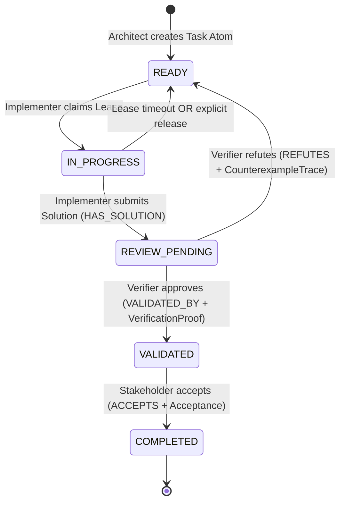

# Agentic Blackboard Schema Catalog & Protocol Specification

This document provides the formal JSON payload schemas, field definitions, and graph relationship specifications for all atoms and links utilized by the Code Property Graph (CPG) Swarm. It covers the REST API (`/api/v1/*`), the `ab-ctl` CLI, and the FastMCP tool protocol.

---

## Table of Contents
1. [Core Blackboard Conventions & Provenance](#core-blackboard-conventions--provenance)
2. [State Transition Lifecycle & Link Model](#state-transition-lifecycle--link-model)
3. [Schema 1: Requirement Atom (`type: requirement`)](#schema-1-requirement-atom-type-requirement)
4. [Schema 2: Task Atom (`type: task`)](#schema-2-task-atom-type-task)
5. [Schema 3: Solution Atom (`type: solution`)](#schema-3-solution-atom-type-solution)
6. [Schema 4: Verification Proof Atom (`type: verification_proof`)](#schema-4-verification-proof-atom-type-verification_proof)
7. [Schema 5: Counterexample Trace Atom (`type: counterexample_trace`)](#schema-5-counterexample-trace-atom-type-counterexample_trace)
8. [Schema 6: Acceptance Atom (`type: acceptance`)](#schema-6-acceptance-atom-type-acceptance)
9. [Graph Relationship Types (`RelType`)](#graph-relationship-types-reltype)
10. [FastMCP Tool Integration Examples](#fastmcp-tool-integration-examples)

---

## Core Blackboard Conventions & Provenance

Every node in the Agentic Blackboard is an immutable or state-tracked "Atom" stored in L3KV and indexed in the graph.

### 1. Dual-Identity Provenance Headers
Every mutation request transmitted via HTTP REST or FastMCP **MUST** provide dual-identity authentication headers:
- `Authorization: Bearer <token>`: Bearer token for authorization.
- `X-Active-User: <user_id>`: Identifies the human user or stakeholder authorizing the run (e.g., `user:jason`).
- `X-Active-Agent: <agent_id>`: Identifies the autonomous agent instance executing the operation (e.g., `agent:cpg-architect-01`).

### 2. Common Top-Level Node Structure
Every atom committed via `POST /api/v1/graph/node` adheres to the following envelope:
```json
{
  "id": "<string: unique atom identifier>",
  "type": "<string: atom type enum>",
  "statement": "<string: optional human-readable summary statement>",
  "metadata": {
    "context_id": "<string: swarm execution context ID>",
    "created_at": "<integer: unix timestamp in seconds>",
    "...": "atom-specific payload attributes"
  }
}
```

Top-level Envelope JSON Schema (Draft-07):
```json
{
  "$schema": "http://json-schema.org/draft-07/schema#",
  "title": "AtomEnvelope",
  "type": "object",
  "required": ["id", "type", "metadata"],
  "properties": {
    "id": { "type": "string" },
    "type": { "type": "string" },
    "statement": { "type": "string" },
    "metadata": {
      "type": "object",
      "required": ["context_id", "created_at"]
    }
  }
}
```

> **Statement Optionality & Synthesis**: In the top-level envelope schema and all atom schemas, `statement` is optional in `required` (`"required": ["id", "type", "metadata"]`). The summary statement can either be provided directly as a top-level `statement` field or synthesized by tooling and UI surfaces from `metadata.name` / `metadata.statement`.

---

## State Transition Lifecycle & Link Model

The swarm executes a Hegelian dialectic workflow where proposals and validations evolve through explicit graph links:



---

## Schema 1: Requirement Atom (`type: requirement`)

### Purpose & Role
Created and owned by the **Stakeholder Agent**. Defines the functional, architectural, or security requirements, acceptance criteria, and non-functional constraints. Serves as the root of the task graph.

### JSON Schema (Draft-07)
```json
{
  "$schema": "http://json-schema.org/draft-07/schema#",
  "title": "RequirementAtom",
  "type": "object",
  "required": ["id", "type", "metadata"],
  "properties": {
    "id": { "type": "string", "pattern": "^req-[a-zA-Z0-9_-]+$" },
    "type": { "type": "string", "enum": ["requirement"] },
    "statement": { "type": "string", "minLength": 5 },
    "metadata": {
      "type": "object",
      "required": ["context_id", "created_at"],
      "properties": {
        "context_id": { "type": "string" },
        "name": { "type": "string" },
        "scope": { "type": "string", "description": "High-level subsystem or repository scope" },
        "acceptance_criteria": {
          "type": "array",
          "items": { "type": "string" },
          "minItems": 1
        },
        "priority": { "type": "string", "enum": ["P0", "P1", "P2", "P3"] },
        "business_constraints": {
          "type": "array",
          "items": { "type": "string" }
        },
        "status": { "type": "string", "enum": ["PROPOSED", "OPEN", "IN_ANALYSIS", "IMPLEMENTED", "ACCEPTED", "REJECTED"] },
        "stakeholder_user": { "type": "string" },
        "created_at": { "type": "integer" }
      }
    }
  }
}
```

### Concrete Payload Example
```json
{
  "id": "req-tls13-downgrade-guard",
  "type": "requirement",
  "statement": "Eliminate TLS 1.3 downgrade vulnerabilities and ensure zero state leakage on handshake failure",
  "metadata": {
    "context_id": "ctx-tls-security-sprint",
    "name": "TLS 1.3 Downgrade Attack Prevention",
    "scope": "src/net/tls/*",
    "acceptance_criteria": [
      "Reject ClientHello offering TLS < 1.3 if server policy mandates TLS 1.3",
      "No memory leaks or dangling session keys on handshake abort",
      "Pass zero-leak IFDS taint analysis from network buffer to cryptographic state"
    ],
    "priority": "P0",
    "business_constraints": [
      "Zero backwards compatibility breaks with TLS 1.2 legacy fallback endpoint",
      "Maximum handshake latency overhead < 5%"
    ],
    "status": "OPEN",
    "stakeholder_user": "user:security-lead",
    "created_at": 1773801600
  }
}
```

---

## Schema 2: Task Atom (`type: task`)

### Purpose & Role
Created by the **Architect Agent** during task decomposition. Claimed by the **Implementer Agent** via exclusive lease. Holds the state machine status (`PROPOSED`, `READY`, `IN_PROGRESS`, `REVIEW_PENDING`, `VALIDATED`, `COMPLETED`, `ESCALATED`).

### JSON Schema (Draft-07)
```json
{
  "$schema": "http://json-schema.org/draft-07/schema#",
  "title": "TaskAtom",
  "type": "object",
  "required": ["id", "type", "metadata"],
  "properties": {
    "id": { "type": "string" },
    "type": { "type": "string", "enum": ["task"] },
    "statement": { "type": "string" },
    "metadata": {
      "type": "object",
      "required": ["context_id", "workflow", "target_symbols", "blast_radius_k", "status", "lease"],
      "properties": {
        "context_id": { "type": "string" },
        "name": { "type": "string" },
        "workflow": { "type": "string", "enum": ["feature", "bugfix", "refactor", "refactoring"] },
        "target_symbols": {
          "type": "array",
          "items": { "type": "string" },
          "minItems": 1
        },
        "blast_radius_k": { "type": "integer", "minimum": 1, "maximum": 5 },
        "status": {
          "type": "string",
          "enum": ["PROPOSED", "READY", "IN_PROGRESS", "REVIEW_PENDING", "VALIDATED", "COMPLETED", "ESCALATED"]
        },
        "lease": {
          "type": "object",
          "required": ["holder", "expires_at"],
          "properties": {
            "holder": { "type": ["string", "null"] },
            "expires_at": { "type": "integer" },
            "timeout_sec": { "type": "integer" }
          }
        },
        "created_at": { "type": "integer" },
        "architect_agent": { "type": "string" }
      }
    }
  }
}
```

### Concrete Payload Example
```json
{
  "id": "task-tls-validate-version",
  "type": "task",
  "statement": "Implement client version enforcement in tls_validate_client_hello()",
  "metadata": {
    "context_id": "ctx-tls-security-sprint",
    "name": "Task-TLS-VersionCheck",
    "workflow": "feature",
    "target_symbols": ["tls_validate_client_hello", "tls_negotiate_ciphersuite"],
    "blast_radius_k": 2,
    "status": "READY",
    "lease": {
      "holder": null,
      "expires_at": 0,
      "timeout_sec": 600
    },
    "created_at": 1773801700,
    "architect_agent": "agent:cpg-architect-01"
  }
}
```

---

## Schema 3: Solution Atom (`type: solution`)

### Purpose & Role
Created by the **Implementer Agent** when work is ready for review. Linked to the task atom via `HAS_SOLUTION`. Contains patch summaries, modified files, and git commits.

### JSON Schema (Draft-07)
```json
{
  "$schema": "http://json-schema.org/draft-07/schema#",
  "title": "SolutionAtom",
  "type": "object",
  "required": ["id", "type", "metadata"],
  "properties": {
    "id": { "type": "string", "pattern": "^sol-[a-zA-Z0-9_-]+$" },
    "type": { "type": "string", "enum": ["solution"] },
    "statement": { "type": "string" },
    "metadata": {
      "type": "object",
      "required": ["task_id", "agent_id", "patch", "context_id", "created_at"],
      "properties": {
        "task_id": { "type": "string" },
        "agent_id": { "type": "string" },
        "patch": { "type": "string", "description": "Unified diff or summary of modifications" },
        "summary": { "type": "string" },
        "modified_files": {
          "type": "array",
          "items": { "type": "string" }
        },
        "commit_hashes": {
          "type": "array",
          "items": { "type": "string" }
        },
        "context_id": { "type": "string" },
        "created_at": { "type": "integer" }
      }
    }
  }
}
```

### Concrete Payload Example
```json
{
  "id": "sol-task-tls-validate-version-8a2f",
  "type": "solution",
  "statement": "Implemented strict TLS 1.3 downgrade check in tls_validate_client_hello",
  "metadata": {
    "task_id": "task-tls-validate-version",
    "agent_id": "agent:cpg-worker-01",
    "patch": "diff --git a/src/net/tls/handshake.cpp b/src/net/tls/handshake.cpp\n@@ -88,4 +88,9 @@ int tls_validate_client_hello(SSLContext* ctx, const Packet* pkt) {\n+    if (ctx->policy == TLS_POLICY_V13_STRICT && pkt->client_version < TLS_1_3_VERSION) {\n+        tls_cleanup_session(ctx);\n+        return TLS_ERR_DOWNGRADE_DETECTED;\n+    }",
    "summary": "Added strict version policy enforcement and instant session memory reclamation on downgrade attempts",
    "modified_files": [
      "src/net/tls/handshake.cpp",
      "include/net/tls/handshake.hpp"
    ],
    "commit_hashes": ["8f73b1a23c4d5e6f"],
    "context_id": "ctx-tls-security-sprint",
    "created_at": 1773802200
  }
}
```

---

## Schema 4: Verification Proof Atom (`type: verification_proof`)

### Purpose & Role
Created by the **Verifier Agent** when static analysis, SMT path verification, and tests **PASS**. Linked to the task via `VALIDATED_BY`. Transitions task status to `VALIDATED`.

### JSON Schema (Draft-07)
```json
{
  "$schema": "http://json-schema.org/draft-07/schema#",
  "title": "VerificationProofAtom",
  "type": "object",
  "required": ["id", "type", "metadata"],
  "properties": {
    "id": { "type": "string", "pattern": "^proof-[a-zA-Z0-9_-]+$" },
    "type": { "type": "string", "enum": ["verification_proof"] },
    "statement": { "type": "string" },
    "metadata": {
      "type": "object",
      "required": ["task_id", "verifier_agent", "verdict", "details", "context_id", "created_at"],
      "properties": {
        "task_id": { "type": "string" },
        "verifier_agent": { "type": "string" },
        "verdict": { "type": "string", "enum": ["PASS"] },
        "details": {
          "type": "object",
          "required": ["taint_violations"],
          "properties": {
            "static_analysis_metrics": {
              "type": "object",
              "properties": {
                "cyclomatic_complexity_delta": { "type": "number" },
                "cognitive_complexity": { "type": "number" },
                "coverage_pct": { "type": "number" }
              }
            },
            "zero_leak_proof": { "type": "boolean" },
            "taint_violations": { "type": "integer", "maximum": 0 },
            "smt_paths_verified": { "type": "integer" },
            "typestate_checks": {
              "type": "object",
              "properties": {
                "uninitialized_reads": { "type": "integer" },
                "double_free_paths": { "type": "integer" },
                "dangling_pointers": { "type": "integer" }
              }
            }
          }
        },
        "context_id": { "type": "string" },
        "created_at": { "type": "integer" }
      }
    }
  }
}
```

### Concrete Payload Example
```json
{
  "id": "proof-task-tls-validate-version-3d91",
  "type": "verification_proof",
  "statement": "Mathematical verification verified: 0 taint violations, 14 SMT paths evaluated with zero leaks",
  "metadata": {
    "task_id": "task-tls-validate-version",
    "verifier_agent": "agent:cpg-verifier-01",
    "verdict": "PASS",
    "details": {
      "static_analysis_metrics": {
        "cyclomatic_complexity_delta": 1.0,
        "cognitive_complexity": 3.0,
        "coverage_pct": 100.0
      },
      "zero_leak_proof": true,
      "taint_violations": 0,
      "smt_paths_verified": 14,
      "typestate_checks": {
        "uninitialized_reads": 0,
        "double_free_paths": 0,
        "dangling_pointers": 0
      }
    },
    "context_id": "ctx-tls-security-sprint",
    "created_at": 1773802500
  }
}
```

---

## Schema 5: Counterexample Trace Atom (`type: counterexample_trace`)

### Purpose & Role
Created by the **Verifier Agent** when static analysis, symbolic execution, or tests **FAIL**. Linked to the task via `REFUTES`. Contains a concrete execution path demonstrating defect reachability. Resets task to `READY`.

### JSON Schema (Draft-07)
```json
{
  "$schema": "http://json-schema.org/draft-07/schema#",
  "title": "CounterexampleTraceAtom",
  "type": "object",
  "required": ["id", "type", "metadata"],
  "properties": {
    "id": { "type": "string", "pattern": "^counter-[a-zA-Z0-9_-]+$" },
    "type": { "type": "string", "enum": ["counterexample_trace"] },
    "statement": { "type": "string" },
    "metadata": {
      "type": "object",
      "required": ["task_id", "verifier_agent", "verdict", "details", "context_id", "created_at"],
      "properties": {
        "task_id": { "type": "string" },
        "verifier_agent": { "type": "string" },
        "verdict": { "type": "string", "enum": ["FAIL"] },
        "details": {
          "type": "object",
          "required": ["failure_type", "suggested_fix"],
          "anyOf": [
            { "required": ["execution_trace"] },
            { "required": ["trace"] }
          ],
          "properties": {
            "failure_type": {
              "type": "string",
              "enum": [
                "TAINT_PROPAGATION_DETECTED",
                "MEMORY_LEAK_ON_ERROR_PATH",
                "USE_AFTER_FREE",
                "UNINITIALIZED_READ",
                "CONCURRENCY_MODREF_HAZARD",
                "TEST_ASSERTION_FAILURE"
              ]
            },
            "execution_trace": {
              "type": "array",
              "items": {
                "type": "object",
                "required": ["step", "file", "line", "event"],
                "properties": {
                  "step": { "type": "integer" },
                  "file": { "type": "string" },
                  "line": { "type": "integer" },
                  "function": { "type": "string" },
                  "event": { "type": "string" },
                  "condition": { "type": "string" },
                  "leak": { "type": "string" }
                }
              },
              "minItems": 1
            },
            "trace": {
              "type": "array",
              "items": {
                "type": "object",
                "required": ["step", "file", "line", "event"],
                "properties": {
                  "step": { "type": "integer" },
                  "file": { "type": "string" },
                  "line": { "type": "integer" },
                  "function": { "type": "string" },
                  "event": { "type": "string" },
                  "condition": { "type": "string" },
                  "leak": { "type": "string" }
                }
              },
              "minItems": 1
            },
            "suggested_fix": { "type": "string" }
          }
        },
        "context_id": { "type": "string" },
        "created_at": { "type": "integer" }
      }
    }
  }
}
```

### Concrete Payload Example
```json
{
  "id": "counter-task-tls-validate-version-1e4b",
  "type": "counterexample_trace",
  "statement": "Counterexample detected: session context leaked on downgrade error branch at line 91",
  "metadata": {
    "task_id": "task-tls-validate-version",
    "verifier_agent": "agent:cpg-verifier-01",
    "verdict": "FAIL",
    "details": {
      "failure_type": "MEMORY_LEAK_ON_ERROR_PATH",
      "execution_trace": [
        {
          "step": 1,
          "file": "src/net/tls/handshake.cpp",
          "line": 75,
          "function": "tls_validate_client_hello",
          "event": "Session context allocated via tls_create_session(ctx)",
          "condition": "true"
        },
        {
          "step": 2,
          "file": "src/net/tls/handshake.cpp",
          "line": 90,
          "function": "tls_validate_client_hello",
          "event": "Downgrade detected: pkt->client_version == TLS_1_2_VERSION",
          "condition": "ctx->policy == TLS_POLICY_V13_STRICT"
        },
        {
          "step": 3,
          "file": "src/net/tls/handshake.cpp",
          "line": 91,
          "function": "tls_validate_client_hello",
          "event": "Immediate return without calling tls_cleanup_session(ctx)",
          "leak": "ctx->session allocation orphaned (4096 bytes)"
        }
      ],
      "suggested_fix": "Insert tls_cleanup_session(ctx) before returning TLS_ERR_DOWNGRADE_DETECTED"
    },
    "context_id": "ctx-tls-security-sprint",
    "created_at": 1773802300
  }
}
```

---

## Schema 6: Acceptance Atom (`type: acceptance`)

### Purpose & Role
Created by the **Stakeholder Agent** upon verifying that the validated task satisfies the original requirements and business constraints. Links the task to stakeholder sign-off and transitions task status to `COMPLETED`.

### JSON Schema (Draft-07)
```json
{
  "$schema": "http://json-schema.org/draft-07/schema#",
  "title": "AcceptanceAtom",
  "type": "object",
  "required": ["id", "type", "metadata"],
  "properties": {
    "id": { "type": "string", "pattern": "^acc-[a-zA-Z0-9_-]+$" },
    "type": { "type": "string", "enum": ["acceptance"] },
    "statement": { "type": "string" },
    "metadata": {
      "type": "object",
      "required": ["task_id", "stakeholder", "context_id", "created_at"],
      "properties": {
        "task_id": { "type": "string" },
        "requirement_id": { "type": "string" },
        "stakeholder": { "type": "string" },
        "acceptance_criteria_signoff": {
          "type": "array",
          "items": {
            "type": "object",
            "required": ["criterion", "satisfied", "evidence"],
            "properties": {
              "criterion": { "type": "string" },
              "satisfied": { "type": "boolean" },
              "evidence": { "type": "string" }
            }
          }
        },
        "notes": { "type": "string" },
        "context_id": { "type": "string" },
        "created_at": { "type": "integer" }
      }
    }
  }
}
```

### Concrete Payload Example
```json
{
  "id": "acc-task-tls-validate-version-7c12",
  "type": "acceptance",
  "statement": "Stakeholder sign-off: TLS 1.3 downgrade protection verified with zero leaks",
  "metadata": {
    "task_id": "task-tls-validate-version",
    "requirement_id": "req-tls13-downgrade-guard",
    "stakeholder": "user:security-lead",
    "acceptance_criteria_signoff": [
      {
        "criterion": "Reject ClientHello offering TLS < 1.3 if server policy mandates TLS 1.3",
        "satisfied": true,
        "evidence": "proof-task-tls-validate-version-3d91 SMT branch proof"
      },
      {
        "criterion": "No memory leaks or dangling session keys on handshake abort",
        "satisfied": true,
        "evidence": "Zero leak proof verified across all 14 error paths"
      }
    ],
    "notes": "Verified against production specification. Ready for merge.",
    "context_id": "ctx-tls-security-sprint",
    "created_at": 1773802600
  }
}
```

---

## Graph Relationship Types (`RelType`)

All relationships are directed links created via `POST /api/v1/link` or swarm tool actions:

| Relation (`label`) | Source Type | Target Type | Precondition / Invariant Rule | Semantics |
| :--- | :--- | :--- | :--- | :--- |
| **`DEPENDS_ON`** | `task` | `task` | Source cannot be claimed (`lease claim`) until target status is `VALIDATED` or `COMPLETED`. | Topological execution precedence constraint. |
| **`SUBTASK_OF`** | `task` | `requirement` / `task` | Target requirement or composite task must exist. | Hierarchical work breakdown decomposition. |
| **`HAS_SOLUTION`** | `task` | `solution` | Source task must be in `IN_PROGRESS` and leased by submitting agent. | Links proposed code modification to task. |
| **`VALIDATED_BY`** | `task` | `verification_proof` | Source task must be in `REVIEW_PENDING`. Automatically marks task `VALIDATED` and clears lease. | Dialectic thesis approval backed by formal verification. |
| **`REFUTES`** | `task` | `counterexample_trace` | Source task must be in `REVIEW_PENDING`. Automatically resets task to `READY` and clears lease. | Dialectic antithesis backed by concrete counterexample trace. |
| **`ACCEPTS`** | `task` | `acceptance` | Source task must be in `VALIDATED`. Automatically marks task `COMPLETED`. | Stakeholder value validation and scope acceptance. |
| **`REQUESTS_CHANGE`** | `requirement` | `task` | Stakeholder or architect requesting modifications after validation failure. | Forces re-architecture or requirement refinement. |

---

## FastMCP Tool Integration Examples

The `ab-ctl` FastMCP stdio server implements native primitives mapping directly to the schemas above:

### 1. Initializing Swarm Context (`swarm_init_context`)
```json
{
  "name": "swarm_init_context",
  "arguments": {
    "context_id": "ctx-tls-security-sprint",
    "name": "TLS Security Sprint",
    "user_id": "user:security-lead"
  }
}
```

### 2. Creating Task (`swarm_create_task`)
```json
{
  "name": "swarm_create_task",
  "arguments": {
    "context_id": "ctx-tls-security-sprint",
    "name": "task-tls-validate-version",
    "workflow": "feature",
    "target_symbols": ["tls_validate_client_hello"],
    "depends_on": []
  }
}
```

### 3. Listing Swarm Tasks (`swarm_list_tasks`)
```json
{
  "name": "swarm_list_tasks",
  "arguments": {
    "context_id": "ctx-tls-security-sprint"
  }
}
```

### 4. Claiming Lease (`swarm_claim_lease`)
```json
{
  "name": "swarm_claim_lease",
  "arguments": {
    "task_id": "task-tls-validate-version",
    "agent_id": "agent:cpg-worker-01",
    "ttl_sec": 600
  }
}
```

### 5. Releasing Lease (`swarm_release_lease`)
```json
{
  "name": "swarm_release_lease",
  "arguments": {
    "task_id": "task-tls-validate-version",
    "agent_id": "agent:cpg-worker-01"
  }
}
```

### 6. Submitting Review (`swarm_submit_review`)
```json
{
  "name": "swarm_submit_review",
  "arguments": {
    "task_id": "task-tls-validate-version",
    "agent_id": "agent:cpg-worker-01",
    "patch_summary": "Added strict version policy enforcement and instant session memory reclamation on downgrade attempts"
  }
}
```

### 7. Recording Dialectic Verdict (`swarm_record_verdict`)
```json
{
  "name": "swarm_record_verdict",
  "arguments": {
    "task_id": "task-tls-validate-version",
    "verifier_id": "agent:cpg-verifier-01",
    "verdict": "PASS",
    "details": {
      "zero_leak_proof": true,
      "taint_violations": 0,
      "smt_paths_verified": 14
    }
  }
}
```

### 8. Stakeholder Acceptance (`swarm_accept_task`)
```json
{
  "name": "swarm_accept_task",
  "arguments": {
    "task_id": "task-tls-validate-version",
    "stakeholder_id": "user:security-lead",
    "notes": "Verified against production specification. Ready for merge."
  }
}
```
