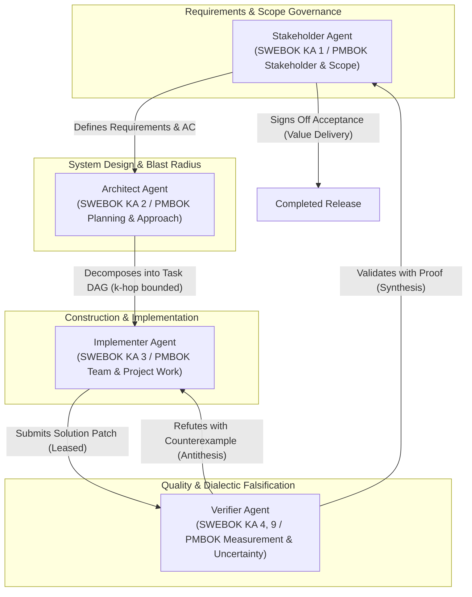

# SWEBOK v3 & PMBOK 7th Edition Mapping for Autonomous Swarms

This document establishes the theoretical foundation and formal engineering mapping between classical software engineering standards (**IEEE SWEBOK v3**) and project management principles (**PMI PMBOK 7th Edition**) and the 4-agent autonomous Code Property Graph (CPG) swarm.

---

## Table of Contents
1. [Theoretical Grounding & Motivation](#theoretical-grounding--motivation)
2. [Swarm Roles & System Boundaries](#swarm-roles--system-boundaries)
3. [IEEE SWEBOK v3 Knowledge Area Mapping](#ieee-swebok-v3-knowledge-area-mapping)
   - 3.1 KA 1: Software Requirements (Stakeholder Agent)
   - 3.2 KA 2: Software Design (Architect Agent)
   - 3.3 KA 3: Software Construction (Implementer Agent)
   - 3.4 KA 4: Software Testing (Verifier Agent)
   - 3.5 KA 9: Software Quality — Verification vs. Validation
4. [PMI PMBOK 7th Edition Performance Domains Mapping](#pmi-pmbok-7th-edition-performance-domains-mapping)
   - 4.1 Stakeholder & Scope Performance Domains (Stakeholder Agent)
   - 4.2 Planning & Development Approach Domains (Architect Agent)
   - 4.3 Team & Project Work Domains (Implementer Agent)
   - 4.4 Measurement & Uncertainty Domains (Verifier Agent)
5. [The Dialectic Value Delivery Lifecycle](#the-dialectic-value-delivery-lifecycle)
   - 5.1 Hegelian Dialectic Verification Model
   - 5.2 Formal State Transition & Invariant Matrix
   - 5.3 Exception Handling, Leases, and Loop Bounding
6. [Dual-Identity Governance & Provenance Model](#dual-identity-governance--provenance-model)

---

## Theoretical Grounding & Motivation

Autonomous multi-agent swarms operating on complex codebases frequently exhibit critical failure modes when unconstrained by formal process discipline:
1. **Hallucinated Completion**: Implementer agents prematurely claim victory without executing rigorous regression tests or edge-case evaluations.
2. **Semantic Drift & Scope Creep**: Agents modify files or interfaces outside the problem boundary, causing unintended blast radius contagion.
3. **Circular Dependencies & Race Conditions**: Uncoordinated concurrent agents claim overlapping tasks or edit the same shared state simultaneously.
4. **Verification-Validation Confusion**: Conflating technical correctness (compiles and passes a mock test) with requirement fulfillment (satisfies business intent).

By formally mapping the swarm roles to **IEEE SWEBOK v3** and **PMI PMBOK 7th Edition**, the swarm enforces separation of concerns, exclusive resource locking, mathematical blast radius containment, and dialectic falsification gates.

---

## Swarm Roles & System Boundaries

The swarm architecture partitions responsibilities across four distinct agents:



---

## IEEE SWEBOK v3 Knowledge Area Mapping

### 3.1 KA 1: Software Requirements (Stakeholder Agent)
- **SWEBOK Scope**: Requirements Elicitation, Requirements Analysis, Requirements Specification, and Requirements Validation.
- **Swarm Role**: **Stakeholder Agent** (`user:<stakeholder_id>`).
- **Blackboard Artifact**: `Requirement Atom` (`type: requirement`).
- **Responsibilities**:
  - Authoring clear, unambiguous problem statements and operational boundaries.
  - Formulating measurable **Acceptance Criteria (AC)** (e.g., performance thresholds, backward-compatibility invariants, security bounds).
  - Classifying priority (`P0` through `P3`) and documenting business constraints.
  - Final acceptance sign-off via `Acceptance Atom` (`type: acceptance`).

### 3.2 KA 2: Software Design (Architect Agent)
- **SWEBOK Scope**: Software Architecture Fundamentals, Component Structure & Decomposition, Interface Design, and Design Quality Analysis.
- **Swarm Role**: **Architect Agent** (`agent:architect-<id>`).
- **Blackboard Artifacts**: `Task Atom` (`type: task`), `DEPENDS_ON` edges, `SUBTASK_OF` edges.
- **Responsibilities**:
  - Interrogating Project Insight CPG via openCypher (`insight_query_cypher` / `insight query`).
  - Calculating call trees, ModRef global variable affiliations, and class inheritance hierarchies.
  - Establishing strict $k$-hop blast radius boundaries ($k \in [1, 5]$) for each task.
  - Constructing an acyclic dependency DAG ensuring prerequisites are validated before dependent tasks can be leased.

### 3.3 KA 3: Software Construction (Implementer Agent)
- **SWEBOK Scope**: Minimizing Complexity, Anticipating Change, Verification of Construction, Coding Standards, and Unit Testing.
- **Swarm Role**: **Implementer Agent** (`agent:worker-<id>`).
- **Blackboard Artifacts**: `Solution Atom` (`type: solution`), Lease ownership (`metadata.lease.holder`).
- **Responsibilities**:
  - Claiming exclusive, time-bound leases (`ab-ctl swarm lease claim`) on unblocked tasks.
  - Performing localized test-driven modifications strictly constrained within the task's blast radius.
  - Committing atomic, well-documented changesets to version control.
  - Submitting formal solution packages (`ab-ctl swarm review submit`) linked via `HAS_SOLUTION`.

### 3.4 KA 4: Software Testing (Verifier Agent)
- **SWEBOK Scope**: Test Levels (Unit, Integration, System), Test Techniques (Specification-based, Code-based, Fault-based), and Defect Localization.
- **Swarm Role**: **Verifier Agent** (`agent:verifier-<id>`).
- **Blackboard Artifacts**: `Verification Proof Atom` (`type: verification_proof`), `Counterexample Trace Atom` (`type: counterexample_trace`).
- **Responsibilities**:
  - Independent static analysis and symbolic execution (IFDS typestate, dataflow taint tracking, SMT path verification).
  - Executing automated regression suites against the proposed patch.
  - Generating concrete counterexample execution traces when defects or leaks are found.
  - Emitting definitive verdicts: `PASS` (links `VALIDATED_BY`) or `FAIL` (links `REFUTES`).

### 3.5 KA 9: Software Quality — Verification vs. Validation

SWEBOK v3 establishes Barry Boehm’s classical distinction between Verification and Validation (V&V). The swarm enforces this distinction through strict architectural role partitioning:

| Dimension | Verification (SWEBOK KA 9.1) | Validation (SWEBOK KA 9.2) |
| :--- | :--- | :--- |
| **Guiding Question** | *"Are we building the product right?"* | *"Are we building the right product?"* |
| **Responsible Agent** | **Verifier Agent** (`agent:verifier-<id>`) | **Stakeholder Agent** (`user:<stakeholder_id>`) |
| **Evaluation Focus** | Internal consistency, structural correctness, absence of memory leaks, typestate adherence, zero taint paths, test passing. | External value delivery, fitness for intended purpose, acceptance criteria satisfaction, business constraints. |
| **Methodology** | Static analysis (IFDS/IDE), SMT path verification, symbolic execution, automated test execution. | Acceptance criteria audit, behavioral review, user scenario validation. |
| **Output Artifact** | `VerificationProof` (`type: verification_proof`) or `CounterexampleTrace` (`type: counterexample_trace`). | `Acceptance` (`type: acceptance`). |
| **Graph Edge** | `VALIDATED_BY` or `REFUTES` | `ACCEPTS` |
| **State Transition** | Transitions task from `REVIEW_PENDING` to `VALIDATED` (or `READY` on fail). | Transitions task from `VALIDATED` to `COMPLETED`. |

---

## PMI PMBOK 7th Edition Performance Domains Mapping

PMBOK 7th Edition moves from process groups to eight project performance domains. The swarm maps these domains as follows:

```
+-------------------------------------------------------------------------------+
|                       PMI PMBOK 7th Edition Performance Domains               |
+---------------------------+---------------------------+-----------------------+
| Stakeholder Performance   | Planning Performance      | Team Performance      |
| & Scope Domain            | & Development Approach    | & Project Work Domain |
| (Stakeholder Agent)       | (Architect Agent)         | (Implementer Agent)   |
+---------------------------+---------------------------+-----------------------+
                            | Measurement Performance   |
                            | & Uncertainty Domain      |
                            | (Verifier Agent)          |
                            +---------------------------+
```

### 4.1 Stakeholder & Scope Performance Domains (Stakeholder Agent)
- **Stakeholder Engagement**: Fosters productive alignment between human operators and autonomous systems.
- **Scope Definition & Management**: Explicitly outlines the system boundary, in-scope functional targets, and out-of-scope behaviors.
- **Value Delivery**: Validates that completed work delivers tangible business value rather than artificial complexity.

### 4.2 Planning & Development Approach Domains (Architect Agent)
- **Development Approach Selection**: Chooses optimal strategy (feature expansion, surgical bugfix, safe refactoring) based on CPG topology.
- **Decomposition & Scheduling**: Constructs the Work Breakdown Structure (WBS) via Task Atoms and establishes critical path constraints via `DEPENDS_ON`.
- **Blast Radius Governance**: Mitigates risk by enforcing $k$-hop boundary limits on code modification.

### 4.3 Team & Project Work Domains (Implementer Agent)
- **High-Performing Autonomous Team**: Clear ownership via exclusive, non-overlapping leases.
- **Work-In-Progress (WIP) Limits**: An implementer agent works on exactly one leased task at any time, preventing context thrashing.
- **Provenance & Integrity**: Every code commit and solution atom is stamped with dual identity (`user` + `agent`).

### 4.4 Measurement & Uncertainty Domains (Verifier Agent)
- **Quantitative Measurement**: Measures cyclomatic complexity deltas, test coverage percentages, taint violation counts, and execution latencies.
- **Uncertainty & Risk Mitigation**: Proactively searches for failure modes (uninitialized reads, double-frees, concurrency hazards) through symbolic execution and SMT solvers.
- **Dialectic Falsification**: Eliminates confirmation bias by adopting an adversarial posture toward implementer proposals.

---

## The Dialectic Value Delivery Lifecycle

### 5.1 Hegelian Dialectic Verification Model
The swarm implements a formal dialectic engine to guarantee correctness:
1. **Thesis (Implementer Proposal)**: The Implementer Agent claims a task lease, writes code, and submits a `Solution Atom` asserting that the requirement is fulfilled.
2. **Antithesis (Verifier Refutation)**: The Verifier Agent acts as an adversarial auditor. It attempts to refute the thesis by synthesizing inputs that cause crashes, memory leaks, taint propagation, or test failures. If found, it attaches a `CounterexampleTrace` via `REFUTES`.
3. **Synthesis (Validated Solution)**: If the Verifier fails to find any counterexamples and mathematically proves zero-leak/zero-taint invariants, it generates a `VerificationProof` via `VALIDATED_BY`. The Stakeholder then validates and completes the task (`ACCEPTS`).

---

### 5.2 Formal State Transition & Invariant Matrix

| Current State | Target State | Triggering Action | Permitted Role | Preconditions & Invariant Checks | Produced Blackboard Links |
| :--- | :--- | :--- | :--- | :--- | :--- |
| *None* | `READY` | `swarm task create` | Architect Agent | Root Requirement must exist in context. Target symbols and $k$-hop specified. | `SUBTASK_OF` (to req/task), `DEPENDS_ON` (to prerequisites) |
| `READY` | `IN_PROGRESS` | `swarm lease claim` | Implementer Agent | **Invariant**: All incoming `DEPENDS_ON` tasks must be in `VALIDATED` or `COMPLETED` state. Task has no active holder. | Updates `metadata.lease = {holder, expires_at}` |
| `IN_PROGRESS` | `READY` | `swarm lease release` | Implementer Agent (or Timer) | Current lease holder matches or lease TTL expired. | Clears `metadata.lease.holder = null` |
| `IN_PROGRESS` | `REVIEW_PENDING` | `swarm review submit` | Implementer Agent | **Invariant**: Caller must be the active lease holder. Solution patch summary provided. | Creates `Solution Atom`, adds `task -[:HAS_SOLUTION]-> solution` |
| `REVIEW_PENDING` | `READY` | `swarm review verdict FAIL` | Verifier Agent | **Invariant**: Task must be `REVIEW_PENDING`. Counterexample details provided. Lease cleared. | Creates `CounterexampleTrace Atom`, adds `task -[:REFUTES]-> counterexample` |
| `REVIEW_PENDING` | `VALIDATED` | `swarm review verdict PASS` | Verifier Agent | **Invariant**: Task must be `REVIEW_PENDING`. Static/SMT metrics show 0 violations. Lease cleared. | Creates `VerificationProof Atom`, adds `task -[:VALIDATED_BY]-> proof` |
| `VALIDATED` | `COMPLETED` | `swarm accept` | Stakeholder Agent | **Invariant**: Task must be in `VALIDATED` state. Acceptance criteria verified. | Creates `Acceptance Atom`, adds `task -[:ACCEPTS]-> acceptance` |

---

### 5.3 Exception Handling, Leases, and Loop Bounding

1. **Lease Expiration**:
   - Every lease specifies a Time-To-Live (`timeout_sec`, default 600s).
   - If an Implementer Agent halts or exceeds TTL, the lease automatically expires. The daemon resets task state to `READY` to allow other agents to claim it.
2. **Refutation Loop Bounding**:
   - To prevent infinite dialectic thrashing between Implementer and Verifier, each task tracks `metadata.refutation_count`.
   - If `refutation_count > 3`, the task enters `ESCALATED` status, notifying the Architect and Stakeholder to re-examine requirements or partition the task into smaller subtasks (`REQUESTS_CHANGE`).
3. **Deadlock Prevention**:
   - The Architect Agent validates DAG acyclicity before creating `DEPENDS_ON` links using Tarjan's or Kahn's topological sorting algorithms. Cyclic dependencies are rejected with HTTP 400.

---

## Dual-Identity Governance & Provenance Model

To ensure legal, audit, and operational compliance, every transaction committed in the Agentic Blackboard records two identities:
1. **User Identity (`X-Active-User`)**: The human stakeholder, project manager, or team principal accountable for the project scope and authorizing agent actions.
2. **Agent Identity (`X-Active-Agent`)**: The specific automated model, toolchain instance, or subagent conversation ID responsible for generating the artifact.

**Provenance Audit Trail:**
```json
{
  "provenance": {
    "user_id": "user:jason",
    "agent_id": "agent:cpg-architect-01",
    "client_app": "ab-ctl-swarm",
    "timestamp": 1773801700,
    "signature": "ed25519:3b7a...f91c"
  }
}
```

This ensures complete traceability across the entire software development lifecycle from initial requirements elicitation through deployment.
