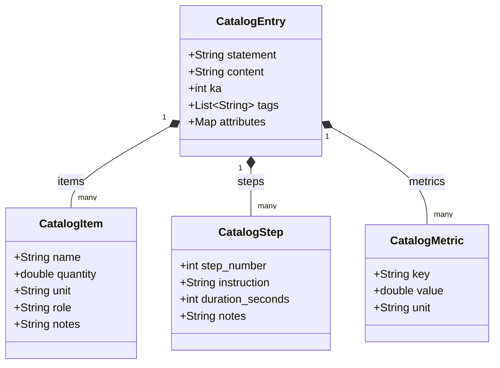

# Procedural Catalog Skill

## name: procedural-catalog
## description: Standardize procedural recipes, workout routines, lab SOPs, and hardware assemblies using CatalogItem, CatalogStep, and CatalogMetric.

---

## Overview
Procedural knowledge encompasses reproducible instructions for physical, chemical, computational, and culinary processes. Unlike descriptive text, procedural execution requires structured decomposition into discrete bills-of-materials (`CatalogItem`), ordered instruction sequences (`CatalogStep`), and quantifiable operational limits (`CatalogMetric`). This skill guides agents in authoring, standardizing, and curating procedural catalog entries in the Agentic Blackboard Substrate using the `create_catalog_entry` MCP tool.

## When to Use
- **Culinary Recipes & Food Science**: Ingredients, prep steps, cooking times, temperatures, and yield metrics (`KA: 27 - CULINARY_RECIPES`).
- **Standard Operating Procedures (SOPs) & Lab Protocols**: Chemical titrations, biological assays, reagent concentrations, and cleanroom handling.
- **Hardware Assembly & Maintenance**: Bill of materials, torque limits, sequential assembly stages, and alignment tolerances.
- **Athletic & Training Routines**: Exercise sets, target muscle splits, rest intervals, and volume metrics (`KA: 20 - HEALTH_WELLNESS`).
- **Fabrication & Shop Workflows**: 3D printing slicing profiles, CNC feed rates, soldering profiles, and surface preparation.

---

## Structure & Schema Definitions



### 1. CatalogItem (BOM, Ingredients, Equipment, Materials)
Represents every discrete physical or chemical entity required for the procedure:
- `name` (string): Canonical name of the item (e.g., `"High-Gluten Bread Flour"`, `"M4x12mm Hex Cap Screw"`, `"Digital Multimeter"`).
- `quantity` (float64): Precise numerical quantity (must be positive).
- `unit` (string): Standard measurement or counting unit (e.g., `"g"`, `"ml"`, `"kg"`, `"pcs"`, `"count"`).
- `role` (string): The functional category of the item:
  - `INGREDIENT`: Consumed culinary or biological component.
  - `MATERIAL`: Consumed fabrication or construction raw material.
  - `EQUIPMENT`: Reusable machinery, apparatus, or appliance (e.g., `"Stand Mixer"`, `"Soldering Station"`).
  - `TOOL`: Hand tools or diagnostic instruments (e.g., `"Torx T10 Screwdriver"`, `"Dial Indicator"`).
  - `SOLVENT` / `CATALYST`: Chemical reagents.
  - `SAFETY_GEAR`: PPE required for the step (e.g., `"Nitrile Gloves"`, `"Eye Protection"`).
- `notes` (string): State, preparation, or specification requirements (e.g., `"room temperature, 20°C"`, `"Grade 8.8 zinc-plated"`).

### 2. CatalogStep (Ordered Execution Sequence)
Represents a discrete, sequential instruction in the procedure:
- `step_number` (int32): 1-indexed execution sequence (1, 2, 3...). Must be strictly increasing.
- `instruction` (string): Concise, imperative operational command (e.g., `"Knead dough at speed 2 for 8 minutes until gluten windowpane test passes."`).
- `duration_seconds` (int32): Duration in seconds (e.g., `480` for 8 minutes). Use `0` for instantaneous or non-timed actions. Accepts both `duration_seconds` and `duration_minutes` (the substrate automatically normalizes to seconds).
- `notes` (string): Quality gates, sensory cues, safety hazards, or tolerances (e.g., `"Internal dough temperature must not exceed 26°C."`).

### 3. CatalogMetric (Quantitative Performance Targets & Telemetry)
Represents measured values, physical parameters, or nutritional/energetic totals:
- `key` (string): Identifier for the metric (e.g., `"prep_time_minutes"`, `"bake_time_minutes"`, `"oven_temperature_c"`, `"torque_nm"`, `"total_calories_kcal"`). Accepts both `key` and `name`.
- `value` (float64): Numerical value.
- `unit` (string): Unit of measurement (e.g., `"minutes"`, `"°C"`, `"N*m"`, `"kcal"`, `"bar"`).

### 4. Attributes (Categorical Metadata)
Flexible string-to-string dictionary capturing domain-specific taxonomies:
- **Recipe Attributes**: `{"cuisine": "Neapolitan", "difficulty": "intermediate", "course": "main", "servings": "4"}`.
- **Hardware Attributes**: `{"subsystem": "gantry", "fastener_standard": "ISO 4762", "cleanliness": "Class 1000"}`.
- **Workout Attributes**: `{"target_muscle": "quadriceps", "split_day": "leg_day", "intensity": "RPE 8"}`.

---

## Workflow Process using `create_catalog_entry`

### Step 1: Pre-Flight Discovery (`search_commonplace`)
Always query the substrate before creating a new catalog entry to prevent duplication:
```json
{
  "query": "sourdough focaccia high hydration",
  "ka": 27,
  "limit": 10
}
```
- If an exact match exists: Do NOT create a duplicate. If developing an adaptation, consider authoring a variation and linking it via `rel::VARIATION_OF`.
- If complementary entries exist (e.g., a compound butter or pairing wine): Note their UUIDs for later `rel::PAIRS_WITH` synapse linking.

### Step 2: Extract and Standardize the Bill of Materials (`items`)
1. Deconstruct all colloquial ingredients or parts into standardized `CatalogItem` records.
2. Normalize all measurements to standard metric units (`g`, `ml`, `kg`, `mm`, `pcs`). Convert volume-based baking measurements (cups, spoons) to mass in grams.
3. Explicitly enumerate required tools and equipment under `role: "EQUIPMENT"` or `role: "TOOL"`.

### Step 3: Sequence Procedural Execution (`steps`)
1. Break down compound steps into atomic, sequential operations.
2. Order steps starting from `step_number: 1`.
3. Compute and assign `duration_seconds` for all timed baking, resting, mixing, curing, or waiting periods.
4. Document sensory checkpoints and failure modes in `notes`.

### Step 4: Quantify Metrics & Classify Attributes
1. Formulate quantitative indicators into `metrics` (`prep_time`, `cook_time`, `yield_units`, `temperature`).
2. Populate `attributes` with categorical metadata (`cuisine`, `course`, `difficulty`, `servings`).

### Step 5: Commit to Substrate (`create_catalog_entry`)
Submit the complete procedural catalog payload via the `create_catalog_entry` MCP tool:
```json
{
  "project_id": "project:culinary_lab",
  "agent_id": "identity:culinary_specialist",
  "statement": "Classic High-Hydration Rosemary Sea Salt Focaccia",
  "content": "A 80% hydration Genovese-style focaccia featuring an overnight cold fermentation and olive oil brine emulsification.",
  "items": [
    {
      "name": "Bread Flour (13% protein)",
      "quantity": 500.0,
      "unit": "g",
      "role": "INGREDIENT",
      "notes": "Type 00 or strong unbleached bread flour"
    },
    {
      "name": "Water (lukewarm, 25°C)",
      "quantity": 400.0,
      "unit": "g",
      "role": "INGREDIENT",
      "notes": "80% hydration"
    },
    {
      "name": "Fine Sea Salt",
      "quantity": 10.0,
      "unit": "g",
      "role": "INGREDIENT",
      "notes": "2% baker's percentage"
    },
    {
      "name": "Instant Dry Yeast",
      "quantity": 3.0,
      "unit": "g",
      "role": "INGREDIENT",
      "notes": "0.6% baker's percentage"
    },
    {
      "name": "Extra Virgin Olive Oil",
      "quantity": 45.0,
      "unit": "g",
      "role": "INGREDIENT",
      "notes": "Cold-pressed, divided between dough and dimpling"
    },
    {
      "name": "Fresh Rosemary Leaves",
      "quantity": 10.0,
      "unit": "g",
      "role": "INGREDIENT",
      "notes": "Lightly crushed"
    },
    {
      "name": "Cast Iron Baking Pan (12-inch)",
      "quantity": 1.0,
      "unit": "pcs",
      "role": "EQUIPMENT",
      "notes": "Pre-seasoned"
    }
  ],
  "steps": [
    {
      "step_number": 1,
      "instruction": "Whisk bread flour, fine sea salt, and instant dry yeast together in a large mixing bowl until homogenous.",
      "duration_seconds": 120,
      "notes": "Ensure salt is fully dispersed before adding water to prevent yeast shock."
    },
    {
      "step_number": 2,
      "instruction": "Add lukewarm water and 15g olive oil; mix with a spatula until a shaggy, wet dough forms with no dry flour pockets.",
      "duration_seconds": 180,
      "notes": "Dough will be sticky and slack; do not add extra flour."
    },
    {
      "step_number": 3,
      "instruction": "Perform 4 sets of stretch-and-folds spaced 30 minutes apart at room temperature (22°C).",
      "duration_seconds": 7200,
      "notes": "Wet hands with cold water between folds to prevent tearing the gluten sheet."
    },
    {
      "step_number": 4,
      "instruction": "Transfer covered dough into refrigerator (4°C) for cold bulk fermentation.",
      "duration_seconds": 86400,
      "notes": "Allow 24–48 hours for optimal organic acid and flavor development."
    },
    {
      "step_number": 5,
      "instruction": "Turn cold dough into heavily oiled cast iron pan, perform dimpling with fingertips, scatter rosemary, and bake at 230°C.",
      "duration_seconds": 1500,
      "notes": "Internal temperature should reach 98°C and crust should be deep golden brown."
    }
  ],
  "metrics": [
    {
      "key": "prep_time_minutes",
      "value": 30.0,
      "unit": "minutes"
    },
    {
      "key": "fermentation_time_hours",
      "value": 24.0,
      "unit": "hours"
    },
    {
      "key": "bake_time_minutes",
      "value": 25.0,
      "unit": "minutes"
    },
    {
      "key": "bake_temperature_c",
      "value": 230.0,
      "unit": "°C"
    },
    {
      "key": "hydration_percent",
      "value": 80.0,
      "unit": "%"
    }
  ],
  "attributes": {
    "cuisine": "Italian",
    "course": "bread",
    "difficulty": "intermediate",
    "servings": "6",
    "dietary": "vegan"
  },
  "tags": ["RECIPE", "FOCACCIA", "BAKING", "FERMENTATION"],
  "ka": 27,
  "check_duplicates": true
}
```

### Step 6: Link to Dialectic Graph & Related Catalog Entries
After the catalog entry is committed:
1. Query `get_node_links(uuid)` to verify edge projections.
2. Link related nodes via `link_nodes`:
   - `PAIRS_WITH`: Connect to companion recipes, sauces, or drink pairings (e.g., connecting focaccia to a roasted garlic dipping oil).
   - `VARIATION_OF`: Connect a customized iteration to its baseline catalog entry.
   - `USES_INGREDIENT`: Connect the catalog recipe to specific ingredient notes or starter cultures in the substrate.
3. Validate W3C RDF Turtle projection with `export_graph_rdf` to ensure export conforms to `schema:Recipe`, `schema:recipeIngredient`, `schema:recipeInstructions`, and `ab:metric` vocabularies.

---

## Anti-Patterns & Rationalizations

| Excuse / Rationalization | Engineering Rebuttal |
| :--- | :--- |
| "It's faster to write the ingredients in markdown prose in `content`." | Unstructured prose cannot be extracted into automated grocery/parts lists, scaled numerically by swarm agents, or queried by metric filters. |
| "I don't need to specify units for countable items like eggs or screws." | Omitting units creates ambiguity across agent swarms. Always use standard units like `"pcs"`, `"count"`, or precise mass in `"g"`. |
| "Step duration doesn't matter; the user knows how long it takes." | Unspecified durations break automated scheduling, timers, and swarm coordination pipelines. Express all timing in `duration_seconds`. |
| "I'll skip `search_commonplace` because this recipe is my own creation." | Standardizing an existing recipe under a different name creates duplicate substrate nodes and breaks dialectic coherence. |
| "I don't need to list tools because everyone owns an oven or screwdriver." | Omitting `role: "EQUIPMENT"` or `role: "TOOL"` prevents prerequisite checking and automated setup validation. |

### Common Anti-Patterns vs. Corrections

| Anti-Pattern | Manifestation | Corrective Action |
| :--- | :--- | :--- |
| **The Prose Dump** | A monolithic paragraph describing ingredients and steps together. | Deconstruct into discrete `items` (BOM) and sequential numbered `steps`. |
| **Vague Quantifiers** | Using "a dash of salt" or "several bolts". | Quantify numerically: `quantity: 2.0`, `unit: "g"`, or `quantity: 4.0`, `unit: "pcs"`. |
| **Implicit Tooling** | Telling user to "mix in a stand mixer" without listing the mixer in `items`. | Add `{ name: "Stand Mixer", quantity: 1.0, unit: "pcs", role: "EQUIPMENT" }`. |
| **Duration Blindness** | Setting `duration_seconds: 0` for an overnight ferment or 30-min bake. | Compute explicit seconds: 30 minutes = `1800`, 24 hours = `86400`. |
| **Unanchored Entry** | Omitting `project_id` or `agent_id` in bundle payload. | Always anchor to an active project and authenticated agent identity. |

---

## Red Flags
- Creating a catalog entry with an empty `items` or empty `steps` array.
- Out-of-order or duplicate `step_number`s (e.g., 1, 3, 2).
- Quantities recorded as non-numeric strings (e.g., `"quantity": "two cups"`).
- Omission of `unit` on measurable physical quantities.
- Setting `check_duplicates: false` when an `ALREADY_EXISTS` collision is detected.
- Failing to specify `role` on catalog items.

---

## Verification Checklist
- [ ] Pre-flight `search_commonplace` executed with no identical duplicate statement.
- [ ] All components deconstructed into `items` with numerical `quantity`, standardized `unit`, and explicit `role`.
- [ ] Equipment and tooling explicitly listed under `role: "EQUIPMENT"` or `role: "TOOL"`.
- [ ] Execution instructions decomposed into sequentially numbered `steps` (1..N).
- [ ] Time-bound steps have explicit `duration_seconds` calculated.
- [ ] Quantifiable parameters populated in `metrics` and classifications in `attributes`.
- [ ] `create_catalog_entry` returned status `COMMITTED` with a valid UUID.
- [ ] Semantic relationships (`PAIRS_WITH`, `VARIATION_OF`) linked via `link_nodes`.
